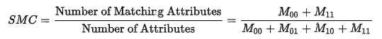

# 熟悉相似系数

> 原文：<https://towardsdatascience.com/familiarity-with-coefficients-of-similarity-73697d357acf?source=collection_archive---------9----------------------->

当你在做一个关于推荐系统或图像语义分割的项目时，你一定遇到过相似性得分。基于这些相似性分数，你预测这个产品与那个产品相似或者预测的分割图像与地面真实情况相似的程度。

相似性度量是重要的，因为许多数据挖掘技术使用这些度量来确定项目或对象之间的相似性，用于根据要求的不同目的，例如聚类、异常检测、自动分类、相关性分析。本文将向您简要介绍不同的相似性度量，而不会过多涉及技术细节。

本文的重点是向您介绍下面的相似性度量标准，

1.简单匹配系数

2.Jaccard 索引

3.欧几里得距离

4.余弦相似性

5.居中或调整的余弦指数/皮尔逊相关性

开始吧！

假设，两个用户 A 和 B 在表单中提供了对十种产品的评论，不管他们是否喜欢这些产品。让我们把它写成向量的形式，

A = (P，P，P，P，P，N，N，N，N

B = (P，P，P，N，N，N，N，N，N

其中 P 表示用户喜欢该产品，N 表示用户不喜欢该产品。

A & B 用户的 SMC 计算如下:

在哪里，

M11(两个 A & B 都喜欢这个产品)= 3

M00(双方都不喜欢该产品)= 5

M10 (A 喜欢该产品，但 B 不喜欢)= 2

M01 (A 不喜欢该产品，但 B 喜欢)= 0

对于 A & B 用户，SMC 为 8/10，即 0.8。这向我们展示了用户 A & B 有 80%的时间是相似的。因此，如果 A 喜欢一种新产品，而 B 还没有见过，你可以向 B 推荐，因为两者有很好的相似性。

这是构建推荐系统的一种非常简单和直观的方法。理想情况下，我们应该使用用户 A 和 b 给出的 1 到 5 的等级，在此基础上，我们可以得出他们喜欢该产品的程度，然后在此基础上提供推荐。

这里要注意的重要一点是，SMC 在向量具有二元属性(正/负)、(真/假)和(男/女)并且两个类携带相同信息的情况下是有用的。

你能想出为什么我们不能在类不携带相等信息的情况下使用 SMC 的任何理由吗？这个问题把我们带到了新的相似性度量。

## **Jaccard 指数:**

让我们考虑另一种情况。一家保险公司希望根据相似性对其客户提交的索赔进行分类。他们有一个索赔数据库，数据库中有 100 个属性，在此基础上，公司决定索赔是否欺诈。属性可以是人的驾驶技术、汽车检查记录、购买记录等。每个属性为索赔生成一个红色标志。在大多数情况下，只有少数属性会生成红旗，其他属性很少会改变。

在这种情况下，红旗比绿旗向保险公司提供了更多的信息(不对称)。

如果我们使用 SMC，我们得到的分数会因很少产生危险信号的属性而有所偏差。在这种情况下，使用 Jaccard 索引。让我们用数字来核对一下。

考虑三个声明 A，具有 20 个二元属性的 B & C，

索赔 A = (R，R，R，G，G，G，G，G，G，G，G，G，G，G，G，G，G，G)

索赔 B = (R，R，G，G，G，G，G，G，G，G，G，G，G，G，G，G，G，G)

索赔 C = (R，G，G，G，G，G，G，G，G，G，G，G，G，G，G，G，G，G)

每对的 Jaccard 指数计算如下:

在哪里，

M11-两个声明都带有红色标记的属性数量，

M10，M01-一个索赔带有红色标志，另一个带有绿色标志的属性数。

对于索赔 A 和 B，Jaccard 指数是 2/3，即 0.66，SMC 是 19/20，即 0.95。

对于索赔 A 和 C，Jaccard 指数为 1/3，即 0.33，SMC 为 18/20，即 0.90。

对于索赔 B 和 C，Jaccard 指数为 1/ 2 即 0.5，SMC 为 19/20 即 0.95。

我们看到，所有三对的 SMC 分数彼此接近，Jaccard 指数显示出显著差异。这是 SMC 的问题，当类不携带相同的信息时。例如，在我们的例子中，R 类比 G 携带更多的信息，但是 SMC 认为它们是相等的。

Jaccard 指数也称为 IOU(交集/并集)度量，用于对图像进行语义分割。

相似性指数通过交叉点图像中高亮像素的数量除以联合图像中高亮像素的数量来计算。

Jaccard 指数可以被认为是 SMC 的一个推广情况。在我们有多个对称类(多个类具有相同的权重)的情况下，我们不能使用 SMC，因为它只适用于二进制对称类。在这种情况下，我们可以为每个类创建虚拟变量，这将使单个虚拟变量不对称，因为每个虚拟变量中存在一个类将提供比没有该类更多的信息。然后，我们可以使用 Jaccard 索引来找出相似性得分。基本上，我们将多个对称类转换为二进制非对称哑变量，然后计算 Jaccard 指数。

到目前为止，我们只是在讨论具有二元属性的向量，如果属性是连续的/数字的呢？这是我们转向基于距离和角度的相似性得分的情况。

**欧几里德距离:**

欧几里德距离更像闵可夫斯基距离和马哈拉诺比斯距离一样是不同的度量。我之所以包括这一点，是因为它构成了对即将到来的指标进行讨论的基础。

我们知道，空间中距离较近的点之间的距离要小于距离较远的点之间的距离。因此，较小的距离意味着更大的相似性，这就是使用欧几里德距离作为相似性度量背后的思想。向量 p 和 q 之间的欧几里德距离计算如下:

考虑三个用户 A、B 和 C。他们为几部电影提供了评级，每个评级的范围从 1 到 5，0 表示用户没有看过这部电影。

用户 A = (0.5，1，1.5，2，2.5，3，3.5)

用户 B = (0.5，1.5，2.5，0，0，0，0)

用户 C = (0.5，1，1.5，2，0，0，0)

使用上面的公式，我们得到 A & B 之间的距离为 5.72，B & C 之间的距离为 2.29，A & C 之间的距离为 3.5。如果你仔细看，A & C 向量给了前四部电影相同的评级，这告诉我们两个对电影有相似的喜欢，但因为 C 没有看过几部电影，所以我们在他们之间有很大的距离。

由于上述向量有七个维度，我们无法在此将其可视化。相反，让我们看看两个轴上的相似向量，每个轴代表一部电影。在图中，红色向量代表用户 A，绿色向量代表用户 B，蓝色向量代表用户 c。所有向量在原点都有尾部。

根据上面的图，我们应该期望蓝色和红色向量显示出高度的相似性，因为它们是共线的。但是当我们计算欧几里得距离时，我们得到了它们之间的显著距离。如果我们不使用向量之间的距离，而是计算它们之间角度的余弦值，会怎么样？向量可以有更小或更大的长度，它们之间的角度将保持不变。这将我们带到新的相似性度量。

## 余弦相似度:

在我们的学术中，我们遇到过两个向量的点积和叉积。两个向量的点积被计算为每个向量的幅度与向量之间角度的余弦的乘积，即

其中，| A |和|B|代表矢量 A 和 B 的长度，它是 A 和 B 到原点的距离。

A.通过对向量 A & B 的逐元素乘法求和来获得 b，即

余弦相似度计算如下:

由于评级为正，我们的向量将始终位于第一象限。因此，我们将在范围[0，1]内得到余弦相似性，1 是高度相似的。

我们想到使用余弦相似度，因为我们知道向量之间的角度保持不变，不管它们的长度如何，但是我们能进一步改进它吗？你发现什么问题了吗？让我们看看！

## 居中或调整余弦相似度:

居中？那是什么？到目前为止，我们一直在努力寻找小苹果和大苹果之间的相似之处。击球手出局了吗我们知道，有些人在评分时总是很严格，而有些人则很慷慨(我就属于这一类😃).如果我们试图寻找它们之间的相似性，我们总是会因为这种行为而产生一些偏差。

这可以通过从一个用户的所有电影评级中移除该用户给出的平均评级来处理，通过围绕平均值排列评级，这只是标准化评级。一旦所有的向量被标准化，我们计算余弦相似性。这不过是居中或调整后的余弦相似度！这也就是俗称的*皮尔逊相关！*

为了证明上述观点，我创建了两个数组，其中第二个数组是通过在第一个数组中添加偏移量来获得的，同时保持第一个数组的所有变量相同。检查笔记本下方的实施情况。

我们得到相关性为 1，余弦相似性为 0.85，这证明了相关性比余弦相似性表现得更好。这是因为矢量的归一化。

也有一些其他可用的相似性度量，但是我们到目前为止讨论的度量是我们在处理数据科学问题时经常遇到的度量。下面是一些参考链接，您可以从中了解更多关于这些指标及其使用案例的信息。

1.  [向量空间模型的余弦相似度](http://blog.christianperone.com/2013/09/machine-learning-cosine-similarity-for-vector-space-models-part-iii/)
2.  [相似度和相异度的比较研究](https://journals.plos.org/plosone/article?id=10.1371/journal.pone.0144059)
3.  [评估图像分割模型](https://www.jeremyjordan.me/evaluating-image-segmentation-models/)
4.  [用户-物品相似度研究门户](https://www.researchgate.net/publication/317349295_Calculating_the_User-item_Similarity_using_Pearson's_and_Cosine_Correlation_Senthilkumar_M)
5.  [皮尔逊相关&索尔顿余弦度量](https://arxiv.org/ftp/arxiv/papers/0911/0911.1318.pdf)

谢谢你一直读到最后。我希望你喜欢它。

学习愉快，再见！