# 从零开始到部署的图像分类

> 原文：<https://towardsdatascience.com/fantastic-and-straightforward-image-classification-with-fastai-library-for-pytorch-30c3380ac284?source=collection_archive---------17----------------------->

## 我们回顾了分类图像和清理训练数据集的技术。我们使用 Google 创建了一个图像数据集，将该模型应用于一个真实案例，并添加了一个使用 Starlette 和 Uvicorn 部署该模型的指南

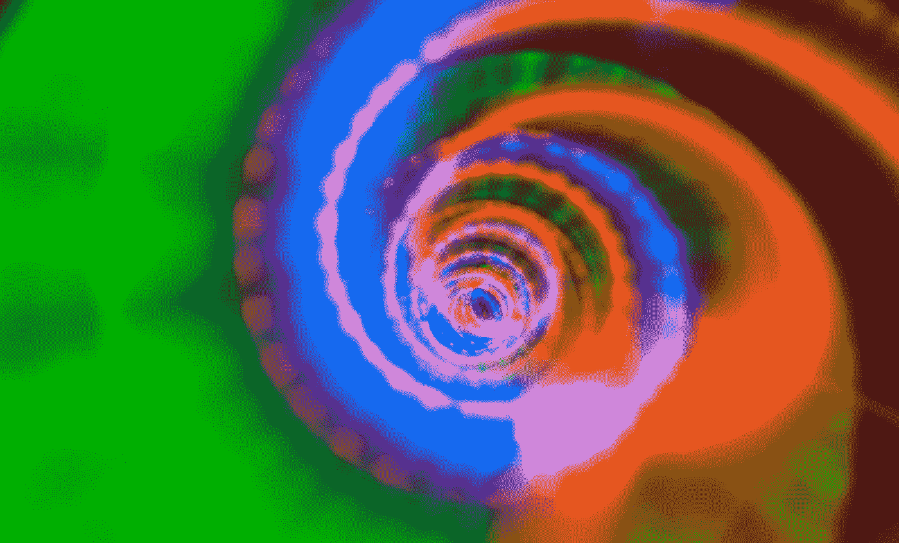

Photo by [Harshal Desai](https://unsplash.com/@harshaldesai?utm_source=medium&utm_medium=referral) on [Unsplash](https://unsplash.com?utm_source=medium&utm_medium=referral)

# 背景

这些天，由于某些情况，我发现自己在做一个用 fast.ai 设计的[免费 Pytorch 课程，这是本文完全基于的材料(第 2 课)，它让我着迷，因为这些库简单、有用、可靠。](https://course.fast.ai)

在这篇文章中，我们将发现一些用于 Pytorch 的 fast.ai 工具，在完成阅读后我们将知道:

*   如何用谷歌的图像搜索引擎创建数据集
*   如何开发和调整神经网络来分类图像
*   如何使用 ImageCleaner 清理训练数据集并加以改进？
*   一个真实案例的例子，并应用了私有数据集
*   关于如何部署模型的说明性指南

# 从 Google 搜索引擎创建数据集

我在 fast.ai 在线课程中看到的第一件事并不明确与 Pytorch 或 fast.ai 相关，而是与直接从谷歌图像搜索引擎创建数据集的方法相关。

这项技术受到了弗朗西斯科·英厄姆和杰瑞米·霍华德/阿德里安·罗斯布鲁克的工作的启发。

## 为每个类别创建 URL 列表

我们将基于鸟类、野猫和飞机的照片创建一个包含三类图像的数据集。


我们必须分别组合每一个类别，为了获得飞机的图像，我们在浏览器中搜索，例如:“飞机摄影”。

为了细化搜索，我们可以使用所有的搜索引擎工具，例如排除图像名称中不需要的元素(例如使用-textToExclude:-camera-airport)或使用标签按钮仅过滤特定类别。

对于数据集的公共使用，您必须过滤“工具-使用权”,并根据适用情况尊重版权。

一旦我们在浏览器中有了想要的图像，我们将在控制台上执行两个 Javascript 语句。

> “在 Windows/Linux 中按 Ctrl-Shift-J，在 Mac 中按 Cmd-Opt-J，会出现一个小窗口 javascript 控制台’。你需要得到每张图片的网址。在运行以下命令之前，您可能需要禁用广告拦截扩展(uBlock、AdBlockPlus 等)。)在 Chrome 中。否则，window.open()命令不起作用。然后，您可以运行以下命令

```
urls **=** Array.from(document.querySelectorAll('.rg_di .rg_meta')).map(el**=>**JSON.parse(el.textContent).ou);window.open('data:text/csv;charset=utf-8,' **+** escape(urls.join('\n')));
```

这段代码将开始下载一个文件，我们必须将其重命名为 urls_[ClassName].csv，我们使用前缀“urls_”和类名作为文件名的约定；这对代码的运行非常重要，我们将在后面看到，

我们重复在浏览器中过滤图像的操作，并将它们的 URL 下载到一个文件中，该文件被重命名为 CSV，用于其他三个类别，直到您获得:

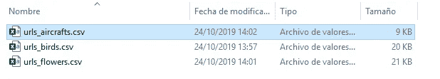

如果我们看一下这些文件的内部，我们会发现它们都是简单的文件，包含过滤图像的 URL 列表

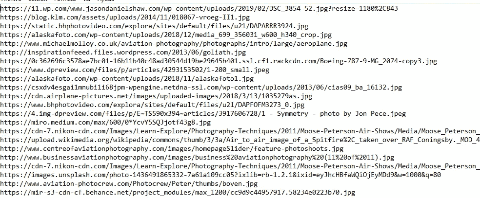

## 下载并验证每个路径中的图像

一旦我们在 CSV 文件中有了每个类别的 URL 列表，我们将运行代码来下载图像并构建我们的数据集。在我的例子中，我创建了一个“数据/照片”路径，这是我的基本路径。在那里，我放置了三个类别的 CSV 文件，然后我们执行代码来创建子目录，图像将被下载到这些子目录中

```
from fastai.vision import *
classes = ['birds','flowers','aircrafts']
path = Path('data/photos')
for folder in classes:
    dest = path/folder
    dest.mkdir(parents=True, exist_ok=True)path.ls()
```

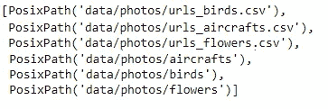

来真正下载我们使用的图像

```
for cla in classes:
   print (cla)
   file = 'urls_'+cla+'.csv'
   dest = path/cla
   download_images(path/file, dest, max_pics=200)
```

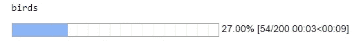

然后，我们执行代码来验证所有下载的图像都是正确的，并删除可能损坏的图像(delete=True)

```
for c in classes:
   print(c)
   verify_images(path/c, delete=True, max_size=500)
```

要查看每个语句的文档，可以运行 doc()命令，例如:

```
doc(verify_images)
```

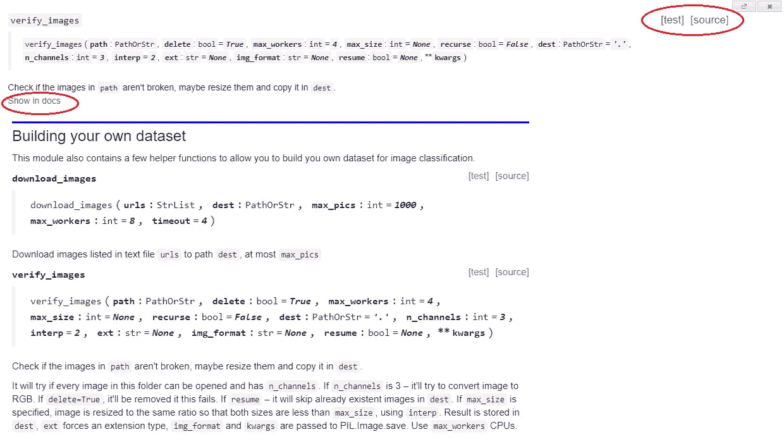

## 创建和可视化数据集

在每个类别对应的路径中下载并验证图像后，我们可以创建一个 fast.ai 数据束(类似的数据帧)，将标记的图像放入其中，并开始可视化或使用它们

```
np.random.seed(7)data = ImageDataBunch.from_folder(path, train=".", valid_pct=0.2, ds_tfms=get_transforms(), size=224, num_workers=4).normalize(imagenet_stats)
```

并运行代码以在数据集内随机显示一批 3 行

```
data.show_batch(rows=3, figsize=(7,8))
```

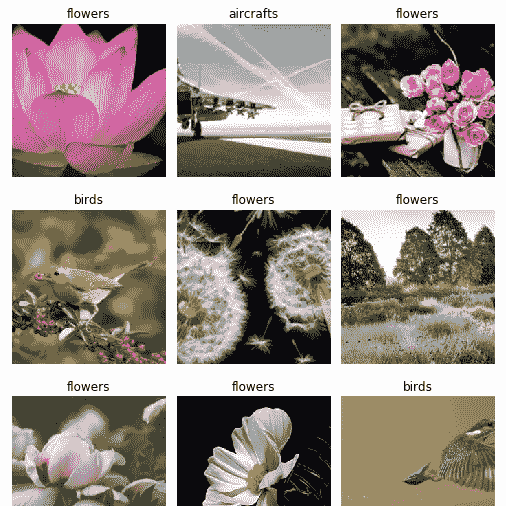

# 模型第一版

在本练习中，我们将使用 resnet34 格式的卷积神经网络。在模型中，有一组预定义的网络架构，涉及不同的结构和 complexities⁴.

原则上，resnet34 配置对于建议的范围来说足够有效和简单

```
learn = cnn_learner(data, models.resnet34, metrics=error_rate)
learn.fit_one_cycle(4)
```

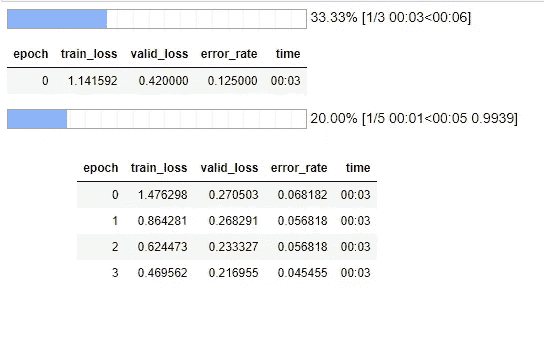

第一次训练后，我们看到网络完全没有出错，达到了 95%的准确率(error_rate = 0.045455)，训练时间非常完美。

为了能够进一步调整这种精度，我们有一种方法来绘制学习率参数的行为:

```
learn.lr_find()
```

我们看到该方法如何搜索不同学习率值的神经网络的 20 次损失。然后，我们可以绘制图表，寻找最适合的范围，并以该设置重新输入:

```
learn.recorder.plot()
```

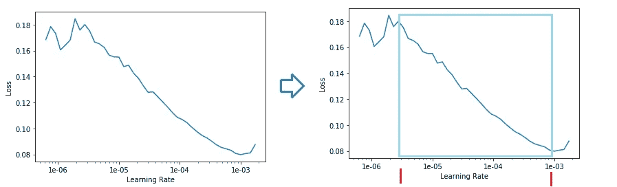

左图显示了神经网络中 learning_rate 的结果，然后我们必须寻找从持续下降开始到下降结束和上升开始之间最重要的学习范围。

这个环境，在右边的图中用底部的红条标出，让我们在 1e-⁶和 1e-⁵之间的中间有了一个起点，所以我们可以粗略地说，起点是近(**1e-⁶/2**)；最终射程显然在 **1e-**

```
learn.fit_one_cycle(2, max_lr=slice(**1e-6/2**,**1e-3**))
```

我们看到模型的精确度提高了，达到 96.5%，误差率= 0.034091

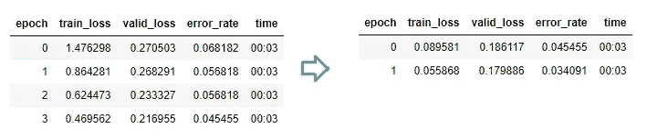

让我们保存这个版本的模型，这样我们就可以回顾它

```
learn.save('stage-2')
```

# 清理训练数据集

## 混淆矩阵

虽然，在这种情况下，获得的精确度可能是足够的，但是除了经典的“混淆矩阵” ***** 之外，我们将看到两个令人兴奋的工具来尝试理解环境混淆了训练。

```
learn.load('stage-2');
interp = ClassificationInterpretation.from_learner(learn)
interp.plot_confusion_matrix()
```

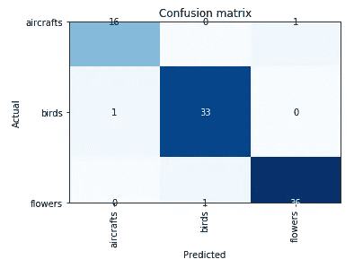

现在让我们使用 ImageCleaner，fastai.widgets 的一个小部件，它将帮助我们删除或重新标记模型中不正确的图像。

## 顶部损失的图像清洁器

对于第一个清理训练数据集工具，我们需要找到使用。from_toplosses 方法定位相应的索引，并将它们传递给 ImageCleaner。

该小部件不会删除相应路径的图像，但会生成一个新的 CSV 文件(cleaned.csv ),其中包含“不用于删除”的图片列表以及正确的类别，以防其被重新分配

```
from fastai.widgets import *db = (ImageList.from_folder(path)
.split_none()
.label_from_folder()
.transform(get_transforms(), size=224)
.databunch())learn_cln = cnn_learner(db, models.resnet34, metrics=error_rate)
learn_cln.load('stage-2');
```

我们创建一个新的 learn_cln 模型，从文件夹(from_folder)中读取数据，并获取前一阶段中保存的阶段 2 的权重。

然后分离数据集和从主要训练损失中提取的指数。对于这些对象，我们调用 ImageCleaner，它将在屏幕上显示混淆的元素(from_toplosses ),以允许我们消除它们或将它们重新分配到正确的类

```
ds, idxs = DatasetFormatter().from_toplosses(learn_cln)
ImageCleaner(ds, idxs, path)
```

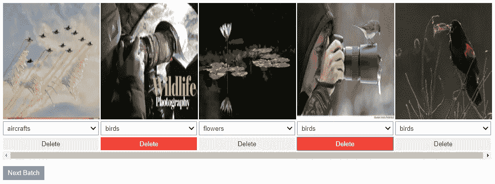

该工具向我们批量展示了一组令人困惑的图像，并允许我们在每个图像下方的分类框中删除或重新分类它们。通过单击下一批，cleaned.csv 文件将重新标记或从列表中删除它们。我们必须重复这个过程，直到小部件中不再有图像。

## 重复的图像清除器

调试我们的训练图像的第二个工具是向我们呈现“可能”相同的图像，只留下其中一个

```
ds, idxs = DatasetFormatter().from_similars(learn_cln)
ImageCleaner(ds, idxs, path, duplicates=True)
```

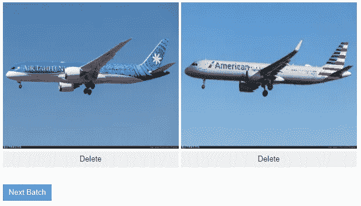

在这种情况下，使用的原始数据集足够干净，不会因重复图像而产生混淆。然而，在下面的例子中，我们将看到它是如何应用于寻找图像之间的相似性的。

# 图像清洗后的模型

这里我们有每个目录的原始图像，并清理。CSV 文件包含通过重新标记将保留和移动的图像列表

这里，我们必须小心处理代码，因为有必要重新生成 DataBunch(包含图像及其标签的数据帧)。尽管如此，在这种情况下，我们将指明原点是“from_csv”(在前面的示例中，它是“from_folder”)。

```
db = (ImageList.**from_csv**(path, 'cleaned.csv', folder='.')
.no_split()
.label_from_df()
.transform(get_transforms(), size=224)
.databunch())learn_cln = cnn_learner(db, models.resnet34, metrics=error_rate)
learn_cln.fit_one_cycle(2, max_lr=slice(1e-6/2,1e-3))
```

通过重新训练模型，您可以达到 100%的准确性，而不会发现令人困惑的值，也不会出现训练模型的 error_rate。太好了！

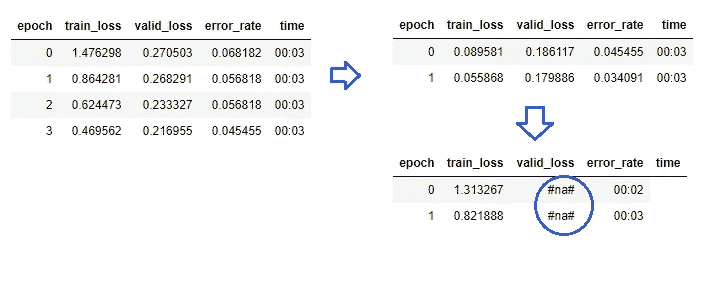

# 一个真实的使用案例

到目前为止，我们已经在我们从谷歌创建的数据集上使用“resnet34”建立了一个图像分类模型。

出于文章的目的，条件足以说明机器学习、可视化和清理数据集工具的威力。

最近出现了一个真实的案例，包括拍摄在 ERP 软件上报告需求的用户的票据所附的图像。我们的目标是将这些图像分为以下几类:“报告”、“错误”、“屏幕”、“罚单”

图像托管在服务器上，在“attach”路径下，在子目录中，用报告错误、消息或需求的用户的 ID 进行编号。

我们使用下面的 Python 代码将图像统一到一个目录中，从那里，客户端将它们“标记”在对应于每个类别的文件夹中。

```
import os
import sys
from shutil import copyfiledir_ori = 'attach'
dest = 'attach/images'
os.chdir(dir_ori)for x in os.listdir('.'):
   if os.path.isdir(x):
       newdir = os.path.join(dir_ori,x)
       os.chdir(newdir)
       for w in os.listdir(newdir):
           if os.path.isfile(w):
               file, ext = os.path.splitext(w)
               if ext.lower() == '.jpg':
                  if sys.platform == "win32":
                     os.popen('copy '+w+' '+dest)
                  else
                     os.popen('cp '+w+' '+dest)
       os.chdir(dir_ori)
```

一旦文件被统一，就安装一个应用程序，以便客户可以在它们相应的文件夹中标记它们，并且应用相同的训练和调色过程，获得以下结果:

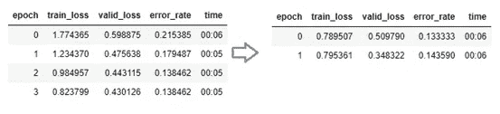

我们的初始准确率(在 ImageCleaner 之前)刚刚超过 85%。

这里我们可以看到一个带有相似搜索的 ImageCleaner 的清晰示例，这在之前的模型中是看不到的。

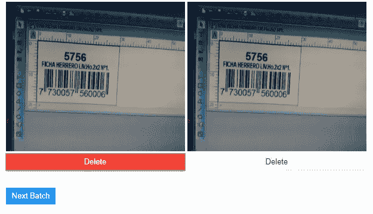

在训练数据集清理和重新标记混淆案例后，我们从 cleaned.csv 中重新获取 dataBuch，当重新训练模型时，以 clean base 作为数据源，我们再次获得 100%的准确率。

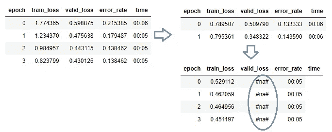

太好了，太好了！

# 部署模型

根据 fast.ai 课程第 2 课的内容，为了不浪费出现在那里的优秀内容，我们将传播它，因为在许多情况下，远离编程的人很难想象如何部署一个模型。

## 工作环境中的预测

首先，让我们看看 Jupyter 笔记本中的模型如何根据我们的工作环境进行预测

```
learn.export()
```

该命令在工作目录中创建一个名为“export.pkl”的文件，该文件包含部署模型所需的所有内容(权重、类的元数据以及所使用的转换或规范化)。

```
defaults.device = torch.device('cpu')
img = open_image(path/'birds'/'00000022.jpg')
img
```

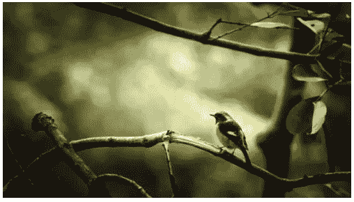

现在，我们必须看看 00000022.jpg，我们测试模型:

```
learn = load_learner(path)
pred_class,pred_idx,outputs = learn.predict(img)
pred_class
```

结果，当然，是鸟类这个类别！

## Starlette⁵和 Uvicorn⁶服役期间的预测

现在，让我们把模型投入生产。为此，我们认为他的框架在 Python 3.6+上是有限制的，为了安装它，我们从 Python 环境中运行

```
$ pip3 install starlette or $ pip install starlette
```

我们还需要建立一个服务器；在这种情况下，我们将使用我们安装的 uvicon[VII]

```
$ pip3 install uvicorn o $ pip install uvicorn
```

让我们尝试一个简单的 Python 代码，看看能否创建一个 API

```
from starlette.applications import Starlette
from starlette.responses import JSONResponse
import uvicornapp = Starlette(debug=True)
@app.route('/')async def homepage(request):
    return JSONResponse({'MySAMPLE': 'It works!'})if __name__ == '__main__':
    uvicorn.run(app, host='0.0.0.0', port=8000)
```

当您运行它时，将构建一个 Uvicorn 服务器，让您从浏览器访问 [http://localhost:8000/](http://localhost:8000/)

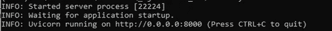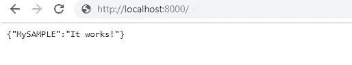

最后，我们可以应用接收一些图像的 URL 作为参数的预测，例如我们可以用

[http://localhost:8000/classify-URL？url=imagen.jpg](http://localhost:8000/classify-url?url=imagen.jpg)

这里，来自西蒙·willison⁷的代码作为完整部署的参考(记住我们需要在部署环境中获取 model.pkl 文件)

```
from fastai.vision import@app.route("/classify-url", methods**=**["GET"])**async** **def** classify_url(request):
   bytes **=** **await** get_bytes(request.query_params["url"])
   img **=** open_image(BytesIO(bytes))
   _,_,losses **=** learner.predict(img)
   **return** JSONResponse({
"predictions": sorted(zip(cat_learner.data.classes, map(float, losses)),key**=lambda** p: p[1],reverse**=True**)
})
```

> *注意:此代码显示为指南，直接取自上述课程。逐步解释或验证它不是本文的范围。一般来说，代码从请求中接收图像的 URL 作为参数，打开它，进行预测，然后返回一个 JSON，其中包含每个类别的概率。你可以参考西蒙·威尔逊的完整代码，* [*感谢*](https://github.com/simonw/cougar-or-not/blob/master/cougar.py) *他。*

# 摘要

我们已经看到了如何从 Google 搜索引擎创建我们自己的一组图像，或者如何操作来自服务器的图像，以将它们统一到我们的客户端可以标记它们。

我们已经开发了一个 resnet34 神经网络，获得了非常好的初始结果，在调整学习速率后更好，在清除可能产生混淆或重复的训练图像后获得了优异的最终结果。

最后，我们看到了关于如何部署模型来预测新病例的肤浅指南。

所有这些都是通过 fast.ai for Pytorch 实现的，只需几行简短的代码。

一旦我们记住这篇文章是受课程 [https://course.fast.ai](https://course.fast.ai) 第 2 课的启发，我们已经对其进行了测试，并且从中我们获得了我们真实案例的基础。

我希望这篇文章对你有用，如果有可以做得更好的地方，我将非常感谢你的评论和报告。

# 参考

[1]在 fast.ai 课程中，这项技术的灵感来自:弗朗西斯科·英厄姆和杰瑞米·霍华德/ [ [阿德里安·罗斯布鲁克](https://www.pyimagesearch.com/2017/12/04/how-to-create-a-deep-learning-dataset-using-google-images/) ]

[2] [https://course.fast.ai，](https://course.fast.ai)第二课，Jupyter 笔记本:第二课-下载

[3][https://towards data science . com/an-overview-of-resnet-and-its-variants-5281 e2f 56035](/an-overview-of-resnet-and-its-variants-5281e2f56035)

[4][https://medium . com/@ 14 Prakash/understanding-and-implementing-architectures-of-resnet-and-resnext-for-state-the-art-image-cf 51669 e 1624](https://medium.com/@14prakash/understanding-and-implementing-architectures-of-resnet-and-resnext-for-state-of-the-art-image-cf51669e1624)

[*]最近，我发现有两个以上类的混淆矩阵看起来奇怪而错误，[显然是 matplotlib](https://stackoverflow.com/questions/56942670/matplotlib-seaborn-first-and-last-row-cut-in-half-of-heatmap-plot) 版本的一个主题，所以我决定无论如何都要包括它。

[5][uvicon](https://www.uvicorn.org/)是一个快如闪电的 ASGI 服务器，建立在 [uvloop](https://github.com/MagicStack/uvloop) 和 [httptools](https://github.com/MagicStack/httptools) 之上。

[6] [Starlette](https://www.starlette.io/) 是一个轻量级的 [ASGI](https://asgi.readthedocs.io/en/latest/) 框架/工具包，是构建高性能 asyncio 服务的理想选择

[7]西蒙·威廉森制作的结构[这个代码](https://github.com/simonw/cougar-or-not)