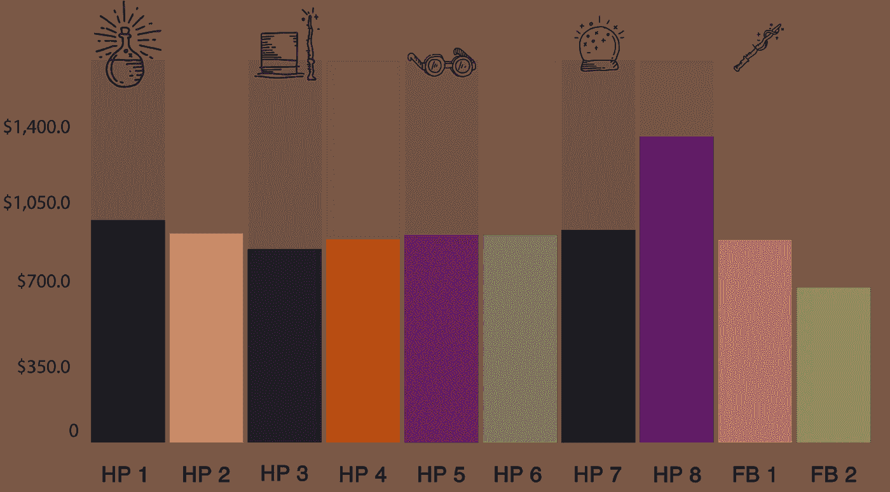
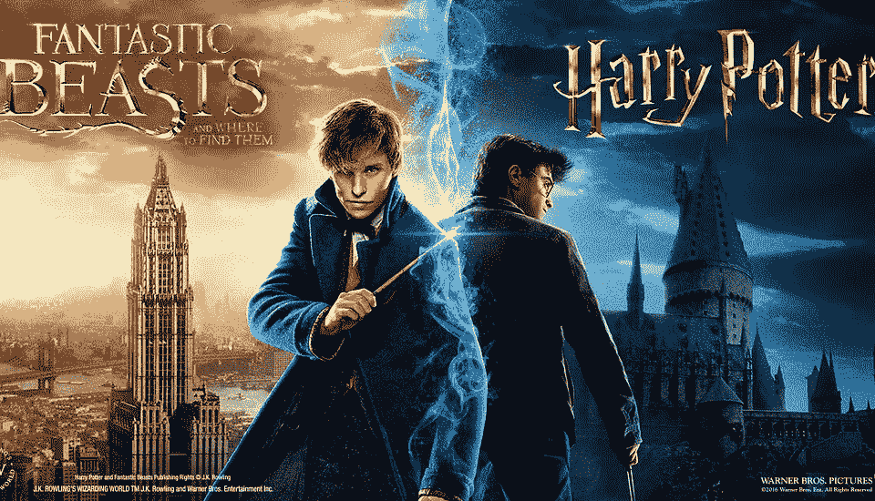

# 神奇动物和在哪里可以找到它们(在推特上)

> 原文：<https://towardsdatascience.com/fantastic-beasts-and-where-to-find-them-on-twitter-18059f2e25b3?source=collection_archive---------12----------------------->

Newt Scamander

从 1997 年第一本书发行到 2018 年最新的《神奇动物》电影，巫师世界一直是一个长期持续的趋势，吸引了许多千禧一代。这是过去二十年中最具影响力的现象之一，并吸引了大批追随者。然而，自从第二部《神奇动物》电影上映后，人们对这部电影的抵触情绪似乎比以往任何时候都多。这甚至导致粉丝群体中的一些人形成了反粉丝心态(加纳，2018 年)，这意味着粉丝会因为不喜欢某个特定部分而与该部分脱离关系。

《神奇动物:格林德沃的罪行》并不是大规模系列电影中第一部受到强烈反对的电影，两年前《星球大战:最后的绝地武士》等其他著名电影也发生过这种情况。这被许多粉丝视为失败，这部电影在网上受到了来自评论家和粉丝的大量仇恨([福布斯，2018](https://www.forbes.com/sites/scottmendelson/2018/06/26/star-wars-9-last-jedi-netflix-solo-force-awakens-wonder-woman-1984-frozen-2-jumanji-james-bond-box-office/#4014ae3c3d17) & [快报，2018](https://www.express.co.uk/entertainment/films/986642/Star-Wars-Last-Jedi-backlash-fan-boycott-Han-Solo-flop-Kathleen-Kennedy-Rian-Johnson) )，然而当[莫顿贝(2018)](https://www.researchgate.net/publication/328006677_Weaponizing_the_haters_The_Last_Jedi_and_the_strategic_politicization_of_pop_culture_through_social_media_manipulation?platform=hootsuite) 在推特上进行的一项研究显示，只有 21.9%的评论是负面的。因此，问题来了，这是否会是《神奇动物》的相同场景，因为大多数人都与魔法世界系列有着密切的关系，我们想给我们的读者一个影迷对新电影的看法的总体概述(带有一些魔法视觉)。这篇文章是写给对世界上最大的球队和球迷之一感兴趣的普通读者的，也是写给球迷自己的。

这些年来，魔法世界的曝光率一直很高，可以说是一种持续的趋势。通过展示谷歌趋势，可以洞察到新系列与哈利波特系列相比有多受欢迎。尽管《神奇动物》也不差，但不用多久我们就会发现《哈利·波特》仍然比《神奇动物》更受欢迎。

Google Trends

值得一提的是，哈利波特自 1997 年以来一直在确立自己的地位，而《神奇动物》只是在 2016 年才上映，然而第一部电影上映时，第一部哈利波特电影就获得了大量的粉丝和金钱。所以，当宣布粉丝们将得到一部前传时，许多粉丝都很兴奋，因为这被视为他们对魔法世界的“延伸”，这也在票房报告中看到。

BOX Office Results Bar Chart

BOX Office Results Pie Chart

《神奇动物在哪里》比《阿兹卡班的囚徒》更受欢迎，这表明它肯定不是系列电影中收入最低的。然而，随着第二部电影在影院上映两个月，它的名声越来越差，收入也明显减少。这些新电影成为了评论家们的热门话题，比如《每日电讯报》(2016 年)、《T2》(2016 年)、《Buzzfeed》(2016 年)和《T4》(2016 年)、《福布斯》(2016 年)，《福布斯》(2016 年)，自从约翰尼·德普在 2016 年电影的结尾以格林德沃的身份意外亮相以来。关于约翰尼·德普的更多见解将在本文后面给出。

[Tweet 1: Popular Negative Opinions](https://twitter.com/JennyENicholson/status/1020406911676502016)

由于这些粉丝对《神奇动物》系列电影有着非常不同的看法，所以研究人员对这些粉丝喜欢或不喜欢这部电影的原因进行了描述。为了这项研究，我们求助于人人都爱过度分享的平台:Twitter。从第一批预告发布到电影停止在影院上映，每部电影有 250 条推文被分析。因此，导致《神奇动物在哪里》从 2016 年 6 月 1 日到 2017 年 4 月 30 日，以及《神奇动物:格林德沃的罪行》从 2018 年 11 月 1 日到 2019 年 1 月 7 日。

通过滚动这些推文，已经可以注意到负面评论围绕着电影中的演员和清晰的情节漏洞等主题，但是稍后我们将详细阐述这些主题，看看人们不喜欢第二部电影是否有特定的原因。

为了理清混乱(由 500 条推文组成)，这些帖子被多次分成不同的类别，以简要概述 Twitter 上存在的积极和消极情绪。第一个主要类别由负面、正面或营销相关推文的数量决定，这导致了以下发现:

Fantastic Beasts 1 and Fantastic Beasts 2 Divide of Comments

在 500 条推文中，超过一半是营销相关的，准确地说是 251 条，这表明用于电影的标签高度商业化。其余的推文似乎对两部电影都非常积极，对第一部电影的负面评论很少(105 条评论中只有 2 条)，对《格林德沃的罪行》电影的总评论中约有三分之一是负面的(144 条中有 35 条)。
然而，这些主要类别仍然没有给我们更多的信息*为什么*《格林德沃的罪行》被描述为“玷污了哈利波特遗产的电影”[(2018 年福布斯)](https://www.forbes.com/sites/scottmendelson/2018/11/14/review-fantastic-beasts-the-crimes-of-grindelwald-franchise-killing-disaster-jk-rowling-johnny-depp/#1028744c3180)

所以，在看了一下非营销相关的推文后，可以看出 Twitter 上的粉丝似乎对电影的角色以及演员有很大的兴趣(无论是积极还是消极)，并通过他们的语言，粉丝艺术和粉丝小说来表现这一点。一些剩余的推文还包括用户提到他们计划去看电影或只是看了电影，没有表达实际意见。这些推文被标记为电影体验，在做更多研究时没有被考虑在内。

Histogram Discussed Topics

Bar Chart Characters FB 1 & 2

我们将从推特上粉丝们最喜欢的角色开始。如上面的视频所示，粉丝们为《神奇动物在哪里》中的纽特·斯卡曼神魂颠倒。虽然，这并不令人惊讶，因为他是电影中的主要主角，他是第一个更有爱心和温柔的男性角色，加上他是赫奇帕奇的事实(而且，每个人都喜欢赫奇帕奇)。Twitter 上其他受欢迎的角色包括邓布利多(或者更确切地说是电影中没有他)和克雷登斯。所有这些男性角色也收到了相当多的粉丝艺术。

[Tweet 2: Fan showing love towards Newt Scamander](https://twitter.com/prettymessygurl/status/1068947380379230209)

在《格林德沃的罪行》中，聚光灯从纽特身上移开，影迷的新欢似乎已经转向电影的对手；格林德沃。这既是因为他成为了第二部电影的主角，也是格林德尔多夫妇中的一员，这也解释了为什么年轻的邓布利多(#Dumbledamn)经常在评论中被提及。尽管粉丝们仍然明显对两人之间缺乏浪漫感到失望([《卫报》，2018](https://www.theguardian.com/film/filmblog/2018/feb/01/fantastic-beasts-2-why-cant-they-just-let-dumbledore-be-gay) )。

[Tweet 3: Complaints about lack of Grindeldore](https://twitter.com/deppheadgang/status/1065945167058935809)

[Tweet 4 : Support for Grindeldore](https://twitter.com/deppheadgang/status/1080454573192548352)

Pie Chart Characters FB 1 & 2

Twitter 上另一个激烈辩论的话题是电影的演员，尤其是因为围绕他们有很多问题。当看《神奇动物》系列第一部电影的推文时，只有两个演员和一个女演员被真正谈论过；雷德梅恩(纽特)，德普(格林德沃)和苏多尔(奎尼)。在这些推文中值得注意的是，所有用户对电影明星都有积极的反应。

Actors mentioned in Tweets FB 1

[Tweet 5: Fan showing love towards actors](https://twitter.com/magicalGicques/status/1071788822264930305)

然而，在第二部电影中，提到了更多的演员。这一次，扮演邓布利多的裘德洛和扮演克雷登斯的埃兹拉·米勒得到了他们应得的赞赏。

Actors mentioned in Tweets FB 2

除了约翰尼·德普，所有的演员都因为他们在电影中的表现而得到了赞扬。在提到他的 28 个帖子中，有 5 个是负面的。这些帖子都提到了他虐待前妻的指控，尽管其余 23 个正面帖子都为他辩护，或者只是说他们不关心他的个人生活，但确实喜欢他的表演。

[Tweet 6 about the Johnny Depp situation](https://twitter.com/Cindispy00/status/1080966882553942016)

为了真正找出电影中令人喜爱或讨厌的地方，还根据对情节的评论对推文进行了分析。对于《神奇动物在哪里》，我们发现所有的评论都是正面的。然而，许多评论并没有提到他们为什么喜欢这部电影，只有 5 条评论具体说明了他们喜欢实际情节的什么，这些都与故事情节有着更黑暗的基调和只是“好”或者时间设置和使用的惊人视觉效果有关。

Infographic Plot FB 1

[Tweet 7: Positive opinion about plot FB 1](https://twitter.com/wyattyhalpert/status/800275977871863808)

对于《神奇动物:格林德沃的罪行》,意见似乎有所不同，仍然有对这部电影的喜爱(66%的评论仍然是积极的),然而粉丝们几乎没有表明他们为什么喜欢它。不喜欢这个情节的人(幸运的是)提到了原因，大多数评论都提到了故事情节不完整或不正确，这使得电影很难理解。这些结果已经表明了粉丝心态的分歧，以及基于他们是否喜欢《神奇动物》系列的问题，似乎出现了不同的亚文化。

Infographic Plot FB 2

[Tweet 8: Negative opinion about plot FB 2](https://twitter.com/RyanmEft/status/1063672113293377536)

粉丝在 Twitter 上表达自己的另一种方式是发布粉丝艺术、粉丝理论和粉丝小说。《神奇动物在哪里》的 105 篇帖子中有 21 篇是粉丝创作的。帖子主要围绕格林德尔多夫妇(格林德尔沃德和邓布利多)，纽特本人和纽特娜(纽特和蒂娜)，在所有的粉丝艺术中，值得注意的是这对夫妇受到了全世界粉丝的喜爱，因为有些帖子甚至用泰语、俄语和日语发布。

Tweet 9 & 10: [Japanese fan-art about Newtina](https://twitter.com/tapioccat/status/1078439397618380800) and [other Fantastic Beasts Characters](https://twitter.com/osatou_tw/status/1081087335159087104)

围绕第二部电影的推文包含了更多粉丝的创作，在 144 条帖子中，有 41 条包含了粉丝艺术和粉丝小说。几乎所有这些帖子都围绕着同一对夫妇和纽特·斯卡曼个人。

不同粉丝艺术的创作清楚地展示了粉丝们对特定角色组合的投入，这与魔法世界粉丝们多年来所做的事情非常吻合；如果他们不能获得足够的东西，他们会自己创造更多。

[Tweet 11](https://twitter.com/decembristsson/status/1081190992567549952) & [12:](https://twitter.com/DiChi71/status/1081659007750807552) Containing fan-art of the Grindeldore couple

Pie Chart Marketing Comments FB 1 & FB 2

在分析了 Twitter 之后，很明显，为电影制作的标签也被大量用于营销目的。既然魔法世界系列已经赚了数十亿美元，商业空间的出现也就不足为奇了。随着 500 条推文中有 251 条与营销相关，很明显越来越多的公司意识到这种神奇的特许经营是他们可以赚钱的东西。此外，还有官方粉丝网站，如 Pottermore 和 MuggleNet，它们主要由粉丝驱动，但仍然被视为中立和商业网站，因为它们为电影做了大量宣传。公司试图对这个市场产生重大影响，他们要么通过在推特上发布关于电影赠品或促销的消息，比如发布更多事实、演员活动、商品或票务网站链接。

[Tweet 13: Give-away by popular account OriginalFunko](https://twitter.com/OriginalFunko/status/1063976339114471424)

[Tweet 14: Promotional post by the original Fantastic Beasts account](https://twitter.com/FantasticBeasts/status/1068671018628079617)

人们对神奇动物系列电影的最大问题之一是约翰尼·德普的选角，他是*也是*一个有争议的人物，因为他被前妻指控虐待，这受到了各种媒体的广泛批评([综艺，2018](https://variety.com/2018/scene/news/amber-heard-johnny-depp-open-letter-me-too-1202975127/) & [卫报，2018](https://www.theguardian.com/film/2018/oct/04/amber-heards-legal-team-condemns-johnny-depp-abuse-denials) )。在续集中，约翰尼·德普出现得更多，在格林德沃的罪行被公布的时候，对话(或指控)再次被点燃。推特和媒体上对此的看法非常明显，许多粉丝对演员和 J.K .罗琳的选角感到愤怒。

Bar Chart #boycottjohnnydepp & #johnnydeppisinnocent

通过查看 Twitter 上最常用的标签来显示对这位演员的支持(# JohnnyDeppIsInnocent)或仇恨(#BoycottJohnnyDepp)，我们看到平台上有一些非常直言不讳的用户。特别是在韩国，这位演员并不受欢迎，有单独的韩国标签被创建来批评他。然而，平台上对约翰尼·德普的支持仍然占大多数，大约三分之二的评论是积极的，许多人仍然表达了他们对他的爱。

[Tweet 15: Negative Johnny Depp Opinion](https://twitter.com/SakuraAi/status/1044586020572778498)

Word-clouds on researched Hashtags

由于推特用户对这样的话题直言不讳，这导致了另一种现象在巫师界发生:在最初的崇拜者圈子里出现了多种崇拜者亚文化。大多数粉丝都直言不讳地表达了他们的观点，这在粉丝群体之间造成了隔阂。一些反粉丝强烈批评那些喜欢约翰尼·德普或神奇动物系列的粉丝。

[Tweet 16](https://twitter.com/mathewkearney/status/1063553558556155904) & [17:](https://twitter.com/kyloporg/status/1044616526681329664) Criticising other fans

Fantastic Beasts vs Harry Potter

通过收集所有的结果，我们可以清楚地看到巫师世界不再是一个大社区，而是多个小社区。所有这些社区对新的神奇动物电影和其中的演员都有非常不同的观点。

著名的《活着的男孩》已经让粉丝着迷了二十多年，而让人们着迷于整个现象的东西(比如房子和令人难以置信的情节)似乎被 J.K .罗琳推到了一边。由于新电影不是基于书籍，也不是围绕哈利·波特、赫敏·格兰杰或罗恩·韦斯莱，它引起了粉丝们的兴趣，因为它带走了哈利·波特的魔力。所以，在新系列播出后，问题来了，罗琳试图在她的魔法世界里放入这么多的系列，是否真的是在摧毁她的魔法。

这可以通过今天的一些研究来回答；是的，她可能正在摧毁她的世界的某些部分，但粉丝已经变得如此之大，无论她发布什么，都会有很大一部分人支持她。
目前的情况与上一部绝地电影有关，在网上看起来这部电影受到了大量的反对，但当它被放在一个角度看时，实际上网上的仇恨相对较少。在粉丝发布的 249 条推文中，有 14.8%是关于神奇动物系列的负面推文。虽然这并不能掩盖《最后的绝地》和《神奇动物》都达到了让粉丝非常困惑和失望的目的。

我们完全建议你做的是自己决定你对新系列的看法，特别是因为有这么多不同的意见，而这只是总共 5 部电影的续集。因此，等到下一部电影来寻找答案也不是一个坏选择。众所周知，J.K .罗琳是创造宏伟故事情节的大师，所以现在，我们所能做的就是对她(以及她背后的整个营销团队)多一点信心，并希望她能利用她的魔法将神奇动物变成粉丝应得的特许经营权。

毫无疑问，即将上映的《神奇动物》系列电影将重新点燃新一代人或老一辈人对魔法的热爱。也许这不会是自 1997 年以来哈利波特教给我们的对魔法的热爱，但纽特·斯卡曼肯定有更多神奇的动物让我们去爱。

由 Imme van Oudheusden 和 Kim Jansen 创作。

APA 参考:

m .贝(2018)。《仇恨者的武器化:最后的绝地和通过社交媒体操纵的流行文化的战略政治化》。洛杉矶:南加州大学安娜堡传播与新闻学院。

Bennett，A. (2016 年 11 月 2 日)。*哈利·波特迷对约翰尼·德普在《神奇动物》中的角色感到愤怒。检索自 BuzzFeed:[https://www . BuzzFeed . com/alannabennett/Johnny-Depp-fantastic-beasts](https://www.buzzfeed.com/alannabennett/johnny-depp-fantastic-beasts)*

丘巴，K. (2018 年 10 月 10 日)。艾梅柏·希尔德在#MeToo 周年纪念活动上阅读关于约翰尼·德普虐待指控的信。检索自综艺:[https://Variety . com/2018/scene/news/amber-heard-Johnny-Depp-open-letter-me-too-1202975127/](https://variety.com/2018/scene/news/amber-heard-johnny-depp-open-letter-me-too-1202975127/)

加纳河(2018)。媒体粉丝和粉丝研究指南。《不是我的命根子:自我民族志、情感波动和流行音乐反狂热》(第 6 章)。约翰·威利父子公司。

霍克斯河(2016 年 11 月 9 日)。约翰尼·德普确认出演《神奇动物》中的格林德沃——但并不是每个人都高兴。从电讯报检索:[https://www . Telegraph . co . uk/films/2016/11/09/Johnny-Depp-confirmed-as-grindelwald-in-fantastic-beasts-but-n/](https://www.telegraph.co.uk/films/2016/11/09/johnny-depp-confirmed-as-grindelwald-in-fantastic-beasts---but-n/)

Kyriazis，S. (2018 年 7 月 10 日)。《星球大战:最后的绝地反击》和影迷抵制:导演警告后果自负。检索自 Express:[https://www . Express . co . uk/entertainment/films/986642/Star-Wars-Last-Jedi-backlash-fan-boycit-Han-Solo-flop-Kathleen-Kennedy-Rian-Johnson](https://www.express.co.uk/entertainment/films/986642/Star-Wars-Last-Jedi-backlash-fan-boycott-Han-Solo-flop-Kathleen-Kennedy-Rian-Johnson)

Mendelson，S. (2016 年 11 月 2 日)。为什么约翰尼·德普不帮助《神奇动物在哪里》。检索自福布斯:[https://www . Forbes . com/sites/Scott Mendel son/2016/11/02/why-Johnny-Depp-donts-help-fantastic-beasts-and-where-to-find-them/# 19e 400442 e44](https://www.forbes.com/sites/scottmendelson/2016/11/02/why-johnny-depp-doesnt-help-fantastic-beasts-and-where-to-find-them/#19e400442e44)

Mendelson，S. (2018 年 11 月 14 日)。*回顾:《神奇动物 2》是一场系列杀人灾难*。检索自福布斯:[https://www . Forbes . com/sites/Scott Mendel son/2018/11/14/review-fantastic-beasts-the-crimes-of-grindelwald-franchise-killing-disaster-JK-Rowling-Johnny-Depp/# ad 50 ACF 31803](https://www.forbes.com/sites/scottmendelson/2018/11/14/review-fantastic-beasts-the-crimes-of-grindelwald-franchise-killing-disaster-jk-rowling-johnny-depp/#ad50acf31803)

Mendelson，S. (2018 年 6 月 26 日)。*《星球大战 9》的大问题不会是《最后的绝地武士》的反弹或者《单飞》的失败*。检索自福布斯:[https://www . Forbes . com/sites/Scott Mendel son/2018/06/26/star-wars-9-last-Jedi-网飞-solo-force-awakens-wonder-woman-1984-frozen-2-juman Ji-James-bond-box-office/# 4014 AE 3c 3d 17](https://www.forbes.com/sites/scottmendelson/2018/06/26/star-wars-9-last-jedi-netflix-solo-force-awakens-wonder-woman-1984-frozen-2-jumanji-james-bond-box-office/#4014ae3c3d17)

普尔弗，A. (2018 年 10 月 4 日)。艾梅柏·希尔德的法律团队谴责约翰尼德普虐待否认。从《卫报》检索:[https://www . The Guardian . com/film/2018/oct/04/amber-heards-legal-team-谴责-Johnny-Depp-虐待-否认](https://www.theguardian.com/film/2018/oct/04/amber-heards-legal-team-condemns-johnny-depp-abuse-denials)

纽特·斯卡曼图片检索自:[https://t1 . dau mcdn . net/movie/0161 e 246399349 CBA 68d 8 f1 f 9 C5 c 15 c 41540263032405](https://t1.daumcdn.net/movie/0161e246399349cba68d8f1f9c5c15c41540263032405)

神奇动物大战哈利波特图片检索自:[http://ovicio . com . br/WP-content/uploads/eg2tsrg 5 bvaybfnqc0ql . jpg](http://ovicio.com.br/wp-content/uploads/eg2tsrg5bvaybfnqc0ql.jpg)

纽特·斯卡曼与 Bowtruckle Gif 检索自:[https://68 . media . Tumblr . com/715 c 11d 0 CEB 1812 c 878 AFD 81 f 20 c8 e 83/Tumblr _ oh 069 mpdcq 1 vpj 1 fho 1 _ 500 . Gif](https://68.media.tumblr.com/715c11d0ceb1812c878afd81f20c8e83/tumblr_oh069mPDCQ1vpj1fho1_500.gif)

恶作剧托管图片检索自:[https://just stitchers . in/WP-content/uploads/2017/01/恶作剧托管. png](https://juststickers.in/wp-content/uploads/2017/01/mischief-managed.png)

所有推文:

推文 1:由用户 [**@** JennyENicholson](https://twitter.com/JennyENicholson) 于 2018 年 7 月 20 日发布
检索自:[https://Twitter . com/jennye Nicholson/status/1020406911676502016](https://twitter.com/JennyENicholson/status/1020406911676502016)

推文 2:由用户@prettymessygurl 于 2018 年 12 月 1 日发布
检索自:[https://Twitter . com/prettymessygurl/status/1068947380379230209](https://twitter.com/prettymessygurl/status/1068947380379230209)

推文 3:由用户@deppheadgang 于 2018 年 11 月 23 日发布
检索自:[https://twitter.com/deppheadgang/status/1065945167058935809](https://twitter.com/deppheadgang/status/1065945167058935809)

推文 4:由用户@deppheadgang 于 2019 年 2 月 1 日发布
检索自:[https://twitter.com/deppheadgang/status/1080454573192548352](https://twitter.com/deppheadgang/status/1080454573192548352)

Tweet 5:由用户@ magicalGicques 于 2018 年 9 月 12 日发布
检索自:[https://Twitter . com/magialgicques/status/1071788822264930305](https://twitter.com/magicalGicques/status/1071788822264930305)

推文 6:由用户@cindispy00 于 2018 年 3 月 12 日发布
检索自:[https://twitter.com/Cindispy00/status/1080966882553942016](https://twitter.com/Cindispy00/status/1080966882553942016)

推文 7:由用户@wyattyhalpert 于 2018 年 11 月 20 日发布
检索自:[https://twitter.com/wyattyhalpert/status/800275977871863808](https://twitter.com/wyattyhalpert/status/800275977871863808)

推文 8:由用户@ryanmeft 于 2018 年 11 月 16 日发布
检索自:[https://twitter.com/RyanmEft/status/1063672113293377536](https://twitter.com/RyanmEft/status/1063672113293377536)

推文 9:由用户@ tapioccat 于 2018 年 11 月 27 日发布
检索自:[https://twitter.com/tapioccat/status/1078439397618380800](https://twitter.com/tapioccat/status/1078439397618380800)

推文 10:由用户@osatou_tw 于 2018 年 3 月 1 日发布
检索自:[https://twitter.com/osatou_tw/status/1081087335159087104](https://twitter.com/osatou_tw/status/1081087335159087104)

推文 11:由用户@decembristsson 于 2018 年 4 月 1 日发布
检索自:[https://Twitter . com/decembristsson/status/1081190992567549952](https://twitter.com/decembristsson/status/1081190992567549952)

推文 12:由用户@dichi71 于 2018 年 5 月 1 日发布
检索自:【https://twitter.com/DiChi71/status/1081659007750807552】T4

推文 13:由用户@originalfunko 于 2018 年 12 月 22 日发布
检索自:[https://Twitter . com/original funko/status/1063976339114471424](https://twitter.com/OriginalFunko/status/1063976339114471424)

推文 14:由用户@fantasticbeasts 于 2018 年 11 月 30 日发布
检索自:[https://Twitter . com/fantastic beasts/status/1068671018628079617](https://twitter.com/FantasticBeasts/status/1068671018628079617)

推文 15:由用户@ sukuraai 于 2018 年 9 月 26 日发布
检索自:[https://twitter.com/SakuraAi/status/1044586020572778498](https://twitter.com/SakuraAi/status/1044586020572778498)

推文 16:由用户@mathewkearney 于 2018 年 11 月 16 日发布
检索自:[https://Twitter . com/mathewkearney/status/1063553558556155904](https://twitter.com/mathewkearney/status/1063553558556155904)

推文 17:由用户@kyloporg 于 2018 年 8 月 25 日发布
检索自:[https://twitter.com/kyloporg/status/1044616526681329664](https://twitter.com/kyloporg/status/1044616526681329664)

