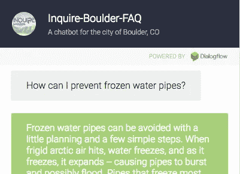
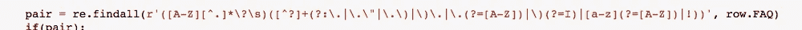

# 常见问题聊天机器人 MVP

> 原文：<https://towardsdatascience.com/faq-chatbot-mvp-871ab7db94cc?source=collection_archive---------11----------------------->

## **使用 Python、Flask、Docker 和谷歌云服务**

[https://willtscott.github.io/inquire-boulder-chatbot/](https://willtscott.github.io/inquire-boulder-chatbot/)

这是一个快速的过程和工具的纲要，我研究并使用它来为博尔德市建立一个聊天机器人，CO 的常见问题页面。将来我会写一些关于技术方面的更详细的帖子。

github:【https://github.com/willtscott/inquire-boulder-chatbot 

> **结果:**现在，这个例子是一个最小可行的产品。我之所以分享这个过程，是因为它可以很容易地转移到其他 FAQ 网站，并且可以通过其他功能进行扩展。我遵循的路线也受到我希望获得标准行业实践经验的影响，因此是简单和复杂选项的平衡。

## 数据采集

将 FAQ 页面转换成数据集在理论上非常简单，第一步是将网页转换成逗号分隔值的文件。根据你的出发点，这可能是琐碎的，也可能是乏味的。

我开始使用科罗拉多州博尔德市的内容，所以当我看到他们的查询博尔德 FAQ 页面的第一反应是震惊！页面是动态生成的，这使得下载或抓取变得更加困难。因此，我最初的选择是点击 250 多个主题中的每一个，并手动将它们的信息复制粘贴到一个文件中。 *Yowch！*(值得注意的是，虽然这可能需要几个小时令人麻木的点击，但弄清楚如何抓取动态页面可能需要更长的时间。)

幸运的是，我有了一个更好的主意，这个主意给我带来了回报，也让我少了很多烦闷。在[博尔德开放数据](https://bouldercolorado.gov/open-data)页面上，我找到了 FAQ 相关数据集维护负责人的联系信息。仅仅发了几封邮件之后，她就从网站管理员那里给我发来了一个文件，里面包含了每个 FAQ 页面的内容，按类别、部门和主题进行了分类。

在项目的早期阶段，这种资产是纯金的，并继续得到回报，因为我的联系人提供了进一步的帮助，建议类似的数据集、相关的项目，以及向博尔德数据团队展示我的 ChatBot 并在他们的数据展示页面上托管它的可能性。所以非常感谢，尼科利亚！

> **经验教训:**在你花大量时间去完成一项琐碎的任务之前，花几分钟四处看看，看看你是否能直接找到问题的根源。许多市政府发布公共数据集，必须有人负责处理所有这些数据。礼貌地提问，你永远不知道你会得到什么样的数据。此外，社会关系可能会更有回报。

## 数据清理

得到这个文件是一个巨大的推动，但它还没有结束。在将文件从 Excel 转换为 CSV 格式后，我仍然需要清理数据并使其达到最终状态:一列问题和一列相应的答案。

我将每个条目转换成 unicode 文本，移除工件，并利用 spaCy 库的[特性来分隔条目中的每个句子。虽然这不是一个完美的修复，但它让我在处理干净数据方面有了一个巨大的开端，足以让我能够继续尝试 NLP 和 ML 技术。](https://spacy.io/usage/spacy-101#lightning-tour-tokens-sentences)

后来，我重新开始清理这些条目，并手工编辑了一些由地址、不标准的语法、奇怪的标点和样式造成的错误。

对于*pie ce de resistance*我编写了一个复杂的正则表达式，从一组文本中分离出问答对，然后将它们放入两个独立的列中。

> **跳到最后:**根据你自己的需要，你可以在这里停下来，把你整洁的 q-n-a 电子表格带到聊天机器人平台，如[微软 QnA Maker](https://www.qnamaker.ai/) 或[谷歌 Dialogflow](https://dialogflow.com/) ，它会把你的数据插入一个预建的界面，包括聊天回复和开箱即用的机器学习。在默认设置的这两个选项中，QnA Maker 给我的结果稍好一些。价格会有所不同，所以在你承诺之前做好你的功课。在这篇博客的最后，我从我的经历中提供了一些建议。

## 自然语言处理

经过预处理和手工清理后，我的 NLP 管道是删除标点符号和停用词，将所有内容都小写，然后对剩余的词进行词条整理。我发现变元化比单纯的词干化要有效得多。将单词简化为最基本的形式有助于更广泛的相似性匹配，这有助于聊天机器人在响应查询时的准确率。NLTK 库有一些简单的选项可以提供帮助。

下一步是将文档转换成 ML 模型能够理解的数字向量。首先，我使用单词包，这是一个大型的稀疏矩阵，用二进制值来表示语料库中的每个单词是否存在于文档中。从这里开始，BOW 向量被转换成[术语频率——逆文档频率](https://en.wikipedia.org/wiki/Tf%E2%80%93idf)向量，它基于每个单词在文档中的频率及其在整个文档集合中的频率来表示每个单词对语料库的重要性。

因此，对于我的数据集，单词“Boulder”具有相对较低的 TF-IDF 值，这是因为它在整个文档中非常普遍。对于一个关于不同城市的常见问题，你会认为“博尔德”更有分量。(无双关之意？)

> **行业工具:**单词袋和 TF-IDF 矢量化是任何 NLP 项目的标准，为更复杂的操作提供了坚实的基础。下面的大多数匹配策略涉及对 TF-IDF 向量应用各种函数。

## 相似性匹配

为了将用户问题与数据集中的答案进行匹配，我尝试了几种不同的方法:

*   [**语义相似度**](https://spacy.io/usage/vectors-similarity) 通过预先训练的模型被包括在 NLP 库[空间](https://spacy.io/)中，该模型认为如果单词在相似的上下文中使用，则它们是相似的。根据我的经验,“中型”空间模型在分配相似性方面几乎和“大型”模型一样好，而且加载速度明显更快。该库的实现既快速又简单(甚至 spaCy 中包括了矢量化)，但是直接的结果并不特别令人印象深刻，并且大型模型可能会在部署时损害您的钱包。
*   [**余弦相似度**](https://en.wikipedia.org/wiki/Cosine_similarity) 是两个向量之间夹角的余弦度量。这里的应用程序是计算用户查询向量和数据集中每个向量之间的夹角余弦。最接近 1 的余弦是用户查询的最佳匹配。我从 [numpy](https://docs.scipy.org/doc/numpy/reference/generated/numpy.transpose.html) 和 [scikit-learn](https://scikit-learn.org/stable/modules/generated/sklearn.metrics.pairwise.cosine_similarity.html) 的现有部分构建了这个比较，它足够简单，并且不需要庞大的模型。我发现结果相当不错，并最终在我的 MVP 机器人中使用了这种精益方法。
*   [**KD 树**](https://scikit-learn.org/stable/modules/generated/sklearn.neighbors.KDTree.html) 是 scikit-learn 中表示的一种数据结构，对存储 K 近邻关系很有用。这种静态存储使您不必在每次比较向量时重新计算距离。scikit-learn 版本中的距离度量不支持余弦相似性，余弦相似性将是该策略的理想扩展，但一些包含的度量(欧几里德、l2、闵可夫斯基和 p)在我的测试案例中工作得一样好。
*   [**Gensim**](https://radimrehurek.com/gensim/models/doc2vec.html)**[的 Doc2Vec](https://radimrehurek.com/gensim/index.html)** 是 Word2Vec 方法的扩展，它使用神经网络来学习整个文档的嵌入，而不仅仅是单个单词。我发现这种方法的设置比以前的方法要复杂得多，并且结果不如基本余弦相似度和 KDTree。然而，如果你对神经网络很熟悉，并且愿意钻研细节，那么这是一个很有前途的角度。需要注意的是:大多数 FAQ 不会包含足够的文本来获得强大的训练，并且没有太多对预训练 Doc2Vec 模型的支持，但是[这里有一个开始](https://github.com/jhlau/doc2vec)。

> 保持简单和愚蠢:相似性匹配有许多不同的方法。同样，遵循阻力最小的途径，寻找一个为您想要使用的策略提供内置功能的库。没有必要重新发明轮子。当你准备好部署你的机器人时，你可以回来重新检查你的选项以提高准确性。
> 
> 我的建议是将你的管道构建成独立的模块，这样你就可以很容易地交换新的选项，而不用重写整个程序。这种模块化还将帮助您测试和比较结果，以便您知道您正在做出关于选择哪个函数的明智决策。

## Web 服务和部署

随着您的管道能够返回相关的响应，下一步是让机器人上线，这样人们就可以实际使用它。

[Flask](http://flask.pocoo.org/) 是一个 Python 微框架，它可以通过在本地 URL 上托管一个基本的 HTML 页面，并将用户查询作为 POST 请求提交给 Flask route 函数，后者返回来自相似性匹配算法的响应，并将其呈现在页面上，从而使聊天机器人的 web 服务变得异常简单。

> **分享就是关怀:**网络服务的真正力量在于把你的机器人放到互联网上，让公众和其他程序都能访问。只要有当地的 Flask 服务，你就已经成功了一半。

在网上提供你的机器人的另一半是让它可以被公众访问。像 [ngrok](http://ngrok - secure introspectable tunnels to localhost https://ngrok.com/) 这样的工具在技术上可以做到这一点，但是规模很小，需要你自己的电脑来托管。更有用的是谷歌、亚马逊、微软等提供的现代云服务。这将为您处理托管(当然是收费的。)

我与[谷歌云服务](https://www.google.com/aclk?sa=l&ai=DChcSEwj-pNOQ1fPgAhULp2kKHXSWBWgYABAAGgJpcQ&sig=AOD64_2sR2s7VvvkSG62lFlX0Wl9A-rk3Q&q=&ved=2ahUKEwj_-suQ1fPgAhUIQq0KHVWlDigQ0Qx6BAgJEAE&adurl=)合作托管我的 Flask 应用程序，将它包装在 Docker 容器中，并在负载平衡的 Kubernetes 集群上运行，以允许扩展。([谷歌应用引擎](http://App Engine - Build Scalable Web & Mobile Backends in Any ... https://cloud.google.com/appengine/)是一个替代方案，在某些情况下可能会更容易。)这一步最后给了 bot 一个公共 URL。分享给你的朋友吧！

## 连接

如果你想建立你自己的网页界面，这是一个好地方。

我在这里采用了一种混合方法，并将我的 q-n-a 数据集上传到 Google Dialogflow，作为[知识库意图](https://dialogflow.com/docs/agents/knowledge-connectors)。然后，我通过使用应用程序的公共 URL 作为一个 [webhook](https://dialogflow.com/docs/tutorial-build-an-agent/create-fulfillment-using-webhook) ，将知识意图连接到我在 GCP 的 web 服务。

现在，每当用户向 Dialogflow 代理查询知识库中的主题时，代理都会在后台向我的 web 服务应用程序发送 webhook 请求，并接收由我的自定义相似性匹配确定的响应。

我的混合方法的好处是，用户可以与 Dialogflow 接口进行交互(包括闲聊响应)，如果我的自定义 bot 服务器出现故障，Google 的知识意图机器学习可以作为后备响应。

> **自豪的家长:**我应该在这里指出——尽管我的相似性算法很基本，但它仍然胜过我测试的大规模技术公司服务中的任何开箱即用的 ML 平台。

# **关于成本的一些话:**

**谷歌云产品:**300 美元的注册信用旨在帮助你在掌握事物的过程中吸收成本，但仍然需要小心你在服务上投入的重量，这样你就可以避免成本飙升的经典恐怖故事。我使用的服务需要启用计费。在测试 Docker、clusters 和 swarms 时，我在几周内花掉了大约 15 美元。一天自己占了 10 美元左右，跟踪钱的去向可能会很棘手，所以要小心！最后，一个用户基数小的聊天机器人运行起来应该相当便宜。稍后我会提供一个更新，提供更多关于信用持续时间的细节。

***更新:*** *经过几周的持续运营，我有了一些关于成本的初步数据。一开始我的服务大概吃了****【3 美元/天*** *。仅使用 webhooks 使我能够消除 Dialogflow API 库，并缩减到仅 1 个集群，而不是 3 个，成本降至~***【2 美元/天】。**

***Dialogflow:** 标准版免费，企业版有按使用付费要求。[这里有一张](https://cloud.google.com/dialogflow-enterprise/docs/editions#pricing_and_support_comparison)对比图，但即使是[标准版配额](https://cloud.google.com/dialogflow-enterprise/quotas)也应该足以让你入门。这个平台有很多小功能，包括语音支持以及与脸书和 Slack 等其他消息应用的集成。*

*微软 QnA Maker: 如果你只是上传一个包含两列的 Excel 文件:问题和答案，微软 Azure 平台上的这个 web 服务开箱即用就能很好地工作。对于我的小测试集，ML 响应比 Dialogflow 的内置 ML 更准确，尽管界面不是那么用户友好。我用 200 美元的免费注册信用连续运行了整整一个月(流量很少)，但我建议在你设置的时候想办法禁用这项服务，以便进一步扩展你的信用。[这是](https://azure.microsoft.com/en-us/pricing/details/cognitive-services/qna-maker/)这项服务的定价页面。*

# *下一集…*

*在我的下一篇文章中，我将进一步深入细节，并提供一个指南，通过 Docker 跟踪将这个简单的 Flask 应用程序部署到 GCP Kubernetes 集群的路径。我计划解决一些其他教程中似乎没有的空白，所以如果你对这个话题感兴趣，请继续关注。如果你有任何问题或者只是想聊聊机器人，请告诉我！*