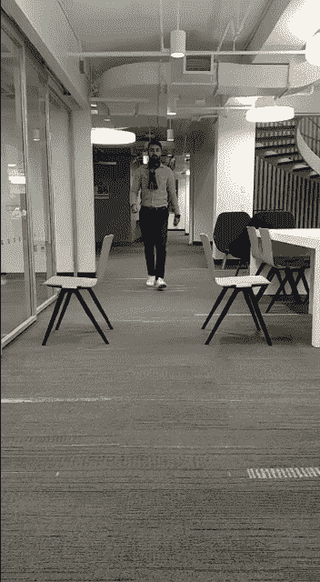

# AI 能阻止犯罪吗？使用计算机视觉的逃票检测

> 原文：<https://towardsdatascience.com/fare-evasion-detection-using-computer-vision-9bf0cead6937?source=collection_archive---------19----------------------->

逃票是纽约市交通管理局面临的一个日益严重的问题。去年的[报告](http://web.mta.info/mta/news/books/docs/special-finance-committee/Fare-evasion-board-doc_181130.pdf)显示:

*   据估计，2018 年因逃票造成的收入损失为 2.15 亿美元
*   地铁 9600 万美元，公交车 1.19 亿美元
*   预计未收收入将比 2015 年增加 1.1 亿美元

Fare Evasion in New York. ([Source](http://web.mta.info/mta/news/books/docs/special-finance-committee/Fare-evasion-board-doc_181130.pdf))

在 2018 年 12 月举行的 MTA 委员会[特别会议](https://nypost.com/2018/12/03/mta-will-have-execs-cops-physically-block-fare-beaters/)上，纽约市交通总裁安迪·拜福德表示，甚至机构高管也可能被部署来阻止逃票者。他说:“我们将让总部的人组成团队，随机去乘坐公共汽车或站在大门前，提供一个物理屏障，以确保你在进入车站或乘坐公共汽车前有票。”。“当然，我们会有(额外的 MTA)团队或警察来支持我们。”

正如这里的[所提到的](https://www.wnyc.org/story/nypd-commissioner-ride-rails/)，逃票还有其他的社会含义。“当我是警察局长时，我们开始关注逃票，”布拉顿在 2014 年说。“我们发现了什么？七分之一的人被通缉。每 21 个人中就有一个携带武器，从美工刀到简自豪冲锋枪。因此，如果你愿意的话，纽约奇迹始于 25 年前对地铁逃票行为的执法。”

用于估计逃票的当前数据收集过程远非完美，并且依赖于人工生成的数据和采样技术。

MTA fare evasion data collection ([source](http://web.mta.info/mta/news/books/docs/special-finance-committee/Fare-evasion-board-doc_181130.pdf))

我相信，通过利用计算机视觉的技术进步，利用安全摄像机镜头测量(而不是估计)地铁逃票的成本有效的自动化系统是可能的。大多数十字转门都被安全摄像头覆盖，这些镜头被记录并保存在中央服务器上。有可能设计一个软件管道来消耗来自这些服务器的视频数据，并使用计算机视觉来检测十字转门跳线，并将该信息记录在数据库中。这种自动化将有以下好处:

*   无需安装边缘设备或现场硬件，这意味着实施成本最低。
*   逃票数据将具有精确的时间粒度，而不是采样。
*   逃票数据将具有精细的空间粒度(车站入口级别),不同于当前方法的全系统估计。
*   将其转化为实时信息系统的潜力
*   准确的估算将使 MTA 能够更好地进行成本效益分析，并以数据驱动的方式决定下一步行动。
*   数据的时空特性将使高效的人员调度成为可能，以防止逃票。
*   它将削减人工数据收集的成本

# 计算机视觉营救

我们将用计算机视觉可以解决的方式来重新表述这个问题。目标是识别视频中发生逃票的帧。当一个人跳过十字转门而不是走过它时，就会发生逃票。因此，如果你能在给定的画面中区分一个行走的人和一个跳跃的人，你就能在此基础上检测逃票行为。

许多基于卷积神经网络的不同架构都有可能解决这个问题。但是从头开始训练这些模型需要大量的数据，而我们并不具备解决这个特定问题的能力(除非你在 MTA 有亲戚)。但是在计算机视觉的现代，你很少需要从头开始。网络上有大量或预先训练好的模型可供使用，可以用来初始化模型的部分或完整状态，也可以用来提取可以用来训练浅层分类的特征。这被称为迁移学习。

姿态估计系统似乎是用于特征提取的完美候选，因为姿态特征应该能够从行走的人识别跳跃的人。姿态估计系统使用卷积神经网络从图像中估计人体上选定关键点的位置。因此，该解决方案分为两个模块:

**姿态特征提取:**该模块将检测帧中的所有人，并通过检测关键身体点来估计他们的姿态。 [Open Pose](https://github.com/CMU-Perceptual-Computing-Lab/openpose) 是一个开源的人体姿态估计系统，我用它来提取姿态特征。

**姿势分类**:基于人走过或跳过十字转门的姿势会有明显不同的直觉。姿态分类将基于姿态特征将姿态分类为跳跃或行走。

**概念验证解决方案**

为了测试提议方法的可行性，我开发了一个概念验证解决方案。准备了来自 google 图像搜索的大约 200 个图像的小数据集。一半的图片是站着的人，另一半是在空中跳跃的人。开放姿态用于从图像中提取姿态特征，这给你身体的 18 个关键点的位置。随后在 18 维特征空间上训练一个小的随机森林来解决双向分类问题。

分类器给出了 91%的精确度和 85%的召回率，即使训练/测试分裂为 50/50，这表明它是一个简单的分类问题。从如此小的数据集获得良好结果的原因是，在 14 维特征空间中，跳跃姿态和行走姿态是容易分离的。

Example predictions on unseen data

现在，我们将尝试通过模型运行一个视频，看看它是否可以识别包含跳跃的人的帧。确实如此。

Me walking through a poorly simulated turnstile.

Me jumping over a poorly simulated turnstile.

结果是有希望的，似乎有可能使用计算机视觉设计一个自动逃票检测系统。

我们相信，通过根据标记的 MTA 监测数据重新训练/微调整个模型管道，可以提高性能。这是因为每个系统都生成具有某些特征属性的数据分布。例如，对于 MTA 监测数据来说，遮挡模式、捕捉角度和照明条件将是独特的。在训练中使用类似的数据应该能够提高性能。

github 上有代码。你可以随意摆弄它，如果你喜欢它，可以留下一颗星星。

 [## muaz-urwa/逃票-使用计算机视觉检测

### 通过在 GitHub 上创建一个帐户，为 muaz-urwa/逃票检测-使用计算机视觉的发展做出贡献。

github.com](https://github.com/muaz-urwa/Fare-Evasion-Detection-using-Computer-Vision)