# 基于整体嵌套边缘检测的卫星图像农场分割

> 原文：<https://towardsdatascience.com/farm-segmentation-from-satellite-images-using-holistically-nested-edge-detection-63454a24b164?source=collection_archive---------15----------------------->

想象一下，如果我们丢弃了整个印度的卫星图像，可以检测出农场边界，不仅可以映射到单个农民，还可以映射到离相应农场最近的银行、铁路、公路和市场。

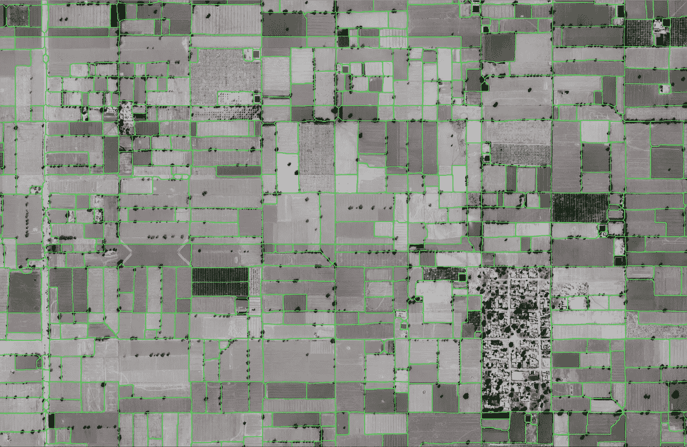

Farm Segmentation Layer after 12 epochs of training on top of a random area in Rajasthan

我最近一直在做一份问题声明，这将有助于检测印度所有的农场。这是一项相当具有挑战性的任务，因为我们将使用废弃的谷歌地球卫星图像来实现这一目标，而农场的边界通常很难区分，因此很难检测到。我决定采用的模型是一种基于深度学习的 ConvNeuralNet 模型，称为整体嵌套边缘检测，它给定一幅图像，在每一层后输出一个预测，并将其与地面真实二进制图像(包含相应图像的真实边缘图)进行比较，以在每一层生成一个边损失，然后将其相加，以给出融合损失。在每个损失级别生成权重，然后反向传播以给出优化值。

现在我们已经对管道有了一个简要的概述，不再赘述，让我们开始吧。

## 预训练模型预测

适用于 HED 的预训练模型已经在著名的 [BSDS](https://www2.eecs.berkeley.edu/Research/Projects/CS/vision/bsds/) 数据集上进行了训练，但对我们没有太大用处，因为作为数据集一部分的图像类型是普通图像，而不是卫星图像。我决定将预训练的模型用于一个小图像，并测试它是否足够令人满意，以便通过一些后期处理来缩放它。

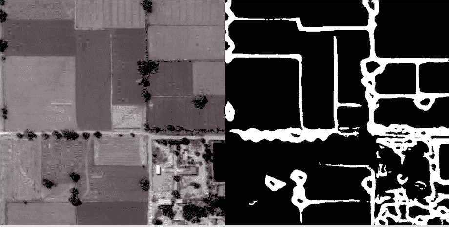

Original Image in juxtaposition with its edge map produced from the pre-trained model

正如您在边缘地图中看到的，结果没有按比例进行切割，给出了一个健壮的农场边界检测模型。可怕的…数据生成和图像标记！

## 数据生成

由于预训练模型未能为我们提供一个稳健的模型，我必须想出一种方法来生成一个数据集及其相应的地面实况，该数据集与 BSDS 数据集一样大，以确保模型不会过度拟合，并以最小的验证损失提供良好的整体准确性。

幸运的是，我从第一天开始就可以访问废弃的谷歌地球卫星图像数据，因此计算出从哪个确切的区域开始分割相对容易得多。在花了几个小时寻找能够包围最大农场并具有清晰边缘以进行地面校正的区域后，Ganganagar tehsil 被选中来获取标记数据。BSDS 数据集包含大约 30，000 个用于训练算法的标记图像(大约 480 X 480)，因此要获得与该数据集接近的精度，大约需要 30，000 个标记图像。废弃的谷歌地球图片每张大约是 1000 X 1000，这样我们就有 480 X 480 的图片可以贴标签了。为了获得与 BSDS 一样大的数据集，需要标注 1，20，000 幅影像。疯狂！

数据增强拯救世界。

## 增大

图像增强是指当你没有足够的数据来训练深度学习模型时，通过对现有数据进行形态学转换来增加数据集的大小。在这种情况下，我确实有足够的数据，但扩充的想法是对相对较小的数据进行基础处理，然后将其扩充到大约 30，000。通过这种方式，人工地面实况调查将减少到标记 1225 幅图像(在将大约 16，1000 X 1000 幅图像裁剪成 480X480 之后)，并且这些图像将增加 24 倍，使得数据集的大小大约为 29，400。我实现了以下基本的扩充技术来增加数据集，这将在下一篇文章中详细介绍。[https://medium . com/nano nets/how-to-use-deep-learning-when-you-has-limited-data-part-2-data-augmentation-c 26971 DC 8 ced](https://medium.com/nanonets/how-to-use-deep-learning-when-you-have-limited-data-part-2-data-augmentation-c26971dc8ced)

## 1.缩放比例

对于这个特殊的问题陈述，我将数据集缩放到 1.5 和 0.5，使放大因子为 3 倍。进一步应用于变换的技术将针对每个标度，使它们进一步乘以因子 3。

Original Scale Image →0.5 →1.5

Scaling in OpenCV

## 2.轻弹

下一个转换是水平翻转图像，然后针对每个比例垂直翻转。因此，对于每个比例，您会得到两张图像，这意味着放大系数是 3 倍。

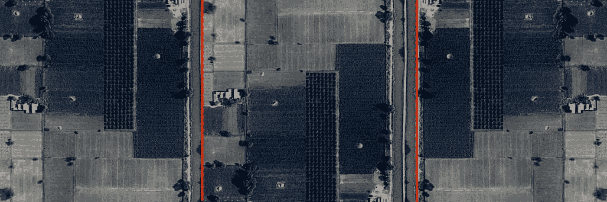

Original Image → Horizontally flipped → Vertically flipped

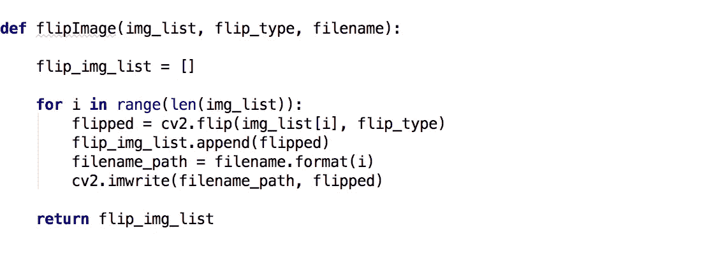

Flipping in OpenCV

## 3.轮流

实现的另一种形态变换是旋转。旋转时唯一需要注意的是，旋转后的图像尺寸可能不一样。将正方形图像旋转 90 度，将矩形图像旋转 180 度，可以保留图像的尺寸。在我的例子中，图像是正方形的，所以可以把它旋转 90 度。放大系数 2 倍。

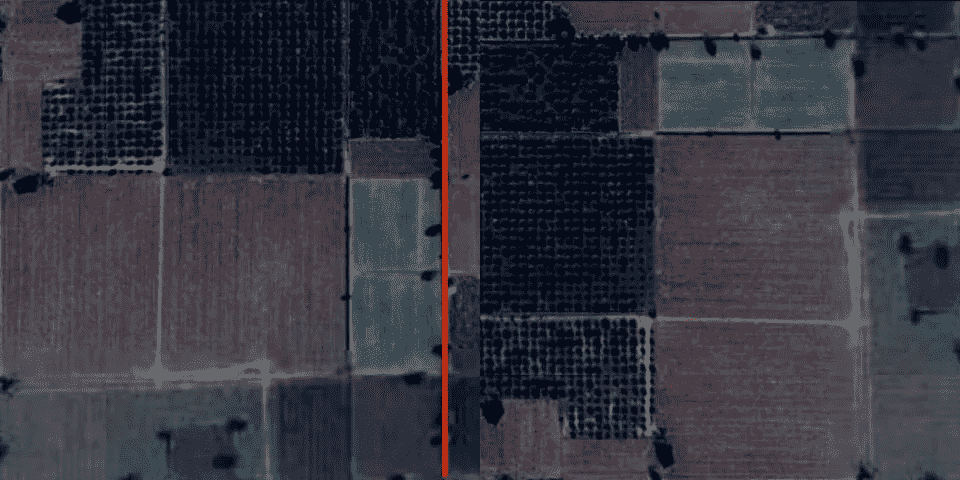

Original Image → Rotated 90 degrees

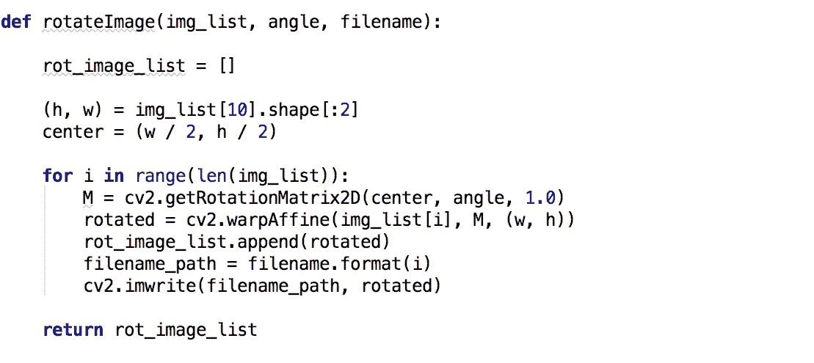

Rotation in OpenCV

## 4.高斯噪声

高斯噪声扭曲了高频(出现最多且特别无用的)特征，这通常是过拟合的原因。高斯噪声也会扭曲低频特征(实际数据)，但网络可以学会忽略它。为数据添加少量 apt 可以增强学习能力。我在整个数据集中添加了随机的粉红色像素来引入高斯噪声。放大系数 2 倍。

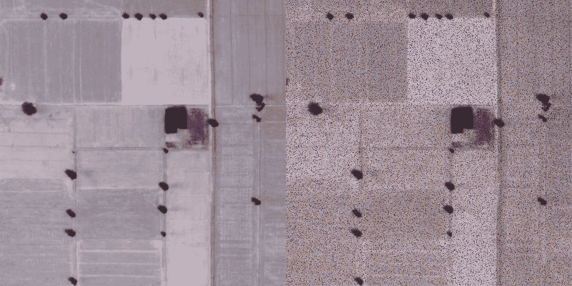

Original Image → With Gaussian Noise

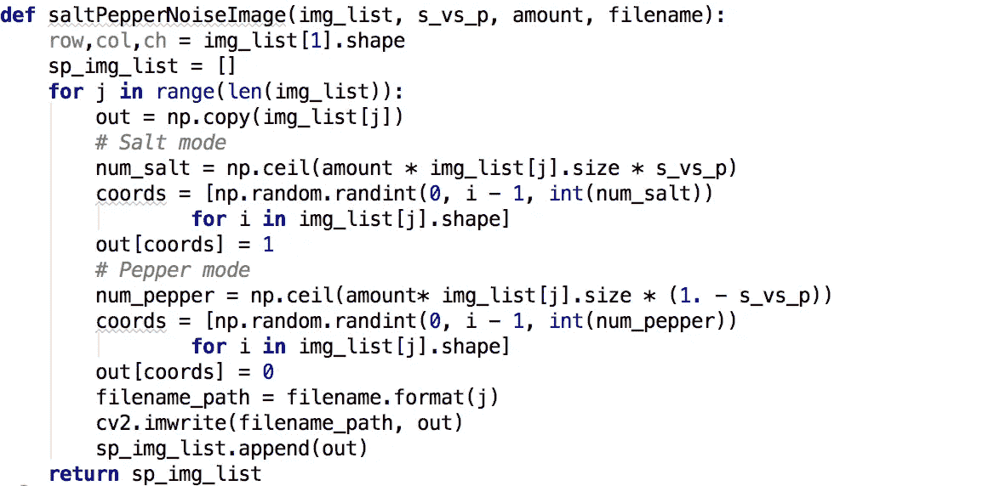

Adding Gaussian noise

在这些技术的帮助下，我们终于能够创建一个非常接近 30，000 大关的数据集。现在是劳动密集型的部分...图像标注！

## 标记

使用了一个基于网络的工具，它将上传一个图像，使用鼠标指针，可以在图像的顶部绘制线条，突出农场的边界。在图像上画线后，提取二值图像，其中白色像素代表农场边缘，黑色像素代表非边缘。这是相应的 RGB 卫星图像的地面实况边缘图。

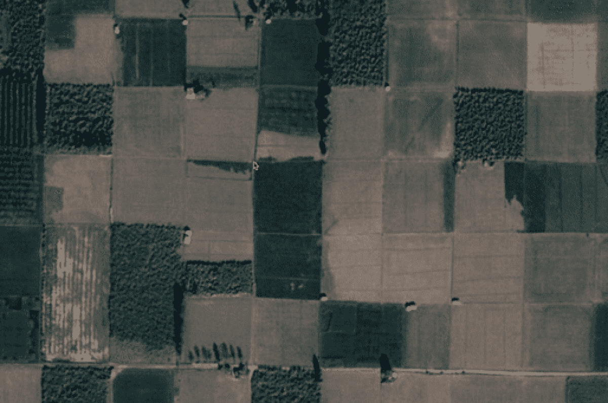

Manual Labeling of Edges using RGB satellite images

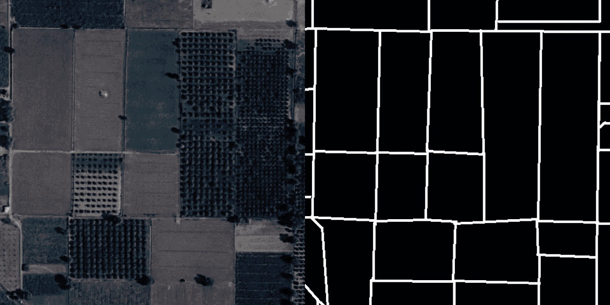

Extracted Binary image after completing labeling

## 整体嵌套边缘检测

该算法基于由 5 个卷积层组成的卷积神经网络架构。在输入图像通过之后，每一层对其输入进行非线性操作，并生成边缘图，该边缘图与输入图像的地面真实图像进行比较，以生成边损。每个侧输出层与产生侧损失的具有相应权重的分类器相关联。在这种图像到图像的训练中，在训练图像中的所有像素上计算损失函数。

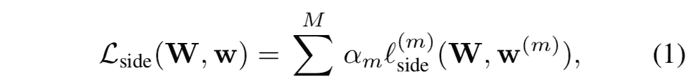

Side-output error for each layer. weights are denoted as w = (w(1) , . . . , w(M) ). where l(side) denotes the image-level loss function for side outputs

对于标准卫星图像，边缘/非边缘像素的分布严重倾斜。估计 85–90%的图像是非边缘的，这就是使用成本敏感函数来正确捕捉误差的原因。该算法在每个像素项的基础上引入类平衡权重β。索引 j 在图像 x 的图像空间维度上。然后，我们使用这个类平衡权重作为一种简单的方法来抵消边缘和非边缘之间的这种不平衡。具体地，我们定义了等式(1)中使用的以下类别平衡的交叉熵损失函数

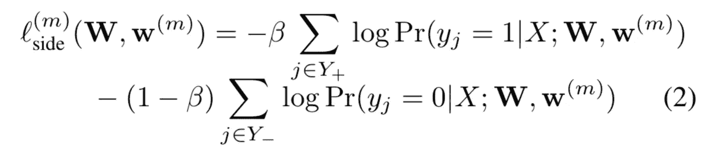

l(side) denotes the image-level loss function for side outputs

其中，β= | Y |/| Y |和 1β= | Y+|/| Y |。| Y |和|Y+|分别表示边缘和非边缘基础真值标签集。pr(yj = 1 | X；w，w(m) ) = σ(a (m) j ) ∈ [0，1]使用 sigmoid 函数σ(.在每个侧输出层，我们然后获得边缘图预测 yˇ(m)side =σ(aˇ(m)side)，其中 aˇ(m)side≡{ a(m)j，j = 1，.。。，|Y |}是层 m 的侧面输出的激活

为了直接利用侧输出预测，该算法在网络中增加了一个加权融合层，同时在训练过程中学习融合权重。

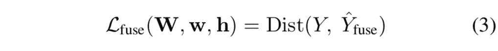

loss function at the fusion layer L(fuse)

其中 Y fuse ≡ σ(求和(m=1-M)(hmA(m)侧))其中 h = (h1，.。。，hM)为融合权重。Dist(，)是融合预测和地面真实标签图之间的距离，我们将其设置为交叉熵损失。将一切放在一起，我们通过标准(反向传播)随机梯度下降最小化以下目标函数:

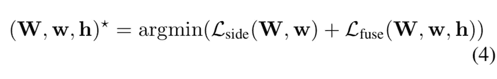

The final objective function used for backpropagation

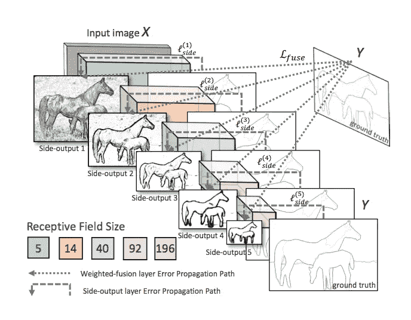

Network Architecture for HED highlighting the error backpropagation paths. Side-output layers are inserted after each convolutional layer. Supervision is imposed at each side-output layer, guiding the side-outputs towards edge predictions with the characteristics we desire. The outputs of HED are multi-scale and multi-level, with the side-output-plane size becoming smaller and the receptive field size becoming larger. One weighted-fusion layer is added to automatically learn how to combine outputs from multiple scales. The entire network is trained with multiple error propagation paths (dashed lines).

https://arxiv.org/pdf/1504.06375.pdf

## 轮廓检测、绘图和后处理

原始预测图像的边缘可能完整，也可能不完整，一旦我们从该图像中提取轮廓，我们希望轮廓是一个闭合的多边形，因为农场也是闭合的。为了处理不完整的边缘，引入了扩张，这将加宽边缘，使得缺失的链接将被完成，并且在扩张后的图像上进行骨架化，以从宽边缘提取单像素线，从而给出最终的完整轮廓。

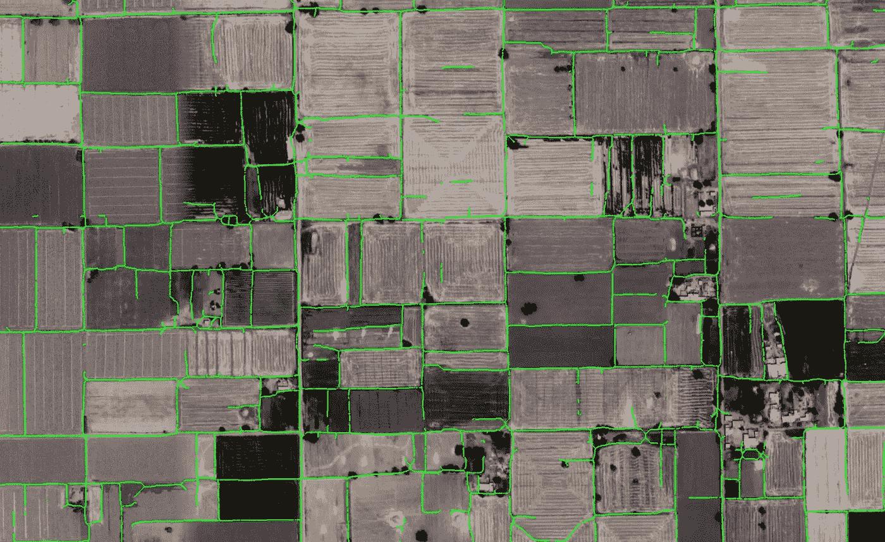

Satellite Image with prediction after dilation and skeletonization. Hanging edges still remain.

此外，如果两条边之间的距离对于膨胀处理来说很大，则在黑色图像上绘制每个轮廓(从已经生成的轮廓中获取),进行填充，然后从中提取新的轮廓，这将自动移除多边形中可能存在的不完整的边。

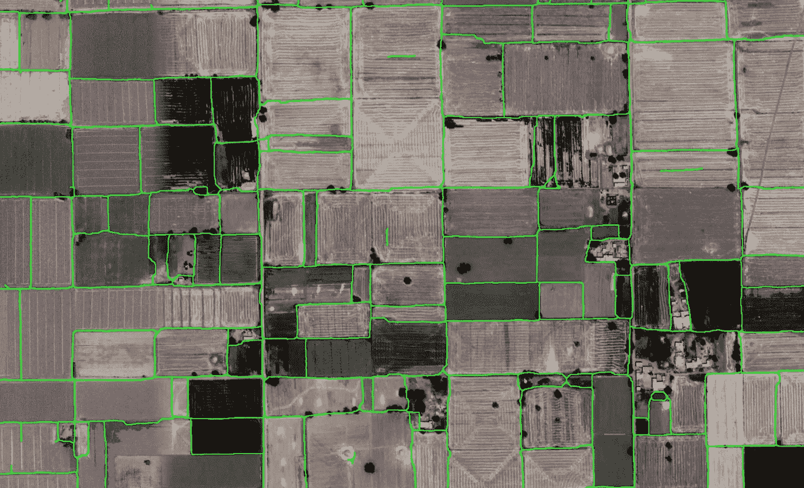

Satellite image with contours after post-processing. Most of the hanging edges are removed.

## 结论

在基于深度学习架构的模型的帮助下，我能够正确地检测拉贾斯坦邦的农田，准确率为 80–85%。这有助于构建进一步的模型，包括:一种测量农场等级的新方法(农场指南),一种连接矩阵，其中农场被映射到最近的铁路、水路、银行、mandi、土壤的各个方面，基于不同的指数和盐度。

(注意:整体嵌套边缘检测的 Keras 实现借用了[https://github.com/lc82111/Keras_HED](https://github.com/lc82111/Keras_HED)