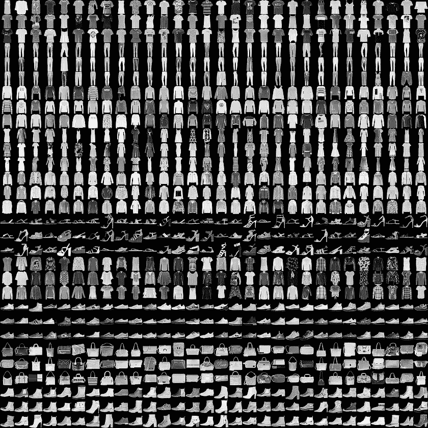
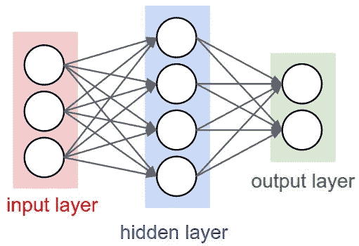
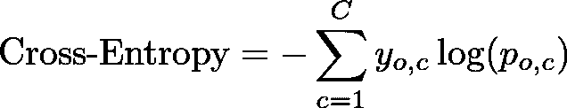

# 使用神经网络的时尚产品图像分类|从零开始的机器学习(第六部分)

> 原文：<https://towardsdatascience.com/fashion-product-image-classification-using-neural-networks-machine-learning-from-scratch-part-e9fda9e47661?source=collection_archive---------5----------------------->

## 通过在 Python 中从头构建神经网络，了解如何处理图像数据和对时尚产品进行分类

> *TL；DR 从头开始用 Python 构建神经网络。使用该模型将时尚产品的图片分为 10 类中的 1 类。*

我们生活在 Instagram、YouTube 和 Twitter 的时代。图像和视频(一系列图像)主导了千禧一代和其他怪人消费信息的方式。

让模特了解图像显示的内容，对于了解你的情绪状态(是的，你可能会在 Instagram 上发布分手自拍后立即收到个性化的可乐广告)、位置、兴趣和社交团体至关重要。

主要地，理解实践中使用的图像数据的模型是(深度)神经网络。在这里，我们将从头开始用 Python 实现一个神经网络图像分类器。

 [## 7 .神经网络

### 合作笔记本

drive.google.com](https://drive.google.com/file/d/1S59KWV8KmZTI-A6OpXge3yG87HXyIcUz/view?usp=sharing) 

# **图像数据**

希望你不会对计算机不能像我们一样看到图像感到惊讶。设备上的每个图像都以矩阵的形式表示/存储，其中每个像素都是一个或多个数字。

## **读取时尚产品数据**

> [*时尚-MNIST*](https://github.com/zalandoresearch/fashion-mnist) *是 Zalando 文章图片的数据集——由 _60，000_ 个示例的训练集和 _10，000_ 个示例的测试集组成。每个示例都是 _28x28_ 灰度图像，与 _10_ classes 中的标签相关联。我们打算将时尚 MNIST 作为原始 MNIST 数据集的直接替代，用于机器学习算法的基准测试。它共享训练和测试分割的相同图像大小和结构。*

以下是这些图片的示例:

你可能熟悉原始的手写数字 MNIST 数据集，并想知道为什么我们不使用它？嗯，在做预测可能太容易了。当然，时尚更酷，对吗？

## **探索**

产品图像是灰度的，28x28 像素，看起来像这样:

以下是图像像素矩阵的前 3 行:

请注意，这些值在 0–255 范围内(灰度)。

我们有 10 类可能的时尚产品:

让我们来看看使用 [t-SNE](https://en.wikipedia.org/wiki/T-distributed_stochastic_neighbor_embedding) 的一些产品的低维表示。我们将使用来自 [scikit-learn](https://scikit-learn.org/stable/modules/generated/sklearn.manifold.TSNE.html) 的实现将数据转换成二维数据:

您可以观察到一些类之间有明显的分隔，而其他类之间有明显的重叠。让我们建立一个可以尝试区分不同时尚产品的神经网络！

# **神经网络**

神经网络(NNs)，特别是深度神经网络，在过去几年里在机器学习领域风靡一时。这并不奇怪，因为大多数关于各种机器学习问题的[最新成果(SOTA)](https://github.com/RedditSota/state-of-the-art-result-for-machine-learning-problems) 都是通过神经网络获得的。

[*浏览论文用源代码实现 SOTA*](https://paperswithcode.com/sota)

## 人工神经元

模拟我们的生物神经元的目标导致了人工神经元的发明。这是你大脑中单个神经元的样子:

source: [CS231n](https://cs231n.github.io/)

另一方面，我们有一个大大简化的数学模型，它在实践中非常有用(神经网络的成功证明了这一点):

source: [CS231n](https://cs231n.github.io/)

人工神经元的想法很简单——你有来自某处的数据向量 *X* ，参数向量 *W* 和偏置向量 *b* 。神经元的输出由下式给出:

其中 *f* 是控制神经元输出信号强度的激活函数。

## 构建神经网络

您可以使用单个神经元作为分类器，但有趣的部分开始于您将它们分组到层中。具体来说，神经元连接成一个无环图，数据在各层之间流动:

source: [CS231n](https://cs231n.github.io/)

这个简单的神经网络包含:

*   输入层-3 个神经元，应该与输入数据的大小相匹配
*   隐藏层-您的模型在训练期间应该学习的权重为 W 的 4 个神经元
*   输出层-提供模型预测的 2 个神经元

想建立深度神经网络？只需添加至少一个隐藏层:

source: [CS231n](https://cs231n.github.io/)

## 乙状结肠的

[sigmoid 函数](https://en.wikipedia.org/wiki/Sigmoid_function)是相当常用的激活函数，至少直到最近是这样。它具有明显的 S 形，对于 00 到 11 之间的任何实输入值和输出值，它都是一个可微的实函数。此外，它在每一点都有一个正导数。更重要的是，我们将使用它作为模型隐藏层的激活函数。

下面是它的定义:

下面是我们实现它的方法:

它的一阶导数(我们将在训练算法的反向传播步骤中使用)具有以下公式:

我们的实现重用了 sigmoid 实现本身:

## Softmax

softmax 函数很容易区分，它是纯函数(输出仅取决于输入),结果向量的元素和为 1。这是:

以下是 Python 实现:

在概率论中，softmax 函数的输出有时用作分类分布的表示。让我们来看一个示例结果:

输出的大部分权重对应于输入 8。softmax 函数突出显示最大值并抑制较小值。

## 反向传播

当使用神经网络时，反向传播几乎是我们所做的任何事情的支柱。该算法由 3 个子任务组成:

1.  向前传球
2.  计算误差
3.  进行反向传递(反向传播)

在第一步中，backprop 使用数据和网络的权重来计算预测。接下来，基于预测和提供的标签计算误差。最后一步是从最后一层开始，通过网络传播错误。因此，权重基于误差一点一点地更新。

让我们对算法实际上在做什么建立更多的直觉:

## 求解异或

我们将尝试创建一个能够正确预测 XOR 函数值的神经网络。下面是它的真值表:

这是一个直观的表示:

让我们从定义一些参数开始:

epochs 参数控制我们的算法在训练期间“看到”数据的次数。然后，我们设置输入层、隐藏层和输出层中神经元的数量——我们有 2 个数字作为输入，1 个数字作为输出大小。学习率参数控制我们的神经网络从新数据中学习并忘记已经知道的东西的速度。

我们的训练数据(来自表格)如下所示:

我们的神经网络中的 *W* 向量需要有一些初始值。我们将采样一个均匀分布，用适当的大小初始化:

最后，反向投影算法的实现:

那个误差好像在减少！耶！而且实现也没那么吓人吧？

在`forward`步骤中，我们取数据 *X* 和 W_hidden 的点积，并应用我们的激活函数来获得我们的隐藏层的输出。我们通过获取隐藏层输出和 W_output 的点积来获得预测。

为了获得`error`，我们计算真实值和预测值之间的差异。请注意，这是一个非常粗略的度量，但是对于我们的示例来说，它很好。

最后，我们使用计算出的误差来调整权重。注意，我们需要来自正向传递`act_hidden`的结果来计算 W_output，并使用`sigmoid_prime`计算一阶导数来更新 W_hidden。

为了进行推断(预测)，我们将只进行前一步(因为我们不会根据结果调整 *W* ):

我们的魔法似乎起作用了！预测是正确的！

# 图像分类

## 构建神经网络

我们的神经网络将只有一个隐藏层。我们将实现上面显示的训练算法的一个更加复杂的版本，以及一些方便的方法。

**初始化权重**

我们将对一个均匀分布进行采样，初始权重的值在-1 和 1 之间。下面是实现过程:

**培训**

我们来看看训练方法:

对于每个时期，我们应用反向投影算法，评估相对于权重的误差和梯度。然后，我们使用学习率和梯度来更新权重。

做一个反向投影步骤比我们的 XOR 例子要复杂一点。我们在返回梯度之前做了一个额外的步骤——应用 [L1 和 L2 正则化](http://www.chioka.in/differences-between-l1-and-l2-as-loss-function-and-regularization/)。正则化通过惩罚参数 *W* 的大值来引导我们的训练朝向更简单的方法。

我们的`forward`和`backward`步骤与上一个例子中的非常相似，误差如何？

## 测量误差

我们将使用[交叉熵损失](https://en.wikipedia.org/wiki/Cross_entropy)(称为对数损失)函数来评估误差。该函数测量分类模型的性能，其输出是概率。它惩罚(严厉地)错误和自信的预测。定义如下:

其中 *C* 是类的数量， *y* 是二进制指示符，如果类标签是观察的正确分类， *p* 是 *o* 属于类 *c* 的预测概率

Python 中的实现如下所示:

现在我们有了损失函数，我们终于可以定义模型的误差了:

在计算交叉熵损失之后，我们添加正则化项并计算平均误差。以下是 L1 和 L2 正则化的实现:

# 做预测

现在我们的模型可以从数据中学习，是时候对它以前没有见过的数据进行预测了。我们将实现两种预测方法— `predict`和`predict_proba`:

回想一下，神经网络中的预测(通常)包括对数据应用向前的一步。但它的结果是一个值的向量，表示每个类对数据的信任程度。我们将使用[最大似然估计(MLE)](https://en.wikipedia.org/wiki/Maximum_likelihood_estimation) 来获得我们的最终预测:

MLE 的工作方式是选取最高值，并将其作为输入的预测类返回。

方法`predict_proba`返回所有类别的概率分布，代表每个类别正确的可能性。注意，我们通过将`softmax`函数应用于`forward`步骤的结果来获得它。

## 估价

是时候测试我们的神经网络模型了。我们可以这样训练它:

培训可能需要一些时间，所以请耐心等待。让我们来预测一下:

首先，我们来看看训练错误:

这里看起来有些可疑，似乎我们的模型不能继续减少 150 个历元左右的误差。让我们来看一个单一的预测:

那个好像是对的！让我们再看几个:

不太好。培训和测试的准确性如何:

嗯，那些看起来不太好。虽然随机分类器将返回约 10%的准确度，但在测试数据集上约 50%的准确度也不会成为实用的分类器。

# 提高准确性

训练误差图上的“锯齿状”线显示了我们的模型无法收敛。回想一下，我们使用反向传播算法来训练我们的模型。[数据标准化后，训练神经网络收敛速度更快](https://arxiv.org/abs/1502.03167)。

我们将使用 scikit-learn 的[标度](https://scikit-learn.org/stable/modules/generated/sklearn.preprocessing.scale.html)来标准化我们的数据。该文件指出:

> 以平均值为中心，以单位方差为分量标度。

这是新的训练方法:

让我们来看看错误:

误差似乎稳定得多，稳定在一个较低的点——约 200 对约 400。让我们来看看一些预测:

那些看起来也好多了！最后，准确性:

训练集上的约 87%(对约 50%)比未缩放的方法有了巨大的改进。最后，你的努力得到了回报！

# 结论

多好的旅程啊！我希望你也能从头开始开发你的第一个神经网络！

你学会了如何处理图像数据，转换它，并用它来训练你的神经网络。我们使用了一些方便的技巧(缩放)来极大地提高分类器的性能。

 [## 7 .神经网络

### 合作笔记本

drive.google.com](https://drive.google.com/file/d/1S59KWV8KmZTI-A6OpXge3yG87HXyIcUz/view?usp=sharing) 

*最初发表于*[*【https://www.curiousily.com】*](https://www.curiousily.com/posts/fashion-product-image-classification-using-neural-networks/)*。*

喜欢你读的吗？你想了解更多关于机器学习的知识吗？提升你对 ML 的理解:

 [## 从零开始实践机器学习

### “我不能创造的，我不理解”——理查德·费曼这本书将引导你走向更深的…

leanpub.com](https://leanpub.com/hmls)