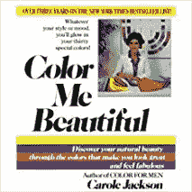
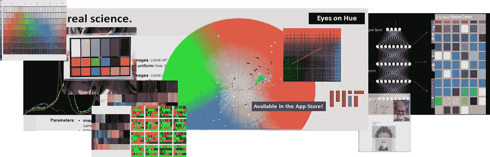
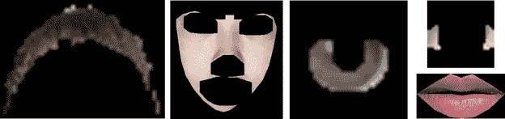
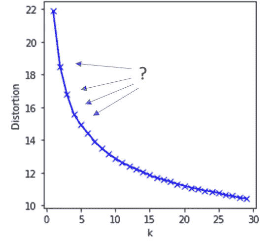
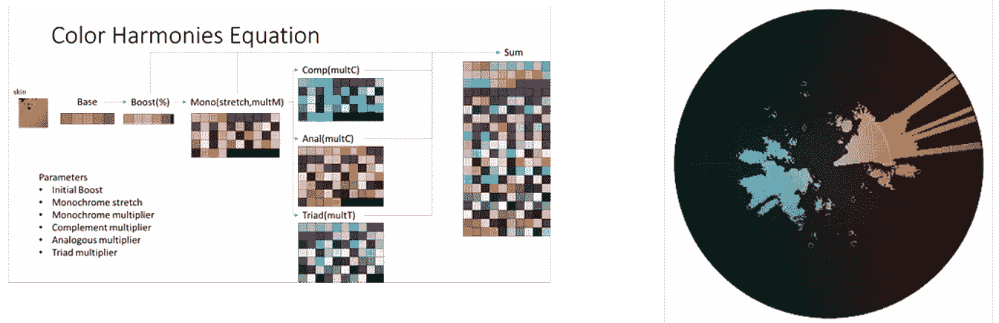

# 时尚科学进行季节性色彩分析

> 原文：<https://towardsdatascience.com/fashion-science-takes-on-seasonal-color-analysis-b399ecc8f675?source=collection_archive---------15----------------------->

## *结果是数据中找不到“季节”*

穿对颜色的衣服，更有魅力！

这就是季节性色彩分析的魅力所在。通过恰当地将你置于四季之一——春、夏、秋、冬——每一季都有适合你的调色板。

本文运用时尚科学来探索一个简单的概念——人们真的会被分成四个部分来映射传统的季节分配吗？对我来说，时尚科学包括图像处理、机器学习和数据分析，但也包括传统的艺术和心理学概念。

使用从我们当前的 iPhone 应用程序收集的超过 100，000 张“肖像自拍”(所有人都关注色调)，我们将每张自拍分成关键的身体部位——皮肤、头发、眼睛和嘴唇。(我说的‘肖像自拍’明确指的是高分辨率的肖像——我们需要虹膜上有很多像素！)然后，我们应用聚类分析技术，根据自拍者身体部位颜色的相似性，将自拍者分组在一起。虽然两个集群和四个集群显然很好，但这些与季节描述完全不相关。

有了新的、基于科学的细分，就有了一个坚实的基础来更好地看待时装设计、营销和零售市场细分的数据方法。进一步的工作也将带我们重新审视个人色彩分析——基于个人色彩调和的个性化调色板的创建。

**背景**

季节性色彩分析(SCA)基于和谐的色彩会增强个体的自然美这一概念。季节方面涉及到把所有人放入四个部分中的一个，以季节命名。有用户自我识别的指导，尽管历史上用户已经被专业的从业者放入他们的季节。有趣的是，这些从业者经常不同意将图像放在哪个季节，尤其是在边缘情况下。

鉴于带摄像头的智能手机的普及，这难道不是自动识别一个人的季节的自然领域吗？

因此，我们一群人研究、设计并部署了一个 iOS 应用程序，它就能做到这一点，即自拍肖像并识别那个人的季节。此外，我们向那个人展示了他们的季节性调色板，还为他们提供了增强现实功能——例如来自他们相机手机的实时视频流，显示了好的和不好的颜色。这在诸如服装店的场所是有用的。

Augmented Reality in a Clothing Store for an Autumn

这个版本的应用程序存在一些挑战，最重要的是，由于光照和人像自拍构图的变化，季节性分配缺乏可重复性。我们已经在下面的分析中解决了这个问题，并计划在不久的将来发布一个更有效的应用程序。

通过使用我们的应用程序，我们有超过 10 万张人类的自拍照。这个集合并不代表人类在年龄、性别、地理和种族上的分布。一种有用的方式是把这些肖像想象成“对 iPhone 感兴趣的时尚人士”。这些肖像自拍只是为了分析而收集的。用户在提供他们的自拍肖像之前同意这一条款，这些在个人层面上是不可用或不显示的。

给定这组人像自拍的数据集，我们能学到什么？让我们测试一下假设，在我们的数据中确实有季节来对个体进行分类。

**对肖像进行分类**

评价一幅肖像的本质在于把肖像图像分解成身体部位——皮肤、头发、眼睛、嘴唇。每一个身体部位的颜色都代表了这个人，并引导我们找到他们的颜色。这是一个至关重要的假设——季节性颜色分配是基于关键的身体部位颜色。

简而言之，这个过程是一个简单的管道:

*   过滤掉糟糕的图像——那些过度亮/暗的图像，那些阴影很深的图像，戴着眼镜/帽子的图像，等等。
*   自动白平衡图像——通过对机器学习网络的广泛训练，我们在显示“真实”人类方面取得了良好的效果。作为一个练习，浏览一组脸书的自拍照，看看明显的人类肤色的广泛变化！

Before / After — Automatically adjusting White Balance for good skin tones

*   识别身体部位-使用图像处理和额外的机器学习来识别皮肤、头发、眼睛(虹膜)、眼睛(巩膜-白色)和嘴唇。

Sample body part images — hair, skin, iris, sclera, lips — from various models

*   对这些身体部位的颜色进行分类——包括平均颜色和代表颜色的等级，以便抓住更微妙的次要颜色的丰富性。

就这样——我们现在有了自拍肖像的数字表示，可以进行分析了。

**聚类分析**

聚类分析意味着对肖像进行分组，以便相似的肖像在聚类中。这是数据分析中的常见任务。有许多方法和算法可用于聚类分析。我们聚类分析的输入是一组身体部位的一组颜色。输出是一组聚类和每个肖像对其聚类的标识。

以下结果使用了三个身体部位-皮肤、头发和虹膜。这些是根据它们在 Lab 颜色空间中的平均颜色而不是 RGB 进行聚类的。正如维基百科所说，Lab“被设计成在人类色觉方面是一致的，这意味着这些值的相同数量的数字变化对应于大约相同数量的视觉感知变化。”也就是说，我们已经用多个身体部位和各种颜色空间进行了评估，以获得类似的结果。

识别聚类的第一种方法被称为肘方法。从 1 到 30 的聚类被评估它们的聚类程度。聚类数量的最佳表示是在图中有一个弯头的地方。

Elbow method to determine optimal clustering — using Skin, Hair, Iris in Lab colorspace

季节色彩分析会让我们相信，应该有两个——温暖/凉爽——和四个——季节的清晰和明显的集群。在此图中，并没有突出显示“肘部”在哪里，是 2 个、3 个、4 个还是 5 个集群？

另一种方法是层次聚类。这可以根据每个模型的身体部位颜色之间的距离来识别聚类。输出显示为树状图——一种树形结构。在图表中，Y 轴代表肖像之间的亲密程度。解释该图表以识别聚类的方法是找出聚类一致的大 Y 长度。

Dendrogram — using Skin, Hair, Iris in Lab colorspace

使用这种方法，人们可以清楚地看到两个簇接着四个簇的解释。这符合当季色彩的诠释。

季节性颜色分析中的一个概念是对两个部分的聚类可以/应该基于皮肤的暖色/冷色。在色轮上，暖色通常与色轮的顶部相关——红色到黄色——而冷色是另一侧——或者蓝色到紫色。传统上，“温暖”包括春季和秋季，而“凉爽”包括夏季和冬季。

在我们的一组代表性数据中，肤色似乎都是暖色，即(惊喜！)肉色，随着色调的变化，集群似乎均匀分散。换句话说，**双聚类模型对肤色/色调**没有帮助。尽管注意到这种温度与色调的关联通常被认为是心理上的而不是物理上的，指的是确定温度的“底色”。这种基调没有出现在数据中。

Skin Hues in the two cluster classification

**四个星团——它们是季节吗？大考**

如果我们从之前的树状图聚类图中提取四个聚类模型，我们可以测试它们是否映射到季节。四个聚类中每个聚类的实际平均颜色在该图表的底部以图形方式显示。

为了测试我们的聚类，我们将我们的聚类任务与一位流行的季节性色彩专家的任务进行了对比。因为我们不知道季节如何映射到这些新发现的聚类，所以我们需要尝试所有的组合，例如，尝试将聚类 1 作为春天，然后将聚类 1 作为夏天，等等。总而言之，对于可能的季节，我们的星团有 24 种可能的组合。完美的映射是 100%，而完全随机的映射是 25%。从经验来看，我希望有 80%-90%的映射能够成功。

对于我们的聚类到专家季节分类的最佳映射，有 36%的匹配百分比。**这不是一张可信的地图。**

忽略总映射(每个季节映射到一个集群，但一次只关注一个季节),最佳映射是冬季到集群二，顺便说一下，这看起来有些合适。其次是夏想的集群三。然而，尽管完美的映射将再次是 100%,但是冬季到聚类 2 的映射百分比仍然只有 47%,而夏季到聚类 3 的映射百分比仍然是 45%——这仍然是一个很差的、不可信的结果。

**总结**

我们已经表明，在我们超过 10 万张自拍肖像和季节性色彩分析模型之间，充其量只有微弱的联系——我们看到每类随机分配 25%，但远远没有达到预期的 80–90%。这通过各种聚类技术、暖/冷评估的应用以及季节性颜色的专家分配的应用来显示。可以有多种方式来反对我们的解释，从自拍肖像的颜色提取不良到我们的数据集与他人的问题。我们尊重所有的挑战，但保留这项调查正在开始的警告——但根据时尚科学的规则——这是在可能的情况下对基于事实的分析的强烈偏好。

这项工作包含了对时装业的强烈暗示。根据颜色对细分市场进行更加精确和真实的识别，可以更好地调整设计、营销甚至零售。

我们正在以各种方式继续这项工作。作为这项工作的一个分支，一个有趣的方法是创建动态调色板——或个性化调色板，而不是季节或集群。这进一步提供了将调色板调整到特定身体部位着色的优点，例如染发剂、唇彩等。以及变化的照明条件，例如阳光、舞厅、办公室等。

请继续关注我们的研究，分享数据集和代码！

(Preliminary) Creation of Personalized Palette based on Color Harmonies