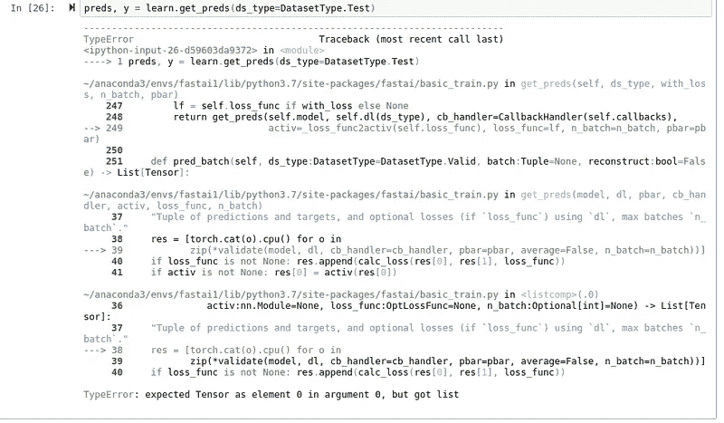

# Fast.ai 库:第一印象

> 原文：<https://towardsdatascience.com/fast-ai-library-1st-impression-958cb52afc?source=collection_archive---------12----------------------->

最近尝试了一下 [fast.ai](https://docs.fast.ai/) 深度学习库，想分享一下经验。

首先，我的背景——不是为了展示我有多酷/多坏，而是因为它主要与像我一样思考和编码的人相关，而与其他人不太相关。

我从来没有学过软件工程，所有的事情都是自学的。从 **C++和 matlab 开始，**在我参与的 **caffe** 工作了 3 年，然后转到 **python 和 pytorch** 。大多数情况下，我写脏代码，并不关心它是否是次优的和不可伸缩的，除非它成为瓶颈。我很少在尝试做某件事之前阅读文档。
也就是说，我可以设计并实现干净、可扩展且高效的软件——就像我曾经在一家名为“先拍照后购买”的时尚初创公司担任首席技术官一样。但这需要时间，而且不适合深度学习研究的快速原型制作，所以大多数情况下我不愿意这么做。我也是 [Jupyter 笔记本](https://jupyter.org/)的粉丝。

先从 fast.ai 的好东西说起，然后描述一下我经历过的挑战。

# fast.ai 里的牛逼东西

1.  **微数据集**。我无法表达微数据集对于快速调试、可再现性、健全性检查和学习有多酷。

[https://github.com/fastai/fastai/blob/master/examples/vision.ipynb](https://github.com/fastai/fastai/blob/master/examples/vision.ipynb)

2.**学习率+wd+动量和增量的默认参数**。这可能看起来是小事，但关系重大。当你试图让工作变得疯狂时，一切都可能出错。数据，采样，缩放，一切。从等式中去掉两个主要的东西是一件解放大脑的大事

[https://docs.fast.ai/vision.transform.html#Data-augmentation-details](https://docs.fast.ai/vision.transform.html#Data-augmentation-details)

3. **lr_find()** ，**一个周期策略**和 **concat 池**。Lr_find 是非常强大而简单的方法，来自 Leslie N. Smith 的“[训练神经网络的循环学习率](https://arxiv.org/abs/1506.01186)”，该论文值得 NIPS/ICML 的最佳论文，但可能会被忽视。fast.ai 保存并提升。想法很简单——用不同的 lr 做一个小批量 SGD，重新编码，选择最好的一个。

[https://docs.fast.ai/basic_train.html#lr_find](https://docs.fast.ai/basic_train.html#lr_find)

它工作得很好:当我们为硬网络论文写代码并做实验的时候，我们花了大约 1 周的时间去发现并相信 lr = 10 是好的。使用 lr_find 和 one_cycle，我可以从 2 次尝试中恢复几乎相同的性能。

[ConcatPool](https://docs.fast.ai/layers.html#AdaptiveConcatPool2d) 是简单的[avg，max]池。根据我的经验，这是仅次于[宝石](https://github.com/filipradenovic/cnnimageretrieval-pytorch/blob/master/cirtorch/layers/pooling.py#L36)池的第二好选择。

# 太棒了，但是只有当你摸它们的时候

1.  ****。复试。** 这是最重要的事情**，这可能在 fast.ai 课程中已经提到很多了，但对于外行人来说一点也不明显，尤其是当你只是谷歌那些不起作用的东西，而不是仔细阅读文档的时候。
    我如何尝试新事物？在 vim 中打开 train.py，把一些代码放在不同的地方，通常利用全局可见的变量(也有风险，但谁在乎呢)。因为我是那种“宁愿花一周时间在谷歌上搜索一些东西，也不愿占用别人的时间寻求帮助”的人 [Radek Osmulski](https://medium.com/u/4b74af654f57?source=post_page-----958cb52afc--------------------------------) ，我花了两天时间(虽然不是全职)试图找出如何在 fast.ai 中做同样的事情
    我几乎要放弃了，但后来找到了回调，并意识到它们是我所需要的。我只是不知道该找什么。Fast.ai 开发者标记了“插入你代码的地方”，你可以通过写回调来访问它们。您还可以全面访问所有变量。****

********

****My explanation of what fast.ai callbacks are — just marked places to put your code.****

# ****对我没用的东西****

****它们大多是测试时的东西，不在“单一输入—单一类输出”的范例中。例如，我的网络有 5 个独立的头(OK，4 个独立的和 1 个相关的)，并输出 2 个列表:一个列表具有来自 5 个分类器的预测，另一个具有 4 个 512d 特征。这足以打破许多现成的功能。
所有故障实例都可以从这里重现:[https://github . com/ducha-aiki/whale-identificati on-2018/blob/master/reproduct _ problems . ipynb](https://github.com/ducha-aiki/whale-identification-2018/blob/master/reproduce_problems.ipynb)****

1.  ****learn.predict()摘自[推理教程](https://docs.fast.ai/tutorial.inference.html):****

********

****2.好的，我可能应该使用函数 get_preds()，它根据教程给出了原始输出，对吗？不对。****

****************

****Things which work with tutorial (left), do not work for me.****

****3.最后一次尝试，测试时间增加****

********

****Again, when output is list, not tensor, nothing works out of the box****

****不要误会我的意思，这些都不是严重的问题:我很容易就构建了工作区，尽管不是以 fast.ai 的方式****

********

****Not nice, but works****

****对于测试时的增强，我只是切换了转换。另一个问题:我还没有找到如何使火车装载机是非洗牌，所以在肮脏的方式:****

********

****Poor-man TTA****

****4.fp16 从来没有为我工作过，结果是失败。我现在已经尝试了 fast.ai 的最新版本，但是不知何故其他东西被改变了，以前工作的代码现在不工作了。我已经经历过几次了，所以:****

****5. **fast.ai 真的很快，这很好，但也有它自己的缺点:你不能只是更新版本，然后希望什么都不会坏。**特别简单的改名都很烦。****

****我也有一些其他问题，但现在认为它们不值得一提——它们更像是我的错，而不是图书馆的错。****

****总之，我很高兴我已经尝试了 fast.ai，并且可能也会在我的研究项目中使用它。****