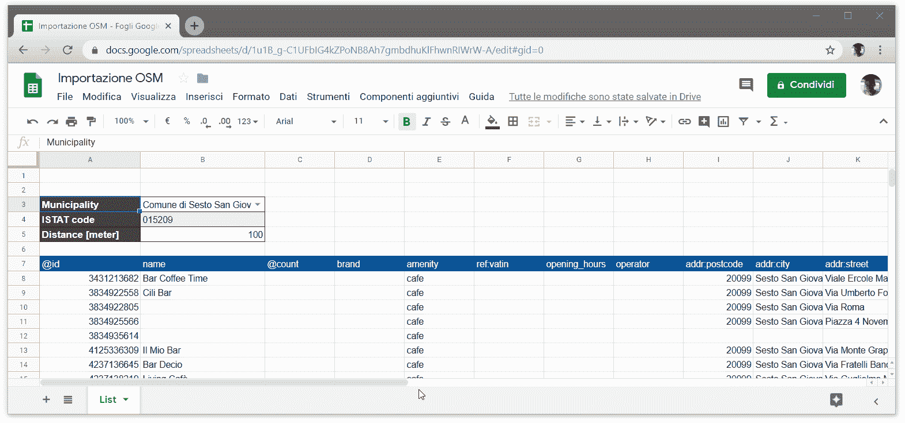
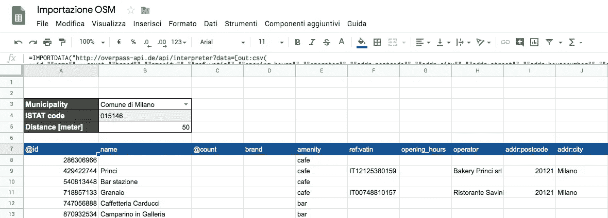

# 快速简便地将开放的街道地图数据动态导入到 Google 工作表文件中

> 原文：<https://towardsdatascience.com/fast-and-easy-way-to-dynamically-import-open-street-map-data-into-a-google-sheet-file-495a400ec25?source=collection_archive---------21----------------------->

# 问题概述

你在一家管理意大利大城市地铁运输的公司担任业务分析师，你需要向营销和传播部门提供该地区酒吧和咖啡馆的列表，并向他们分发可以贴在窗户上或房间内的地图。此外，销售部门将联系离车站最近的酒吧和咖啡馆，提议加入贵公司提供的交通服务的售票计划。

这是一个每月发生的定期请求。

# 数据源

这类地理相关问题的主要数据源之一是公开的街道地图。

有几种方法可以访问开放的街道地图数据库，但是最流行的方法之一是使用天桥 API。在本文中，我们将看到如何使用这些 API 在 Google Sheet 中生成一个动态列表，该列表由参数化查询生成，并由最终业务用户设置值。通过这种方式，其他同事可以自己获取数据，并可以复制、编辑或保存列表以供将来操作，例如将每个酒吧或咖啡馆分配给一个将联系该结构的重要客户经理。

通过天桥 API 的查询可以使用两种语言:天桥 XML 或天桥 QL。

这次我们将使用天桥 QL，*，一种用 C 风格语法*编写的命令式编程语言。学习这门语言的主要“入门”指南可在[本页](https://wiki.openstreetmap.org/wiki/Overpass_API/Overpass_QL)找到。

# 数据析取

让我们总结一下我们需要提取的内容:

*   文本输出，**我们将使用标准的 CSV 格式，标题在第一行，用逗号作为列分隔符**，Google Sheet 会喜欢这个选择的！
*   **指定区域的酒吧和咖啡馆列表；**
*   **经营场所必须在地铁站入口 X 米半径范围内。**

要提取的属性的细节变化很大，并且不是每个场所的所有信息都被完全编辑，与其他国家(首先是德国)相比，可能有许多细节字段仍然不完整(例如电话号码或营业时间)。

超时将在 20 秒后修复。商业用户将不能轻易改变这个值。增加它是不合适的，因为我们想要提取的数据并不大，并且以下规则适用:

> "*如果查询运行时间超过此时间，服务器可能会超时中止查询。第二个影响是，这个较高的值，服务器可能会在执行查询之前拒绝它。*

让我们来设置查询！

正如预期的那样，我们希望提取特定区域的酒吧和咖啡馆列表。这些元素在 OSM 数据库中用以下标签分类:

*   *舒适=酒吧*
*   *舒适=咖啡馆*

当我们必须使用天桥 API 时，要遵循的一个好规则是查阅与我们想要提取的标签相关的 TagInfo 页面:

*   【https://taginfo.openstreetmap.org/tags/?key=amenity 价值=咖啡馆#概述
*   [https://taginfo.openstreetmap.org/tags/?key=amenity&值=条形#概述](https://taginfo.openstreetmap.org/tags/?key=amenity&value=bar#overview)

在这里，我们可以找到各种有用的信息。在“ *combination* ”选项卡中，我们找到了与该标签相关的特性列表，这是制作我们想要提取的列列表的良好起点，稍后我们将在项目中指定这些列。

**在“*概述*”选项卡中，我们可以看到这个地方在数据库中是如何编码的。在这种情况下，我们很容易看到，酒吧和咖啡馆可以是节点，方式或关系。**出于我们的目的，该信息是基本的，因为在查询中我们将指定在所有这些实体中进行搜索，并且因为我们知道该信息可以存储为点(*节点*)或更大的区域(*方式*)。在这个项目中，我们显然希望只提取一次与酒吧/咖啡馆相关的信息，因此我们希望获得的纬度和经度坐标是线所包围区域的中心坐标。

让我们举一个例子，在一个方形条的情况下，在 OSM 数据库中有四个 way 元素，但是我们希望在表中所有这些都在一行中表示，考虑到条总是相同的(相同的名字，相同的电话号码，…)。这一目的将通过指示立交桥仅提取该区域的中心来实现。

**查询中要考虑的最后一个元素是我们要提取的区域。我们选择使用每个自治市的边界提取数据，这些数据将在表格**的用户填写的输入单元格中显示，记住一些地铁站位于不同的自治市。

从这张有用的表中，我们可以了解到，意大利直辖市的行政边界在 OSM 数据库中用 8 级表示。

至此，我们已经拥有了构建查询的所有元素:

我们考虑了酒吧/咖啡馆和车站入口之间的固定距离值(50 米)的查询，以及固定的自治市(ISTAT 代码 015146 对应于米兰市)，因此我们必须修改查询，使其可用于 Google sheet。

# 如何在电子表格中使用查询

我们需要遵循以下步骤:

*   在 [**内包含查询 IMPORTDATA**](https://support.google.com/docs/answer/3093335?hl=en) **公式**(阅读 Google Sheet 官方指南)；
*   用嵌套双引号替换单单双引号；
*   将距离值替换为*&B5&*；
*   用*&B4&*替换市 *ISTAT 代码*的值。

我们最后得出以下结论:

通过链接到隐藏表的数据验证和获得 [ISTAT 代码](https://en.wikipedia.org/wiki/Italian_National_Institute_of_Statistics)的 [**VLOOKUP 公式**](https://support.google.com/docs/answer/3093318?hl=en) ，我们可以制作一个用户友好的下拉菜单，用户可以从中选择自治市的名称和要考虑的距离值。

每次单元 B3 或单元 B4 发生变化时，服务地址列表的值都会更新。