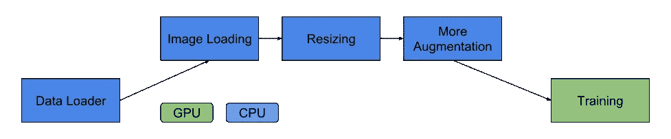
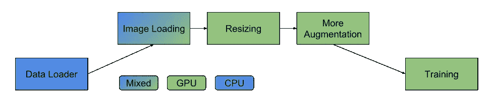

# 使用 Nvidia DALI 在 PyTorch 中快速增强数据

> 原文：<https://towardsdatascience.com/fast-data-augmentation-in-pytorch-using-nvidia-dali-68f5432e1f5f?source=collection_archive---------18----------------------->

原帖:[https://www . basic ml . com/performance/2019/04/16/py torch-data-augmentation-with-NVIDIA-Dali](https://www.basicml.com/performance/2019/04/16/pytorch-data-augmentation-with-nvidia-dali)

在我工作的新项目中，我必须为多标签多类别分类任务处理一组足够大的图像数据。尽管 GPU 利用率接近 100%，但运行超过 200 万张图像的单个训练时段需要近 3.5 小时。如果您正在进行基线实验，并且想要快速得到结果，这是一个大问题。我首先想到的是，由于我在处理原始大小的图像，每个图像至少有几兆字节，所以瓶颈是磁盘 I/O。我使用 [Imagemagick mogrify](https://imagemagick.org/script/mogrify.php) 来调整所有 200 万张图像的大小，这花了很长时间。令我惊讶的是，调整图片大小根本没有减少训练时间！嗯，不明显。因此，我仔细检查了代码，发现主要的瓶颈是 PyTorch 中的图像增强操作。

在偶然发现 Github 的时候，我发现在 Nvidia 工作的人最近发布了一个库——[DALI](https://github.com/NVIDIA/DALI)，据说就是为了解决这个问题。该库仍在积极开发中，并支持所有主要 ML 开发库的快速数据扩充— [PyTorch](https://pytorch.org/) ， [Tensorflow](https://www.tensorflow.org/) ， [MXNet](https://mxnet.apache.org/) 。

Fig 1: A typical data augmentation pipeline

使用 Nvidia DALI，可以通过将适当的[操作](https://docs.nvidia.com/deeplearning/sdk/dali-developer-guide/docs/supported_ops.html)移到 GPU 来优化上述数据流水线。使用 DALI 后，管道看起来像这样-

Fig 2: Fig 2: An Nvidia DALI pipeline

有关 DALI 功能的更多细节，请参见这篇由 Nvidia 开发人员撰写的初学者友好帖子，标题为[使用 NVIDIA DALI 进行快速 AI 数据预处理](https://devblogs.nvidia.com/fast-ai-data-preprocessing-with-nvidia-dali/)。在这篇文章的剩余部分，我将展示如何将 Nvidia DALI 合并到 PyTorch 代码中。欢迎读者对下面的代码提供可能的改进。

我们从安装所需的依赖项开始。

到目前为止，您已经完成了“nvidia-dali”的安装，我们现在将把它集成到我们的 PyTorch 代码中。为了创建虚拟数据集，我们下载了由 [Udacity](https://www.udacity.com/course/deep-learning-pytorch--ud188) 提供的花卉分类数据。数据集包含两个文件夹——“训练”和“有效”。我们使用“train”文件夹中的图像，并展平目录，该目录组织为一个分层文件夹，包含按标签排列的图像，每个标签有一个子文件夹。我们不使用提供的标签，而是生成虚拟标签进行演示。

接下来，我们创建一个空格分隔的文件，它符合 Nvidia DALI 官方文档页面上给出的示例。

接下来，我们创建一个“ExternalInputIterator ”,它对我们的数据进行批处理，并由 DALI [管道](https://docs.nvidia.com/deeplearning/sdk/dali-master-branch-user-guide/docs/examples/getting%20started.html#Pipeline)用来输入数据，并将其馈送给相应的设备进行处理。下面的代码改编自官方代码[这里](https://docs.nvidia.com/deeplearning/sdk/dali-developer-guide/docs/examples/external_input.html)为多个标签工作。感谢[悉达多甘居](https://medium.com/u/43ce294a7ce?source=post_page-----68f5432e1f5f--------------------------------)指向官方教程。

接下来，我们实例化该迭代器，并将其作为输入提供给‘externalsourcepipeline ’,该‘externalsourcepipeline’扩展了‘pipeline’类，并将数据提供给相应的设备用于增强操作。

我们差不多完成了，现在我们实例化一个“DALIGenericIterator ”,它帮助我们迭代数据集，就像我们在 PyTorch 中通常做的那样。

谷歌 Colab: [笔记本](http://tiny.cc/nvidia-dali)

我还没有在我的代码中对 DALI 进行基准测试，一旦有了结果，我会更新这篇文章。

保持优雅。

**链接:**

-达利 Github [回购](https://github.com/NVIDIA/DALI)

-大理官方[博客文章](https://devblogs.nvidia.com/fast-ai-data-preprocessing-with-nvidia-dali/)