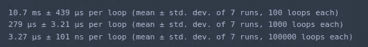

# 快速傅里叶变换

> 原文：<https://towardsdatascience.com/fast-fourier-transform-937926e591cb?source=collection_archive---------0----------------------->


Photo by [Fré Sonneveld](https://unsplash.com/@fresonneveld?utm_source=medium&utm_medium=referral) on [Unsplash](https://unsplash.com?utm_source=medium&utm_medium=referral)

## 如何从零开始用 Python 实现快速傅立叶变换算法？

如果你有电气工程的背景，你很可能听说过傅立叶变换。通俗地说，傅立叶变换是一种将信号的域(x 轴)从时间改变到频率的数学运算。后者对于分解由多个纯频率组成的信号特别有用。更多细节请看下面的视频。

傅立叶变换的应用不限于数字信号处理。事实上，傅立叶变换可以加速卷积神经网络的训练过程。回想一下卷积层如何在图像的一部分上覆盖内核，并对该位置的所有值执行逐位乘法。然后，内核被转移到图像的另一部分，并且重复该过程，直到它遍历了整个图像。


傅立叶变换可以通过利用以下特性来加速卷积。


上面的等式表明，两个信号的卷积等价于它们的傅立叶变换的乘法。因此，通过将输入变换到频率空间，卷积变成单个元素的乘法。换句话说，卷积层和内核的输入可以使用傅立叶变换转换成频率，**乘以一次**，然后使用傅立叶逆变换转换回来。存在与将输入变换到傅立叶域和傅立叶逆变换以将响应返回到空间域相关联的开销。然而，这被从执行单次乘法而不是将图像的不同部分与内核相乘获得的速度所抵消。

# 离散傅里叶变换

离散傅立叶变换(DTF)可以写成如下形式。


为了确定离散信号`x[n]`(其中`N`是其域的大小)，我们将它的每个值乘以`n`的某个函数的`e`。然后我们对给定的`n`的结果求和。如果我们使用计算机来计算信号的离散傅立叶变换，它需要执行 N(乘法)x N(加法)= O(N)次运算。

顾名思义，快速傅立叶变换(FFT)是一种确定输入的离散傅立叶变换的算法，比直接计算要快得多。用计算机科学的行话来说，FFT 将大小为`N`的问题所需的计算次数从`O(N^2)`减少到`O(NlogN)`。


表面上看，这似乎没什么大不了的。然而，当 N 足够大时，它可以产生一个不同的世界。请看下表。


假设执行一次操作需要 1 纳秒。对于大小为`N = 10` ⁹.的问题，快速傅立叶变换算法需要大约 30 秒来计算离散傅立叶变换相比之下，常规算法需要几十年的时间。


# 快速傅立叶变换算法

假设，我们将傅立叶变换分成偶数和奇数索引子序列。


在做了一点代数运算后，我们得到了两项的和。这种方法的优点在于可以同时计算偶数和奇数索引子序列。


假设，`N = 8`，为了可视化数据随时间的流动，我们可以利用一个蝴蝶图。我们同时计算偶数和奇数项的离散傅立叶变换。然后，我们使用上面的公式计算`x[k]`。


我们可以用大 O 符号来表示增益，如下所示。第一项来自于我们两次计算离散傅立叶变换的事实。我们将后者乘以在一半原始输入上计算离散傅立叶变换所花费的时间。在最后一步，需要`N`步来累加特定`k`的傅立叶变换。我们通过在最终产品中添加`N`来说明这一点。


请注意，我们是如何将傅里叶变换的计算时间缩短了 1/2 的。我们可以通过应用分治法来进一步改进算法，每次将计算成本减半。换句话说，我们可以继续分割问题大小，直到我们剩下两个一组，然后直接计算每一对的离散傅立叶变换。


只要`N`是 2 的幂，你可以分成两等份的最大次数由`p = log(N)`给出。


如果我们使用问题大小为`N = 8`的快速傅立叶变换算法，结果会是这样。请注意我们是如何划分`p = log(8) = 3`阶段的。


# Python 代码

让我们看看如何使用 Python 从头开始实现快速傅立叶变换算法。首先，我们导入`numpy`库。

```
import numpy as np
```

接下来，我们定义一个函数来直接计算离散傅立叶变换。

```
def dft(x):
    x = np.asarray(x, dtype=float)
    N = x.shape[0]
    n = np.arange(N)
    k = n.reshape((N, 1))
    M = np.exp(-2j * np.pi * k * n / N)
    return np.dot(M, x)
```

通过将结果与从 numpy 的`fft`函数获得的结果进行比较，我们可以确保我们的实现是正确的。

```
x = np.random.random(1024)
np.allclose(dft(x), np.fft.fft(x))
```


我们可以清楚地看到，离散傅里叶变换函数比快速傅里叶变换算法慢几个数量级。

```
%timeit dft(x)
%timeit np.fft.fft(x)
```


就像我们之前看到的，快速傅立叶变换的工作原理是计算整个问题的小子集的离散傅立叶变换，然后组合结果。后者可以使用递归在代码中轻松完成。

```
def fft(x):
    x = np.asarray(x, dtype=float)
    N = x.shape[0]
    if N % 2 > 0:
        raise ValueError("must be a power of 2")
    elif N <= 2:
        return dft(x)
    else:
        X_even = fft(x[::2])
        X_odd = fft(x[1::2])
        terms = np.exp(-2j * np.pi * np.arange(N) / N)
        return np.concatenate([X_even + terms[:int(N/2)] * X_odd,
                               X_even + terms[int(N/2):] * X_odd])
```

同样，我们可以通过比较从 numpy 获得的结果来验证我们的实现是否正确。

```
x = np.random.random(1024)
np.allclose(fft(x), np.fft.fft(x))
```


FFT 算法比直接实现要快得多。然而，它仍然比 numpy 实现落后很多。其中一个原因是 numpy 实现使用矩阵运算来同时计算傅立叶变换。

```
%timeit dft(x)
%timeit fft(x)
%timeit np.fft.fft(x)
```


我们定义另一个函数来计算傅立叶变换。只是这一次，我们利用了向量运算而不是递归。

```
def fft_v(x):
    x = np.asarray(x, dtype=float)
    N = x.shape[0]
    if np.log2(N) % 1 > 0:
        raise ValueError("must be a power of 2")

    N_min = min(N, 2)

    n = np.arange(N_min)
    k = n[:, None]
    M = np.exp(-2j * np.pi * n * k / N_min)
    X = np.dot(M, x.reshape((N_min, -1)))while X.shape[0] < N:
        X_even = X[:, :int(X.shape[1] / 2)]
        X_odd = X[:, int(X.shape[1] / 2):]
        terms = np.exp(-1j * np.pi * np.arange(X.shape[0])
                        / X.shape[0])[:, None]
        X = np.vstack([X_even + terms * X_odd,
                       X_even - terms * X_odd])return X.ravel()
```

同样，通过与 numpy 库中的结果进行比较，我们可以确保获得正确的结果。

```
x = np.random.random(1024)
np.allclose(fft_v(x), np.fft.fft(x))
```


正如我们所看到的，使用向量运算的 FFT 实现比我们以前获得的要快得多。我们仍然没有接近 numpy 库计算傅立叶变换的速度。这是因为 numpy 的`fft`背后的 FFTPACK 算法是一个 Fortran 实现，经过了多年的调整和优化。如果您有兴趣了解更多，我建议您看看源代码。

```
%timeit fft(x)
%timeit fft_v(x)
%timeit np.fft.fft(x)
```

