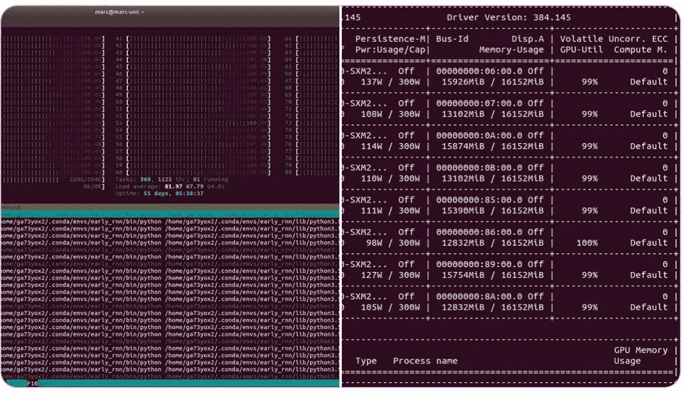

# Ray Tune:一个 Python 库，可以在任意比例下快速调整超参数

> 原文：<https://towardsdatascience.com/fast-hyperparameter-tuning-at-scale-d428223b081c?source=collection_archive---------2----------------------->

## 在不改变代码的情况下，将您的搜索从笔记本电脑扩展到数百台机器。 [*验出雷调*](https://ray.readthedocs.io/en/latest/tune.html) *。*


如果你曾经试图调整机器学习模型的超参数，你就会知道这可能是一个非常痛苦的过程。简单的方法很快变得耗时。


现在，您比以往任何时候都更需要**尖端的超参数调整工具来跟上最先进的技术。**

模型的进步越来越依赖于更新更好的超参数调整算法，如**基于人口的训练** ( **PBT** )、HyperBand 和 ASHA。


Population-based Training improves DeepMind’s state-of-the-art algorithms on many domains by significant margins. Source: [https://deepmind.com/blog/population-based-training-neural-networks/](https://deepmind.com/blog/population-based-training-neural-networks/)

这些算法提供了两个关键优势:

*   **他们将模型性能**最大化:例如，DeepMind 使用 PBT[在星际争霸](https://www.reddit.com/r/MachineLearning/comments/ajgzoc/we_are_oriol_vinyals_and_david_silver_from/)上实现超人性能；Waymo 使用 [PBT 来启用自动驾驶汽车](https://www.technologyreview.com/s/614004/deepmind-is-helping-waymo-evolve-better-self-driving-ai-algorithms/)。
*   **他们最大限度地降低培训成本** : [HyperBand 和 ASHA 收敛到高质量配置](https://determined.ai/blog/addressing-challenges-parallel-hyperparameter-optimization/)所需时间是以前方法的一半；[基于人口的数据增强算法](https://arxiv.org/abs/1905.05393)将成本削减了几个数量级。

事实是，绝大多数研究人员和团队没有利用这样的算法。大多数现有的超参数搜索框架没有这些更新的优化算法。一旦达到一定规模，大多数现有的并行超参数搜索解决方案可能会很难使用——您需要为每次运行配置每台机器，并且通常需要管理单独的数据库。

实际上，实现和维护这些算法需要大量的时间和工程。

但是不需要这样。没有理由为什么您不能轻松地将超参数调整集成到您的机器学习项目中，在您的集群中的 8 个 GPU 上无缝地运行并行异步网格搜索，并在云上大规模利用基于群体的训练或任何贝叶斯优化算法。

在这篇博文中，我们将介绍 [RayTune，这是一个强大的超参数优化库](https://ray.readthedocs.io/en/latest/tune.html)，旨在消除缩放实验执行和超参数搜索之间的摩擦。


Tune scales your training from a single machine to a large distributed cluster without changing your code.

## RayTune 是一个强大的库，可以加速超参数优化。以下是一些核心功能:

*   RayTune 提供了现成的分布式异步优化。
*   RayTune 提供最先进的算法，包括(但不限于)[【ASHA】](https://ray.readthedocs.io/en/latest/tune-schedulers.html#asynchronous-hyperband)[【BOHB】](https://ray.readthedocs.io/en/latest/tune-searchalg.html#bohb)[基于群体的训练](https://ray.readthedocs.io/en/latest/tune-schedulers.html#population-based-training-pbt)。
*   您可以将 RayTune 超参数搜索从单台机器扩展到大型分布式集群，而无需更改您的代码。
*   RayTune 集成了许多优化库，如 [Ax/Botorch](http://ax.dev) 、 [HyperOpt](https://github.com/hyperopt/hyperopt) 和[贝叶斯优化](https://github.com/fmfn/BayesianOptimization)，使您能够透明地扩展它们。
*   RayTune 支持任何机器学习框架，包括 PyTorch、TensorFlow、XGBoost、LightGBM、scikit-learn 和 Keras。

除了 RayTune 的核心特性之外，研究人员和开发人员更喜欢 RayTune 而不是其他现有超参数调优框架的两个主要原因是:**规模**和**灵活性**。


Note for Search Algorithms: as of 8/12/2019, HpBandSter supports HyperBand, Random Search, and BOHB. KerasTuner supports Random Search, HyperBand, and Bayesian Optimization. Optuna supports Median (Percentile) Stopping, ASHA, Random Search, and Bayesian Optimization (TPE). HyperOpt supports Bayesian Optimization and Random Search. Tune supports PBT, BOHB, ASHA, HyperBand, Median Stopping, Random Search, Bayesian Optimization (TPE, etc), and numerous others due to library integrations.

## 调整简化了缩放。

通过添加不到 10 行 Python 代码，利用机器上的所有内核和 GPU 来执行并行异步超参数调优。

If you run into an ImportError, try installing from a snapshot wheel: [https://ray.readthedocs.io/en/latest/installation.html#trying-snapshots-from-master](https://ray.readthedocs.io/en/latest/installation.html#trying-snapshots-from-master)



[https://twitter.com/MarcCoru/status/1080596327006945281](https://twitter.com/MarcCoru/status/1080596327006945281)

使用另一个配置文件和 4 行代码，在云上启动大规模分布式超参数搜索，并自动关闭机器(我们将在下面向您展示如何做到这一点)。

借助 Tune 的内置容错、试验迁移和集群自动扩展，您可以安全地利用 spot(可抢占)实例，并将云成本降低[高达 90%。](https://aws.amazon.com/ec2/spot/)

## 调谐是灵活的。


Tune 与实验管理工具无缝集成，如 [MLFlow](https://ray.readthedocs.io/en/latest/tune-usage.html#mlflow) 和 [TensorBoard](https://ray.readthedocs.io/en/latest/tune-usage.html#visualizing-results) 。

Tune 为优化算法提供了一个[灵活的接口，允许您轻松实现和扩展新的优化算法。](https://ray.readthedocs.io/en/latest/tune-searchalg.html#contributing-a-new-algorithm)

您可以使用 Tune 来利用和扩展许多最先进的搜索算法和库，如 [HyperOpt](https://github.com/hyperopt/hyperopt) (如下)和 [Ax](http://ax.dev) ，而无需修改任何模型训练代码。

# 使用 Tune 很简单！

现在让我们深入一个具体的例子，展示如何利用最先进的早期停止算法(ASHA)。我们将首先在您工作站上的所有内核上运行 Tune。然后，我们将用大约 10 行代码在云上扩展相同的实验。

我们将在这个例子中使用 PyTorch，但是我们也有可用的 [Tensorflow 和 Keras 的例子。](https://ray.readthedocs.io/en/latest/tune-examples.html)

Tune 作为[射线](https://ray.readthedocs.io/en/latest/installation.html)的一部分安装。要运行这个示例，您需要安装以下软件:`pip install ray torch torchvision.`

你可以在这个博客这里下载[完整版的博客。](https://gist.github.com/richardliaw/c66357d057e24ca8c285a811d4a485d7)

我们首先运行一些导入:

header of `tune_script.py`

让我们用 PyTorch 写一个神经网络:

要开始使用 Tune，在 PyTorch training below 函数中添加一个简单的日志记录语句。

```
def train_mnist(config):
    model = ConvNet()
    train_loader, test_loader = get_data_loaders()
    optimizer = optim.SGD(
        model.parameters(), 
        lr=config["lr"], 
        momentum=config["momentum"])
    for i in range(10):
        train(model, optimizer, train_loader, torch.device("cpu"))
        acc = test(model, test_loader, torch.device("cpu"))
 **tune.track.log(mean_accuracy=acc)**
        if i % 5 == 0:
            # This saves the model to the trial directory
            torch.save(model, "./model.pth")
```

注意，在上面的训练脚本中有几个助手函数；你可以在这里看到它们的定义。

## 运行曲调

让我们运行 1 次试验，从一个均匀分布中随机抽样，以获得学习率和动量。

现在，你已经完成了你的第一次跑调！您可以通过指定 GPU 资源来轻松启用 GPU 使用— [参见文档](https://ray.readthedocs.io/en/latest/tune-usage.html#using-gpus-resource-allocation)了解更多详细信息。然后我们可以画出这次试验的表现。

## 并行执行和提前停止


Early stopping with ASHA.

让我们集成 ASHA，一个可扩展的提前停止算法([博文](https://blog.ml.cmu.edu/2018/12/12/massively-parallel-hyperparameter-optimization/)和[论文](https://arxiv.org/abs/1810.05934))。ASHA 终止了不太有希望的试验，并将更多的时间和资源分配给更有希望的试验。

使用`num_samples`在机器上的所有可用内核中并行搜索(额外的尝试将被排队)。

您可以使用与上例相同的数据帧绘图。运行后，如果安装了 Tensorboard，还可以使用 Tensorboard 可视化结果:`tensorboard --logdir ~/ray_results`


# 走向分布式

建立一个分布式超参数搜索通常工作量很大。Tune 和 Ray 让这一切变得天衣无缝。

## 使用简单的配置文件启动云


Launch a cluster and distribute hyperparameter search without changing your code

首先，我们将创建一个配置光线簇的 YAML 文件。作为[射线](http://ray.readthedocs.io/en/latest/)的一部分，Tune 与[射线簇发射器](https://ray.readthedocs.io/en/latest/autoscaling.html)之间的交互非常干净。下面显示的相同命令将在 GCP、AWS 和[本地私有集群](https://ray.readthedocs.io/en/latest/autoscaling.html#quick-start-private-cluster)上工作。除了一个头节点之外，我们还将使用 3 个工作节点，因此集群上总共应该有 32 个 vCPUs，这使我们能够并行评估 32 个超参数配置。

tune-default.yaml

## 把东西放在一起

要在光线簇中分布超参数搜索，需要将它附加到脚本的顶部:

考虑到计算的大幅增长，我们应该能够增加搜索空间和搜索空间中的样本数量:

你可以在这个博客(作为`tune_script.py`)下载[完整版的剧本。](https://gist.github.com/richardliaw/c66357d057e24ca8c285a811d4a485d7)

## 启动你的实验

要启动您的实验，您可以运行(假设到目前为止您的代码在一个文件`tune_script.py`中):

```
$ ray submit tune-default.yaml tune_script.py --start \
     --args=”localhost:6379”
```

这将在 AWS 上启动您的集群，将`tune_script.py`上传到 head 节点上，并运行`python tune_script localhost:6379`，这是 Ray 为支持分布式执行而打开的一个端口。

脚本的所有输出都会显示在您的控制台上。请注意，集群将在设置任何工作节点之前首先设置头节点，因此最初您可能只看到 4 个可用的 CPU。一段时间后，您可以看到 24 个试验被并行执行，其他试验将排队等候，一旦一个试验空闲，就立即执行。

要关闭集群，您可以运行:

```
$ ray down tune-default.yaml
```

你完了🎉！

# 了解更多信息:

Tune 还有许多其他特性，使研究人员和从业人员能够加速他们的开发。这篇博客文章中没有涉及的其他调整功能包括:

*   运行分布式容错实验的简单 API
*   通过[的分布式超参数搜索为 PyTorch 进行分布式数据并行训练](https://ray.readthedocs.io/en/latest/distributed_training.html)
*   [基于人口的培训](https://ray.readthedocs.io/en/latest/tune-schedulers.html#population-based-training-pbt)

对于能够访问云的用户，Tune 和 Ray 提供了许多实用程序，可以实现在笔记本电脑上开发和在云上执行之间的无缝过渡。[文档](https://ray.readthedocs.io/en/latest/tune-distributed.html#common-commands)包括:

*   在后台会话中运行实验
*   向现有实验提交试验
*   在 TensorBoard 中可视化分布式实验的所有结果。

> Tune 旨在轻松扩展实验执行和超参数搜索。如果您有任何意见或建议，或者对 Tune 有兴趣，您可以[联系我](https://github.com/richardliaw)或 [ray-dev 邮件列表](https://groups.google.com/forum/#!forum/ray-dev)。
> 
> 代码:[https://github . com/ray-project/ray/tree/master/python/ray/tune](https://github.com/ray-project/ray/tree/master/python/ray/tune)
> 文档:[http://ray.readthedocs.io/en/latest/tune.html](http://ray.readthedocs.io/en/latest/tune.html)

关于超参数调整的其他阅读材料，请查看 Neptune.ai 关于 Optuna vs HyperOpt 的[博文！](https://neptune.ai/blog/optuna-vs-hyperopt)

感谢彭于晏、埃里克·梁、乔伊·冈萨雷斯、扬·斯托伊察、尤金·维尼斯基、丽莎·邓拉普、菲利普·莫里茨、、阿尔文·万、丹尼尔·罗斯柴尔德、布里詹·塔南杰扬、阿洛克·辛格(也许还有其他人？)来通读这篇博文的各种版本！