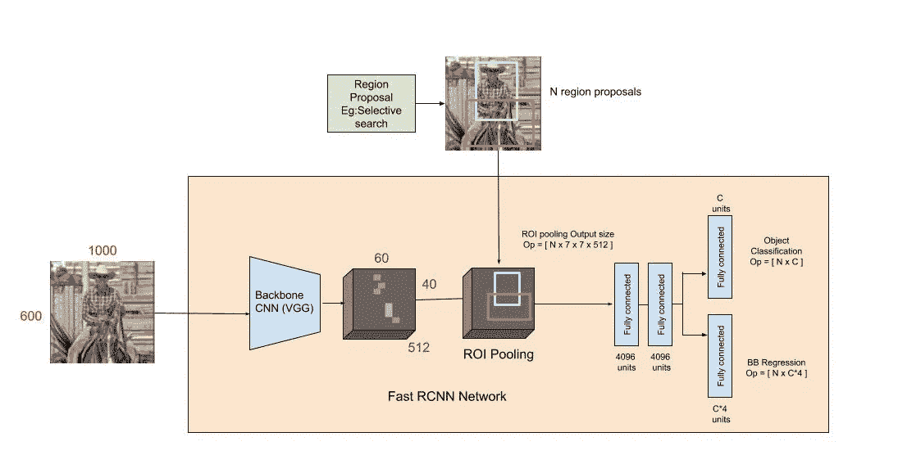

# 用于目标检测的快速 R-CNN

> 原文：<https://towardsdatascience.com/fast-r-cnn-for-object-detection-a-technical-summary-a0ff94faa022?source=collection_archive---------6----------------------->

## 技术论文摘要

在试图理解使用深度学习的对象检测的关键概念和里程碑时，之前关于使用 CNN【1】的[区域的文章强调了有史以来第一个具有深度学习主干的检测器网络中每个阶段的功能和训练细节。这篇文章深入挖掘了它的热门继任者 Fast R-CNN 的细节。[2]](https://medium.com/@shilpa_47526/r-cnn-for-object-detection-a-technical-summary-9e7bfa8a557c)

随着 2014 年 R-CNN 论文发表以来我们看到的技术进步和计算能力的增加，我们现在很容易看到作者当时发现的 R-CNN 的明显缺陷:

*   **多阶段、昂贵的训练:**网络所有阶段所需的独立训练过程——在对象提议上微调 CNN，学习 SVM 以对来自 CNN 的每个提议的特征向量进行分类，以及学习边界框回归器以微调对象提议(更多细节请参考[区域和 CNN](https://medium.com/@shilpa_47526/r-cnn-for-object-detection-a-technical-summary-9e7bfa8a557c))在时间、计算和资源方面被证明是一种负担。例如，为了训练 SVM，我们需要将前一阶段的数千个可能的区域提议的特征写入磁盘。
*   **慢测试时间:**给定这种多级流水线，使用简单的 VGG 网络作为主干的检测 CNN 需要 47 秒/图像。

2015 年发表的另一篇论文 SPP-Nets 或“空间金字塔池网络”[3]解决了问题的一部分。它的主要贡献是 a)使用多尺度图像特征池来提高分类和检测的网络性能，以及 b)使用任意大小的输入图像来训练 CNN，尽管使用了全连接(FC)层。在其检测管道中，它引入了一个重要的概念——从整个图像中仅提取一次单个特征图，并从该单个特征图中汇集该图像的任意大小的“区域提议”的特征。这使得他们的网络运行速度比 R-CNN 快几个数量级。他们没有像 R-CNN 那样对 2000 个地区的提案运行 CNN，而是只有一个转发通道，可以从中汇集所有 2000 个候选提案的特征。

# 快速 R-CNN 流水线

## 架构细节:

为了更好地理解快速 R-CNN 如何以及为什么提高 R-CNN 和 SPP 网络的效率和性能，让我们首先来看看它的架构。

*   快速 R-CNN 由 CNN(通常在 ImageNet 分类任务上预先训练)组成，其最终池层由“ROI 池”层代替，其最终 FC 层由两个分支代替——一个(K + 1)类别 softmax 层分支和一个类别特定的边界框回归分支。

Figure 1: The Fast R-CNN pipeline

Figure 2: The ROI pooling layer as a special case of SPP layer

*   整个图像被馈送到主干 CNN，并且从最后的卷积层获得特征。取决于所使用的主干 CNN，输出的特征地图比原始图像尺寸小得多。这取决于中枢 CNN 的步幅，在 VGG 中枢的情况下通常是 16。
*   同时，对象提议窗口从类似选择性搜索的区域提议算法中获得[4]。正如在[带 CNN 的区域](https://medium.com/@shilpa_47526/r-cnn-for-object-detection-a-technical-summary-9e7bfa8a557c)中所解释的，物体提议是图像上的矩形区域，表示物体的存在。
*   然后，属于该窗口的主干特征图的部分被馈入 ROI 汇集层。
*   ROI 池图层是只有一个金字塔等级的空间金字塔池(SPP)图层的特例。该层基本上将来自所选建议窗口(来自区域建议算法)的特征划分成大小为 *h/H* 乘 *w/W* 的子窗口，并在这些子窗口的每一个中执行汇集操作。这产生了大小为(H x W)的固定大小输出特征，而与输入大小无关。选择 h 和 W，使输出与网络的第一个全连接层兼容。在 Fast R-CNN 论文中 H 和 W 的选择值是 7。像常规池一样，ROI 池在每个渠道中单独进行。
*   ROI 池层(N x 7 x 7 x 512，其中 N 是建议数量)的输出特征随后被送入后续 FC 层，以及 softmax 和 BB-regression 分支。softmax 分类分支产生属于 K 个类别和一个总括背景类别的每个 ROI 的概率值。BB 回归分支输出用于使来自区域提议算法的边界框更加精确。

## 损失:

softmax 层的分类分支给出了(K +1)个类别上每个 ROI 的概率 p = p₀，… pₖ.分类损失 *L* 𝒸ₗₛ *(p，u)* 由-log(pᵤ给出)是真实 u 类的对数损失

Equation 1: smooth L1 loss for BB regression

Equation 2: Joint loss for multi-task training

回归分支产生 4 个边界框回归偏移 tᵏᵢ，其中 *i = x，y，w，*和 *h. (x，y)* 代表左上角， *w* 和 *h* 表示边界框的高度和宽度。类别 u 的真实边界框回归目标由 *v* ᵢ表示，其中当 u≥1 *时 *i = x，y，w，*和 *h* 。*忽略 *u=0* 的情况，因为背景类没有背景事实框。使用的回归损失是等式 1 中给出的平滑 L1 损失。每个 ROI 的联合多任务损失由两个损失的组合给出，如等式 2 所示。请注意，这里的快速 R-CNN 有一个组合学习方案，可以微调主干 CNN，并对边界框进行分类和回归。

## 培训:

*   在训练期间，每个小批量由 N=2 个图像构成。小批量由来自每个图像的 64 个 ROI 组成。
*   像 R-CNN 一样，25%的 ROI 是具有至少 0.5 IoU 的对象提议，具有前景类的地面真实边界框。对于特定的类，这些将是正的，并且将被标上适当的 u=1…K。
*   其余感兴趣区域从 IoU 的基础边界框在[0.1，0.5]之间的提案中取样。这些 ROI 被标记为属于类别 u = 0(背景类别)。
*   直到 ROI 合并层之前，整个图像都要通过 CNN。这样，来自同一图像的所有 ROI 在向前和向后通过 CNN 时共享计算和内存(在 ROI 合并层之前)。
*   与 SPP 网络不同，采样策略(从非常少的图像中批量采样所有 ROI)允许整个模块(特征生成、分类和回归)一起训练。在 SPP 网络中，大多数输入 ROI 来自不同的图像，因此用于检测的训练过程仅在特征生成之后微调完全连接的层，因为在 SPP 层之前更新权重是不可行的(一些 ROI 在原始图像上可能具有非常大的感受野)。实际特征仍然来自为分类而训练的预训练网络。这限制了 SPP 网络的准确性。
*   请注意，在 ROI 合并层之前，CNN 网络的批次大小非常小(批次大小= 2)，但在接下来的 softmax 和回归层中，网络的批次大小要大得多(批次大小= 128)。

## 其他注意事项:

*   **通过 ROI pooling 层反向传播:**对于每个小批量 ROI *r，*让 ROI pooling 输出单元 *yᵣⱼ* 作为其子窗口 *R(r，j)中最大池的输出。*然后，如果该位置*是为 *yᵣⱼ.选择的 argmax，则在 *R(r，j)* 中的输入单元( *xᵢ* )中累积梯度**

**

*   *在快速 R-CNN 的多尺度流水线中，输入图像在训练时被调整为随机采样的尺寸，以引入尺度不变性。在测试时，每个图像以多个固定的比例被馈送到网络。对于每个 ROI，仅从这些尺度之一汇集特征，选择这些尺度使得缩放的候选窗口具有最接近 224×224 的像素数。然而，作者发现单尺度流水线的性能几乎一样好，而计算时间成本低得多。在单尺度方法中，训练和测试时的所有图像都被调整为 600(最短边)，最长边的上限为 1000。*
*   *可以用截短的 SVD 来压缩大的全连接层，以使网络更有效。这里，由 w 作为其权重矩阵参数化的层可以被因式分解，以通过将它分成两层(具有偏差的σₜvᵀ和 u)来减少参数计数，而它们之间没有非线性，其中 w ~ u σₜvᵀ.*

# *结果*

*   *Fast R-CNN 在发布 VOC12、VOC10(含额外数据)和 VOC07 时实现了最先进的性能。*
*   *快速 R-CNN 在测试时处理图像的速度比 R-CNN 快 45 倍，在训练时快 9 倍。它的训练速度比 SPP-Net 快 2.7 倍，运行测试映像的速度比 SPP-Net 快 7 倍。在进一步使用截断 SVD 时，网络的检测时间减少了 30%以上，mAP 仅下降 0.3。*
*   *该论文的其他贡献表明，对于更大的网络，微调 conv 层(而不仅仅是 SPPnets 等 FC 层)对于实现更好的 mAP 非常重要。对于较小的网络，这种改进可能不会很大。*
*   *多任务训练不仅更容易，而且还能提高表现，因为训练时任务会相互影响。因此，训练网络的不同阶段一起提高了它的共享代表力量(骨干 CNN)*

*这就是 Fast R-CNN 论文的技术总结。希望你喜欢(理解)！欢迎在下面的评论中讨论或更正。*

*阅读快速 R-CNN 的继任者和最先进的物体探测网络——更快 R-CNN [这里](https://medium.com/@shilpa_47526/faster-r-cnn-for-object-detection-a-technical-summary-474c5b857b46)。*

## *参考资料:*

*[1] Girshick，Ross 等人，“用于精确对象检测和语义分割的丰富特征层次。”2014 年 IEEE 计算机视觉与模式识别会议(2014)
【2】Girshick，Ross。"快速 R-CNN "2015 年 IEEE 计算机视觉国际会议(ICCV)(2015)
【3】何，等，“用于视觉识别的深度卷积网络中的空间金字塔池”计算机科学讲义(2014)
[4] Uijlings，J. R. R .等，“物体识别的选择性搜索”国际计算机视觉杂志 104.2 (2013)*