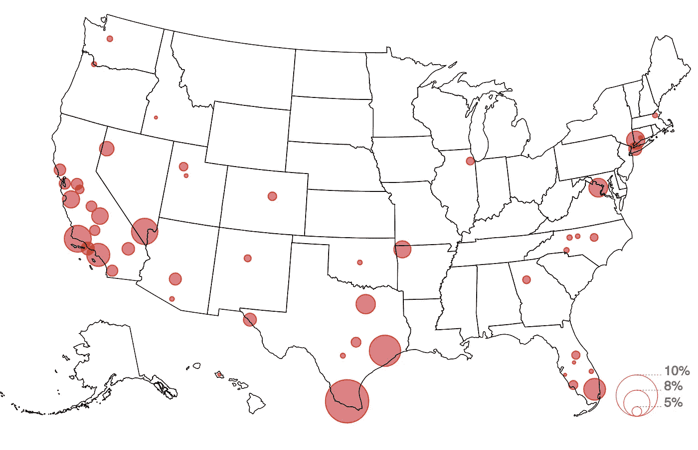

# 用 Turf.js 和命令行构建的快速静态 D3 地图

> 原文：<https://towardsdatascience.com/fast-static-d3-maps-built-with-turf-js-and-the-command-line-5b7c72b7e775?source=collection_archive---------19----------------------->

## 将 Mike Bostock 的命令行制图教程与 Node.js 的灵活性结合起来



Estimated percent of undocumented residents in U.S. metro areas. Source: [Pew Research Center](http://www.pewhispanic.org/2017/02/13/estimates-of-unauthorized-immigrant-population-by-metro-area-2014/)

最近，我需要制作一些美国各州的泡沫地图，嵌入到《圣安东尼奥快报新闻》的[报道中。我想使用 D3，但担心缓慢的资产加载和地图渲染，特别是因为 CMS 的限制，我需要单独`iframe`每个地图。](https://www.expressnews.com/news/local/politics/article/Immigrant-who-won-a-labor-case-for-back-pay-hides-13303195.php?t=c8def45e81)

为了找到导出 D3 生成的 SVG 的方法，我进行了一些谷歌搜索。

[这家伙做了个出口按钮](http://bl.ocks.org/Rokotyan/0556f8facbaf344507cdc45dc3622177)，挺酷的。*纽约时报*有 [SVG Crowbar](https://nytimes.github.io/svg-crowbar/) ，提供类似的功能。然而，我发现的最令人兴奋的结果是这篇由四部分组成的文章，Mike Bostock 的[](https://medium.com/@mbostock/command-line-cartography-part-1-897aa8f8ca2c)**。**

**我强烈推荐 Bostock 的文章，本教程的大部分内容都来源于此。我对他的方法的唯一问题是，对我来说，在命令行上编写 d3 代码会变得复杂和混乱。这里有一个片段:**

```
**(topo2geo tracts=- \
    < ca-topo.json \
    | ndjson-map -r d3 -r d3=d3-scale-chromatic 'z = d3.scaleThreshold().domain([1, 10, 50, 200, 500, 1000, 2000, 4000]).range(d3.schemeOrRd[9]), d.features.forEach(f => f.properties.fill = z(f.properties.density)), d' \
    | ndjson-split 'd.features'; \
topo2geo counties=- \
    < ca-topo.json \
    | ndjson-map 'd.properties = {"stroke": "#000", "stroke-opacity": 0.3}, d')\
  | geo2svg -n --stroke none -p 1 -w 960 -h 960 \
  > ca.svg**
```

**我想找到一个利用 Node.js 的解决方案，允许我仍然从命令行使用 Bostock 的 [d3-geo-projection](https://github.com/d3/d3-geo-projection/blob/master/README.md) ，但是将大部分制图操作和地图渲染的处理交给 JavaScript。这就是 Turf.js 的用武之地——一个用于编写和操作 GeoJSON 的令人惊叹的开源地理空间分析工具。**

**本教程一步一步地介绍如何使用 node 和命令行生成静态地图。我们将以 SVG 格式构建上述地图，该地图显示了美国 100 个最大的大都市区中无证居民比例最高的 50 个大都市区。**

**第一步:加载你的数据**

**地图需要的文件有:**

1.  **2017 年皮尤研究中心研究的未记录居民数据。**
2.  **定义美国城市区域位置的 shapefile。**
3.  **定义美国各州轮廓的 shapefile。**

**启动命令行并创建一个工作目录:**

```
**mkdir undocumented-residents-map
cd undocumented-residents-map**
```

**创建一个 bash 文件，我们将使用它作为我们的主要构建脚本:**

**`touch buildmap.sh`**

**原始皮尤数据在处[可用。我将其简化为两列，并将其存储在 data.world](http://www.pewhispanic.org/2017/02/13/estimates-of-unauthorized-immigrant-population-by-metro-area-2014/) 上[。shapefiles 由](https://data.world/lukewhyte/estimated-percent-of-undocumented-residents-in-us-metro-ar)[人口普查局](https://www.census.gov/geo/maps-data/data/tiger-cart-boundary.html)提供。我们可以通过浏览器下载所有这些文件，但以编程方式进行更有趣。**

**在您最喜欢的文本编辑器中打开`buildmap.sh`,写下如下内容:**

**上面有条件地下载并解压所有三个文件到我们的项目文件夹的根目录。**

**现在我们有了我们的资产，我们可以开始构建我们的地图。**

****第二步:将 Shapefiles 转换为 GeoJSON****

**我们将使用 NPM 包来实现这一点，所以现在是设置`package.json`的好时机。**

**运行`npm init`并按照提示生成 JSON。接下来，您需要将以下内容添加到生成的`package.json`中:**

```
**"scripts": { "buildmap": "sh buildmap.sh" }**
```

**这将允许我们在当前 NPM 一揽子计划的背景下管理`buildmap.sh`。**

**安装 Mike Bostock 的流 shapefile 解析器(`npm i shapefile -D)`，并在`buildmap.sh`的底部添加以下代码行，将我们的 shape file 转换为 GeoJSON:**

**这两个 GeoJSON 文件用于以下目的:**

*   **`metroareas.geojson`:我们将使用地理数据将未记录的常驻 CSV 数据绑定到地图上。**
*   **`states.geojson`:我们将用来绘制地图背景的美国州轮廓。**

**最终，这两个文件将与 CSV 文件合并成一个主 GeoJSON 文件，我们将把它转换成 SVG。但是首先…**

****第三步:将位置数据添加到我们未记录的居民数据点****

**在这一步中，我们将使用 Node 将 CSV 中的数据(美国大都市区未登记居民的百分比)转换为 GeoJSON 文件中以各自大都市区为中心的缩放圆。**

**如果你是 GeoJSON 新手，我推荐你从维基百科页面开始。**

**我们输出的 GeoJSON 将包括 CSV 中每个大都市区域的单个要素-一个点。这些特征的坐标将从`metroarea.geojson`中获得，每个点的“属性”对象将包括一个`pointRadius`属性，用于相对于在该城市区域中发现的无证居民的相应百分比来缩放点的大小。**

**下面是我们将在 JS 文件中采取的步骤的概述:**

1.  **将`metroareas.geojson`和`metro-area-percent-undocumented.csv`转换为 JS 对象**
2.  **过滤`metroareas.geojson`,只包括我们的 CSV 中也存在的城市区域**
3.  **使用 Turf.js 找到每个都会区多边形的中心，并将我们的点固定到中心的坐标上。**
4.  **在每个特性的“properties”对象中为我们的点添加样式(颜色等),包括我们的`pointRadius`属性，它是使用 d3 缩放的。**
5.  **将要素集导出为新的 GeoJSON 文件。**

**首先，创建文件:**

```
**touch mapMetroPathsToCircles.js**
```

**打开`mapMetroPathsToCircles.js`并编写以下代码，完成上述 5 个步骤，并在注释中详细说明每个步骤:**

**在将它添加到 bash 文件之前，我们需要安装所需的依赖项:**

```
**npm i @turf/turf d3 csv-parse@3.1.3 -D**
```

**然后，在`buildmap.sh`中我们可以添加:**

```
**node mapMetroPathsToCircles.js # Create circles.geojson**
```

****第四步:将州轮廓添加到我们的城市区域 GeoJSON 中****

**现在我们有了圆形的地理图，但是没有背景图。因此，我们将合并到美国的州大纲中。**

**在命令行上:**

```
**touch mapAndMergeStates.js**
```

**用以下内容填充文件(注释中的详细信息):**

**最后把这个加到`buildmap.sh`:**

```
**node mapAndMergeStates.js # merge in states, output topo.geojson**
```

****步骤五:** **将 GeoJSON 转换为 SVG****

**我们现在有了主 GeoJSON 文件(`topo.geojson`)，可以将其转换为 SVG。**

**然而，我们应该首先对我们的数据应用地理投影，这样 SVG 就可以按比例生成。为此，我们将使用 Bostock 的[地质项目](https://github.com/d3/d3-geo-projection/blob/master/README.md#geoproject)。**

**我们还希望分割 GeoJSON，以便每个要素都在一行上。因此，当我们将 GeoJSON 转换为 SVG 时，每个要素将在 XML 中占据一个新行。当我们在本教程末尾使用命令行拼接图例时，这将非常有用。**

**安装:**

```
**npm i d3-geo-projection ndjson-cli -D**
```

**在`buildmap.sh`的顶部，将您需要的投影(在我们的例子中是美国艾伯斯)和 SVG 输出的高度和宽度放入 bash 变量:**

```
**# USA albers
PROJECTION='d3.geoAlbersUsa()'# Display height and width
WIDTH=960
HEIGHT=600**
```

**然后在`buildmap.sh`底部添加:**

**注意第 7 行，我们运行 sed 命令从 SVG 中提取最后一行:因为我们使用了`ndjson-split`将 GeoJSON 转换为换行符分隔的 JSON 文件，所以我们的 SVG XML 也是换行符分隔的。因此，使用 sed 命令，我们去掉了 SVG 的右括号。当我们构建我们的 legend SVG 时，我们也将去掉它的左括号，并将两者连接到我们的最终输出中。**

**你可以在这里了解更多关于换行符分隔的 JSON 及其用法[。](https://medium.com/@kandros/newline-delimited-json-is-awesome-8f6259ed4b4b)**

****第六步:给我们的地图添加一个图例****

**我们快完成了。最后一步是使用 node 和 D3 生成 SVG 格式的图例，然后将所述图例合并到我们的地图中。**

**我们将使用 Brad Oyler 的 [D3 节点库](https://bradoyler.com/projects/d3-node/)在 D3 手写我们的图例(并导出 SVG)。我们还将使用标志传入我们的 SVG 高度和宽度变量，并用[minimit](https://github.com/substack/minimist)库解析所述标志。**

**安装:**

```
**npm i d3-node minimist -D**
```

**在命令行上创建我们的 JS 文件:**

```
**touch buildLegend.js**
```

**然后写下以下内容(细节再次在评论中):**

**现在，在`buildmap.sh`中，我们可以添加:**

**上面运行`buildLegend.js`，传入我们的 SVG 宽度和高度。然后，它使用`tail`将图例和地图连接到我们的最终输出`topo.svg`。**

**最后两行只是清理目录，删除不必要的文件。**

**我们完事了。！！在命令行上运行:**

```
**npm run buildmap**
```

**如果一切顺利，这应该会生成`topo.svg`，看起来[有点像这个](https://s3.amazonaws.com/graphics.expressnews.com/graphics/undocumented-resident-percentages/raw_assets/topo.svg)。**

**作为参考，[这里有一个回购](https://github.com/sa-express-news/undocumented-resident-percentages)包括所有这些文件的最终形式和[一个直接链接](https://github.com/sa-express-news/undocumented-resident-percentages/blob/master/buildmap.sh)到所述回购中的`buildmap.sh`。**