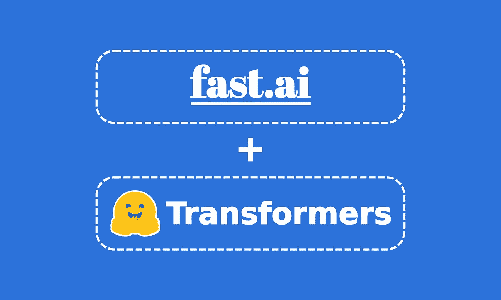
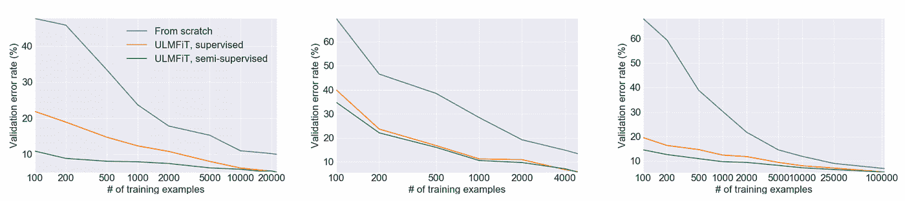
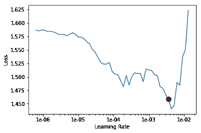
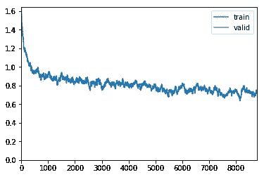

# Fastai 与🤗变形金刚(伯特、罗伯塔、XLNet、XLM、迪沃伯特)

> 原文：<https://towardsdatascience.com/fastai-with-transformers-bert-roberta-xlnet-xlm-distilbert-4f41ee18ecb2?source=collection_archive---------3----------------------->

## 使用 Fastai 实现最先进的 NLP 模型进行情感分析的教程



在【2018 年初，[杰瑞米·霍华德](https://medium.com/u/34ab754f8c5e?source=post_page-----4f41ee18ecb2--------------------------------)(fast . ai 的联合创始人)和[塞巴斯蒂安·鲁德](https://medium.com/u/e3999e445181?source=post_page-----4f41ee18ecb2--------------------------------)推出了[通用语言模型微调文本分类](https://arxiv.org/pdf/1801.06146.pdf) (ULMFiT)方法。ULMFiT 是第一个应用于 NLP 的**迁移学习**方法。因此，除了显著优于许多最先进的任务之外，它还允许在只有 100 个标记示例的情况下，匹配相当于基于 100 倍以上数据训练的模型的性能。



*ULMFiT requires less data than previous approaches.* ([Howard and Ruder, ACL 2018](https://arxiv.org/abs/1801.06146))

我第一次听说 ULMFiT 是在杰瑞米·霍华德的一次 fast.ai 课程中。他演示了如何通过几行代码轻松实现完整的 ULMFiT 方法——多亏了`fastai`库。在他的演示中，他使用了在 Wikitext-103 上预先训练的 AWD-LSTM 神经网络，并迅速获得了最先进的结果。他还解释了关键技术——也在 ULMFiT 中演示过——来微调模型，如**区分学习率**、**逐步解冻**或**倾斜三角形学习率**。

自从 ULMFiT 的引入，**迁移学习**在 NLP 中变得非常流行，然而谷歌(BERT，Transformer-XL，XLNet)，脸书(RoBERTa，XLM)甚至 OpenAI (GPT，GPT-2)都开始在非常大的语料库上预先训练他们自己的模型。这一次，他们没有使用 AWD-LSTM 神经网络，而是使用了基于变压器的更强大的架构(参见[注意力是你所需要的全部](https://arxiv.org/abs/1706.03762))。

虽然这些模型很强大，但是`fastai`并没有将它们全部集成。幸好[抱紧脸](https://huggingface.co/)🤗创建了众所周知的`[transformers](https://github.com/huggingface/transformers)` [库](https://github.com/huggingface/transformers)。这个库以前被称为`pytorch-transformers`或`pytorch-pretrained-bert`，它汇集了超过 40 个最先进的预训练 NLP 模型(伯特、GPT-2、罗伯塔、CTRL……)。该实现提供了有趣的附加工具，如 tokenizer、optimizer 或 scheduler。

[](https://github.com/huggingface/transformers) [## 拥抱脸/变形金刚

### 用于 TensorFlow 2.0 和 PyTorch 的最先进的自然语言处理🤗变形金刚(以前称为…

github.com](https://github.com/huggingface/transformers) 

`transformers`库可以是自给自足的，但是将它并入`fastai`库提供了与强大的`fastai`工具兼容的更简单的实现，如**区分学习速率**、**逐步解冻**或**倾斜三角形学习速率**。这里的要点是允许任何人——专家或非专家——轻松获得最先进的结果，并“让 NLP 再次变得不酷”。

值得注意的是，在`fastai`中集成拥抱脸`transformers`库已经在:

*   *Keita Kurita* 的文章[用快速 AI](https://mlexplained.com/2019/05/13/a-tutorial-to-fine-tuning-bert-with-fast-ai/) 微调 BERT 的教程，使`pytorch_pretrained_bert`库兼容`fastai`。
*   [Dev Sharma](https://medium.com/u/795cbf38e25d?source=post_page-----4f41ee18ecb2--------------------------------) 的文章[将 RoBERTa 与 Fastai 一起用于 NLP](https://medium.com/analytics-vidhya/using-roberta-with-fastai-for-nlp-7ed3fed21f6c) ，这使得`pytorch_transformers`库与`fastai`兼容。

虽然这些文章质量很高，但是它们的演示的某些部分不再与`transformers`的最新版本兼容。

# 🛠集成变压器和 fastai 进行多类分类

在开始实现之前，请注意可以通过多种方式将`transformers`集成到`fastai`中。为此，我带来了——我认为是——最通用、最灵活的解决方案。更准确地说，我试图对两个库进行最小的修改，同时使它们与最大数量的 transformer 架构兼容。但是，如果你找到一个聪明的方法来实现这个，请在评论区告诉我们！

本教程的 Jupiter 笔记本版本可以在这个 [Kaggle 内核](https://www.kaggle.com/maroberti/fastai-with-transformers-bert-roberta)上获得。

## 库安装

首先，您需要安装`fastai`和`transformers`库。为此，只需遵循此处[和此处](https://github.com/fastai/fastai/blob/master/README.md#installation)和[的说明。](https://github.com/huggingface/transformers#installation)

在这个演示中，我使用了已经安装了`fastai`库的 Kaggle。所以我只是用命令安装了`transformers`:

```
pip install transformers
```

用于本演示的库的版本是`fastai 1.0.58`和`transformers 2.1.1`。

## 🎬示例任务

选择的任务是对[电影评论](https://www.kaggle.com/c/sentiment-analysis-on-movie-reviews/overview)进行多类文本分类。

本文的[数据集](https://www.kaggle.com/c/sentiment-analysis-on-movie-reviews/data)和相应的[笔记本](https://www.kaggle.com/maroberti/fastai-with-transformers-bert-roberta)可以在 Kaggle 上找到。

[](https://www.kaggle.com/c/sentiment-analysis-on-movie-reviews/data) [## 电影评论的情感分析

### 下载数千个项目的开放数据集+在一个平台上共享项目。探索热门话题，如政府…

www.kaggle.com](https://www.kaggle.com/c/sentiment-analysis-on-movie-reviews/data) 

对于每个文本电影评论，模型必须预测情感的标签。我们根据分类精度*评估模型的输出*。情感标签是:

0→负
1→有点负
2→空档
3→有点正
4→正

使用`pandas`将数据加载到`DataFrame`中。

## 主变压器等级

在`transformers`中，每个模型架构都与 3 种主要类型的类相关联:

*   一个**模型类**，用于加载/存储特定的预训练模型。
*   一个**记号赋予器类**，用于预处理数据并使其与特定模型兼容。
*   一个**配置类**，用于加载/存储特定型号的配置。

例如，如果您想使用 BERT 架构进行文本分类，您可以使用`[BertForSequenceClassification](https://huggingface.co/transformers/model_doc/bert.html#bertforsequenceclassification)`作为**模型类**，使用`[BertTokenizer](https://huggingface.co/transformers/model_doc/bert.html#berttokenizer)`作为**标记器类**，使用`[BertConfig](https://huggingface.co/transformers/model_doc/bert.html#bertconfig)`作为**配置类**。

稍后，您将看到那些类共享一个公共的类方法`from_pretrained(pretrained_model_name, ...)`。在我们的例子中，参数`pretrained_model_name`是一个字符串，带有要加载的预训练模型/标记器/配置的快捷方式名称，例如`bert-base-uncased`。我们可以在`transformers`文档[这里](https://huggingface.co/transformers/pretrained_models.html#pretrained-models)找到所有的快捷方式名称。

为了在类之间轻松切换——每个类都与一个特定的模型类型相关——我创建了一个字典，它允许通过指定正确的模型类型名来加载正确的类。

值得注意的是，在这种情况下，我们只对一个*多类文本分类*任务使用`transformers`库。出于这个原因，本教程只集成了实现了序列分类模型的 transformer 架构。这些模型类型是:

*   伯特(来自谷歌)
*   XLNet(来自谷歌/CMU)
*   XLM(来自脸书)
*   罗伯塔(来自脸书)
*   蒸馏啤酒(来自拥抱脸)

然而，如果你想更进一步——通过实现另一种类型的模型或 NLP 任务——本教程仍然是一个很好的开端。

## 数据预处理

为了匹配预训练，我们必须以特定的格式格式化模型输入序列。
为此，您必须首先**对**进行标记，然后**对**文本进行正确的数字化。
这里的困难在于，我们将微调的每个预训练模型需要完全相同的特定预处理，即**记号化** & **数值化**，而不是在预训练部分使用的预处理。
幸运的是，来自`transformers` 的**记号赋予器类**提供了正确的预处理工具，对应于每个预训练的模型。

在`fastai`库中，数据预处理是在`DataBunch`创建期间自动完成的。
正如您将在`DataBunch`实现部分看到的那样，**记号赋予器**和**数值化器**在处理器参数中以如下格式传递:

```
processor = [TokenizeProcessor(tokenizer=tokenizer,…), NumericalizeProcessor(vocab=vocab,…)]
```

让我们首先分析如何将`transformers`记号赋予器集成到`TokenizeProcessor`函数中。

**自定义标记器**

这一部分可能有点混乱，因为许多类被包装在一起，并且具有相似的名称。
继续，如果我们仔细观察`fastai`的实现，我们会注意到:

1.  `[TokenizeProcessor](https://docs.fast.ai/text.data.html#TokenizeProcessor)` [对象](https://docs.fast.ai/text.data.html#TokenizeProcessor)将`Tokenizer`对象作为`tokenizer`参数。
2.  `[Tokenizer](https://docs.fast.ai/text.transform.html#Tokenizer)` [对象](https://docs.fast.ai/text.transform.html#Tokenizer)将一个`BaseTokenizer`对象作为`tok_func`参数。
3.  `[BaseTokenizer](https://docs.fast.ai/text.transform.html#BaseTokenizer)` [对象](https://docs.fast.ai/text.transform.html#BaseTokenizer)实现函数`tokenizer(t:str) → List[str]`,该函数获取文本`t`并返回其令牌列表。

因此，我们可以简单地创建一个继承自`BaseTokenizer`的新类`TransformersBaseTokenizer`，并重写一个新的`tokenizer`函数。

在这个实现中，要注意三件事:

1.  由于我们没有使用 RNN，我们必须将*序列长度*限制为模型输入大小。
2.  大多数模型需要在序列的开头和结尾放置特殊的标记。
3.  像 RoBERTa 这样的一些模型需要一个*空格*来开始输入字符串。对于那些模型，应该在`add_prefix_space`设置为`True`的情况下调用编码方法。

下面，您可以找到本教程中使用的 5 种模型类型的每个预处理要求的简历。您也可以在每个模型部分的[拥抱脸文档](https://huggingface.co/transformers/)中找到该信息。

> 伯特:[CLS] +代币+ [SEP] +填充
> 
> 蒸馏瓶:[CLS] +代币+ [SEP] +填充
> 
> 罗伯塔:[CLS] +前缀空格+记号+ [SEP] +填充
> 
> XLM: [CLS] +代币+ [SEP] +填充
> 
> XLNet:填充+令牌+ [SEP] + [CLS]

值得注意的是，在这部分实现中，我们不添加填充。
我们将在后面看到，`fastai`会在`DataBunch`创建期间自动管理它。

**自定义数值化器**

在`fastai`中，`[NumericalizeProcessor](https://docs.fast.ai/text.data.html#NumericalizeProcessor)` [对象](https://docs.fast.ai/text.data.html#NumericalizeProcessor)将一个`[Vocab](https://docs.fast.ai/text.transform.html#Vocab)` [对象](https://docs.fast.ai/text.transform.html#Vocab)作为`vocab`参数。
通过这种分析，我建议采用两种方法来适应`fastai` **数控化器**:

1.  你可以像在 [Dev Sharma 的文章](https://medium.com/analytics-vidhya/using-roberta-with-fastai-for-nlp-7ed3fed21f6c)中描述的那样(第 1 节。*设置记号赋予器*，检索记号列表并创建一个`Vocab`对象。
2.  创建一个继承自`Vocab`的新类`TransformersVocab`，并覆盖`numericalize`和`textify`函数。

即使第一个解决方案看起来更简单，`Transformers`也没有为所有模型提供一个直接的方法来检索他的令牌列表。
因此，我实现了第二个解决方案，它针对每个模型类型运行。
包括分别使用`numericalize`和`textify`中的`convert_tokens_to_ids`和`convert_ids_to_tokens`功能。

注意:函数`__gestate__` 和`__setstate__`允许函数[导出](https://docs.fast.ai/basic_train.html#Learner.export)和 [load_learner](https://docs.fast.ai/basic_train.html#load_learner) 与`TranformersVocab`一起正确工作。

**定制处理器**

既然我们已经有了自定义的**记号赋予器**和**数值化器**，我们就可以创建自定义的**处理器**。注意我们正在传递`include_bos = False`和`include_eos = False`选项。这是因为默认情况下`fastai`添加了自己的特殊标记，这会干扰我们的自定义标记器添加的`[CLS]`和`[SEP]`标记。

**设置数据发送**

对于 DataBunch 创建，您必须注意将参数`processor`设置为我们新的定制处理器`transformer_processor`，并正确管理填充。

正如拥抱脸文档中提到的，伯特、罗伯塔、XLM 和迪尔伯特是具有绝对位置嵌入的模型，所以通常建议在右侧填充输入，而不是在左侧。关于 XLNET，它是一个具有相对位置嵌入的模型，因此，您可以在右侧或左侧填充输入。

## 定制模型

正如这里提到的[和](https://github.com/huggingface/transformers#models-always-output-tuples)一样，每个模型的 forward 方法总是输出一个`tuple`，其中包含各种元素，具体取决于模型和配置参数。在我们的例子中，我们只对访问逻辑感兴趣。
访问它们的一种方法是创建自定义模型。

为了使我们的转换器适应多类分类，在加载预训练模型之前，我们需要精确标签的数量。为此，您可以修改 config 实例，或者像 Keita Kurita 的文章中那样修改`num_labels`参数。

## 学员:自定义优化器/自定义指标

在`pytorch-transformers`中，拥抱脸实现了两个特定的优化器——BertAdam 和 OpenAIAdam——它们已经被一个 AdamW 优化器所取代。
这个优化器匹配 Pytorch Adam 优化器 Api，因此，将它集成到`fastai`中变得很简单。
注意，为了重现贝塔姆的特定行为，你必须设置`correct_bias = False`。

## 有区别的微调和逐步解冻

为了使用**区别学习率**和 **G *随机解冻*** ，`fastai`提供了一个工具，允许将结构模型“分割”成组。fastai 文档[中描述了执行“分割”的指令，此处为](https://docs.fast.ai/basic_train.html#Discriminative-layer-training)。

不幸的是，模型架构差异太大，无法创建一个独特的通用函数，以方便的方式“拆分”所有的模型类型。因此，您将不得不为每个不同的模型架构实现一个定制的“分割”。

例如，如果我们使用 DistilBERT 模型，我们通过制作`print(learner.model)`来观察他的架构。我们可以决定将模型分成 8 块:

*   1 嵌入
*   6 变压器
*   1 个分类器

在这种情况下，我们可以这样分割我们的模型:

请注意，我没有发现任何文件研究了**区别学习率**和**逐步解冻**甚至**倾斜三角形学习率**对变压器架构的影响。因此，使用这些工具并不能保证更好的结果。如果你发现了任何有趣的文档，请在评论中告诉我们。

## 火车

现在我们终于可以使用所有的`fastai`内置特性来训练我们的模型了。像 ULMFiT 方法一样，我们将使用**倾斜三角学习率、区分学习率**和**逐渐解冻**模型。

因此，我们首先冻结除分类器之外的所有组，使用:

```
learner.freeze_to(-1)
```

对于**倾斜三角形学习率**，您必须使用函数`fit_one_cycle`。更多信息，请查看 fastai 文档[这里](https://docs.fast.ai/callbacks.one_cycle.html)。

为了使用我们的`fit_one_cycle`,我们需要一个最佳的学习速率。我们可以用一个学习率查找器来找到这个学习率，这个学习率查找器可以用`[lr_find](https://docs.fast.ai/callbacks.lr_finder.html#callbacks.lr_finder)`来调用。我们的图表看起来像这样:



我们将选择一个比最小值稍早的值，此时损失仍会增加。这里 2x 10–3 似乎是一个不错的值。

```
learner.fit_one_cycle(1,max_lr=2e-03,moms=(0.8,0.7))
```

损失图看起来像这样:



然后，我们解冻第二个组，并重复这些操作，直到所有组都解冻。如果您想使用**区别学习率**，您可以如下使用`slice`:

要解冻所有组，使用`learner.unfreeze()`。

## 创建预测

既然我们已经训练了模型，我们想要从测试数据集生成预测。

如 *Keita Kurita* 的[文章](https://mlexplained.com/2019/05/13/a-tutorial-to-fine-tuning-bert-with-fast-ai/)中所述，由于函数`get_preds`默认情况下不按顺序返回元素，因此您必须将元素按正确的顺序重新排序。

在 [Kaggle 示例](https://www.kaggle.com/maroberti/fastai-with-transformers-bert-roberta)中，在没有过多使用参数的情况下，我们获得了 0.70059 的公开分数，这使我们在排行榜上排名第 5！

# 📋结论

在本文中，我解释了如何将`transformers`库与心爱的`fastai`库结合起来。它的目的是让你明白在哪里寻找和修改这两个库，使它们一起工作。很可能，它允许你使用**倾斜三角形学习率**、**区别学习率**和甚至**逐步解冻**。因此，甚至无需调整参数，您就可以快速获得最先进的结果。

今年，变形金刚成了 NLP 的必备工具。正因为如此，我认为预先训练的变形金刚架构将很快被整合到`fastai`的未来版本中。同时，本教程是一个很好的开端。

我希望您喜欢这第一篇文章，并发现它很有用。
感谢您的阅读，不要犹豫，请留下问题或建议。

我会继续在 NLP 上写文章，敬请期待！

# 📑参考

[1]拥抱脸，变形金刚 GitHub(2019 年 11 月)，[https://github.com/huggingface/transformers](https://github.com/huggingface/transformers)

[2] Fast.ai，Fastai 文档(2019 年 11 月)，[https://docs.fast.ai/text.html](https://docs.fast.ai/text.html)

[3]https://arxiv.org/abs/1801.06146[杰瑞米·霍华德&塞巴斯蒂安·鲁德，文本分类通用语言模型微调(2018 年 5 月)](https://arxiv.org/abs/1801.06146)

[4] Keita Kurita，[用快速人工智能微调 BERT 的教程](https://mlexplained.com/2019/05/13/a-tutorial-to-fine-tuning-bert-with-fast-ai/)(2019 年 5 月)

[5] [Dev Sharma](https://medium.com/u/795cbf38e25d?source=post_page-----4f41ee18ecb2--------------------------------) ，[使用 RoBERTa 和 Fastai 进行 NLP](https://medium.com/analytics-vidhya/using-roberta-with-fastai-for-nlp-7ed3fed21f6c)(2019 年 9 月)