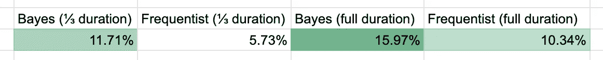
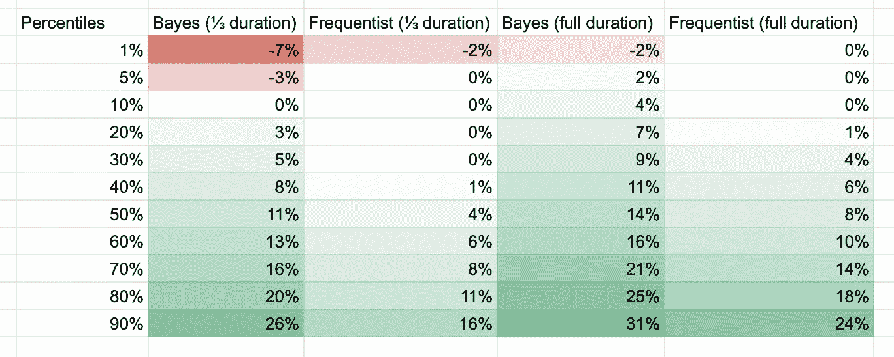
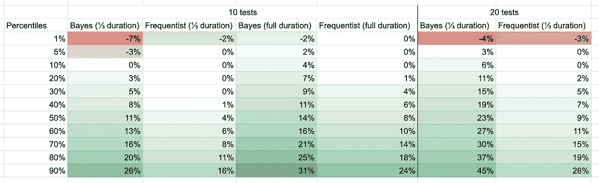

# 更快的 A/B 测试🚀—用数字表示

> 原文：<https://towardsdatascience.com/faster-a-b-testing-in-numbers-ee82e1af0885?source=collection_archive---------47----------------------->

## 除了传统假设检验(也称为 frequentist)方法之外的其他方法正变得越来越普遍——我发现贝叶斯方法是一个有意义的改进。


# 传统的方法🎓

典型的 A/B 测试意味着假设测试——这意味着我们想要“证明 A & B 是显著不同的”。我们可以将我们的测试结果插入到现有的 A/B 测试评估器中，例如来自 Evan Miller 的[评估器，并得到结果。](https://www.evanmiller.org/ab-testing/chi-squared.html)

在大多数这些工具中，部分结果是“p”值。通常，如果小于 5%，结果被认为是显著的。有趣的是，许多人不知道“p”值的实际含义，并且经常被误解。这是问题的一部分，因为如果你不能解读测试结果，就很难得出合理的结论。

*“p”值代表 A 和 B 来自同一分布的可能性*

# 为什么要改变？😱

在我看来，常规方法有两个重大问题:

1.  由于理解“p”值很难，人们经常得出错误的结论
2.  传统的方法需要非常大的样本量:用典型的参数来显示 1%成功率的转换漏斗上 10%的提升，你必须让 320 000 个用户看到你的测试！

# 贝氏救援队。⛑

为了评估其他工具，我构建了一个模拟环境来测试各种框架及其参数。下面我将分享我的高级发现，并推荐一些你可以使用的参数，我发现这些参数非常健壮。

**场景:**假设你计划在接下来的几周内一个接一个地运行 10 个 A/B 测试，如果一个测试被接受，你将为所有未来的用户推出这个特性。不是所有的 A/B 测试都是肯定的，有时你不知道用户在寻找什么——我假设你测试的是更好或更差的版本。

在每个模拟中，我综合了每个测试的改进——因此，如果 10 个测试中有 3 个测试获得了+3%、+7%、+2%的改进，我会计算:

```
(1.03 * 1.07 * 1.02)-1 = 0.124.. = 12.4%
```

我重复了 1000 次以上的模拟，然后平均出复合结果:



正如你所看到的，所有的框架都接受积极的测试，并允许你向所有用户推出改进。但是你也可以看到, **Bayes(完整持续时间)**版本产生了最大的提升(给定相同的精确 A/B 测试结果)。这怎么可能呢？**贝叶斯**伊恩方法接受小结果的负担也较低——因为来自多个测试的小结果可以合成大结果，所以**贝叶斯**伊恩方法胜出。您还可以看到，如果您运行 A/B 测试的时间较短，那么框架将无法做出如同拥有所有数据一样好的决策。

但是贝叶斯方法有什么缺点吗？不幸的是，这一点经常被忽略，但是要回答这个问题，我们不应该看平均模拟结果，而应该看复合结果的分布。



百分位数显示，在一小部分模拟中(~1%)测试框架的错误决策会导致整体性能下降。虽然在我们的模拟中我们可以看到这一事实，但在现实世界中，您不会注意到您正在损害您的业务！相比之下，你可以看到非常保守的传统(Frequentist)方法没有这个问题。

# 好吧，那么哪个更好呢？🤔

总的来说，我更喜欢贝叶斯伊恩方法——只要你不是超级倒霉，你就可以期待用这种方法得到更好的结果，但在这种情况下，你也不会比传统方法失去太多。

您还必须考虑时间方面——为您的决策框架提供更少的时间(和数据)将会导致更糟糕的决策……

除了:如果更短的测试持续时间可以让你运行更多的测试，这是一个值得的权衡。

比方说，如果你在三分之一的时间内运行你的测试，它允许你在相同的时间内运行两倍的测试。这对结果有什么影响？



正如你所看到的，在 Frequentist 方法中用更短的测试持续时间运行更多的测试并没有太大的帮助，但是在 **Bayes** ian 的情况下，我们减少了可能的负面影响并显著提高了正面影响。

# 让我们在 0 时间内运行无限量的测试🦁

我的模拟显示，在 **Bayes** ian 框架中，只要运行同等数量的测试，就有可能将测试时间越来越短(例如，将时间减少 10 倍，运行 10 倍的测试)。实际上，这有几个问题:

1.  如果您正在运行的测试的质量因为频率的增加而下降——所有的赌注都将被取消
2.  通常你不能运行尽可能多的测试，因为有人需要构建它们——在这种情况下，为测试分配尽可能多的时间以做出最好的决策是有意义的
3.  一般来说，你应该运行你的测试至少一个星期——用户在周末的行为可能与工作日有很大的不同，你的测试应该能够考虑这些情况！

# 让我们用贝叶斯分析一些测试🐳

我建议你使用以下参数来保护你的缺点:

1.  获胜的可能性应该大于 66%
2.  利润应大于 1%

我将在下面提供 python 代码，但是您也可以在大多数其他编程语言中这样做！该代码只是近似的，运行速度相当快。

```
*# to install dependencies: pip install numpy scipy* **import** numpy **as** _numpy
**from** scipy.stats.distributions **import** beta **as** _beta **def** get_likelihood_of_win(test_result, margin=0.01):
    success = 0
    total = 0 ref_pos = test_result[**'A'**][**'success_cnt'**]
    ref_neg = test_result[**'A'**][**'fail_cnt'**]
    test_pos = test_result[**'B'**][**'success_cnt'**]
    test_neg = test_result[**'B'**][**'fail_cnt'**] conv_rate_base = max(
        (ref_pos/ ref_pos + ref_neg),
        (test_pos/ test_pos + test_neg)
    ) **for** x **in** _numpy.linspace(0, min(conv_rate_base * 2, 1), 100):
        prob = _beta.pdf(x=x, a=ref_pos, b=ref_neg)
        prob_test_wins = 1 - _beta.cdf(
            x=x * (1 + margin), 
            a=test_pos, b=test_neg
        )
        success += prob_test_wins * prob
        total += prob **return** success / total **if** __name__ == **'__main__'**:
    test_result = {
        **'A'**: {
            **'success_cnt'**: 10,
            **'fail_cnt'**: 100,
        },
        **'B'**: {
            **'success_cnt'**: 18,
            **'fail_cnt'**: 100,
        }
    }
    likelihood_of_win = get_likelihood_of_win(
        test_result=test_result, margin=0.01
    )
    accepted = likelihood_of_win > 0.66
    print(accepted, round(likelihood_of_win, 2))
```