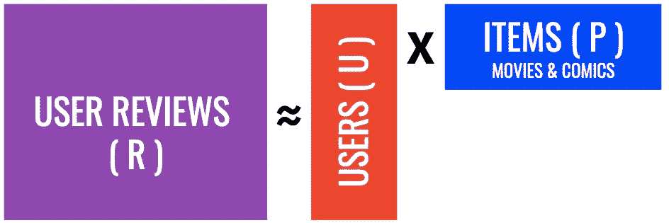
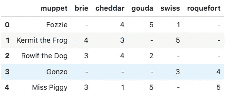
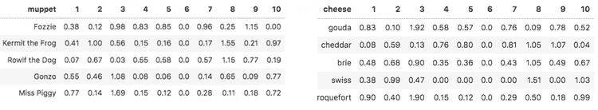
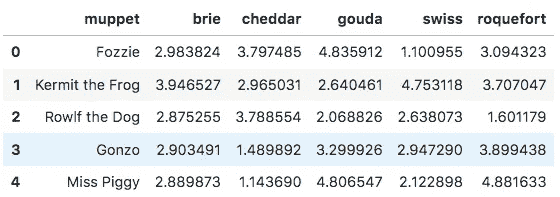

# 更快的 ALS 推荐与特征提取(和布偶！)

> 原文：<https://towardsdatascience.com/faster-als-recommendations-with-feature-extraction-and-muppets-78402af9c011?source=collection_archive---------24----------------------->


[CC](https://www.flickr.com/photos/42242019@N00/6906714977)

[在最近的另一篇文章](https://medium.com/@johnnaujoks/creating-a-comic-book-recommendation-system-for-non-comic-readers-e56a5c68c798)中，我讲述了我是如何为非漫画读者创建一个漫画推荐系统[到漫画](http://www.intocomics.club/)。我回顾了我是如何做到这一点的一些步骤，包括创建一个交替最小二乘法(ALS)模型，该模型将用户和项目分解成他们自己的矩阵，可以这样可视化:



当我们将这两个值分开后，可以将它们相乘，得到稀疏矩阵中原始值的最接近的组合，但也可以填入我们没有的值。现在，每个用户和物品都有自己独特的功能，这些功能以数字矩阵值的形式表现出来，我们用这些值来实现这些功能。

# 🐸十.🧀

我的推荐系统使用大量的项目和用户，所以为了帮助说明这一点，我将看一下我自己想象的一个非常简化的版本。我在怪异的例子中学得最好，所以它们会在我的大脑中停留更长的时间。所以，为了你的享受，让我们想象布偶需要一个奶酪的推荐系统。你把他们中的一些人聚集在一起，得到他们从 1 到 5 的分数，然后创建一个数据框，看起来像这样:



使用 ALS，我们可以将评级矩阵分解为代表用户和项目的矩阵，每个矩阵都通过潜在特征来表达。假设我们决定布偶奶酪推荐器有十个潜在特征，我们将得到两个特征矩阵，如下所示:



使用矩阵乘法，当我们重新组合这些矩阵时，我们会得到一个新的矩阵，如下所示:



你现在可以看到的一件大事是，这个过程已经填充了任何原本缺少评级的单元格。我们使用用户和项目的潜在特征来估计他们对项目的评价。如果我们向 Gonzo 推荐一种奶酪，知道他已经对 Swiss & Roquefort 进行了评级，我们可以看到 Gouda 是他没有吃过的项目中评级最高的，这是一个可靠的选择！

## 特征提取的魔力

我们做到了，我们可以向布偶推荐奶酪。但是…我们如何向牙齿医生推荐一种奶酪呢？滑板车？老鼠里索！？我们怎么会忘记他呢！我们需要帮助获得更多的布偶和最适合它们的奶酪。

一位新用户向我们提出了所谓的冷启动问题。我们必须弄清楚如何向没有信息的用户推荐(或者如果我们想添加新的奶酪，我们会遇到类似的问题)。我们可以只推荐评价最高的，也许是评价最高的，有许多不同的方法来尝试和解决这个问题。回到我最初的漫画推荐用例，我决定从他们那里获得一些用户评级，并从那里开始预测，但是我如何使用新的评级呢？

正如您在 ALS 中看到的，要有效地获得推荐，您需要有完整的矩阵，创建模型，然后找到最佳匹配。这样做的问题很简单:计算量很大，速度很慢。如果每次需要推荐时都需要重新创建模型，那么效率会非常低。

为了在不建立新模型的情况下快速获得结果，我们可以使用从项目中提取的特征以及新用户的一些推荐，并简单地进行矩阵乘法来获得分数。这听起来可能很直接，但让我详细介绍一下这个概念:

在 Python 中，让我展示一下可能的样子。首先，让我们假设牙齿博士决定加入这个布偶奶酪聚会，并将高达奶酪和切达奶酪都评为 5 分(他是一个相当快乐的家伙)。我们把他的分数放在他们自己的 numpy 数组中:

```
dr_teeth = np.array([[5],[5]])
dr_teeth.shape # (2, 1)
```

接下来，我们获取 gouda 和 cheddar 的项目特征，并将它们放在一个单独的数组中。它们是上图中要素数据框中的前两个项目，因此看起来会像这样:

```
select_cheese = items.iloc[0:2, 2:12].to_numpy()
select_cheese.shape # (2, 10)
```

接下来，我们将使用最小二乘法的线性代数解来求解牙齿博士的用户特征:

```
dr_teeth_features = np.linalg.lstsq(select_cheese, dr_teeth, rcond=None)
dr_teeth_features = dr_teeth_features[0].reshape((10,))
dr_teeth_features
###
array([1.94412615, 0\.        , 0\.        , 1.49873073, 0.20873594,
       0\.        , 0\.        , 0.42289857, 0.36965752, 0.19383103])
```

我们做到了！现在，我们有了用户功能，就像所有其他现有用户一样。然后，我们可以使用这些和所有项目的矩阵乘法来返回牙齿医生的全套分数:

```
dr_teeth_scores = [np.dot(dr_teeth_features, row) for row in items.iloc[:, 2:12].to_numpy()]for row in zip(items['cheese'], dr_teeth_scores):
    print(row)###
('gouda', 4.9999999999999964)
('cheddar', 5.000000000000001)
('brie', 4.270218133363084)
('swiss', 2.505755675697055)
('roquefort', 3.5066194383500755)
```

看起来对他来说下一个最好的奶酪是布里干酪。我们现在有一种快速的方法来近似新用户的结果，而不必创建一个全新的模型。

解开这一想法最重要的部分是知道你可以将特征提取应用到许多涉及数据科学的操作中。特别是当你开始使用大型预训练模型进行图像分类时，我们可以类似地使用它们的特征，而不需要运行大规模的神经网络来在更短的时间内获得结果的近似。