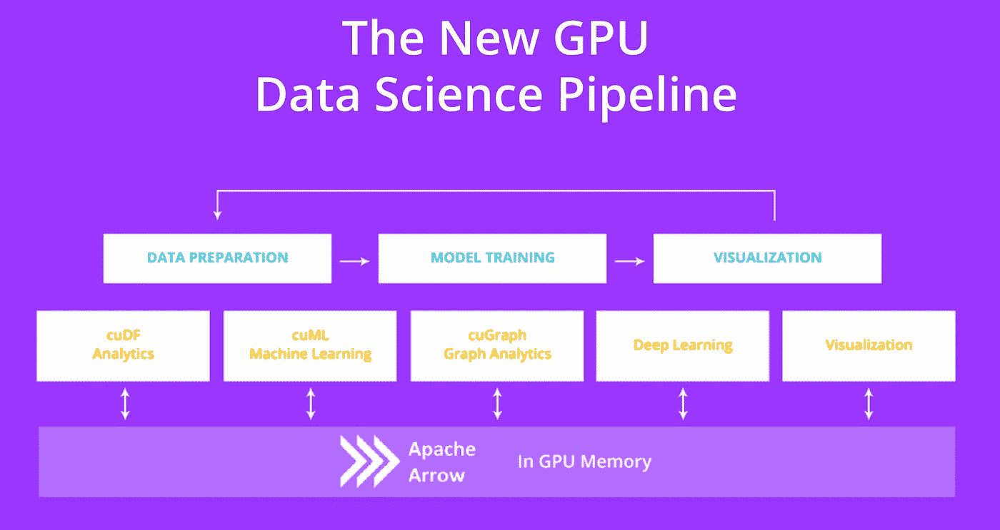
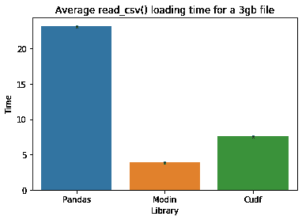
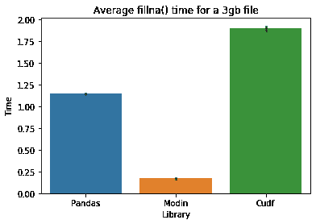
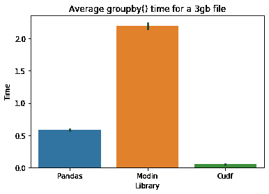

# 具有并行处理的更快的熊猫:cuDF 与 Modin

> 原文：<https://towardsdatascience.com/faster-pandas-with-parallel-processing-cudf-vs-modin-f2318c594084?source=collection_archive---------10----------------------->


Photo by [Lindsay Henwood](https://unsplash.com/@lindsayhenwood?utm_source=unsplash&utm_medium=referral&utm_content=creditCopyText) on [Unsplash](https://unsplash.com/s/photos/steps?utm_source=unsplash&utm_medium=referral&utm_content=creditCopyText)

对于 Pandas，默认情况下我们一次只能使用一个 CPU 内核。这对于小数据集来说没问题，但是当处理较大的文件时，这可能会造成瓶颈。

通过使用并行处理来加快速度是可能的，但是如果你从未编写过多线程程序，不要担心:你不需要学习如何去做。一些新的图书馆可以为我们做到这一点。今天我们就来对比一下其中的两位: [cuDF](https://github.com/rapidsai/cudf) 和[摩丁](https://github.com/modin-project/modin)。它们都使用类似 pandas 的 API，所以我们可以通过修改 import 语句来开始使用它们。

## cuDF

[cuDF](https://github.com/rapidsai/cudf) 是一个 GPU 数据帧库，它提供了一个**类似熊猫的 API** ，允许我们加速我们的工作流，而无需进入 CUDA 编程的细节。lib 是 RAPIDS 的一部分，RAPIDS 是一套开源库，使用 GPU 加速，**与流行的数据科学库和工作流**集成，以加速机器学习。



The RAPIDS suite

该 API 与 pandas 非常相似，因此在大多数情况下，我们只需更改一行代码就可以开始使用它:

```
**import cudf as pd**s = pd**.Series(**[1,2,3,None,4]**)**df = pd**.DataFrame**([('a', list(range(20))),
                     ('b', list(reversed(range(20)))),
                     ('c', list(range(20)))]**)**df.**head**(2)df.**sort_values**(by='b')
df['a']
df.**loc**[2:5, ['a', 'b']]s = pd.Series([1,2,3,None,4])s.fillna(999)df = pd.**read_csv(**'example_output/foo.csv'**)** df.**to_csv(**'example_output/foo.csv', index=False**)**
```

cuDF 是一个**单 GPU 库**。对于多 GPU，他们使用 Dask 和 dask-cudf 包，该包能够在单台机器上的多个 GPU 之间扩展 cudf，或者在一个集群中的许多机器上扩展多个 GPU[[cuDF 文档](https://rapidsai.github.io/projects/cudf/en/0.10.0/dask-cudf.html) ]。

## 摩丁

[Modin](https://github.com/modin-project/modin) 还提供了一个 **pandas-like API** 使用 Ray 或 Dask 实现一个高性能的分布式执行框架。有了 Modin，你可以使用**你机器上的所有 CPU 内核**。它在 4 个物理内核的笔记本电脑上提供了高达 4 倍的速度提升[ [摩丁文档](https://github.com/modin-project/modin) ]。


[Modin](https://modin.readthedocs.io/en/latest/)

# 环境

我们将使用 [Maingear VYBE PRO 数据科学 PC](https://maingear.com/nvidiadatascience/) ，我正在使用 Jupyter 运行脚本。以下是技术规格:

## Maingear VYBE PRO 数据科学电脑

*   125gb 内存
*   i9–7980 xe，36 个内核
*   2x 泰坦 RTX 24GB

用于基准的数据集是[巴西 2018 年高等教育普查](http://download.inep.gov.br/microdados/microdados_educacao_superior_2018.zip)。

# 基准 1:读取一个 CSV 文件

让我们使用 Pandas、cuDF 和 Modin 读取一个 3gb 的 CSV 文件。我们将运行它 30 次并得到平均值。



Reading a CSV file

摩丁以平均不到 4s 胜出。它会自动在系统的所有可用 CPU 内核中分配计算，我们有 36 个内核，这可能就是原因🤔？

# 基准 2:缺失值

在这个基准测试中，我们将填充数据帧的 NaN 值。



Filling missing values

摩丁也是这个基准的赢家。cuDF 是平均运行时间更长的库。

# 基准 3:分组依据

让我们将行分组，看看每个库的行为。



Grouping rows

这里 cuDF 是赢家，摩丁表现最差。

# 酷，那么我应该使用哪个库呢？


[https://twitter.com/swyx/status/1202202923385536513](https://twitter.com/swyx/status/1202202923385536513)

要回答这个问题，我想我们必须考虑一下**我们在工作流程中最常用的方法**。在今天的基准测试中，使用 Modin 读取文件要快得多，但是我们需要在 ETL 中使用多少次`read_csv()`方法呢？相比之下，理论上，我们会更频繁地使用`groupby()`方法，在这种情况下，cuDF 库的性能最好。

Modin 很容易安装(我们只需要使用 pip)，cuDF 比较难(你需要更新 NVIDIA 驱动，安装 CUDA，然后使用 conda 安装 cuDF)。或者你可以跳过所有这些步骤，得到一台[数据科学电脑](/how-to-use-gpus-for-machine-learning-with-the-new-nvidia-data-science-workstation-64ef37460fa0)，因为它配备了所有 RAPIDS 库和完全安装的软件。

此外，摩丁和 cuDF 仍处于早期阶段，他们还没有完整覆盖整个熊猫 API。

# 入门指南

如果你想深入研究 cuDF，10 分钟到 cuDF 和 Dask-cuDF 是一个很好的起点。

关于摩丁的更多信息，[这篇博文](https://rise.cs.berkeley.edu/blog/pandas-on-ray-early-lessons/)解释了更多关于用[射线](https://github.com/ray-project/ray)并行化熊猫的信息。如果你想更深入地了解，还有关于用 Modin 透明地扩展交互式数据科学的技术报告，它很好地解释了 Modin 的技术架构。