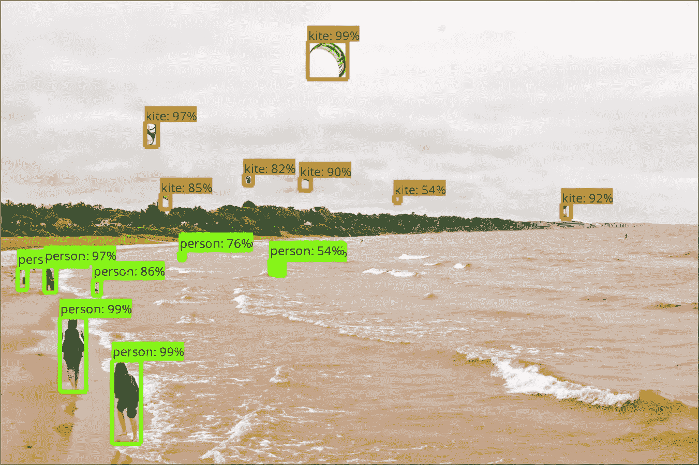
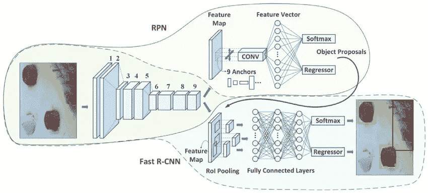
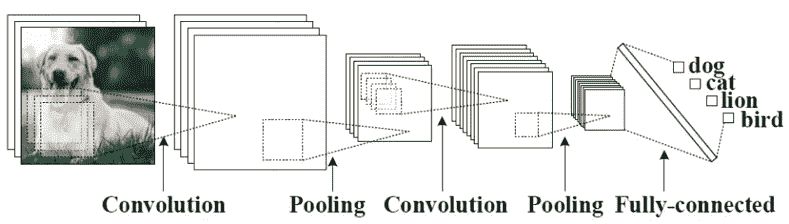
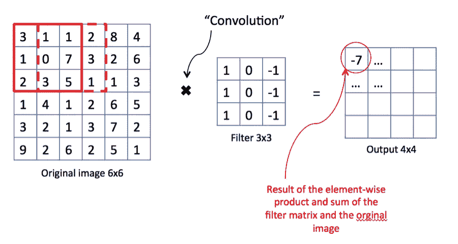
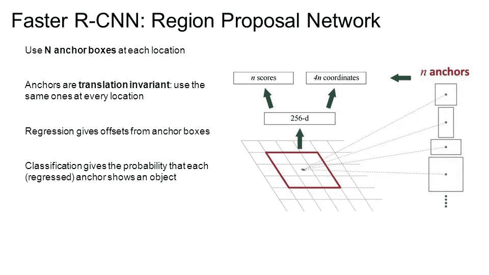

# 更快的 RCNN 对象检测

> 原文：<https://towardsdatascience.com/faster-rcnn-object-detection-f865e5ed7fc4?source=collection_archive---------2----------------------->

**简介**

更快的 RCNN 是由[罗斯·吉斯克](https://arxiv.org/search/cs?searchtype=author&query=Girshick%2C+R)、[邵青·任](https://arxiv.org/search/cs?searchtype=author&query=Ren%2C+S)、[明凯·何](https://arxiv.org/search/cs?searchtype=author&query=He%2C+K)、[孙健](https://arxiv.org/search/cs?searchtype=author&query=Sun%2C+J)于 2015 年提出的一种物体检测架构，是像 YOLO(你只看一次)和 SSD(单次检测器)一样使用卷积神经网络的著名物体检测架构之一。

让我们解释一下这个架构是如何工作的，

更快的 RCNN 由 3 部分组成

*   **第 1 部分:卷积层**

在这一层中，我们训练过滤器来提取图像的适当特征，例如，假设我们要训练这些过滤器来提取人脸的适当特征，那么这些过滤器将通过训练只存在于人脸中的形状和颜色来学习。

所以我们可以把卷积层比作咖啡过滤器，咖啡过滤器不让咖啡粉通过杯子，所以我们的卷积层学习物体的特征，不让任何东西通过，只让想要的物体通过。

*   咖啡粉+咖啡液=输入图像
*   咖啡过滤器= CNN 过滤器
*   咖啡液体 CNN 的最后一个专题图

让我们更多地讨论卷积神经网络，
卷积网络通常由卷积层、汇集层和最后一个组件组成，该组件是完全连接的或另一个扩展的组件，将用于适当的任务，如分类或检测。

我们通过沿着我们的输入图像的滑动滤波器来计算卷积，并且结果是称为特征图的二维矩阵。

池包括通过消除低值像素来减少要素地图中的要素数量。

最后一件事是使用全连接层来分类这些特征，这在快速 RCNN 中不是我们的情况。

*   **第 2 部分:区域提议网络(RPN)**

RPN 是一种小型神经网络，它在卷积层的最后一个特征图上滑动，预测是否存在对象，并预测这些对象的包围盒。

*   **第 3 部分:类别和包围盒预测**

现在，我们使用另一个完全连接的神经网络，该网络将 RPN 提出的区域作为输入，并预测对象类别(分类)和边界框(回归)。

*   **培训**

为了训练这种架构，我们使用 SGD 来优化卷积层过滤器、RPN 权重和最后完全连接的层权重。

**应用更快的 RCNN**

您可以使用 Tensorflow 对象检测 API ( [链接](https://github.com/tensorflow/models/tree/master/research/object_detection))在您的自定义数据集上训练更快的 RCNN 预训练模型([链接](https://github.com/tensorflow/models/blob/master/research/object_detection/g3doc/detection_model_zoo.md))。