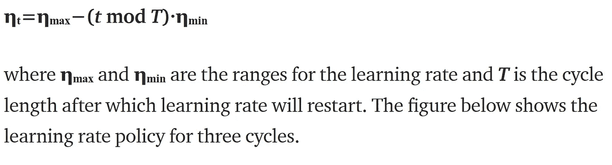

# 高效 CNN 的快速培训

> 原文：<https://towardsdatascience.com/faster-training-of-efficient-cnns-657953aa080?source=collection_archive---------18----------------------->

> 最近，已经证明[深度卷积](https://arxiv.org/abs/1610.02357)在设计高效网络方面非常有效，例如 [MobileNet](https://arxiv.org/abs/1801.04381) 和 [ShuffleNet](https://arxiv.org/abs/1807.11164) 。然而，这种高效的网络需要花费**更长的时间来训练，通常需要 300-400 个历元**，才能在 ImageNet 数据集上达到最先进的精度。

在本文中，我们描述了 ***在 [ESPNetv2](https://arxiv.org/pdf/1811.11431.pdf) 论文(CVPR'19)中介绍的一种有效的学习率调度器*** ，它允许在大约 100 个时期内训练有效的网络，而不会对准确性产生任何重大影响。为了展示 ESPNetv2 中学习率调度程序的卓越性能，我们在本文中使用了 [ShuffleNetv2](https://arxiv.org/abs/1807.11164) 的架构。我们注意到我们的发现与其他高效网络一致，包括 [MobileNetv2](https://arxiv.org/abs/1801.04381) 。

# 学习率调度程序

ESPNetv2 引入了[余弦学习率](https://arxiv.org/abs/1608.03983)的变体，其中学习率线性衰减直到周期长度，然后重新开始。在每个时期 ***t*** ，学习率ηₜ被计算为:

**Figure 1:** Cyclic learning rate policy with linear learning rate decay and warm restarts

## F 紫苑培训

使用上述学习速率调度程序，我们在四个 TitanX GPUs 上使用 SGD 在两种不同的 FLOP 设置下为*训练 ShuffleNetv2 总共 120 个历元*，批量大小为 512:(1)41m flops 和(2) 146 MFLOPs。对于前 60 个时期，我们将 **ηₘᵢₙ** 、 **ηₘₐₓ** 和 **T** 分别设置为 0.1、0.5 和 5。对于剩余的 60 个纪元，我们设置 **ηₘₐₓ=0.1** 、 **T=60** 、 **ηₘᵢₙ** = **ηₘₐₓ/T** 。下图显示了 120 个时期的学习策略。

**Figure 2:** Cyclic learning rate scheduler with warm restarts for faster training proposed in the ESPNetv2 paper.

## ImageNet 数据集上的结果

结果见图 3 和表 1。我们可以清楚地看到，学习率调度器(如上所述)能够实现更快的训练，同时提供与 ShuffleNet 论文中的线性学习率调度器相似的性能。

**Figure 3:** Epoch-wise training (***left***) and validation (***right***) accuracy of ShuffleNetv2 (41 MFLOPs) using linear (see ShuffleNetv1/v2 papers) and cyclic (discussed above) learning rate schedule.

**Table 1:** Top-1 accuracy of the ShuffleNetv2 model with two different learning rate schedules: (1) ***Linear,*** **as in the ShuffleNet paper** and (2) **Cyclic, as in the ESPNetv2** **paper** (described above). The slight difference in reported and our implementation is likely due to the batch size. We used a batch size of 512 while in ShuffleNetv2 paper a batch size of 1024 is used.

# 我们可以在不同的工作上使用 ESPNetv2 排程器吗？

是的，调度程序是通用的，可以跨不同的任务使用。在 ESPNetv2 论文中，我们将它用于所有三个标准视觉任务:(1)图像分类，(2)对象检测，以及(3)语义分割。详见[论文](https://arxiv.org/pdf/1811.11431.pdf)。