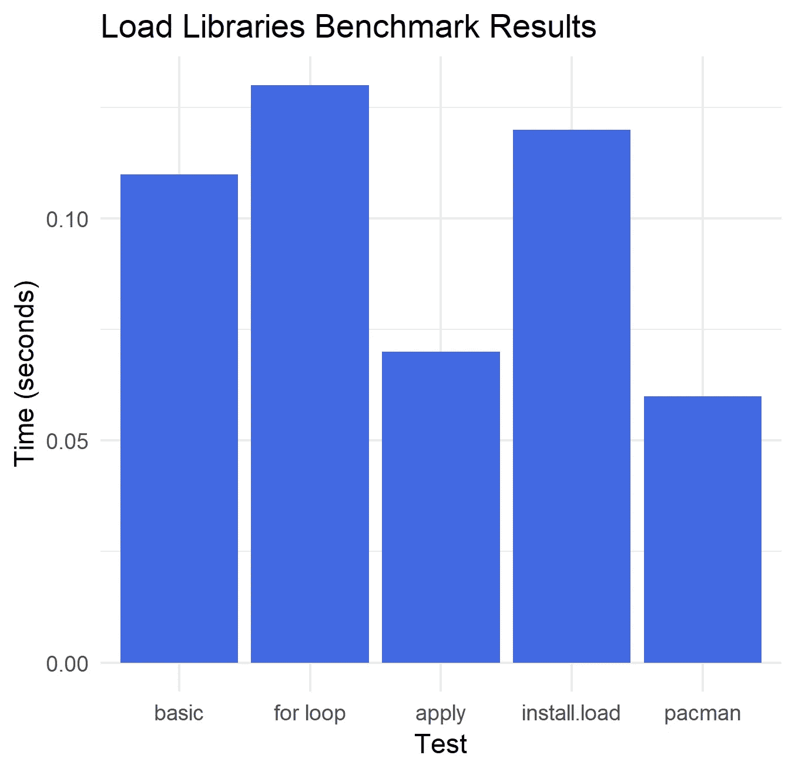

# 在 R 中安装和加载库的最快方法

> 原文：<https://towardsdatascience.com/fastest-way-to-install-load-libraries-in-r-f6fd56e3e4c4?source=collection_archive---------15----------------------->

在与一位同学合作之后，很明显我需要一种新的方式来加载我在学校学到的库。不是每个人都安装了相同的库，这可能会出错。我希望代码能为每个人无缝运行。此外，不得不反复编写相同的函数来安装和加载不同的库是很痛苦的。我和我的同学努力寻找一种简单的方法来做到这一点。然后我使用了一个名为 [tictoc](https://cran.r-project.org/web/packages/tictoc/index.html) 的包来测量不同方法的速度。

注意:测试是在干净的全球环境中进行的。所有的包都已经被安装和加载了，所以测试可以保持一致(包会被重新加载)。

首先，为了进行分析，需要安装和加载 tictoc 包。我还将为要加载的包列表定义一个变量。

```
install.packages("tictoc")
library(tictoc)packages <- c("tidyverse", "dplyr", "stringr", "zoo", "ROCR", "caret", "class", "gmodels", "randomForest")
```

**方法 1 —分别加载和安装每个库:**

*我注释掉了 install.packages，因为不管这个包是否存在，它都会重新安装。这不是最有效的方法，因为如果省略 install.packages 并且该软件包在当前安装中不存在，您将重新安装所有内容或得到一个错误。*

总时间:0.11 秒

```
tic("basic")#install.packages(packages)
library(tidyverse)
library(dplyr)
library(stringr)
library(zoo)
library(ROCR)
library(caret)
library(class)
library(gmodels)
library(randomForest)toc(log = TRUE)
log.txt <- tic.log(format = TRUE)
```

**方法 2——使用 for 循环**

总时间:0.13 秒

```
tic("for loop")libraries <- function(packages){
  for(package in packages){
    #checks if package is installed
    if(!require(package, character.only = TRUE)){
      #If package does not exist, then it will install
      install.packages(package, dependencies = TRUE)
      #Loads package
      library(package, character.only = TRUE)
    }
  }
}libraries(packages)toc(log = TRUE)
log.txt <- tic.log(format = TRUE)
```

**方法 3 —使用应用方法**

总时间:0.07 秒

```
tic("apply")ipak <- function(pkg){
  new.pkg <- pkg[!(pkg %in% installed.packages()[, "Package"])]
  if (length(new.pkg))
    install.packages(new.pkg, dependencies = TRUE)
  sapply(pkg, require, character.only = TRUE)
}ipak(packages)toc(log = TRUE)
log.txt <- tic.log(format = TRUE)
```

**方法 4 —使用**[**install . load**](https://cran.r-project.org/web/packages/install.load/README.html)**包**

*在这篇文章中，我假设用户已经安装了 install.load 来计算时间，因为这只会发生一次。要安装的代码只是出于可复制性的目的。*

总时间:0.12 秒

```
tic("install.load")if (!require("install.load")) install.packages("install.load")
library(install.load)install_load(packages)toc(log = TRUE)
log.txt <- tic.log(format = TRUE)
```

**方法 5——使用** [**吃豆人**](https://cran.r-project.org/web/packages/pacman/index.html) **包**

*这也是在假设用户已经安装了 pacman 的情况下计算的。*

总时间:0.06 秒

```
tic("pacman")if (!require("pacman")) install.packages("pacman")
#pacman will not accept a character vector so the same packages are repeated
pacman::p_load("tidyverse", "dplyr", "stringr", "zoo", "ROCR", "caret", "class", "gmodels", "randomForest")toc(log = TRUE)
log.txt <- tic.log(format = TRUE)
```

**最终判决**

安装和/或加载许多软件包的最快方法是使用 pacman 软件包。但是，如果您不想安装额外的软件包，最好使用 apply 方法。它只是稍微慢了一点。

值得一提的是，对于“基本”测试，如果用户不确定他们当前已经安装的软件包，由于上面提到的原因，这种方法会变得非常慢。

