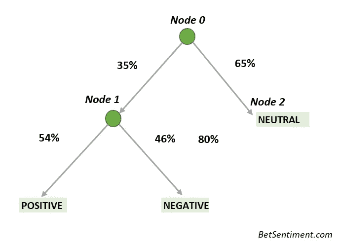
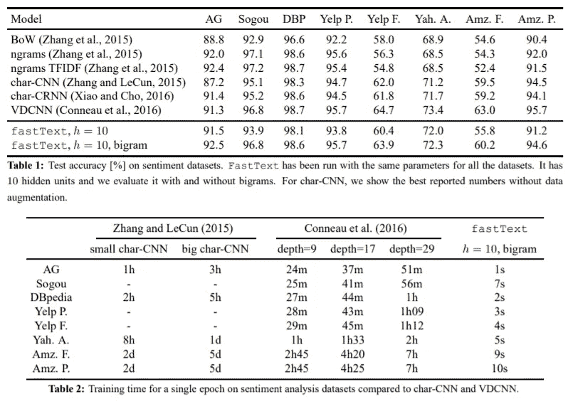
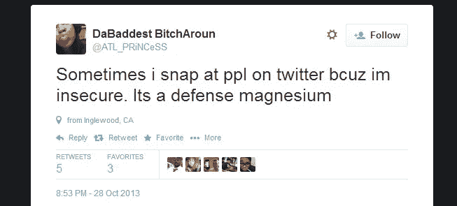
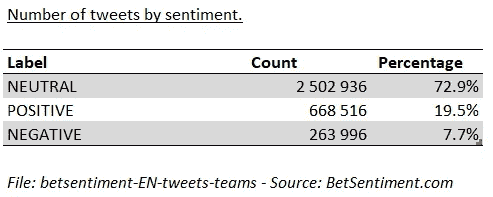
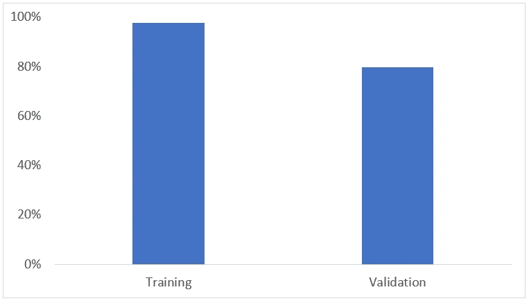

# 推特快速文本情感分析:简单指南

> 原文：<https://towardsdatascience.com/fasttext-sentiment-analysis-for-tweets-a-straightforward-guide-9a8c070449a2?source=collection_archive---------6----------------------->

## 快速文本架构、清理、上采样和推文情感的本质


A robot learning sentiments

在这篇文章中，我们介绍了 **fastText** 库，它如何在文本分类方面比一些深度神经网络实现更快的速度和类似的准确性。接下来，我们将展示如何借助由**AWS comprehende**生成的数据来训练情感分析模型。在[的另一篇文章](https://medium.com/@charlesmalafosse/deploy-a-machine-learning-model-with-aws-elasticbeanstalk-dfcc47b6043e)中，我们展示了如何使用 **AWS Elastic Beanstalk** 创建一个机器学习服务器来服务你的模型。

# fast text——浅层神经网络架构

FastText 是由 facebook AI 开发的开源 NLP 库，最初于 2016 年发布。它的目标是高效地提供**单词嵌入**和**文本分类**。据他们的作者称，在准确性方面，它通常与深度学习分类器不相上下，并且在训练和评估方面**快许多数量级**。[1]

这使得 **fastText 成为构建 NLP 模型**并为生产环境生成实时预测的优秀工具。

# FastText 架构概述

FastText 的核心依赖于用于单词表示的[连续单词包](https://en.wikipedia.org/wiki/Bag-of-words_model) (CBOW)模型和一个分层分类器来加速训练。

连续单词包(CBOW)是一个浅层神经网络，它被训练来从其邻居预测一个单词。FastText 用预测类别取代了预测单词的目标。这些单层模型训练速度非常快，并且可以很好地扩展。

此外，fastText 用分层的 softmax 替换标签上的 softmax。这里每个节点代表一个标签。这减少了计算量，因为我们不需要计算所有标签的概率。有限数量的参数减少了训练时间。



fastText hierarchical architecture for sentiment analysis.

# 训练速度更快，但结果相似

根据最初的论文[1]，fastText 实现了与其他算法类似的结果，同时训练速度快得多。

正如您在下面看到的，fastText 的训练时间在 1 到 10 秒之间，而其他型号的训练时间为几分钟或几小时。



Bag of Tricks for Efficient Text Classification — Joulin 2016

# 打开用于情感分析的数据集

大多数用于文本分类的开放数据集都很小，我们注意到，除了英语之外，很少(如果有的话)可以用于其他语言。因此，除了为情感分析提供指导，我们还想为情感分析提供[开放数据集](https://github.com/charlesmalafosse/open-dataset-for-sentiment-analysis)【2】。

出于这些原因我们提供了包含推文列表及其观点的文件:

*   **英语推文数据集=>630 万条推文可用。**
*   **西班牙语推文数据集=>120 万推文。**
*   **法语推文数据集= > 25 万条推文**
*   **意大利推文数据集= > 425 000 条推文**
*   **德国推文数据集= > 210 000 条推文**

这些都是得益于 [**AWS 领悟 API**](https://aws.amazon.com/comprehend/) 生成的。对于西班牙语和法语，首先使用谷歌翻译将推文翻译成英语，然后使用 AWS 领悟进行分析。情绪分为积极、消极、中性或混合。

对于本文，我们使用的是英语推文数据集。

# 为情绪清理推文。

他们说清理通常是数据科学家 80%的时间。可悲的是，这里没有例外。为了获得最好的结果，我们必须确保数据接近正确的英语，因为我们在处理推文，这不是一件容易的事情。



Example of (funny) misspelled tweets — source: thepoke.co.uk

我们的目标是清理推文，使它们更容易被机器阅读。有许多技术可以清理文本。最著名的是**词汇化**、**词干化**和**停用词**。

*   **词干化和词条化**的目标都是将一个单词的屈折形式和派生相关形式简化为一个通用的基本形式。例如:am，are，is = > be / dog，dogs，dogs’s，dogs =>dog。)这些减少了语料库的大小及其复杂性，允许更简单的单词嵌入(am、are 和 is 共享相同的精确单词向量)。
*   **停用词**过滤增加噪音或对机器理解文本没有价值的常用词。例子:a，and，the…

虽然词干化和词汇化有助于情感分析，但停用词过滤并不简单。停用词的目标是删除不必要的词，但是如果您查看可用的停用词列表，例如来自 NLTK 库的列表，您会发现可能传达负面情绪的词，例如:not，don 't，has not…但是对于情感分析问题，我们希望保留负面词汇。很明显，“这是一个好游戏”和“这不是一个好游戏”提供了相反的观点。因此，用户需要**编辑停用词列表以排除传达负面含义的词，或者根本不使用停用词。我们选择了后者。**

此外， **tweets 是包含大量表情符号、缩写、标签、拼写错误的单词和俚语的短信**。其中大多数对情感分析没有什么价值，需要清理:

*   **缩写/俚语清理**。如果我们想简化我们的问题，当有合适的替代方法时，我们需要去掉缩写并翻译俚语。然而，很难找到这样的词汇库或数据库。为此，我们必须创建一个列表。去我的 GitHub 页面看看吧。

```
#CONTRACTIONS is a list of contractions and slang and their conversion. { "you've":"you have", "luv":"love", etc...}
tweet = tweet.replace("’","'")
words = tweet.split()
reformed = [CONTRACTIONS[word] if word in CONTRACTIONS else word for word in words]
tweet = " ".join(reformed)
```

*   **修复拼错的单词。**这里我们使用一个正则表达式，使用 regex 来删除单词中的重复字符。除了 regex 之外，您还可以使用其他能够检测和修复拼写错误的库。遗憾的是，它们非常慢，当你每天有数千条推文要分析时，这在生产中是不可接受的。

```
import itertools
tweet = ''.join(''.join(s)[:2] for _, s in itertools.groupby(tweet))
```

*   **转义 HTML 字符**:Twitter API 有时会返回 HTML 字符。当这种情况发生时，我们需要将它们转换成 ASCII 形式。比如， **%20** 转换成空格，**&amp**；被转换为&。为此，我们使用 Beautiful Soup，一个用于解析 HTML 和 XML 文档的 Python 包。

```
from bs4 import BeautifulSoup
tweet = BeautifulSoup(tweet).get_text()
```

*   **移除标签/账户**:需要移除使用 Twitter 标签(#)和账户(@)的名称。我们不希望一个足球运动员的名字被我们的模型永远归类为“负面”，仅仅因为他在我们的数据集中与糟糕的评论相关联。

```
tweet = ' '.join(re.sub("(@[A-Za-z0-9]+)|(#[A-Za-z0-9]+)", " ", tweet).split())
```

*   **删除网址**:

```
tweet = ' '.join(re.sub("(\w+:\/\/\S+)", " ", tweet).split())
```

*   **去除标点符号**:标点符号不用于“单词袋”技术。

```
tweet = ' '.join(re.sub("[\.\,\!\?\:\;\-\=]", " ", tweet).split())
```

*   **小写**:将所有内容转换为小写，以避免区分大小写的问题:

```
#Lower case
tweet = tweet.lower()
```

*   **表情符号/表情符号**:在一条推文中，表情符号和表情符号用“\\”或标点符号表示，因此没有正确标记。为了保持它们的意义，我们需要将它们转换成更简单的形式。对于表情符号，有一个 **python 库“e moji”**通过将表情符号代码转换为标签来实现这一点。对于表情符号:-)，您必须提供您的列表，我们会在 GitHub 页面上提供。

```
#Part for smileys - SMILEY is a list of smiley and their conversion. {"<3" : "love", ":-)" : "smiley", etc...}
words = tweet.split()
reformed = [SMILEY[word] if word in SMILEY else word for word in words]
tweet = " ".join(reformed)
#Part for emojis
tweet = emoji.demojize(tweet)
```

*   口音只限于英语，但广泛用于其他语言，口音经常被放错地方或遗忘。对付它们最简单的方法就是摆脱它们。

```
def strip_accents(text):
    if 'ø' in text or  'Ø' in text:
        #Do nothing when finding ø 
        return text   
    text = text.encode('ascii', 'ignore')
    text = text.decode("utf-8")
    return str(text)
```

要查看所有相关内容，请查看我的 GitHub 页面上的代码[2]。

# 格式化数据

FastText 需要标记数据来训练监督分类器。标签必须以前缀`__label__`开头，这是它识别标签或单词的方式。下面是标签为正面和负面的推文所需格式的示例。

```
__label__POSITIVE congratulations you played very well yesterday.
__label__NEGATIVE disappointing result today.
...
```

我们使用下面的代码来格式化数据。

```
def transform_instance(row):
    cur_row = []
    #Prefix the index-ed label with __label__
    label = "__label__" + row[0]  
    cur_row.append(label)
    #Clean tweet and tokenize it
    cur_row.extend( nltk.word_tokenize(tweet_cleaning_for_sentiment_analysis(row[1].lower())))def preprocess(input_file, output_file, keep=1): with open(output_file, 'w') as csvoutfile:
        csv_writer = csv.writer(csvoutfile, delimiter=' ', lineterminator='\n')
        with open(input_file, 'r', newline='') as csvinfile: #,encoding='latin1'
            csv_reader = csv.reader(csvinfile, delimiter=',', quotechar='"')
            for row in csv_reader:
                if row[0].upper() in ['POSITIVE','NEGATIVE','NEUTRAL','MIXED']:
                    row_output = transform_instance(row)
                    csv_writer.writerow(row_output)# Preparing the training dataset 
preprocess('BetSentimentTweetAnalyzed.csv', 'tweets.train')
```

# 向上采样以抵消类别不平衡。

当一个标签比其他标签出现得更频繁时，就会出现类别不平衡的问题。在这种情况下，分类器往往会被大类淹没，而忽略小类。

应用于我们的英语推特数据集[2]，我们注意到中性与积极/消极类别的不平衡。**因此，将所有事物分类为中性的原始策略将给出 73%的准确率**(见下表)。出于同样的原因，我们的模型可能倾向于中性。如果不加以管理，类别不平衡将使我们的模型简单化和不准确。



Example of imbalance in labels

为了解决这个问题，我们必须使用上采样。**上采样(或过采样)包括为少数类**添加新的推文，正的和负的，以使它们达到与多数类相等的推文数量，这里是中性的。我们提供了一个简单的代码来做到这一点。

```
def upsampling(input_file, output_file, ratio_upsampling=1):
    #
    # Create a file with equal number of tweets for each label
    #    input_file: path to file
    #    output_file: path to the output file
    #    ratio_upsampling: ratio of each minority classes vs majority one. 1 mean there will be as much of each class than there is for the majority class.
    i=0
    counts = {}
    dict_data_by_label = {} i=0
    counts = {}
    dict_data_by_label = {}# GET LABEL LIST AND GET DATA PER LABEL
    with open(input_file, 'r', newline='') as csvinfile:
        csv_reader = csv.reader(csvinfile, delimiter=',', quotechar='"')
        for row in csv_reader:
            counts[row[0].split()[0]] = counts.get(row[0].split()[0], 0) + 1
            if not row[0].split()[0] in dict_data_by_label:
                dict_data_by_label[row[0].split()[0]]=[row[0]]
            else:
                dict_data_by_label[row[0].split()[0]].append(row[0])
            i=i+1
            if i%10000 ==0:
                print("read" + str(i))# FIND MAJORITY CLASS
    majority_class=""
    count_majority_class=0
    for item in dict_data_by_label:
        if len(dict_data_by_label[item])>count_majority_class:
            majority_class= item
            count_majority_class=len(dict_data_by_label[item])  

    # UPSAMPLE MINORITY CLASS
    data_upsampled=[]
    for item in dict_data_by_label:
        data_upsampled.extend(dict_data_by_label[item])
        if item != majority_class:
            items_added=0
            items_to_add = count_majority_class - len(dict_data_by_label[item])
            while items_added<items_to_add:
                data_upsampled.extend(dict_data_by_label[item][:max(0,min(items_to_add-items_added,len(dict_data_by_label[item])))])
                items_added = items_added + max(0,min(items_to_add-items_added,len(dict_data_by_label[item])))# WRITE ALL
    i=0with open(output_file, 'w') as txtoutfile:
        for row in data_upsampled:
            txtoutfile.write(row+ '\n' )
            i=i+1
            if i%10000 ==0:
                print("writer" + str(i))upsampling( 'tweets.train','uptweets.train')
```

通过上采样，你冒着过度拟合的风险，一遍又一遍地重复同样的推文。但是如果你的数据集足够大，这应该不是问题。

# 使用 fastText 进行培训

现在是有趣的部分。是时候训练我们的机器了！

我们使用 fastText python 包装器来训练我们的模型。你可以在脸书研究院的 GitHub 页面[上找到实现示例和文档。请确保您使用“git clone …”安装 fastText，而不是使用“pip install fasttext”。](https://github.com/facebookresearch/fastText/tree/master/python)

由于我们已经准备好了数据，现在我们需要做的就是使用函数`fastText.train_supervised`。此功能有大量选项，但为了简单起见，我们主要关注以下内容:

*   **输入**:我们训练数据的路径。
*   **lr** :学习率。我们将其设置为 0.01。
*   **epoch** :我们遍历整个数据集的次数。我们用 20。
*   **wordNgrams** :一个 n 元文法是来自给定文本样本的最大 n 个单词的连续序列。我们把它设置为 2。
*   **dim** :字向量的维度。我们用 20。

以下 python 代码显示了我们模型的训练。

```
hyper_params = {"lr": 0.01,
    "epoch": 20,
    "wordNgrams": 2,
    "dim": 20}     

# Train the model.
model = fastText.train_supervised(input=training_data_path, **hyper_params)
print("Model trained with the hyperparameter \n {}".format(hyper_params))
```

一旦经过训练，我们需要评估我们的模型在情感分析方面有多好。为此，我们可以使用**两个度量精度和召回率，它们是 fastText** 函数`model.test`的输出。然而，由于我们的问题的性质，精度和召回给出类似的数字，我们可以只关注精度。

下面的代码对训练和验证数据执行`model.test`，以比较我们模型的准确性。请注意，为了验证，我们采用了不同的数据集，在该数据集上我们使用了相同的清理过程，但没有上采样。

```
# CHECK PERFORMANCE      
result = model.test(training_data_path)
validation = model.test(validation_data_path)

# DISPLAY ACCURACY OF TRAINED MODEL
text_line = str(hyper_params) + ",accuracy:" + str(result[1])  + ",validation:" + str(validation[1]) + '\n' 
print(text_line)
```

总的来说，该模型对训练数据给出了 97.5%的准确度，对验证数据给出了 79.7%的准确度。



考虑到我们没有调整超参数，还不错。此外，研究估计**人在判断对一段特定文本的情感时，只有** [**同意约 60%到 80%的次数**](http://ceur-ws.org/Vol-1096/paper1.pdf) 。因此，虽然我们可以尝试达到 100%的准确性，但我们必须记住，人类是会犯错的……最重要的是，我们在推特上工作！！

# 结论

我们刚刚展示了 fastText 如何工作，以及如何训练一个英语情感分析模型。我们使用了由**AWS comprehensive**产生的情感数据。在[的另一篇文章](https://medium.com/@charlesmalafosse/deploy-a-machine-learning-model-with-aws-elasticbeanstalk-dfcc47b6043e)中，我们解释了如何使用 **AWS Elastic Beanstalk** 和 Python **Flask** 应用程序为您的模型提供健壮的云基础设施。

如果你想重现结果，只要去我的 gitHub。如果需要完整的英文数据集，可以问我(对 GitHub 来说太大了)。我很乐意与你分享它。

# 成为中等会员，在平台上支持我！

[https://medium.com/@charlesmalafosse/membership](https://medium.com/@charlesmalafosse/membership)

# 参考

[1] [*高效文本分类的锦囊妙计，*](https://arxiv.org/abs/1607.01759) 阿曼德·茹林，爱德华·格雷夫，彼得·博亚诺夫斯基，托马斯·米科洛夫，2016

[https://github.com/charlesmalafosse](https://github.com/charlesmalafosse)。我的 GitHub 页面，包含本文的全部代码。

[3]脸书 GitHub，带有 fastText python 包装器。[https://github . com/Facebook research/fast text/tree/master/python](https://github.com/facebookresearch/fastText/tree/master/python)

[4]用 AWS Elastic Beanstalk 部署一个机器学习模型[https://medium . com/@ charlesmalafosse/Deploy-a-machine-learning-model-with-AWS-Elastic Beanstalk-dfcc 47 b 6043 e](https://medium.com/@charlesmalafosse/deploy-a-machine-learning-model-with-aws-elasticbeanstalk-dfcc47b6043e)