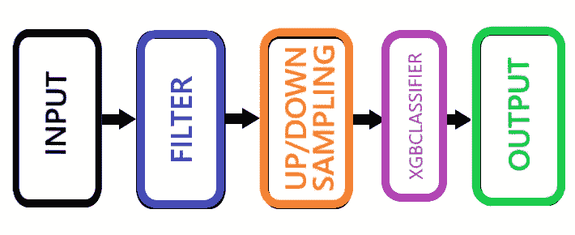
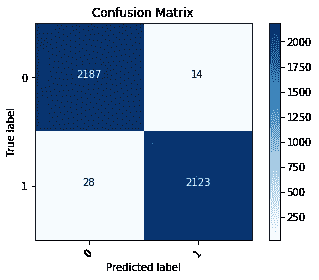
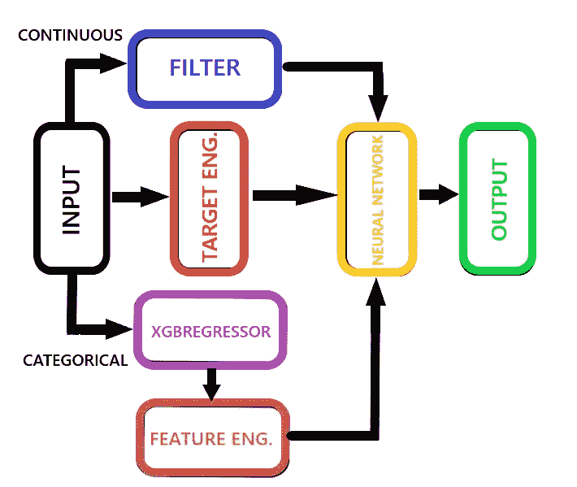
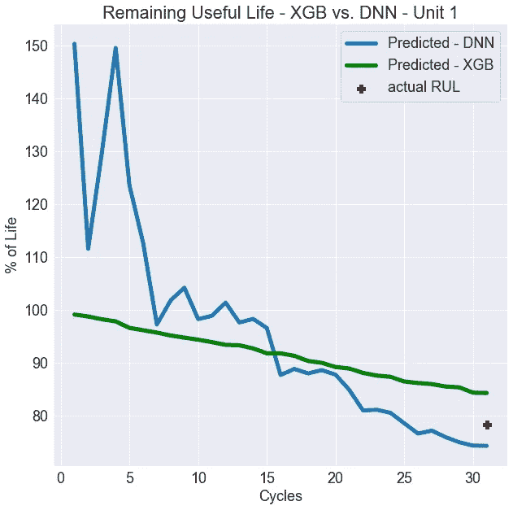

# 故障检测，即预测健康管理和测试方法

> 原文：<https://towardsdatascience.com/fault-in-the-stars-c7308ba1b840?source=collection_archive---------29----------------------->

In most cases, machines can’t tell you when they’re sick

## 机器什么时候会出故障

“预测健康管理(PHM)是对系统状态的询问，并使用潜在损坏的非破坏性评估来评估已部署系统中的产品寿命。系统健康状况通常在实际操作环境中进行评估。”

([http://cave . auburn . edu/RS rch-thrusts/proportional-health-management-for-electronics . html](http://cave.auburn.edu/rsrch-thrusts/prognostic-health-management-for-electronics.html))。

这就是 PHM 的定义，至少谷歌是这么认为的。有人称之为“故障检测”，有一段时间我确实这么叫它，直到我了解到它不仅仅是能够检测故障何时发生。它还根据收集的数据预测机器的剩余寿命。

这是一个有趣的话题，考虑到几乎每一个制造的物品或它被制造的物品都受益于知道它什么时候会出问题。随着我的兴趣被激起，我对方法做了一些研究，并在我能找到的几个数据集上进行了一些实验(由于专有信息，很难找到这样的数据)。有了这个，我想采取一些方法。首先，进入直接故障分类，然后预测剩余使用寿命(RUL)。

我还应该指出，PHM 的核心也是时间序列分析。

**故障分类**

一言以蔽之，故障分类基本上是一个二元分类问题。这种观察有错还是没有错？为了节省您的时间，我将简单介绍一下这个模型，给出一个简单的结果，并在最后贴上一个 Github 的链接。

我为这个特定模型选择的模型看起来像这样:

Fault Classification Model

只是为了突出可能不太明显的项目:

*滤镜*

我用来预处理数据的滤波器是卡尔曼滤波器。有许多论文详细介绍了所涉及的数学，但总而言之，它有助于消除传感器数据中的“噪声”。在自动驾驶汽车传感器和其他一些应用中，它被大量用于接收信息。这里有一篇关于卡尔曼滤波器[的中型文章 https://Medium . com/@ jae ms 33/understanding-Kalman-filters-with-python-2310 e 87 b8 f 48](https://medium.com/@jaems33/understanding-kalman-filters-with-python-2310e87b8f48)，Github repo 用 python 对其进行了编码。

*上/下采样*

在这种特殊情况下，不到 1%的数据实际上是错误的。像这样的问题，SMOTE 自 imblearn 库[https://unbalanced-learn . readthedocs . io/en/stable/generated/imb learn . over _ sampling。SMOTE.html](https://imbalanced-learn.readthedocs.io/en/stable/generated/imblearn.over_sampling.SMOTE.html)将从少数民族标签中随机生成新样本。

结果如下:

Precision: .99 , Recall: .99, F1: .99, CV: 95.4

**剩余使用寿命**

这一部分提出了更大的挑战。RUL 根据以前周期的数据预测机器的寿命。为此收集的数据来自 PHM 协会 2008 年的一次实际比赛。同样，查看 Github 来查看数据和完整的笔记本。

我为这个模型选择了一条更复杂的路线:

Remaining Useful Life Model

以下是不太明显的步骤:

*目标工程*

这个特殊的数据集没有现成的训练目标。所以我做了一个:

1.  利用可用的周期
2.  对每个单元进行反向排序
3.  转换成剩余寿命的百分比(重要的一步)

*xgb 回归器/特征工程* g

这两个为什么在一起？基本上，这是一个模型堆叠的例子。对于像这样的回归问题，分类数据可能是一个小烦恼。通过训练好的回归网络运行分类数据并使用这些输出作为另一个特征是有意义的。最终，它确实在损失改善方面发挥了相当大的作用。我测试了一个调优的 XGBRegressor 和一个深度神经网络。令人惊讶的是，两者的结果非常接近。

Unit 1 results — test set RMSE between 49–55

两者的结果因单位而异，有些单位的 NN 优于 XGB，反之亦然。

**外卖**

如果从这篇文章中有所收获的话，那就是我们发现的这些收获:

1.  两个数据集都没有关于所采取措施的细节——理论上，**不同类型的测量(压力、温度、振动)会有不同类型的方法，适用于适当的预处理。**
2.  仅仅从视觉上，你可以看到**神经网络是如何学习的**。最初的几次迭代偏离很远，随着它的进展，它逐渐接近目标。
3.  这个领域的机会是无限的。在给定信息的情况下，这两个模型的具体程度，可以肯定地说，任何机器和/或材料在某个时候都会有一个为其设计的模型。

关于这个主题有大量的研究，也有许多方法。我采用的方法可能不是最好的方法，我会继续研究这个课题。欢迎所有评论。感谢您的宝贵时间！

Github 位于:[https://github . com/Jason-M-Richards/Fault-Detection-Methodologies](https://github.com/Jason-Richards76/Fault-Detection-Methodologies)