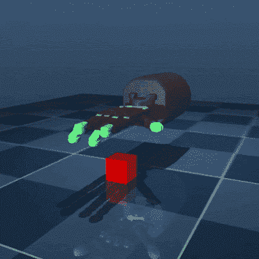

# 恐惧告诉我们必须做什么

> 原文：<https://towardsdatascience.com/fear-tells-us-what-we-have-to-do-ec016aecdbf2?source=collection_archive---------43----------------------->

## 我 2019 年 9 月 30 日至 2019 年 7 月 10 日的深度学习自学

我是一名数学讲师，也是一名有抱负的数据科学家，希望参与人工通用智能研究，本周我决定开始每周写一篇博客，记录我一直在做的事情，既是为了自己参考，也可能是为了帮助走上类似道路的其他人，遵循 fast.ai 的[雷切尔·托马斯](https://medium.com/@racheltho/why-you-yes-you-should-blog-7d2544ac1045)的建议，“写一篇能帮助你在六个月前阅读的博客。”

我有一个纯数学的硕士学位，但我没有太多的统计知识，所以我正在通过可汗学院的[“统计和概率”](https://www.khanacademy.org/math/statistics-probability)课程学习，我还通过 fast.ai 的[“程序员实用深度学习”](https://course.fast.ai/)学习深度学习。最后，我正在使用 Udemy 上何塞·波尔蒂利亚的[“数据科学和机器学习的 Python boot camp”](https://www.udemy.com/course/python-for-data-science-and-machine-learning-bootcamp/)学习 NumPy、Pandas、matplotlib 和其他数据科学的 Python 库。

在过去的几周里，我倾向于只关注其中的一个，直到我陷入困境，然后跳槽去做另外一个。对一些人来说，这种工作流程可能是高效的，但我可以感觉到自己在使用它来避免在处理困难的事情时冒出的自我怀疑的情绪，我最后提醒自己这句话:

~Steven Pressfield, The War of Art: Break Through the Blocks & Win Your Inner Creative Battles ([https://stevenpressfield.com/books/the-war-of-art/](https://stevenpressfield.com/books/the-war-of-art/))

所以上周，我为每周的每门课程设定了具体的学习目标。我认为避免我在自己身上观察到的两种次优学习行为会更容易:完全避免困难的事情，而选择简单的事情，或者——在有用性钟形曲线的另一端——在困难的事情上花费太多时间，在其他事情上毫无进展。用机器学习的术语来说，我需要把我自己的学习速率调得更高，以避免陷入局部最小值！

每周，我计划做:
一堂来自 fast.ai 的课
一个单位的统计数据
Python 课程的 0.5–1 个部分(一些部分是简短的，其他部分是完整的项目)
阅读一篇深度或机器学习论文

当我真的不想做某件事时，我会使用[番茄工作法](https://en.wikipedia.org/wiki/Pomodoro_Technique):我只要求自己做 25 分钟，然后我可以停下来或者休息一下。前 25 分钟几乎总能让我克服情绪上的阻力，之后我会更容易坚持下去。这个技巧也帮我完成了研究生期间的家庭作业！

所以上周，我做了 fast.ai 的“程序员实用深度学习”第四课，你可以在这里详细阅读我的经验。
我还学习了可汗学院统计学课程的“探索双变量数据”和“研究设计”单元，学习如何计算和解释最小二乘回归线，以及实验研究和观察研究。

在 Udemy 上的“Python for Data Science and Machine Learning boot camp”课程中，我完成了第 5-7 节，复习了我在 Coursera 上的 Deep Learning . ai[“Deep Learning”](https://www.coursera.org/specializations/deep-learning)课程中学到的 NumPy 语法，并练习了用 Pandas 查询数据。我以前学过一些 SQL，但没有意识到 Pandas 和 SQL 有多少共同点。然后我开始想知道什么时候一个比另一个更好用，并发现这个帖子非常有帮助:

> 使用哪种工具取决于你的数据在哪里，你想用它做什么，你自己的优势是什么。如果您的数据已经是一种文件格式，就没有必要使用 SQL 做任何事情。如果您的数据来自数据库，那么您应该通过以下问题来了解您应该在多大程度上使用 SQL。
> 
> ~*《SQL 与熊猫》(*[*https://towardsdatascience.com/sql-and-pandas-268f634a4f5d*](/sql-and-pandas-268f634a4f5d)*)作者凯丽·史密斯*

我选择阅读的论文——[“用好奇心驱动的深度强化学习学习温和的物体操纵”](https://arxiv.org/abs/1903.08542)——来自 [DeepMind](https://deepmind.com/) ，作者是 Sandy H. Huang、Martina Zambelli、Jackie Kay、Murilo F. Martins、Yuval Tassa、Patrick M. Pilarski 和 Raia Hadsell。你可以在这里 [查看我做的笔记和我阅读时的疑问](https://github.com/g0g0gadget/Papers-Read/blob/master/Learning%20Gentle%20Object%20Manipulation%20With%20Curiosity-Driven%20(notes)...-merged.pdf).)[。这项工作围绕着使用深度强化学习来教机器人轻轻地处理物体。](https://github.com/g0g0gadget/Papers-Read/blob/master/Learning%20Gentle%20Object%20Manipulation%20With%20Curiosity-Driven%20(notes)...-merged.pdf)

这是我第一次阅读深度或机器学习论文，事实证明这是一个非常棒的选择。即使对于外行人来说，整体想法也是直观的，更好的是，实际实验的[模拟和视频](https://sites.google.com/view/gentlemanipulation)使得方法和结果易于理解。但是当我阅读的时候，我仍然有很多问题，并且学到了很多。

在这篇论文之前，我没有读过多少关于强化学习的东西，我不明白它会有什么帮助。奖励？处罚？为什么？为什么都是？我不明白为什么一个机器人执行一项特殊的任务需要“奖励”，更不用说“痛苦惩罚”了。现在看来很明显，我明白了，但这确实是该项目的“学习”方面:如果我们提前知道机器人应该使用多少力来处理一个物体，我们就完成了。但是，如果我们希望能够让机器人处理一个它以前从未遇到过的物体，而不必为它采取的每个动作指定一个力的大小，我们必须有一种方法让它知道它什么时候做对了。

当学习者的一个实例(“代理”)被训练与一个物体接触时只有奖励，它会经常过度用力。然而，只对过度用力进行惩罚的训练，会导致代理人完全避免与物体接触。受儿童发展研究的启发，作者为一个代理人设立了一个奖励，当它预测到它应该不正确地使用*的力量时，以真正的金发女孩的方式，三种奖励类型的组合是赢家。代理人对疼痛惩罚感到“好奇”,并试图探索不同的力量来找到“恰到好处”的力量。*

*很难表达这篇论文读起来有多有趣，以及瞥见人类心理学如何被用来推进人工智能是多么令人着迷。我们称之为人工“智能”，因为我们明确理解这种体贴是人类的努力，但令人难以置信的是，它是如何实际实现的。*

*我是加州大学东湾分校的数学讲师，也是一名有抱负的数据科学家。在 [LinkedIn](https://linkedin.com/in/laura-langdon/) 上和我联系，或者在 [Twitter](https://twitter.com/laura_e_langdon) 上和我打招呼。*