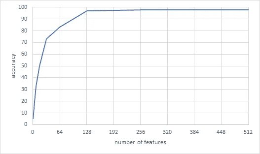

# 使用 SVM 权重的特征消除

> 原文：<https://towardsdatascience.com/feature-elimination-using-svm-weights-c287c16a5151?source=collection_archive---------23----------------------->

## 特别是对于 SVMLight，但是这种特征消除方法可以用于任何线性 SVM。



Figure 1: a random example of accuracy based on the number of SVM features used.

大约在 2005 年至 2007 年，我在写硕士论文时，不得不根据 SVM 模型计算特征权重。这是在 2007 年开始的 SKlearn 之前。这个想法是基于算法认为影响最小的特征来迭代地删除冗余特征，看看我们可以在不牺牲性能的情况下删除多少。今天，您可以在 SKlearn 和其他包中轻松地选择这些类型的特性，但是，如果您坚持使用 SVMLight，您可以使用下面的代码。总的来说，这种方法今天仍然有效。

当时我们有两个选择，SVMLight 或者 LibSVM。我选择了 SMLight。Thorsten Joachims 发布了一个 Perl 脚本来计算 SVM 重量，但我使用的是 python，我用 Python 重写了他的脚本，他还在他的网站上放了一个[下载链接](http://www.cs.cornell.edu/people/tj/svm_light/svm2weight.py.txt)。

可以在这里找到 Perl 脚本原文：<http://www.cs.cornell.edu/people/tj/svm_light/svm_light_faq.html> 和 Python 脚本:[http://www . cs . Cornell . edu/people/TJ/SVM _ light/SVM 2 weight . py . txt](http://www.cs.cornell.edu/people/tj/svm_light/svm2weight.py.txt)

使用该脚本将获得所有要素的权重。这在以后非常有用，正如您在下面的伪代码中看到的，您可以系统地消除功能:

1.  K = 50%
2.  在对所有当前特征进行训练之后，选择具有最高 SVM 权重 s 的 K 个特征和具有最低(最负)SVM 权重的 K 个特征
3.  再培训
4.  基于看不见的数据集测量准确性
5.  迭代:转到 2。当没有更多功能可供选择时停止。
6.  选择如图 1 所示的最佳“弯头”。在本例中，重点是 128 个特征允许您获得与所有特征相同的精度。

**您会注意到，仅使用您的特征子集就可以获得更高的预测结果。这是特征选择的本质。**

```
# Compute the weight vector of linear SVM based on the model file
# Original Perl Author: Thorsten Joachims (thorsten@joachims.org)
# Python Version: Dr. Ori Cohen (orioric@gmail.com)
# Call: python svm2weights.py svm_modelimport sys
from operator import itemgettertry:
    import psyco
    psyco.full()
except ImportError:
    print 'Psyco not installed, the program will just run slower'def sortbyvalue(d,reverse=True):
    ''' proposed in PEP 265, using  the itemgetter this function sorts a dictionary'''
    return sorted(d.iteritems(), key=itemgetter(1), reverse=True)def sortbykey(d,reverse=True):
    ''' proposed in PEP 265, using  the itemgetter this function sorts a dictionary'''
    return sorted(d.iteritems(), key=itemgetter(0), reverse=False)def get_file():
    """
    Tries to extract a filename from the command line.  If none is present, it
    assumes file to be svm_model (default svmLight output).  If the file
    exists, it returns it, otherwise it prints an error message and ends
    execution.
    """
    # Get the name of the data file and load it into
    if len(sys.argv) < 2:
        # assume file to be svm_model (default svmLight output)
        print "Assuming file as svm_model"
        filename = 'svm_model'
        #filename = sys.stdin.readline().strip()
    else:
        filename = sys.argv[1] try:
        f = open(filename, "r")
    except IOError:
        print "Error: The file '%s' was not found on this system." % filename
        sys.exit(0) return fif __name__ == "__main__":
    f = get_file()
    i=0
    lines = f.readlines()
    printOutput = True
    w = {}
    for line in lines:
        if i>10:
            features = line[:line.find('#')-1]
            comments = line[line.find('#'):]
            alpha = features[:features.find(' ')]
            feat = features[features.find(' ')+1:]
            for p in feat.split(' '): # Changed the code here.
                a,v = p.split(':')
                if not (int(a) in w):
                    w[int(a)] = 0
            for p in feat.split(' '):
                a,v = p.split(':')
                w[int(a)] +=float(alpha)*float(v)
        elif i==1:
            if line.find('0')==-1:
                print 'Not linear Kernel!\n'
                printOutput = False
                break
        elif i==10:
            if line.find('threshold b')==-1:
                print "Parsing error!\n"
                printOutput = False
                break i+=1
    f.close() #if you need to sort the features by value and not by feature ID then use this line intead:
    #ws = sortbyvalue(w)    ws = sortbykey(w)
    if printOutput == True:
        for (i,j) in ws:
            print i,':',j
            i+=1
```

Ori Cohen 博士拥有计算机科学博士学位，专注于机器学习。他领导着 Zencity.io 的研究团队，试图积极影响市民的生活。