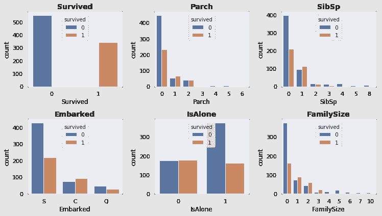

# 泰坦尼克号数据集的特征工程和算法精度

> 原文：<https://towardsdatascience.com/feature-engineering-and-algorithm-accuracy-for-the-titanic-dataset-5891cfa5a4ac?source=collection_archive---------18----------------------->

机器学习最流行的数据集之一对应于泰坦尼克号事故

在这里，我们正在处理这个数据集中的特征，试图发现选择不同的特征对一些基本的最大似然算法的准确性的影响。这些特征对应于数据的头部


the head of the dataset (first 5 rows)

数据集显示了一名乘客是否幸存(1)以及在几列中对该乘客的描述，如他的阶级(Pclass)、年龄等。下表[(从 kaggle 中提取)](https://www.kaggle.com/c/titanic)对这些特性进行了描述:


我们做的第一个图形探索性分析显示了特征之间的一些关系


我们可以为一些特殊的功能关闭它，例如 SibSp 和 Parch


这幅图描述了一个乘客是否幸存，基于他/她同行的家庭成员的数量。不过，他的关系并不清楚。

我们建议在随机森林分类器下传递这些特征，以更好地理解它们对存活率的影响:


结果并不清楚，这就是为什么我们创造了新的功能，如“孤独”或“家庭大小”。

下一个图显示了这些特征对幸存乘客数量的影响:



同样，我们可以探讨年龄和阶级之间的关系:


然而，当我们再次训练一个**随机森林算法时，这种关系更加清晰。**下一个图显示了基于乘客年龄和阶级的存活率


Before grouping Age feature

这很好，但是，为年龄创建更小的组，算法显示出更好的洞察力:


After grouping Age feature

这种表示更清楚，因此我们期望在年龄列中使用较小的组(而不是连续值)的学习算法会有更好的结果

此外，我们还可以检查新功能是否为我们未来的模式增加了价值:


这不是很清楚，所以我们也可以评估所有特征的熵，并删除这些可能产生比价值更多的噪声的列:

```
Survived column entropy : 0.96
Pclass column entropy : 1.44
Age column entropy : 1.4
SibSp column entropy : 1.34
Parch column entropy : 1.13
Fare column entropy : 1.61
FamilySize column entropy : 1.82
IsAlone column entropy : 0.97
Age*Class column entropy : 2.14
female column entropy : 0.94
male column entropy : 0.94
C column entropy : 0.7
Q column entropy : 0.42
S column entropy : 0.85
```

**训练模特**

我们测试了 4 个选项，第一个是在功能没有任何变化的情况下进行的训练(即，没有上述部分的工作):


No features, we use only the columns of the original data

下一次尝试包括了第一部分中创建的所有功能:


accuracy of model with **all features**

接下来，我们只包括那些用熵< 2, that is droping those columns that maybe add more noise than value


Feature with **entropy < 2**

it seems that the global accuracy of all the models is increasing

Next, we select only those features with entropy < 1,5 :


Feature with **entropy < 1,5**

It seems this feature combination give the better accuracy for all the algorithms

**训练 KNN** 的特征

另一点，例如，当训练一个有几个邻居的 KNN 时，结果取决于定义的特征。

我们绘制了几个邻居的 KNN 的精确度:


该图清楚地显示了定义要素将如何改变算法的输出，甚至是在选择其参数之前(例如，KNN 的邻域数)

这个“*实验*的代码在这里:

[](https://www.kaggle.com/felipesanchezgarzon/eda-feature-engineering-comparison-ml-accuracy) [## EDA，特征工程比较=> ML 精度

### 使用泰坦尼克号的数据:灾难中的机器学习

www.kaggle.com](https://www.kaggle.com/felipesanchezgarzon/eda-feature-engineering-comparison-ml-accuracy) 

**感谢阅读！！！**

> 如果你想继续阅读这样的故事，你可以[在这里订阅！](https://fesan818181.medium.com/membership)