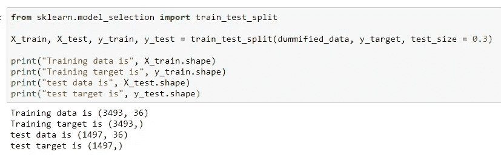

# 使用超市销售数据的特征工程和数据准备

> 原文：<https://towardsdatascience.com/feature-engineering-and-data-preparation-using-supermarket-sales-data-part-2-171b7a7a7eb7?source=collection_archive---------12----------------------->

**续。从** [**利用超市销售数据进行探索性数据分析。第一部分。**](https://link.medium.com/xAwDKWDqUV)

在上一篇 [**文章**](/exploratory-data-analysis-feature-engineering-and-modelling-using-supermarket-sales-data-part-1-228140f89298) 中，我们对超市销售数据集进行了基本的数据探索。我们将在这一部分使用这些重要的见解和发现。我建议你在这里查看第一篇文章**，这样我们就在同一页上了。**

**在开始之前，让我们了解什么是特征工程，以及我们为什么要这样做。**

**我相信我应该首先定义什么是特性，所以开始吧；**

**特征仅仅是原始数据的一个方面的表示，一些作者也称之为属性。例如， **Product_Weight、Product_Type、**和 **Product_Price** 是我们超市数据中的一些特征。这些特征可以是数字或分类的，最后必须转换成数字格式(机器学习模型可以使用的唯一类型)。**

**现在，让我们定义特征工程；**

**特征工程是从原始数据中提取重要特征并将其转换为适合机器学习模型的格式的行为。为了进行功能工程，数据科学家必须使用领域知识(关于特定领域的知识)、数学和编程技能来转换或提出新的功能，以帮助机器学习模型更好地执行。**

**特征工程是机器学习的一个非常广泛和实用的领域，我建议你查阅一些关于这个主题的书籍或课程，因为这篇文章只是触及了表面。下面列出了一些链接。**

**有了这些基本知识，让我们开始研究超市数据。在这篇文章的最后，我们将有一个干净的数据集，我们可以扔进任何机器学习模型。**

**首先，让我们实现上一篇文章(数据探索)中的所有发现。**

> **新特征创建**

****

**code for **is_normal_fat** feature creation**

**代码解释:**

**代码片段 1:我们首先打印出 Product_Fat_Content 列中唯一的类，这样我们就知道正确的类别及其拼写。**

**代码片段 2:我们创建一个字典，并将类别映射到二进制类。
低脂肪和超低脂肪为 0 级，而正常脂肪为 1 级。
其次，我们使用 pandas map 函数将 Product_Fat_Content 中的值映射到我们创建的字典中的类。**

**代码片段 3:我们确认我们有类(0 和 1)**

**代码片段 4:打印出两个类中的点数。**

**我们建议创建的第二个功能是一个列，该列捕获具有*(低价)正常脂肪的产品和具有*(高价)低/超低脂肪的产品的价格。
现在，再次将正常脂肪从其他两类中分离出来会给我们一个多余的特征，因为我们已经在之前的特征(is_normal_fat)中将它们分离出来了。所以我们跳过这个特征创建。****

****第三个被提议的特性是一个捕获开业年份的列。此功能将 S***super market _ Opening _ Year***分为 90 年代和 2000 年代。****

****我们创建这个列，如下所示。****

********

****代码片段 1:一个简单的函数，将年份作为参数，如果小于 1996，则返回 0，否则返回 1。****

****代码片段 2:我们使用 pandas apply 方法**创建特性 **open_in_the_2000s** 。我们**将函数(cluster_open_year)应用于**超市 _ 开业 _ 年份中的每个值。******

****3:新列的预览。****

****第四个建议的特性是将产品类型分为两类。类别 1 将包含**家庭、健康卫生、**和**其他**类别，而类别 0 将包含其余类别。****

****让我们在下面创建它。****

********

****代码片段 1:这里我们获得了 **Product_Type** 列中的唯一类别，然后删除了属于类别 1 的类别。****

****代码片段 2:我们创建了一个简单的函数，如果 **Product_Type** 是类 0，则返回 0，否则返回 1。****

****代码片段 3:我们应用我们的函数来创建新列 **Product_type_cluster。******

******转换倾斜特征******

****在我们的 EDA 过程中，我们发现**产品 _ 超市 _ 销售**和**产品 _ 货架 _ 可见性**是右偏的，我们建议将它们转换成正态分布。****

********

****代码片段 1:我们创建了一个 1 行 2 列的子图来保存转换前后的图，这样我们就可以比较变化了。****

****代码片段 2:在轴 1 中绘制普通的 Product_Supermarket_Sales 特性。****

****代码片段 3:使用 *numpy 的* **np.log1p( )** 函数对特征进行日志转换。该函数在应用对数函数之前将变量加 1。然后我们在第二个轴上绘制新的变换特征。****

****代码片段 4:用 tight_layout()参数在两个轴之间添加空格，并添加一个标题。****

********

****当我们运行上面的代码时，我们注意到对数转换使特征**Product _ Supermarket _ Sales**更接近正态分布，这是更好的，并且主要是由统计学家鼓励的。如果想知道为什么统计学家喜欢正态分布，请点击这里。****

******接下来，让我们转换产品 _ 货架 _ 可见性******

********

****代码与前者非常相似，但是这里我们转换了 Product_Shelf_Visibility。****

****运行代码，我们得到以下结果…****

********

****当我们应用对数变换时，这个特性没有显著的变化。这是因为这些值大多接近于零。像这样转换特性的高级方法是存在的，但是在这篇文章中我们将坚持使用它。****

## ******处理分类特征******

****接下来，我们将处理所有的分类列，但是首先，让我们解释一些重要的概念，它们将帮助我们正确地处理这些特性。****

******分类编码，是什么？******

****分类变量用于表示类别或类。例如，我们数据集中的 **Product_Type** 列是一个分类变量，有 3 个类别(低脂肪、超低脂肪和正常脂肪)。****

****分类编码是用于将非数字特征/变量转换成数字的方法。执行分类编码有多种方法，但这可能取决于我们正在处理的分类变量的类型。
在进行编码之前，我们通常考虑的两种范畴类型是序数和非序数/名词性范畴。在选择编码方案之前，理解这两种类型之间的区别是很重要的。我们先来了解一下他们。****

******序数范畴:**这些是可以按数量顺序排列的范畴。也就是说，我们可以以这样一种方式安排这些类，使得一个类可以比另一个类具有更大的幅度。例如，我们数据集中的特征 **SuperMarket_Size** 是一个有序分类，因为分类标签 **High** 大于 **Medium** ，后者又大于 **Small** 。因此，如果我们对这些特征进行编码，我们肯定应该给**高**类分配一个更大的类号。****

****{高:3，中:2，小:1}****

****这些类别在数量上没有有意义的差别。即一个类别标签不大于另一个。例如，在 feature **Product_Type** ，**，*软饮料*，**不大于**，*家用*，**健康与卫生**，，**类也不大于**，*日记*，**类。****

******现在让我们来谈谈一些类型的编码**
**对于具有少量类别的分类特征的编码，通常少于 20 个******

******一热编码:**在一热编码中，我们用一组比特来表示一个类，其中一个特定时间只能激活一个类。考虑我们数据集中的特征**Supermarket _ Location _ Type**，该特征有三个类(分类 1、分类 2 和分类 3)。我们可以使用如下所示的三位对该特性进行一次性编码。****

********

****在这里，我们可以看到我们使用了 3 位，一次只能激活一个类。****

******哑元编码:**哑元编码与单热编码相同，唯一的区别是在哑元编码中，我们比单热编码少用一位。也就是说，我们有一个全是 0 位的类。区别是微妙的，两种方法可以互换使用。****

******具有大量类别的分类特征的编码，通常大于 20 个******

*   ******标签编码:**在标签编码中，我们简单的给每个类别分配整数，比如 1 到 n (n =类别数)。这通常会产生可订购的功能。****
*   ******注意:**一些机器学习模型，如树或线性模型，可以很好地执行这种类型的编码，因为树不处理数据点的大小。但这将影响神经网络和基于距离的模型，如 KNN，它考虑了数据点的数量。****

****其他先进但有效的编码方案是嵌入、特征散列和容器计数。****

****现在，让我们看看我们的分类特征和它们的独特类别。****

********

****类别数最多的列是 Product_Type 列(15)。****

****根据我们对上述编码方案的理解，我们可以使用 one-hot-encoding 方案，因为我们的数据很小(大约 5000 个),唯一类别也很小。****

****对于 Python 中的 one-hot-encoding，我们将使用 pandas 中可用的虚拟函数。这是一个简单的方法，我们只需要调用**。getdummies()** 方法并传入我们想要编码的数据帧。****

********

******处理缺失值******

****在清理和转换数据时，另一件重要的事情是处理丢失的值。这意味着我们可以删除丢失的值或者填充它们。****

********

****首先，我们将使用熊猫 **isnull()** 函数打印出每一列中缺失值的数量。****

****请注意，列的数量急剧增加，这是由于我们之前进行的一次性编码。一种热编码使用分类列的唯一类创建新要素。****

****从输出中，我们看到唯一缺少值的特性是 **Product_weight** 列。****

****在 **4990** 中有 **802** 个缺失值，我们将使用平均值来填充这些缺失值。****

******注意:**除了仅使用平均值，还有其他填充或处理缺失值的方法。**sci kit learn**(python 中的一个机器学习包)有一个叫做**的模块，用于自动处理缺失值。但是因为我们只有一列缺少值，所以我们将手动执行填充。******

********

****code for filling missing values****

****代码片段 1:我们使用 pandas mean()函数计算平均值。****

****代码片段 2:我们使用 pandas***fillna***方法用我们计算的平均值自动填充每个缺失值。 ***inplace = True*** 表示对原始数据集进行操作。****

****最后，我们预览我们的变化。在这里，我们看到我们不再有丢失的值。****

****咻…我们的数据几乎准备好建模了。我们将执行最后两个重要的步骤:创建我们的**系列**和**测试**测试集和 f **特征标准化/缩放。******

******将我们的数据分为训练集和测试集******

****我们通常把数据分成三组。训练集、测试集和验证集。我们使用训练集来训练我们的模型，在每轮训练后使用测试集来评估我们的模型，并在项目结束时使用最终验证集来最终评估我们的模型。****

****最终的验证集很重要，因为在训练和测试的过程中，模型开始学习测试集，并且会不断地做得更好。****

****这是不好的，因为我们可能最终认为我们的模型会概括得很好，而实际上它只是记住了训练和测试集。因此，建议只在建模的最后使用验证集。****

****我们将使用 **scikit-learn** 中一个流行的函数 **train_test_split** 来拆分我们的数据。****

********

****code to split data into train and test sets****

****首先，我们导入函数 train_test_split，然后传递四个变量****

1.  ****X_train:训练数据****
2.  ****X_test:测试数据****
3.  ****y_train:培训目标****
4.  ****y_test:测试目标****

****在 **train_test_split** 函数中，我们传递想要分割的数据和目标，然后指定分配给测试数据的数据数量(0.3 = > 30%的数据)****

****最后，我们检查新数据的形状。****

******注意**:X _ train 和 y_train 的第一个尺寸必须相同。****

****最后，我们将数据标准化****

******特征标准化/缩放******

****特征标准化/缩放用于将独立特征的值的范围标准化为大致相同的范围。这一点很重要，因为数据集的各个特征的值的范围变化很大，这可能导致大多数机器学习模型表现不佳。****

****例如，在我们的数据集中，特征**超市 _ 开业 _ 年份**的值的范围在 1992 年和 2016 年之间，而特征 Product_Shelf_Visibility 的值的范围以(0-0.4)为中心。这两个特性的取值范围非常不同，应该标准化。****

****当我们使用指定的方法进行规范化时，这些值被转换到相同的范围，有时在(0 和 1，-1 和 1 或最小值和最大值)之间****

****我们将使用[**robust scaler**](https://scikit-learn.org/stable/modules/generated/sklearn.preprocessing.RobustScaler.html#sklearn.preprocessing.RobustScaler)**模块中的 [**Scikit learn**](https://scikit-learn.org) 来执行本项目中的归一化。其他可用的归一化方法有[最小最大缩放器](https://scikit-learn.org/stable/modules/generated/sklearn.preprocessing.MinMaxScaler.html#sklearn.preprocessing.MinMaxScaler)、[、**规格化器**、](https://scikit-learn.org/stable/modules/generated/sklearn.preprocessing.Normalizer.html#sklearn.preprocessing.Normalizer)[、**标准缩放器**、](https://scikit-learn.org/stable/modules/generated/sklearn.preprocessing.StandardScaler.html#sklearn.preprocessing.StandardScaler)[、**最大最小缩放器**、](https://scikit-learn.org/stable/modules/generated/sklearn.preprocessing.MaxAbsScaler.html#sklearn.preprocessing.MaxAbsScaler)等等******

************

******首先，我们从 **sklearn.preprocessing** 导入 RobustScaler 包，然后我们从它创建一个对象。******

******其次，我们拟合我们的训练数据(X_train)。拟合过程是函数学习它将用于转换训练、测试和(如果可用的话)验证数据的所有度量的过程。******

******接下来，我们使用计算出的指标在 X_train 和 X_test 上执行实际的转换。******

******最后，我们打印新转换的数据的形状。******

********注意:**只适合你的训练数据！******

************

******咻…我们的数据终于可以用于建模了！******

******在这篇文章中，我们已经从探索性的数据分析转向实际的特征创建和清理。我们创建了新的要素，处理了缺失值，分割了数据，并执行了标准化。******

******我们在这里所做的一切都可以归类到数据准备之下，这是任何数据分析项目中最耗时的部分。******

******在[的下一篇](/creating-machine-learning-models-b48bb72a791f)中，我们将使用这些干净的数据为 [**建模**](/creating-machine-learning-models-b48bb72a791f) 。******

# ******所以，去做一些功能创建和清理的乐趣。再见了。******

*******本项目的笔记本和资料可以在* [***这里***](https://github.com/risenW/medium_tutorial_notebooks/blob/master/supermarket_regression.ipynb) 找到******

> ******问题，评论和贡献总是受欢迎的。******

> ******在 [**twitter**](https://twitter.com/risingodegua) **上和我联系。********
> 
> ******在[**insta gram**](https://www.instagram.com/rising_developer/)**上跟我连线。********