# Kaggle“房价竞赛”前 10 名的特征工程和集合模型

> 原文：<https://towardsdatascience.com/feature-engineering-and-ensembled-models-for-the-top-10-in-kaggle-housing-prices-competition-efb35828eef0?source=collection_archive---------8----------------------->

## 我们一步一步地详细说明开发回归模型的程序，以便在这场全球竞赛中进入“前 10 名”。


Photo by [Jesse Roberts](https://unsplash.com/@jesseroberts?utm_source=medium&utm_medium=referral) on [Unsplash](https://unsplash.com?utm_source=medium&utm_medium=referral)

aggle 是数据科学家和机器学习者最重要的在线社区之一。在 [Kaggle](https://www.kaggle.com/) 中，经常可以找到比赛，不同的用户生成预测模型并提交他们的结果，根据分数在排行榜中排名。

支持每个初学者进行的在线课程的竞赛是“[Kaggle Learn 用户房价竞赛](https://www.kaggle.com/c/home-data-for-ml-course)”。

因此，全球和以学习为导向的能力，网上流通的材料是丰富的，甚至对于那些看起来很好的人来说，可以直接找到优秀模型的完整代码，这些代码在记分牌上非常接近 1%。

本文基于 Kaggle 中 [Sandeep Kumar](https://www.kaggle.com/sandeepkumar121995) 曝光的代码。这个[代码](https://www.kaggle.com/sandeepkumar121995/blending-of-6-models-top-10)是我们在比赛中最重要的起点。虽然单凭这段代码不足以进入前 10 名，但它使用了许多令人兴奋的技术。除了这里使用的方法之外，我们还添加了其他方法，使我们的模型进入了前 10 名。

因为当你开始尝试提高 1%以内时，每个细节都很重要，所以你需要非常有条理和彻底地处理数据工程和模型参数。

# 数据集和工作流

该数据集包含 1460 行房屋及其相应的 79 个要素和目标变量:每栋房屋的价格。还有一个测试集，有 1459 个其他的房子。

在本文中，我们将对我们将要应用的不同技术进行统一处理，并在实现最终预测以提高结果之前将它们分开。

数据集的工作流将

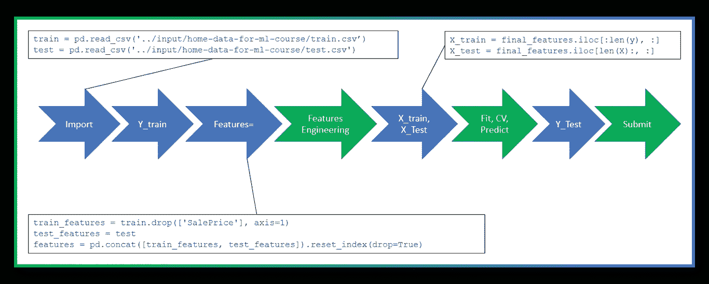

a)导入训练特征和测试特征数据。

b)保存并删除索引(Id ),准备不带目标变量的训练特征

c)创建连接它们的数据框“特征”

d)执行数据工程

e)在完成数据工程工作后，再次分割 X_train 和 X_test 数据集。

f)制作模型、拟合和预测

g)如果我们对目标变量(Y)应用任何变换，我们必须在预测上反转这个变换。

h)提交结果

# 目标变量:销售价格

我们正面临一个回归练习，我们必须计算每栋房子的销售价格，数据集的每一行。

我们的目标是列 SalePrice，首先，让我们看看它的一般行为:

```
train['SalePrice'].describe()
```

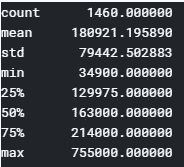

现在让我们看看它在任何直接使用它的模型中的实践，或者对它应用对数。

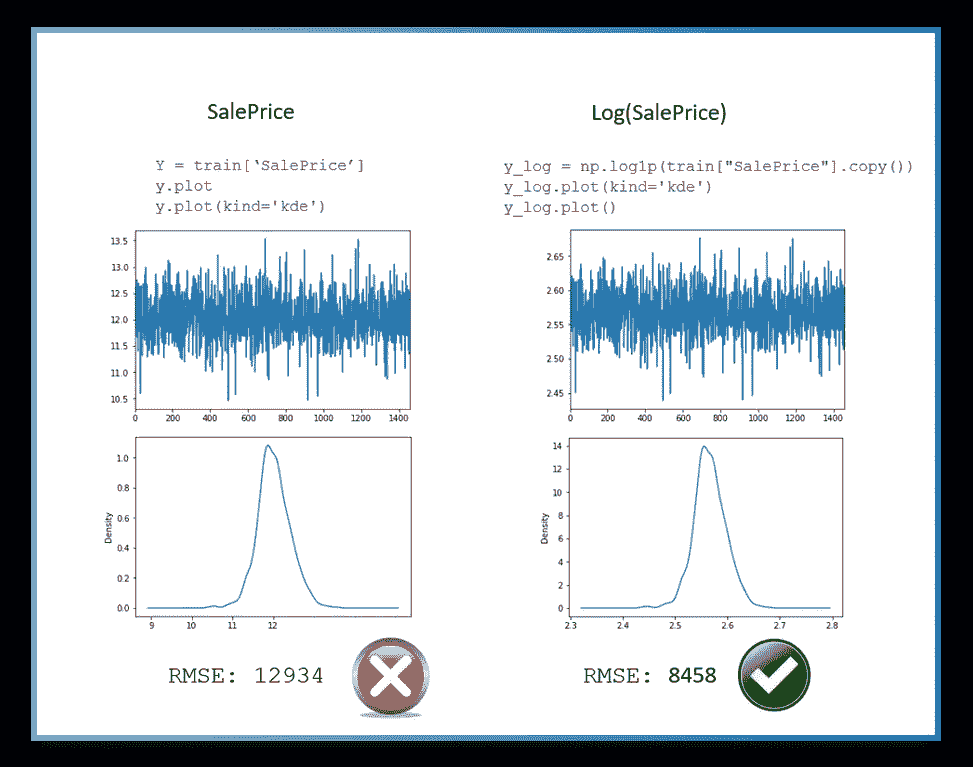

因此，我们看到，如果我们改变模型训练，将目标变量的对数而不是“销售价格”直接作为结果，那么从 12934 到 8458 的改进是显著的。

# 特征工程

## 与目标变量的相关性

> 相关性的目的是检查两个定量变量之间关联的方向和强度。因此，我们将知道它们之间关系的强度，以及当一个变量的值增加时，另一个变量的值是增加还是减少。”

如果你想知道更多关于变量和目标变量相关性的发生率，你可以回顾这一期的详细分析。

我们将创建一个包含数字列的数据框，并对它们应用 Pandas“corr()”方法，然后评估销售价格目标:

```
data_corr = train.select_dtypes(include=[np.number])
data_corr.head()
```

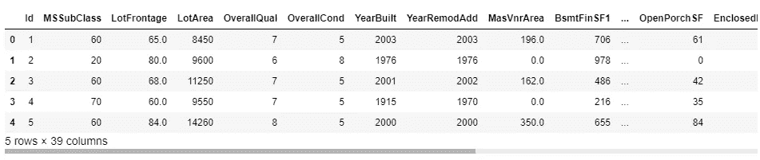

```
corr = data_corr.corr()
corr.head(20)
corr.sort_values(['SalePrice'], ascending=False, inplace=True)
corr['SalePrice']
```

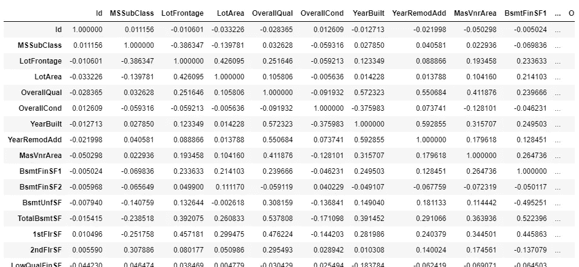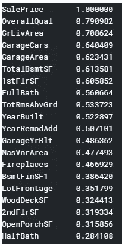

这里我们有一个与目标变量相关的变量的有序列表，随着我们使用与目标变量越来越不相关的变量，模型精度的提高可能会被认为是降低的。

## 数据集中的异常值

> “…异常值会显著影响估计统计数据的过程(*，例如*，样本的平均值和标准偏差)，从而导致高估或低估值。因此，数据分析的结果在很大程度上取决于缺失值和异常值的 processed…"⁴方法

在引用这段话的[文章](https://www.ncbi.nlm.nih.gov/pmc/articles/PMC5548942/)中，可以深入找到关于异常值处理的优秀概念。

让我们以 GrLivArea 为例，它是与价格相关性最高的变量之一。

为了可视化异常值，我们通常使用箱线图。

这里有一篇关于箱线图和离群点 detection⁵的使用的优秀文章，以及他的主要特点:

*   箱线图有从 LQ 到 UQ 的方框，中间标有
*   它们描绘了数据最小值、LQ、中值、UQ、最大值的五个数字的图形摘要
*   帮助我们了解数据分布
*   帮助我们轻松识别异常值
*   25%的人口低于第一个四分位数，
*   75%的人口低于第三个四分位数
*   如果盒子被推到一边，而一些值离盒子很远，那么这是异常值的明显迹象

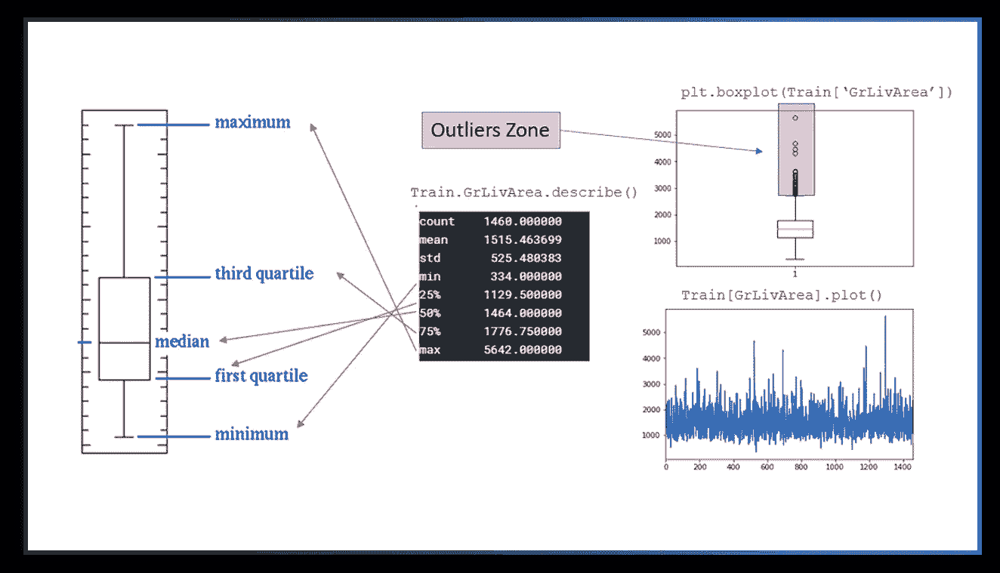

我们使用整个训练集对任何模型进行检查，剔除大于 4500 的异常值和大于 4000 的异常值，获得以下值

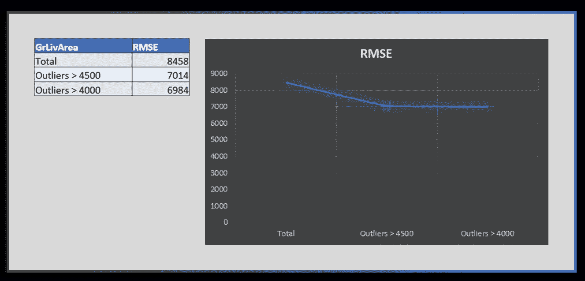

在 4000 或 4500 切割之间的性能差异似乎并不显著；然而，当 slice GrLivArea 寄存器大于 4500 时，精度的提高是相当可观的。

原则上，根据训练数据，这似乎是一个合适的策略。尽管如此，还是有必要在模型的入口中寻找一个平衡，因为它可能会产生过度拟合，或者使我们的模型失去泛化的可能性。

## 删除不必要的列并填充空值

如果我们使用此代码在这些操作之前和之后在数据框中部署空值，我们将获得如下图所示的图形。

```
import matplotlib.pyplot as plt
import seaborn as sns
plt.figure(figsize=(12, 6))
sns.heatmap(features.isnull())
plt.show()
```

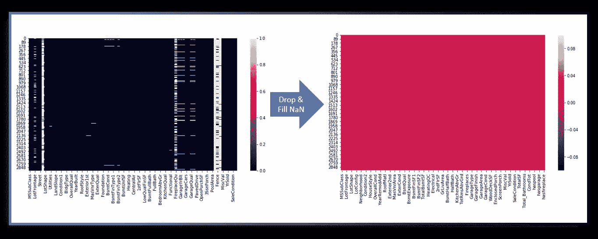

请记住，在输入模型之前，必须清除所有的空值。

这些数据中的许多我们已经知道我们不打算精确化它们，或者填充空值的尝试对它们来说是不可行的；我们直接应用柱的下降。

```
features.drop(['Street'], axis=1, inplace=True)
features.drop(['Fence'], axis=1, inplace=True)
```

填充缺失数据的日常用法是用“无”或“零”来填充，这取决于数据的类型。

让我们在这里看两个例子来分配最频繁的值(Pandas mode 函数)或如何应用整个列或一组列的平均值。

这些示例仅用于说明目的；您可以应用任何 Pandas 函数，并根据您想要组成集群的任何属性进行分组。它还可以用于创建“集群”类型的新功能。

**示例 a** :应用最频繁的 MSZoning 值，为每个 MSSubClass 分组

```
features['MSZoning'] = features.groupby('MSSubClass')['MSZoning'].transform(lambda x: x.fillna(x.mode()[0]))
```

**例 b** :应用为每个街区分组的地段临街面的平均值

```
features['LotFrontage'] = features.groupby('Neighborhood')['LotFrontage'].transform(lambda x: x.fillna(x.median()))
```

**例 c** :用最频繁的量来完成你的特色

```
features['Exterior1st'] = features['Exterior1st'].fillna(features['Exterior1st'].mode()[0])
```

最后，我们必须确保没有空值，以便我们可以根据列的类型将填充应用于无或零:

```
objects = [col for col in features.columns if features[col].dtype == "object"]
features.update(features[objects].fillna('None'))numerics = [col for col in features.columns if features[col].dtype in np.number]
features.update(features[numerics].fillna(0))
```

## 根据他人创造变量

您可以创建新的变量来添加有助于模型定义数据集的特定信息，或者通过创建平均值、总和或布尔变量来简化模型。

必须仔细选择这些变量中的每一个，并且必须测量对模型的影响，以查看它是否增加了结果的质量，并且在用于“简化”的情况下，如果被消除的列的损失不影响模型的准确性。

```
features['CondTot'] = (features['Condition1'] + features['Condition2']) / 2features['OverTot'] = features['OverallQual'] + features['OverallCond']features['TotalSF'] = features['TotalBsmtSF'] + features['1stFlrSF'] + features['2ndFlrSF']features['haspool'] = features['PoolArea'].apply(lambda x: 1 if x > 0 else 0)
```

## 倾斜特征

> 对于正态分布的数据，偏斜度应该在 0 左右。对于单峰连续分布，偏度值> 0 意味着分布的右尾有更多的权重。函数 [skewtest](https://docs.scipy.org/doc/scipy/reference/generated/scipy.stats.skewtest.html#scipy.stats.skewtest) 可用于确定偏斜值是否足够接近 0，从统计角度来说。⁵

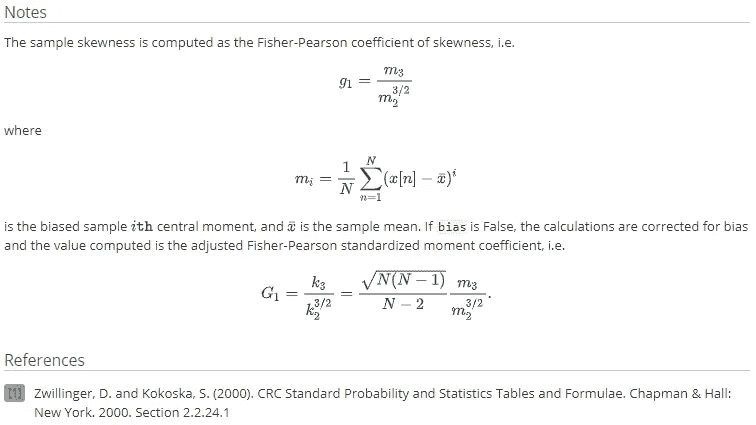

我们使用 scipy.boxcoxp1 来计算 1 + *x* 的 Box-Cox 变换。 [**计算的 Box-Cox 变换为:boxs p1p**](https://docs.scipy.org/doc/scipy/reference/generated/scipy.special.boxcox1p.html#scipy.special.boxcox1p):

```
y = ((1+x)**lmbda - 1) / lmbda  **if** lmbda != 0
log(1+x)                        **if** lmbda == 0Returns *nan* if x < -1\. Returns *-inf* if x == -1 and lmbda < 0.
```

为了在 boxscox 1 中获得输入的λ值，我们使用来自 Scipy 的 boxscox _ normmax(features[ind])，它为输入 data⁷计算最佳的 Box-Cox 变换参数

这种转换只能在具有所有正值的特征上进行；如果需要对具有负值的元素进行转换，请参阅参考 note⁸。

```
from scipy.stats import skew
from scipy.special import boxcox1p
from scipy.stats import boxcox_normmaxnumerics = [col for col in features.columns if features[col].dtype in np.number]skew_f = features[numerics].apply(lambda x: skew(x)).sort_values(ascending=False)highest_skew =  skew_f[skew_f > 0.5]
highest_skew
```

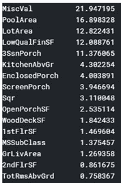

```
skew_idx = highest_skew.index
for ind in skew_idx:
    features[ind] = boxcox1p(features[ind], boxcox_normmax(features[ind))features[highest_skew.index].head()
```

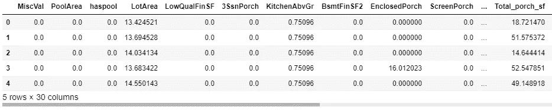

## 创建与目标变量相关的特征

当创建与目标变量相关的变量时，有必要只在列车数据集上执行这些操作，然后尝试将它们带到测试数据集，因为在那里我们不知道目标变量“Y”的值。

这类变量使我们在竞争排行榜上有了显著的改善

例如，我们可以计算每平方米的价格，与每一个社区或每一类住房相关联，然后我们首先在列车组中算出它:

```
train['Sqr'] = train['SalePrice'] / train['LotArea']
train['Sqr'] = train.groupby('Neighborhood')['Sqr'].transform(lambda x: x.median())
```

然后我们用每个街区的价格编了一本字典:

```
d = {}
for indice_fila, x_train in train.iterrows():
    d.update({x_train['Neighborhood']:x_train['Sqr']})
```

最后，我们在测试数据集中创建了特征

```
test['Sqr'] = 0.00
for indice, x_test in test.iterrows():
    test.loc[test.index == indice ,'Sqr'] = d[x_test['Neighborhood']]
```

# 分类对象变量

> “一种热门的编码方式是，将一个包含分类数据的列进行标签编码，然后将该列拆分为多列。数字被“1”和“0”代替，取决于哪一列有什么值……”⁹

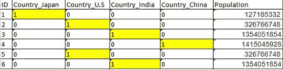

对对象特征进行分类可能非常方便，关于使用哪些列对其应用 OHE 的讨论非常广泛，并且它们的局限性也很分散，因为列中的每个不同值都将被转换为模型矩阵输入的新维度。有时，创建一个对不同值进行分组以降低维数的新特征可能会很方便，例如，一组具有相似特征和价格的邻域。

对于某些数值列，我们可能需要对它们进行分类，为此，将类型更改为字符串很方便，因为最后，我们将对 type 对象的所有列应用 get_dummies。

```
features['MSSubClass'] = features['MSSubClass'].apply(str)
features['MoSold'] = features['MoSold'].astype(str) 
final_features = pd.get_dummies(features).reset_index(drop=True)
```

## 虚拟变量陷阱:

> “虚拟变量陷阱直接来自于对分类变量应用的一热编码……一热向量的大小等于分类列占用的唯一值的数量，并且每个这样的向量中正好包含一个‘1’。这将多重共线性纳入我们的数据集中……”⁰

换句话说，当执行转换时，添加的 OHE 特征集与目标变量对齐，因此通常会删除任何列。在我们的模型中，我们没有应用这种技术。

## 过度进食

Sandeep Kumar 的原始工作包括在特征工程结束时应用 get_dummies，这是一种寻找那些具有大量零值(高于 99.94%)的列的代码，这些值是 drop。

这种技术间接地减轻了分类变量中虚拟变量陷阱的影响，并且还避免了在模型中包括由于分类内容的影响而与试图提取主要特征并对其进行概括的模型无关的列。

```
overfit = []
for i in X.columns:
    counts = X[i].value_counts()
    zeros = counts.iloc[0]
    if zeros / len(X) * 100 **> 99.94:** overfit.append(i)overfit = list(overfit)
**overfit.append('MSZoning_C (all)')** overfit
```

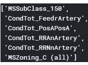

```
X = X.drop(overfit, axis=1).copy()
```

# 集合模型

回归算法在支持分类后的列方面没有问题，所以除了非常不方便的情况，删除它们似乎没有必要，甚至不是一个好主意。然而，这只是一种方法；在这篇文章的结尾，我们将看到解决这个问题的其他方法非常不同，而且一样有用，甚至更有用。

在这种情况下，没有必要降低模型的维数，因为使用不同算法的训练时间不是问题，并且强力似乎不是一个坏策略。

## “集合模型”是什么意思？

> “集合模型给了我们出色的表现，可以解决各种各样的问题。它们比其他类型的技术更容易训练，需要的数据更少，效果更好。在机器学习中，集成模型是标准。即使你没有使用它们，你的竞争对手也是… [集合模型](https://www.analyticsvidhya.com/blog/2018/06/comprehensive-guide-for-ensemble-models/)由几个本身并不优秀的弱模型组成，被称为弱学习者。当您将它们结合在一起时，它们可以弥补彼此的不足，并提供比单独部署时更好的性能。”

## 模型度量

竞争指标是平均绝对误差(MAE)。

对于初始测量，RMSE 和 CV_RMSE 使用。

因为 CV_RMSE 是负的，要应用平方根，需要翻转它。

```
def rmsle(y, y_pred):
    return np.sqrt(mean_squared_error(y, y_pred))def cv_rmse(model):
    rmse = np.sqrt(-cross_val_score(model, X, y, scoring="neg_mean_squared_error", cv=kfolds))
    return rmse
```

## 模特们

这是 Sandeep Kumar 使用的原始模型的一个示例，我们可以看到大量超参数的使用:

```
gbr = GradientBoostingRegressor(n_estimators=3000, learning_rate=0.05,max_depth=4, max_features='sqrt', min_samples_leaf=15, min_samples_split=10, loss='huber', random_state=42)
```

## 制作集合模型

在我们对 GBR 模型执行的相同操作中，我们可以对其他不同的回归模型执行该操作。然后在一个函数中，我们给它们分配一个总值的关联系数，这样比率加起来就是 1。

Sandeep Kumar 混合模型:

```
def blend_models_predict(X):
   return (
(0.1 * elastic_model_full_data.predict(X)) + \
(0.1 * lasso_model_full_data.predict(X)) + \
(0.1 * ridge_model_full_data.predict(X)) + \
(0.1 * svr_model_full_data.predict(X)) + \
(0.1 * gbr_model_full_data.predict(X)) + \
(0.15 * xgb_model_full_data.predict(X)) + \
(0.1 * lgb_model_full_data.predict(X)) + \
(0.25 * stack_gen_model.predict(np.array(X))))
```

Mi 混合模型:

```
def blend_models_predict(X=X):
    return (
(0.10 * elastic_model_full_data.predict(X)) +
(0.05 * lasso_model_full_data.predict(X)) +
(0.05 * ridge_model_full_data.predict(X)) +
(0.05 * svr_model_full_data.predict(X)) +
(0.20 * gbr_model_full_data.predict(X)) +
(0.20 * xgb_model_full_data.predict(X)) +
(0.10 * lgb_model_full_data.predict(X)) +
(0.25 * stack_gen_model.predict(np.array(X))))
```

我们能够使用其他模型，如线性回归、树形回归等。分配给每个模型的重要性取决于我们对测试数据集上的算法的信心，有时 GBR、XGB 或 LGB 等算法在拟合中工作得很好，但由于在测试集中过度拟合而失败。另一方面，像 SVR 或 RIDGE 这样的模型往往精度较低，但更稳定。

# 把所有这些放在一起，花了很多时间的努力

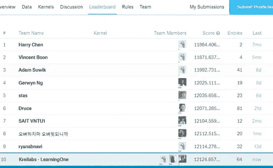

# 其他方法

当我们设法将我们的模型放入世界比赛的前 10 名，并知道我们的知识非常匮乏，渴望获得更多，但感觉处于平稳状态时，我联系了当时排名第三的 Adam su wik,他仍然在那里处于领先位置:

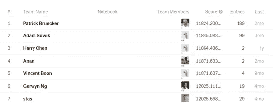

亚当非常友好地同意在一篇非常生动的[帖子](https://www.kaggle.com/c/home-data-for-ml-course/discussion/100526#652503)中分享他的模型的方法。

我们在这里抄录了这篇文章中一些最重要的段落:

> “……这不是什么秘密知识，只是简单的逻辑思维(尽管该领域的专业知识也会很有帮助)。
> 
> 根据模型调整数据—线性回归很可能是首选。不幸的是，大多数数据没有多大意义，可能会对结果产生不利影响。例如，质量——小房子和大别墅的优秀质量并不具有相同的价值——它应该被“优秀质量的平方英尺大小”所取代。而且在我看来，大部分数据应该是这样准备的——结合地块大小、房屋面积、地下室面积、公摊面积等。
> 
> 组合数据/简化模型——这是我经常使用的方法。世界没有那么复杂。在这种情况下，对我来说 3 个特征就足够了——房子有多大？，多好啊？有多舒服？，也许是一些额外的设施，如游泳池、额外的车库等。…
> 
> 丢弃数据—我也经常使用它。如果我看不到价值，或者认为信息包含在其他地方，或者如果我以某种方式设计了数据，我会放弃一切可能的东西。一些专业知识在这里会非常有用，但是仅仅使用常识，许多看起来有影响的数据实际上是次要的。没有人会在廉价的地基上建造豪宅，反之亦然…
> 
> 聚类——并非总是相同的规则适用于整个群体，如果我能够隔离一大群相似的案例，我将为他们建立一个单独的模型。从生活经验来看——如果你看看每平方英尺的价格，你会注意到，对于较小的公寓来说，它肯定更大。
> 
> 我可能还可以描述一些其他的事情，但这一切都归结为一件事——仔细分析所有的数据，并思考如何设计它们以适应您使用的模型。我相信一个原则:“垃圾进，垃圾出”。你提供什么质量的数据，你将得到什么质量的结果…
> 
> 南的。不幸的是，答案如上——没有秘密——做任何看起来有意义的事情。我喜欢“0”，“没有”，我真的喜欢我自己的预测，我讨厌平均值，这就像承认缺乏任何想法，只是最小化假设错误的成本…

这是另一种方法，还有更多方法可以使用网络。在任何竞争中占 1%本身就是一个足够好的模式，也是我们走在正确道路上的标志。

# 摘要

我们已经看到，在他人分享的初步工作中开始一项工作是多么重要，在这种情况下，Sandeep Kumar 模型的迁移学习。谢谢他！

之前的迁移学习为我们提供了基础知识和基本知识，比新手从在线课程中获得的经验更加详尽和精炼。

然后，经过几个小时的努力和系统测试，我们看到了每种技术对不同变量的影响，以做出关于工程特性和模型集合的决策。

有一天，我有了一个想法，这个想法很重要，被分散了注意力，但仍然在思考，这个想法是根据一个给定的概念来计算平方英尺的值，达到前十名的满足感是一个不可思议的时刻。

这场卡格尔比赛的目的是学习

这篇文章旨在传播一些技巧，如果你像我几个月前一样在游戏中陷入困境，你可以使用这些技巧，希望能帮助你走上改善模型的正确道路，或者帮助你点亮那盏有所作为的小灯。

如果有什么地方可以做得更好，我将非常感谢您的评论和报告。

# 参考

Kaggle 是一个由数据科学家和机器学习者组成的在线社区，归[谷歌有限责任公司](https://en.wikipedia.org/wiki/Google_LLC)所有。Kaggle 允许用户查找和发布数据集，在基于网络的数据科学环境中探索和构建模型，与其他数据科学家和机器学习工程师合作，并参加竞赛以解决数据科学挑战。Kaggle 通过提供机器学习竞赛起家，现在还提供公共数据平台、基于云的数据科学工作台和简短的人工智能教育。2017 年 3 月 8 日，谷歌宣布他们正在收购 Kaggle。

[2]【https://www.google.com/url?sa=t】T4&source = web&RCT = j&URL = https://personal . us . es/vararey/adatos 2/correlacion . pdf&ved = 2 ahukewiaytlhqnlahugllkghel 2 b 24 qfjamegqibxab&usg = aovvaw 1 mijaxh 5 f 0 qxixmpead 5j

[3] [回归模型中相关性与时间特征的关联](https://medium.com/analytics-vidhya/incidence-of-correlation-and-time-features-in-a-regression-model-6fc1c4653e4f?source=your_stories_page---------------------------)

[4] [统计数据准备:缺失值和异常值的管理](https://www.ncbi.nlm.nih.gov/pmc/articles/PMC5548942/)

“…基本上有三种方法来处理数据集中的异常值。一种方法是去除异常值，作为修整数据集的手段。另一种方法包括替换异常值或通过异常值权重调整来减少异常值的影响。第三种方法是使用稳健技术来估计异常值。

**修剪**:在这种方法下，分析排除离群值的数据集。微调估计量(如均值)会减少数据中的方差，并导致基于低估或高估的偏差。假设异常值也是观察值，将它们从分析中排除会使这种方法不适用于异常值的处理。

**Winsorization** :这种方法包括修改离群值的权重，或者用期望值替换离群值的测试值。权重修改方法允许在不丢弃或替换离群值的情况下修改权重，从而限制离群值的影响。值修改方法允许在排除异常值的观测值中用最大或第二小的值替换异常值。

**稳健估计方法**:当总体分布的性质已知时，这种方法被认为是合适的，因为它产生对异常值稳健的估计量，并且估计量是一致的。近年来，许多研究提出了各种稳健估计的统计模型；然而，由于复杂的方法学问题，它们的应用进展缓慢。"

[5][https://docs . scipy . org/doc/scipy/reference/generated/scipy . stats . skew . html](https://docs.scipy.org/doc/scipy/reference/generated/scipy.stats.skew.html)

[6][https://docs . scipy . org/doc/scipy/reference/generated/scipy . special . boxcox 1p . html](https://docs.scipy.org/doc/scipy/reference/generated/scipy.special.boxcox1p.html)

[7][https://docs . scipy . org/doc/scipy/reference/generated/scipy . stats . box Cox _ normmax . html？highlight = normmax # scipy . stats . box Cox _ normmax](https://docs.scipy.org/doc/scipy/reference/generated/scipy.stats.boxcox_normmax.html?highlight=normmax#scipy.stats.boxcox_normmax)

[8][https://www . ka ggle . com/rtatman/data-cleaning-challenge-scale-and-normalize-data](https://www.kaggle.com/rtatman/data-cleaning-challenge-scale-and-normalize-data)

“你可以做的一件事是加上一个固定值，这个值刚好大于你的最小负值，使你的所有值都正常。另一种规范化方法是[约翰逊变换](https://cran.r-project.org/web/packages/jtrans/jtrans.pdf)，它可以处理负值。

[9][https://towards data science . com/choosing-the-right-encoding-method-label-vs-one hot-encoder-a 4434493149 b](/choosing-the-right-encoding-method-label-vs-onehot-encoder-a4434493149b)

[10][https://towards data science . com/one-hot-encoding-multi-commonline-and-the-dummy-variable-trap-b 5840 be 3c 41a](/one-hot-encoding-multicollinearity-and-the-dummy-variable-trap-b5840be3c41a)

[11][https://medium . com/@ ODSC/ensemble-models-demystified-c 871 D5 ee 7793](https://medium.com/@ODSC/ensemble-models-demystified-c871d5ee7793)

[https://github.com/scikit-learn/scikit-learn/issues/2439](https://github.com/scikit-learn/scikit-learn/issues/2439)

sk learn . cross _ validation . cross _ val _ score 返回的均方误差始终为负值。虽然这是一个经过设计的决策，以便该函数的输出可以用于给定一些超参数的最大化，但直接使用 cross_val_score 时会非常混乱。至少我问自己，一个平方的平均值怎么可能是负的，并认为 cross_val_score 没有正确工作或者没有使用提供的度量。只有在深入 sklearn 源代码之后，我才意识到这个标志被翻转了。

scorer.py 的 make_scorer 中提到了这种行为，但是 cross_val_score 中没有提到，我认为应该提到，因为否则会让人认为 cross_val_score 没有正常工作