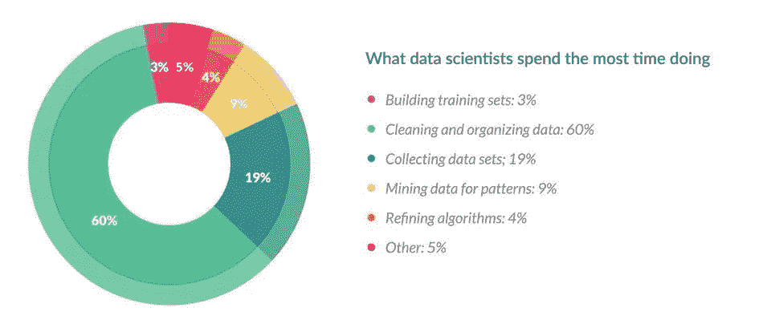

# 面向机器学习的特征工程基本技术

> 原文：<https://towardsdatascience.com/feature-engineering-for-machine-learning-3a5e293a5114?source=collection_archive---------0----------------------->

## 用熊猫例子进行综合数据预处理所需的所有方法。


# 介绍

什么是特性，为什么我们需要它的工程化？基本上，所有的机器学习算法都使用一些输入数据来创建输出。该输入数据包括特征，这些特征通常是结构化列的形式。算法需要具有某些特定特征的功能才能正常工作。这里，出现了对**特征工程**的需求。我认为特性工程的努力主要有两个目标:

*   准备适当的输入数据集，与机器学习算法要求兼容。
*   提高机器学习模型的性能。

> 你使用的特性比其他任何东西都更能影响结果。据我所知，没有任何算法可以单独补充正确的**特征工程**所提供的信息增益。
> 
> —卢卡·马萨隆

根据《福布斯》的一项调查，数据科学家花费 **80%** 的时间在**数据准备上:**



[Source: https://www.forbes.com/sites/gilpress/2016/03/23/data-preparation-most-time-consuming-least-enjoyable-data-science-task-survey-says/](https://www.forbes.com/sites/gilpress/2016/03/23/data-preparation-most-time-consuming-least-enjoyable-data-science-task-survey-says/#1594bda36f63)

这一指标显示了特征工程在数据科学中的重要性，令人印象深刻。因此，我决定写这篇文章，用简短的描述总结特征工程的主要技术。我还为每种技术添加了一些基本的 python 脚本。你需要导入 **Pandas** 和 **Numpy** 库来运行它们。

```
import pandas as pd
import numpy as np
```

上面的一些技术可能更适合一些算法或数据集，而其中一些可能在所有情况下都是有益的。本文不打算在这方面深入探讨。尽管如此，还是有可能为上面的每一种方法写一篇文章，我试着保持解释的简短和翔实。我认为获得特征工程专业知识的最佳方式是在各种数据集上实践不同的技术，并观察它们对模型性能的影响。

## 技术列表

*   [1。插补](https://medium.com/p/3a5e293a5114#3abe)
*   [2。处理异常值](https://medium.com/p/3a5e293a5114#1c08)
*   [3。宁滨](https://medium.com/p/3a5e293a5114#7559)
*   [4。日志转换](https://medium.com/p/3a5e293a5114#199b)
*   [5。一键编码](https://medium.com/p/3a5e293a5114#7c18)
*   6。分组操作
*   7。特征分割
*   8。缩放比例
*   9。提取日期

# 1.归罪


当您尝试为机器学习准备数据时，丢失值是您可能会遇到的最常见问题之一。丢失值的原因可能是人为错误、数据流中断、隐私问题等等。无论是什么原因，丢失的值都会影响机器学习模型的性能。

一些机器学习平台在模型训练阶段自动丢弃包括缺失值的行，并且由于训练规模的减小而降低了模型性能。另一方面，大多数算法不接受具有缺失值的数据集并给出错误。

对于缺失值，最简单的解决方案是删除行或整列。没有最佳的删除阈值，但是您可以使用 **70%** 作为示例值，并尝试删除丢失值高于此阈值的行和列。

```
threshold = 0.7**#Dropping columns with missing value rate higher than threshold**
data = data[data.columns[data.isnull().mean() < threshold]]

**#Dropping rows with missing value rate higher than threshold**
data = data.loc[data.isnull().mean(axis=1) < threshold]
```

## 数值插补

插补是比删除更可取的选择，因为它保留了数据的大小。然而，有一个重要的选择，你归咎于丢失的价值。我建议从考虑列中缺失值的可能默认值开始。例如，如果您有一个只有 **1** 和 **NA** 的列，那么很可能 **NA** 行对应于 **0** 。再举一个例子，如果您有一个显示**“上个月的客户访问计数”**的列，那么只要您认为这是一个合理的解决方案，缺失的值可能会被替换为 **0** 。

缺少值的另一个原因是连接不同大小的表，在这种情况下，输入 **0** 可能也是合理的。

除了缺失值有默认值的情况，我认为最好的插补方式是使用列的**中位数**。因为列的平均值对异常值敏感，而中间值在这方面更可靠。

```
**#Filling all missing values with 0**
data = data.fillna(0)**#Filling missing values with medians of the columns**
data = data.fillna(data.median())
```

## 分类插补

用列中的最大出现值**替换缺失值是处理分类列的一个好选择。但是，如果你认为该列中的值是均匀分布的，并且没有一个主导值，那么把一个像“**其他**”这样的类别归入可能更合理，因为在这种情况下，你的插补很可能收敛于一个随机选择。**

```
**#Max fill function for categorical columns**
data['column_name'].fillna(data['column_name'].value_counts()
.idxmax(), inplace=True)
```

# 2.处理异常值

在提到如何处理异常值之前，我想说明检测异常值的最好方法是直观地展示数据。所有其他的统计方法都有可能出错，而可视化异常值提供了一个高精度决策的机会。无论如何，我计划在另一篇文章中深入讨论可视化，让我们继续讨论统计方法。

统计方法不如我提到的精确，但另一方面，他们有优势，他们很快。这里我将列出两种处理异常值的不同方法。这些将使用**标准差**和**百分位数**来检测它们。

## 基于标准差的异常值检测

如果一个值与平均值的距离高于 ***x *标准差*，**，则可以将其视为异常值。那什么 **x** 应该是？

对于 x 没有简单的解决方案，但是通常，介于 2 和 4 之间的值似乎是可行的。

```
**#Dropping the outlier rows with standard deviation**
factor = 3
upper_lim = data['column'].mean () + data['column'].std () * factor
lower_lim = data['column'].mean () - data['column'].std () * factor

data = data[(data['column'] < upper_lim) & (data['column'] > lower_lim)]
```

另外，可以用 **z-score** 代替上面的公式。 **Z 分数**(或标准分数)使用标准差标准化数值和平均值之间的距离。

## 基于百分位数的异常值检测

另一种检测异常值的数学方法是使用百分位数。您可以将顶部或底部值的某个百分比假定为异常值。这里的关键点是再次设置百分比值，这取决于前面提到的数据分布。

此外，一个常见的错误是根据数据范围使用百分位数。换句话说，如果你的数据范围是从 **0** 到 **100** ，那么你的 top **5%** 就不是在 **96** 和 **100** 之间的值。Top **5%** 在这里是指超出第 95 个数据百分点的数值。

```
**#Dropping the outlier rows with Percentiles**
upper_lim = data['column'].quantile(.95)
lower_lim = data['column'].quantile(.05)

data = data[(data['column'] < upper_lim) & (data['column'] > lower_lim)]
```

## 离群困境:下降还是上升

处理异常值的另一个选择是**限制**它们，而不是丢弃它们。因此，您可以保持您的数据大小，并且在一天结束时，它可能对最终的模型性能更好。

另一方面，封顶会影响数据的分布，因此最好不要夸大它。

```
**#Capping the outlier rows with Percentiles**
upper_lim = data['column'].quantile(.95)
lower_lim = data['column'].quantile(.05)data.loc[(df[column] > upper_lim),column] = upper_lim
data.loc[(df[column] < lower_lim),column] = lower_lim
```

# 3.扔掉


Binning illustration of numerical data

宁滨可应用于分类数据和数值数据:

```
**#Numerical Binning Example****Value      Bin**       
0-30   ->  Low       
31-70  ->  Mid       
71-100 ->  High**#Categorical Binning Example****Value      Bin**       
Spain  ->  Europe      
Italy  ->  Europe       
Chile  ->  South America
Brazil ->  South America
```

宁滨的主要动机是使模型更加**健壮**并防止**过度拟合**，然而，这是以性能为代价的。每次你绑定一些东西，你就牺牲了一些信息，使你的数据更有规律。(请参见[机器学习中的正则化](/regularization-in-machine-learning-76441ddcf99a))

在**性能**和**过度拟合**之间的权衡是宁滨过程的关键点。在我看来，对于数值列，除了一些明显的过度拟合情况，宁滨对于某种算法来说可能是多余的，因为它会影响模型性能。

然而，对于分类列，低频标签可能会对统计模型的稳健性产生负面影响。因此，为这些不太频繁的值分配一个通用类别有助于保持模型的稳健性。例如，如果您的数据大小是 **100，000** 行，那么将计数小于 **100** 的标签合并到一个新的类别中，比如**“其他”**，这可能是一个不错的选择。

```
**#Numerical Binning Example**data['bin'] = pd.cut(data['value'], bins=[0,30,70,100], labels=["Low", "Mid", "High"]) **value   bin**
0      2   Low
1     45   Mid
2      7   Low
3     85  High
4     28   Low**#Categorical Binning Example** **Country**
0      Spain
1      Chile
2  Australia
3      Italy
4     Brazilconditions = [
    data['Country'].str.contains('Spain'),
    data['Country'].str.contains('Italy'),
    data['Country'].str.contains('Chile'),
    data['Country'].str.contains('Brazil')]

choices = ['Europe', 'Europe', 'South America', 'South America']

data['Continent'] = np.select(conditions, choices, default='Other') **Country      Continent**
0      Spain         Europe
1      Chile  South America
2  Australia          Other
3      Italy         Europe
4     Brazil  South America
```

# 4.对数变换

对数变换是特征工程中最常用的数学变换之一。日志转换的好处是什么:

*   它有助于处理倾斜的数据，在转换后，分布变得更接近正常。
*   在大多数情况下，数据的数量级在数据范围内变化。例如:年龄 **15** 和 **20** 的差别不等于年龄 **65** 和 **70** 。从年龄上来说，是的，他们是相同的，但是对于其他所有方面来说， **5** 年轻年龄的差异意味着更高的量级差异。这种类型的数据来自乘法过程，对数变换会像这样对幅度差异进行归一化。
*   由于幅度差的归一化，它还降低了异常值的影响，并且模型变得更加稳健。

**重要提示:**您应用对数变换的数据必须只有正值，否则您会收到一个错误。此外，您可以在转换数据之前将 **1** 添加到数据中。因此，您可以确保转换的输出为正。

> **Log(x+1)**

```
**#Log Transform Example**
data = pd.DataFrame({'value':[2,45, -23, 85, 28, 2, 35, -12]})data['log+1'] = (data['value']+1).transform(np.log)**#Negative Values Handling
#Note that the values are different** data['log'] = (data['value']-data['value'].min()+1) .transform(np.log) **value  log(x+1)  log(x-min(x)+1)**
0      2   1.09861          3.25810
1     45   3.82864          4.23411
2    -23       nan          0.00000
3     85   4.45435          4.69135
4     28   3.36730          3.95124
5      2   1.09861          3.25810
6     35   3.58352          4.07754
7    -12       nan          2.48491
```

# 5.**一键编码**

**一键编码**是机器学习中最常见的编码方式之一。该方法将一列中的值扩展到多个标志列，并将 **0** 或 **1** 分配给它们。这些二进制值表示分组列和编码列之间的关系。

该方法将算法难以理解的分类数据更改为数字格式，并使您能够在不丢失任何信息的情况下对分类数据进行分组。(详情请参见**分类列分组**的最后一部分)


One hot encoding example on City column

**为什么一热？:**如果你的列中有 **N** 个不同的值，把它们映射到 **N-1** 个二进制列就足够了，因为缺失的值可以从其他列中扣除。如果我们手里的所有列都等于 **0** ，那么缺失值一定等于 **1** 。这就是它被称为**一键编码**的原因。不过，我会用熊猫的 **get_dummies** 函数来举例说明。该函数将一列中的所有值映射到多列。

```
encoded_columns = pd.get_dummies(data['column'])
data = data.join(encoded_columns).drop('column', axis=1)
```

# 6.分组操作

在大多数机器学习算法中，每个实例都由训练数据集中的一行来表示，其中每一列都显示该实例的不同特征。这种数据称为**【整齐】**。

> 整齐的数据集易于操作、建模和可视化，并且具有特定的结构:每个变量是一列，每个观察值是一行，每种类型的观察单元是一个表。
> 
> —哈德利·韦翰

像事务这样的数据集很少符合上面整洁数据的定义，因为一个实例有多行。在这种情况下，我们按实例对数据进行分组，然后每个实例仅由一行表示。

分组操作的关键是确定特征的聚合函数。对于数字特征，平均值和总和函数通常是方便的选项，而对于分类特征，这就更复杂了。

## 分类列分组

我建议用三种不同的方法来聚合分类列:

*   第一个选项是选择**最高频率**的标签。换句话说，这是对分类列的 **max** 操作，但是普通的 max 函数一般不会返回这个值，为此需要使用 lambda 函数。

```
data.groupby('id').agg(lambda x: x.value_counts().index[0])
```

*   第二个选择是制作一个**数据透视表**。这种方法类似于上一步中的编码方法，但有一点不同。代替二进制表示法，它可以被定义为分组列和编码列之间的值的聚合函数。如果您的目标不仅仅是二进制标志列，而是将多个要素合并成信息更丰富的聚合要素，那么这将是一个不错的选择。


Pivot table example: Sum of Visit Days grouped by Users

```
**#Pivot table Pandas Example**data.pivot_table(index='column_to_group', columns='column_to_encode', values='aggregation_column', aggfunc=np.sum, fill_value = 0)
```

*   最后一个分类分组选项是在应用**一键编码**后，通过函数应用**分组。这个方法保留了所有的数据——在第一个选项中，您会丢失一些——此外，您同时将编码列从分类转换为数字。关于**数值列分组**的解释，可以查看下一节。**

## 数字列分组

在大多数情况下，使用 **sum** 和 **mean** 函数对数字列进行分组。根据特征的含义，两者都是优选的。例如，如果你想获得**比**列，你可以使用二元列的平均值。在同一个示例中，sum 函数也可用于获得总计数。

```
#sum_cols: List of columns to sum
#mean_cols: List of columns to averagegrouped = data.groupby('column_to_group')

sums = grouped[sum_cols].sum().add_suffix('_sum')
avgs = grouped[mean_cols].mean().add_suffix('_avg')

new_df = pd.concat([sums, avgs], axis=1)
```

# 7.特征分割


Photo by [Jaxon Lott](https://unsplash.com/@jaxonlott?utm_source=medium&utm_medium=referral) on [Unsplash](https://unsplash.com?utm_source=medium&utm_medium=referral)

分割特征是使它们在机器学习方面有用的好方法。大多数情况下，数据集包含的字符串列违反了[整齐数据](http://vita.had.co.nz/papers/tidy-data.html)原则。通过将列的可利用部分提取到新特征中:

*   我们让机器学习算法能够理解它们。
*   使得可以对它们进行绑定和分组。
*   通过发现潜在信息来提高模型性能。

**分割**功能是一个很好的选择，但是，没有一种分割功能的方式。这要看栏目的特点，怎么拆分。下面用两个例子来介绍一下。首先，一个普通名称列的简单拆分函数:

```
**data.name**
0  Luther N. Gonzalez
1    Charles M. Young
2        Terry Lawson
3       Kristen White
4      Thomas Logsdon#Extracting first names **data.name.str.split(" ").map(lambda x: x[0])** 0     Luther
1    Charles
2      Terry
3    Kristen
4     Thomas#Extracting last names **data.name.str.split(" ").map(lambda x: x[-1])** 0    Gonzalez
1       Young
2      Lawson
3       White
4     Logsdon
```

上面的例子通过只取第一个和最后一个元素来处理长度超过两个单词的名称，这使得该函数对于极端情况是健壮的，这在处理这样的字符串时应该被考虑。

split 函数的另一种情况是提取两个字符之间的字符串部分。以下示例显示了通过在一行中使用两个 split 函数来实现这种情况。

```
#String extraction example **data.title.head()**
0                      Toy Story (1995)
1                        Jumanji (1995)
2               Grumpier Old Men (1995)
3              Waiting to Exhale (1995)
4    Father of the Bride Part II (1995)**data.title.str.split("(", n=1, expand=True)[1].str.split(")", n=1, expand=True)[0]** 0    1995
1    1995
2    1995
3    1995
4    1995
```

# 8.缩放比例

在大多数情况下，数据集的数字特征不具有特定的**范围**，并且它们彼此不同。在现实生活中，期望**年龄**和**收入**栏有相同的范围是无稽之谈。但是从机器学习的角度来看，这两列怎么比较呢？

缩放解决了这个问题。在缩放过程之后，连续特征在范围方面变得相同。对于许多算法来说，这个过程不是强制性的，但是应用起来可能还是不错的。然而，基于**距离**计算的算法，如 **k-NN** 或 **k-Means** 需要将缩放的连续特征作为模型输入。

基本上，有两种常见的缩放方式:

## 正常化


归一化(或**最小-最大归一化**)在 **0** 和 **1** 之间的固定范围内缩放所有值。这种变换不会改变特征的分布，由于标准偏差减小，异常值**的影响**会增加。因此，在标准化之前，建议处理异常值。

```
data = pd.DataFrame({'value':[2,45, -23, 85, 28, 2, 35, -12]})

data['normalized'] = (data['value'] - data['value'].min()) / (data['value'].max() - data['value'].min()) **value  normalized**
0      2        0.23
1     45        0.63
2    -23        0.00
3     85        1.00
4     28        0.47
5      2        0.23
6     35        0.54
7    -12        0.10
```

## 标准化

标准化(或 **z 分数标准化**)在考虑标准偏差的同时缩放数值。如果特征的标准偏差不同，它们的范围也会彼此不同。这降低了特征中异常值的影响。

在下面的标准化公式中，**均值**表示为***标准** **偏差**表示为 ***σ*** 。*

**

```
*data = pd.DataFrame({'value':[2,45, -23, 85, 28, 2, 35, -12]})

data['standardized'] = (data['value'] - data['value'].mean()) / data['value'].std() **value  standardized**
0      2         -0.52
1     45          0.70
2    -23         -1.23
3     85          1.84
4     28          0.22
5      2         -0.52
6     35          0.42
7    -12         -0.92*
```

# *9.提取日期*

*虽然日期列通常提供关于模型目标的有价值的信息，但是它们作为输入被忽略或者被无意义地用于机器学习算法。可能是这个原因，日期可以以多种格式呈现，这使得算法很难理解，即使它们被简化为类似**" 01–01–2017 "**的格式。*

*如果不处理日期列，在值之间建立顺序关系对于机器学习算法来说是非常具有挑战性的。这里，我建议对日期进行三种类型的预处理:*

*   *将日期的各个部分提取到不同的列中:年、月、日等。*
*   *根据年、月、日等提取当前日期和列之间的时间段。*
*   *从日期中提取一些特定的特征:工作日的名称、是否是周末、是否是假日等。*

*如果您将日期列转换为如上所述的提取列，它们的信息就会公开，机器学习算法可以轻松理解它们。*

```
*from datetime import date

data = pd.DataFrame({'date':
['01-01-2017',
'04-12-2008',
'23-06-1988',
'25-08-1999',
'20-02-1993',
]})

**#Transform string to date**
data['date'] = pd.to_datetime(data.date, format="%d-%m-%Y")

**#Extracting Year**
data['year'] = data['date'].dt.year

**#Extracting Month**
data['month'] = data['date'].dt.month

**#Extracting passed years since the date**
data['passed_years'] = date.today().year - data['date'].dt.year

**#Extracting passed months since the date**
data['passed_months'] = (date.today().year - data['date'].dt.year) * 12 + date.today().month - data['date'].dt.month

**#Extracting the weekday name of the date**
data['day_name'] = data['date'].dt.day_name() **date  year  month  passed_years  passed_months   day_name**
0 2017-01-01  2017      1             2             26     Sunday
1 2008-12-04  2008     12            11            123   Thursday
2 1988-06-23  1988      6            31            369   Thursday
3 1999-08-25  1999      8            20            235  Wednesday
4 1993-02-20  1993      2            26            313   Saturday*
```

# *结论*

**

*[https://xkcd.com/1838/](https://xkcd.com/1838/)*

*我试图解释在特征工程过程中有益的基本方法。在这篇文章之后，继续进行数据准备的其他主题，例如**特征选择、训练/测试分割、**和**采样**可能是一个不错的选择。*

*你可以查看我的[另一篇关于过采样的文章](/how-to-calibrate-undersampled-model-scores-8f3319c1ea5b)。*

*最后，我想以一个提醒来结束这篇文章。这些技术不是神奇的工具。如果你的数据微小、肮脏且无用，特征工程可能仍然无能为力。别忘了****垃圾进来，垃圾出去！”*****

## **参考**

*   **[**栈溢出**](https://stackoverflow.com/) 问题对于每一种特性工程脚本都是非常有益的。**
*   **我强烈推荐 [**Kaggle**](https://www.kaggle.com) 比赛和他们的讨论板。**
*   **[**检测和清除异常值的方法**](/ways-to-detect-and-remove-the-outliers-404d16608dba)**
*   **[**理解特征工程(上)——连续数值数据**](/understanding-feature-engineering-part-1-continuous-numeric-data-da4e47099a7b)**
*   **[**了解特征工程(第二部分)—分类数据**](/understanding-feature-engineering-part-2-categorical-data-f54324193e63)**
*   **[**偏斜和宽分布的对数变换**](https://www.r-statistics.com/2013/05/log-transformations-for-skewed-and-wide-distributions-from-practical-data-science-with-r/)**
*   **[**整理数据**](http://vita.had.co.nz/papers/tidy-data.html)**
*   **[**关于特征缩放和归一化**](https://sebastianraschka.com/Articles/2014_about_feature_scaling.html)**