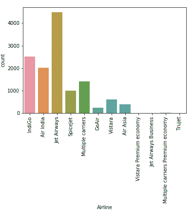
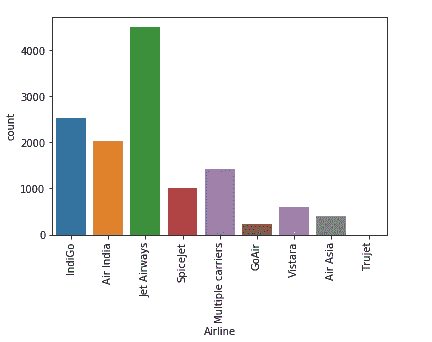
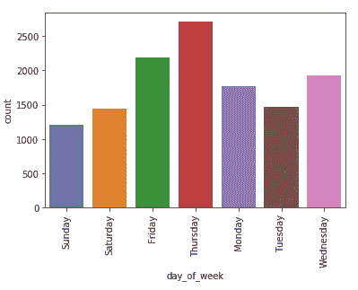
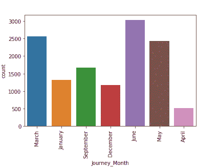
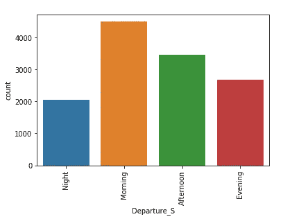

# Python 中的要素工程

> 原文：<https://towardsdatascience.com/feature-engineering-in-python-part-i-the-most-powerful-way-of-dealing-with-data-8e2447e7c69e?source=collection_archive---------3----------------------->

## "*我们的目标是将数据转化为信息，并将信息转化为洞察力。*——[卡莉·菲奥莉娜](http://en.wikipedia.org/wiki/Carly_Fiorina)。


Photo by [h heyerlein](https://unsplash.com/photos/ndja2LJ4IcM?utm_source=unsplash&utm_medium=referral&utm_content=creditCopyText) on [Unsplash](https://unsplash.com/search/photos/data?utm_source=unsplash&utm_medium=referral&utm_content=creditCopyText)

我们生活在一个数据驱动的经济中。在这个世界里，拥有大量数据、理解这些数据并知道如何处理数据就是力量。理解你的数据并不是数据科学中最困难的事情之一，但是很费时间。当我们知道数据的来源*时，数据的解释是有效的。*

## 数据

我们相信上帝。所有其他人必须携带数据。— [W .戴明](https://www.deming.org/theman/overview)
首先，我们需要了解我们的数据。有 **3** 种数据:

1.  **数值** 这代表某种定量测量。例如:身高的人，股票价格，页面加载时间等。它可以进一步分解为两部分:
    ***离散数据:*** 这是基于整数的，通常是一些事件的计数。例如:“一个用户喜欢多少首歌？”或者“一枚硬币掷到“头”上多少次？”
    ***连续数据:*** 它有无限多种可能的值。比如:“一个用户购买用了多长时间？”
2.  **分类的** 这代表没有明显内在数学意义的定性数据。例子:是或否，性别，种族，婚姻状况等。这些可以被赋予像是(0)和否(1)这样的数字，但是数字没有数学意义。
3.  **序数**
    它兼具数值型和分类型数据的特征。但是分类中的数字有数学意义。例如:电影评分为 1-5 等。这些值具有数学意义。因此，我们往往会忽略这一步，直接跳入水中。

## 特征工程

机器学习将数学符号与数据进行拟合，以获得一些见解。模型将特征作为输入。特征通常是现实世界现象或数据的一个方面的数字表示。就像迷宫中有死胡同一样，数据路径充满了噪音和缺失的部分。作为一名数据科学家，我们的工作是找到一条通往洞察最终目标的清晰道路。


Photo by [Victor Garcia](https://unsplash.com/photos/_qXjdWm8YEo?utm_source=unsplash&utm_medium=referral&utm_content=creditCopyText) on [Unsplash](https://unsplash.com/search/photos/maze?utm_source=unsplash&utm_medium=referral&utm_content=creditCopyText)

数学公式对数字量起作用，原始数据并不完全是数字。特征工程是从数据中提取特征并将其转换为适合机器学习算法的格式的方法。

它分为三大类

**特征选择:**所有特征不相等。这就是从大量的特性中选择一小部分特性。我们选择那些最能解释自变量与目标变量之间关系的属性。对于模型的准确性来说，某些特征比其他特征更重要。它与降维**不同，因为降维方法是通过组合现有属性来实现的，而特征选择方法是包含或排除那些特征。
特征选择的方法有卡方检验、相关系数评分、LASSO、岭回归等。**

**特性转换:**就是把我们原来的特性转换成原来特性的功能。缩放、离散化、宁滨和填充缺失数据值是最常见的数据转换形式。为了 [**减少**](https://codeburst.io/2-important-statistics-terms-you-need-to-know-in-data-science-skewness-and-kurtosis-388fef94eeaa) 数据的右偏，我们使用 log。

**特征提取:**当一个算法要处理的数据太大时，一般认为是冗余的。使用大量变量进行分析需要大量的计算能力和内存，因此我们应该减少这些类型变量的维数。这是一个构建变量组合的术语。对于表格数据，我们使用主成分分析来减少特征。对于图像，我们可以使用直线或边缘检测。

**我们从 MachineHack** **的这个** [**数据集开始。**
我们将首先导入特征工程所需的所有包。](https://www.machinehack.com/course/predict-the-flight-ticket-price-hackathon/)

```
import pandas as pd
import numpy as np
import matplotlib.pyplot as plt
import datetime
```

我们将使用 pandas 加载数据，并将显示设置为最大，以便显示所有包含详细信息的列:

```
pd.set_option('display.max_columns', None)data_train = pd.read_excel('Data_Train.xlsx')data_test = pd.read_excel('Data_Test.xlsx')
```

在我们开始预处理数据之前，我们希望单独存储目标变量或标签。在从训练数据集中移除标签之后，我们将组合我们的训练和测试数据集。我们合并训练和测试数据集的原因是，机器学习模型不擅长**推断，**即 *ML 模型不擅长从现有信息中推断出尚未明确陈述的东西*。因此，如果测试集中的数据没有得到很好的表示，比如在训练集中，预测就不可靠。

```
price_train = data_train.Price # Concatenate training and test sets data = pd.concat([data_train.drop(['Price'], axis=1), data_test])
```

这是我们在`data.columns`之后得到的输出

```
Index(['Airline', 'Date_of_Journey', 'Source', 'Destination', 'Route','Dep_Time', 'Arrival_Time', 'Duration', 'Total_Stops',
'Additional_Info', 'Price'], dtype='object')
```

要检查前五行数据，请键入`data.head()`。

为了更全面地了解情况，我们使用了`data.info()`方法。

```
<class 'pandas.core.frame.DataFrame'>
Int64Index: 13354 entries, 0 to 2670
Data columns (total 10 columns):
Airline            13354 non-null object
Date_of_Journey    13354 non-null object
Source             13354 non-null object
Destination        13354 non-null object
Route              13353 non-null object
Dep_Time           13354 non-null object
Arrival_Time       13354 non-null object
Duration           13354 non-null object
Total_Stops        13353 non-null object
Additional_Info    13354 non-null object
dtypes: int64(1), object(10)
memory usage: 918.1+ KB
```

要了解我们数据的分布，使用`data.describe(include=all)`

我们希望分析数据并删除所有重复的值。

```
data = data.drop_duplicates()
```

因此，我们希望检查数据中的任何空值。

```
Airline            0
Date_of_Journey    0
Source             0
Destination        0
Route              1
Dep_Time           0
Arrival_Time       0
Duration           0
Total_Stops        1
Additional_Info    0
Price              0
dtype: int64
```

因此，我们使用下面的代码来删除空值。

```
data = data.drop(data.loc[data['Route'].isnull()].index)
```

## 航空公司

让我们查一下航空公司一栏。我们注意到它包含了**分类**值。在使用了`data['Airline'].unique()`之后，我们注意到航空公司的价值观在某种程度上是重复的。

我们首先想要可视化该列:

```
sns.countplot(x='Airline', data=data)plt.xticks(rotation=90)
```



这种形象化帮助我们理解某些航空公司被分成了两个部分。例如，Jet Airways 有另一个部分叫做 Jet Airways Business。我们想把这两类结合起来。

```
data['Airline'] = np.where(data['Airline']=='Vistara Premium economy', 'Vistara', data['Airline'])data['Airline'] = np.where(data['Airline']=='Jet Airways Business', 'Jet Airways', data['Airline'])data['Airline'] = np.where(data['Airline']=='Multiple carriers Premium economy', 'Multiple carriers', data['Airline'])
```

这就是我们的列中的值现在的样子。



## 航班的目的地

目的地也是如此。我们发现德里和新德里被分成了两个不同的类别。因此，我们将它们合二为一。

```
data['Destination'].unique()data['Destination'] = np.where(data['Destination']=='Delhi','New Delhi', data['Destination'])
```

## 旅行日期

我们检查这个列，`data['Date_of_Journey']`，发现这个列的格式是:-

```
24/03/2019
1/05/2019
```

这只是原始数据。我们的模型不能理解它，因为它不能给出数值。为了从这个列中提取有用的特性，我们想把它转换成工作日和月份。

```
data['Date_of_Journey'] = pd.to_datetime(data['Date_of_Journey'])**OUTPUT** 2019-03-24
2019-01-05
```

然后从中获取工作日

```
data['day_of_week'] = data['Date_of_Journey'].dt.day_name()**OUTPUT** Sunday
Saturday
```



从旅行日期开始，我们还会得到月份。

```
data['Journey_Month'] = pd.to_datetime(data.Date_of_Journey, format='%d/%m/%Y').dt.month_name()**OUTPUT** March
January
```



## 航空公司的出发时间

出发时间采用 24 小时制(22:20)，我们希望将其绑定以获得更多信息。

我们将创建固定宽度的箱，每个箱包含一个特定的数字范围。通常，这些范围是手动设置的，具有固定的大小。在这里，我决定将时间分成 4 个部分。[0–5]、[6–11]、[12–17]和[18–23]是 4 个容器。我们不能在计数中有大的间隙，因为这可能会产生没有数据的空箱。这个问题通过基于数据的分布定位箱来解决。

```
data['Departure_t'] = pd.to_datetime(data.Dep_Time, format='%H:%M')a = data.assign(dept_session=pd.cut(data.Departure_t.dt.hour,[0,6,12,18,24],labels=['Night','Morning','Afternoon','Evening']))data['Departure_S'] = a['dept_session']
```



我们在“出发 _S”列中用“夜间”填充空值。

```
data['Departure_S'].fillna("Night", inplace = True)
```

## 持续时间

我们的持续时间栏中的时间是这样写的`2h 50m`。为了帮助机器学习算法获得有用的见解，我们将把这些文本转换成数字。

```
duration = list(data['Duration'])for i in range(len(duration)) :
    if len(duration[i].split()) != 2:
        if 'h' in duration[i] :
            duration[i] = duration[i].strip() + ' 0m'
        elif 'm' in duration[i] :
            duration[i] = '0h {}'.format(duration[i].strip())dur_hours = []
dur_minutes = []  

for i in range(len(duration)) :
    dur_hours.append(int(duration[i].split()[0][:-1]))
    dur_minutes.append(int(duration[i].split()[1][:-1]))

data['Duration_hours'] = dur_hours
data['Duration_minutes'] =dur_minutesdata.loc[:,'Duration_hours'] *= 60data['Duration_Total_mins']= data['Duration_hours']+data['Duration_minutes']
```

我们现在得到的结果本质上是连续的。

可视化数据后，删除持续时间少于 60 分钟的行是有意义的。

```
# Get names of indexes for which column Age has value 30indexNames = data[data.Duration_Total_mins < 60].index# Delete these row indexes from dataFramedata.drop(indexNames , inplace=True)
```

我们将删除有噪音或文本的列，这对我们的模型没有帮助。为了获得更好的见解，我们将这些内容转化为更新的专栏。

```
data.drop(labels = ['Arrival_Time','Dep_Time','Date_of_Journey','Duration','Departure_t','Duration_hours','Duration_minutes'], axis=1, inplace = True)
```

## 虚拟变量

我们设计了几乎所有的功能。我们已经处理了缺失值、装箱的数字数据，现在是时候将所有变量转换为数字变量了。我们将使用`get_dummies()`来进行转换。

```
cat_vars = ['Airline', 'Source', 'Destination', 'Route', 'Total_Stops',
       'Additional_Info', 'day_of_week', 'Journey_Month', 'Departure_S' ]
for var in cat_vars:
    catList = 'var'+'_'+var
    catList = pd.get_dummies(data[var], prefix=var)
    data1 = data.join(catList)
    data = data1

data_vars = data.columns.values.tolist()
to_keep = [i for i in data_vars if i not in cat_vars]data_final=data[to_keep]
```

## 下一步

我们将不得不重新划分数据集。特征工程有助于从原始数据中提取信息，即它已经创建了许多特征。这意味着我们需要找到整个批次的主要特征。这也被称为维数灾难。我们用特征选择来对抗特征生成。

[*如果你想了解***和* ***峰度*** *，点击这里。**](https://codeburst.io/2-important-statistics-terms-you-need-to-know-in-data-science-skewness-and-kurtosis-388fef94eeaa)

*[*如果你想了解数据科学* *背后的* ***统计学，点击这里。***](/statistics-for-data-scientists-f2456d26c5a5)*

*[*如果你想获得一个* ***机器学习入门*** *，点击这里。*](/machine-learning-intuition-for-beginners-ba07a640d928)*

**感谢阅读！**

***这里也可以给支持:**https**://**buymeacoffee.com/divadugar*