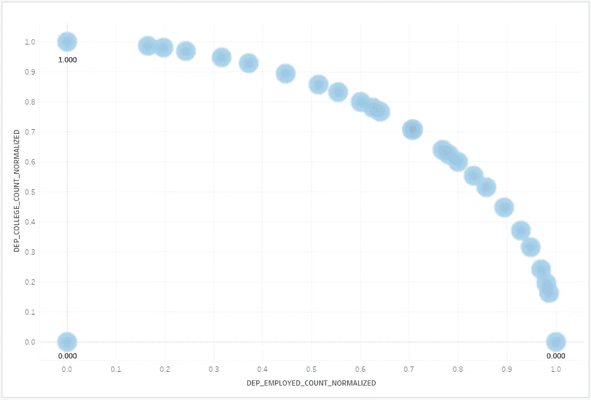

# 雪花中的特征工程

> 原文：<https://towardsdatascience.com/feature-engineering-in-snowflake-1730a1b84e5b?source=collection_archive---------12----------------------->

在之前的故事中，我展示了一个真正的云数据仓库能够处理结构化数据的常见机器学习任务，如训练基于树的模型。

我的论点的要点是，如果架构是正确的，用例是常见的，那么您不应该需要将数据从数据库转移到通用计算集群中。作为雪花用户，您的分析工作负载可以利用其[微分区](https://docs.snowflake.net/manuals/user-guide/tables-clustering-micropartitions.html)来删除大量处理，并且预热后的每秒计费计算集群已准备好参与非常短暂但繁重的数字处理任务。

然而，人们常说，数据科学家 80%的时间都花在特性工程上，这几乎总是在你可以训练模型之前的一个要求。这部分也可以在数据库中完成吗？

# 什么是特征工程？

特征工程是关于转换输入数据，以便它可以被机器学习算法使用。数据背后有许多上下文含义，人类使用我们丰富的经验和能力来概括我们的学习，从而直观地解释这些含义。但是，尽管有一些营销材料，机器还不能自己做到这一点。

一些 ML 算法要求它们的输入是“工程化的”，这有几个原因，但用一个例子来说明:假设你的两个输入变量是工资和年龄，你的目标变量是购买产品的可能性。在你的数据集中，工资可能在 30，000 到 200，000 美元之间，年龄可能在 10 到 90 岁之间。读者们可能会理解，20 岁的年龄差距比 20 美元的工资差距要重要得多，但对于算法来说，它们只是需要拟合曲线的数字。因此，为了做好工作，计算机需要你考虑到这一点，在这种情况下，你可以通过缩放来做到这一点(例如，使工资和年龄都在 0.0 和 1.0 之间)。您还可以使用像宁滨(又名分桶)这样的技术将值放入固定数量的值范围之一(例如，工资范围 0 到 6)。

# 实现数据库内

当你看到像 [scikit-learn 的预处理库](https://scikit-learn.org/stable/modules/classes.html#module-sklearn.preprocessing)这样的东西时，从头开始实现它们以在数据库中运行的前景可能会令人望而生畏，想象出处理低级数字操作的数千行代码的图像。

我不觉得它令人生畏的原因是，它的大部分实际上不是从零开始的。从概念上讲，它更像是实现一个金字塔的顶端部分，那里已经有了许多基础的构建块。例如，在我的决策树算法中，我使用标准偏差减少来计算树分裂。但是我不需要从头开始实现标准差。这是一个内置的雪花函数，我只需要把它插在正确的地方。有用的不仅仅是聚合函数；窗口函数有助于分解数据集，表函数非常适合切片和切块。

同样的原则应该适用于特征工程。如果你真的找到了一个缺失的构建模块，或者只是想把事情收拾得干净整洁，你总是可以成为一个优秀的工程师，像雪花函数一样孤立地解决它，然后根据需要调用它。继续读下去，你会发现我这样做了好几次。


在这个故事中，我将研究 scikit-learn 预处理函数的完整列表，并展示一个等效的雪花解决方案，使用所有雪花帐户可用的样本数据。

除非另有说明，否则数据库为“雪花 _ 样本 _ 数据”，模式为“TPCDS_SF10TCL”。

如果您像我一样在 Tableau Desktop 中运行这些查询，请确保在最后添加一个**示例(500 行)**，因为其中一些表有数十亿行，真的会挤满一个图表。

## `preprocessing.Binarizer`


*根据阈值*将数据二值化(将特征值设置为 0 或 1)

作为热身练习，让我们将 customer _ demographic dependencies 计数二进制化。假设它只与你是否有家属相关，我们不在乎有多少。


Before

```
select iff(CD_DEP_COUNT>0, true, false ) as CD_DEPENDANTS
from CUSTOMER_DEMOGRAPHICS
```


After

## `preprocessing.FunctionTransformer`

*从任意可调用函数构造一个转换器。*

这个只是让你 BYO 变换函数，所以不是真正的算法。我们知道我们可以对存储过程或函数做同样的事情。

## `preprocessing.KBinsDiscretizer`


*将连续数据分入区间。*

在 scikit-learn 函数中有几个选择。编码器参数可以是“onehot”、“onehot-dense”或“ordinal”。我将使用 ordinal 这个简单的方法，但是不要担心，我们稍后必须实现一个热编码作为它自己的函数。

同样，为了简单起见，我将采取“统一”的策略，但我计划在以后的帖子中处理 k-means。

这是商店销售的 SS_LIST_PRICE:


Before

放入 20 个等宽的箱子中:

```
with aggregates as (
  select min(SS_LIST_PRICE) as min_price,
  max(SS_LIST_PRICE) as max_price
  from STORE_SALES)
select width_bucket("SS_LIST_PRICE",min_price,max_price,20)
from aggregates,STORE_SALES
limit 100
```


After

这是垃圾箱的样子:


## `preprocessing.KernelCenterer`

*居中一个核矩阵*

我不知道您怎么想，但是我在关系数据库的上下文中并不经常遇到内核矩阵，所以很难想象这是如何应用的。如果你认为我在这里太容易摆脱困境，请发表评论。

## `preprocessing.LabelBinarizer`

*以一对一的方式二进制化标签*

这个和 OneHotEncoder 太像了，这里就不赘述了。

## `preprocessing.LabelEncoder`


*用 0 和 n_classes-1 之间的值对标签进行编码。*

这里我们利用了雪花中一些很酷的数组函数，将所有不同的值用 **array_agg** 推入一个数组，这样我们就可以使用 **array_position** 函数对标签进行编码。


Before

```
with distinct_values as (
    select array_agg(distinct cd_marital_status) as marital_status_array from CUSTOMER_DEMOGRAPHICS)
select array_position(cd_marital_status::variant,marital_status_array) 
from distinct_values,CUSTOMER_DEMOGRAPHICS
```


After

## `preprocessing.MultiLabelBinarizer`

*在可迭代的可迭代和多标签格式之间转换。*

真正适用的唯一方法是使用雪花数组存储多标签数据。我怀疑这是否普遍，但这也不是一个疯狂的想法。我将创建一个例子来匹配 [doco](https://scikit-learn.org/stable/modules/generated/sklearn.preprocessing.MultiLabelBinarizer.html#sklearn.preprocessing.MultiLabelBinarizer) 中的第二个例子。

示例表创建:

```
create or replace temporary table films as (
  select array_construct('sci-fi','thriller') as genres
  union
  select array_construct('comedy'));

select * from films
```


我们还需要一个简单的函数，给定一个完整的可能值数组，告诉我们每个值是否出现在给定的子集中。

```
create or replace function array_element_matches(MASTER_ARRAY array,ELEMENTS array)
  returns array
  language javascript
as
$$
  return MASTER_ARRAY.map(function(master_element){
    for (var i=0;i<ELEMENTS.length;i++){
      if (ELEMENTS[i]==master_element){
        return true;
      }
    }
    return false;
  });
$$
;
```

通过演示，该功能更容易解释:

```
select array_element_matches(
   array_construct('a','b','c','d','e'),
   array_construct('b','d')) as test
```


使用创建的函数，我们可以继续为我们的电影制作一个多标签二值化器。首先，我们将所有数组合并成一个数组，并获得一个不同值的列表。

然后我们可以使用函数来进行二值化。

```
with distinct_values as (
    select array_agg(distinct value::string) as all_genres_array from films
    ,lateral flatten(input => genres) g
    )
select all_genres_array,genres,array_element_matches(all_genres_array,genres) as genres_mlb
from distinct_values,films
```


我只解释一下 array_agg +横向展平部分。当您对数组值调用 array_agg 时，您会得到包含数组的数组(例如[ [1，2]，[3，4] ])。这些很难处理，所以我们需要把它们都放到一个大的数组中([1，2，3，4])。

## `preprocessing.MaxAbsScaler`


*按最大绝对值缩放每个特征。*


Before

这很简单，用每个值除以总的最大绝对值:

```
with aggregates as (
  select max(abs(WS_LIST_PRICE)) as max_abs_dep
  from WEB_SALES)
select WS_LIST_PRICE,max_abs_dep,WS_LIST_PRICE / max_abs_dep AS WS_LIST_PRICE_SCALED
from aggregates,WEB_SALES
```


After

## `preprocessing.MinMaxScaler`


*通过将每个特征缩放到给定范围来变换特征。*


Before

这类似于 MaxAbsScaler，除了我们使用最小值和最大值。

```
with aggregates as (
  select min(CD_DEP_COUNT) as min_dep,max(CD_DEP_COUNT) as max_dep
  from CUSTOMER_DEMOGRAPHICS)
select (CD_DEP_COUNT - min_dep)
        / (max_dep - min_dep)
from aggregates,CUSTOMER_DEMOGRAPHICS
```


After

## `preprocessing.Normalizer`

*将样本分别标准化为单位标准。*

这个公式需要一个除以零的保护措施，所以我们把它放在一个函数里。在这个例子中，我们将使用 [L2 标准](http://mathworld.wolfram.com/L2-Norm.html)。

```
create or replace function normalize_scale(x float,y float)
  returns float
  language javascript
as
$$
  var magnitude=Math.sqrt(X**2 + Y**2);
  if (magnitude==0){
    return 0;
  }else{
    return X/magnitude;
  }
$$
;
```

这是客户人口统计数据中的 DEP 就业人数和 DEP 大学人数。它们是离散值而不是连续值，但是你明白了。


Before

然后，根据自身和 CD _ DEP _ 学院 _ 计数对 CD _ DEP _ 就业 _ 计数进行规范化:

```
select 
  normalize_scale(CD_DEP_EMPLOYED_COUNT,CD_DEP_COLLEGE_COUNT) as dep_employed_count_normalized,
  normalize_scale(CD_DEP_COLLEGE_COUNT,CD_DEP_EMPLOYED_COUNT) as dep_college_count_normalized
from CUSTOMER_DEMOGRAPHICS
limit 1000000
```



## `preprocessing.OneHotEncoder`


*将分类整数特性编码为一个独热数值数组。*

你是否对类别或标签进行编码无关紧要，这只是一个 **if** 语句。因为这将为每一列提供一个特性，所以您也可以只选择您计划使用的特定特性。

让我们从 CUSTOMER_DEMOGRAPHICS 返回 CD _ marriage _ STATUS:


Before

```
select 
    iff(cd_marital_status='S',true,false) as MARITAL_STATUS_S,
    iff(cd_marital_status='D',true,false) as MARITAL_STATUS_D,
    iff(cd_marital_status='W',true,false) as MARITAL_STATUS_W,
    iff(cd_marital_status='U',true,false) as MARITAL_STATUS_U
from CUSTOMER_DEMOGRAPHICS
```


After

请注意，您可以在此处轻松滚动标签，例如，将离婚和丧偶视为同一要素。

## `preprocessing.OrdinalEncoder`

*将分类特征编码为一个整数数组。*

在关系数据库中这真的没有意义，它不像你按列付费。如果在一个数组中有固定数量的特征，只需将它们分成各自的列，并分别编码。

## `preprocessing.PolynomialFeatures`

*生成多项式和交互特征。*

这些可以通过添加您计划使用的计算列(使用乘法、平方等)来轻松完成。

## `preprocessing.PowerTransformer`

*按特征应用幂变换，使数据更像高斯。*

“yeo-johnson”或“box-cox”是可用于建立正态分布的两个函数。虽然它们不太复杂，但是有一些参数需要自动选择，这是一个需要进行一些构建的领域。Scikit-learn 包含许多参数优化函数(在本例中，是 Brent 的方法)，这将是一个很难实现的函数。也许在以后的帖子里？

## `preprocessing.QuantileTransformer`

*使用分位数信息变换特征。*

简而言之，scikit-learn 实现:

1.  计算一组百分位数(默认为 1000)
2.  使用这些百分位数的线性插值将每个值映射到 0–1 的范围内。

我会试着先想象一下。使用 CUSTOMER 表中的 C_BIRTH_YEAR 列，我们可以想象在 x 轴上展开的年份。

选择 10 作为一个简单的百分位数，我们可以计算这些，并在 y 轴上绘制。第一个点(10%，或 0.1)表示出生年份，您必须选择将 10%的值放在它的左边，将 90%的值放在它的右边。如果您一次做一个，您可以使用雪花的 PERCENTILE_*函数之一，但是我们需要在一个查询中生成它们。

```
-- Make a 0-percentile row containing the minimum value 
-- (i.e. 100% of values fall to its right)
select 0 as quantile,(select min(SS_LIST_PRICE) from STORE_SALES) as quantile_value
union all
-- generate 10 percentile values (10% increments) and for each, determine the maximum value that  
-- will divide the dataset row counts by that percentage
select quantile,max(case when rownum/numrows <= quantile then SS_LIST_PRICE end) as quantile_value
from 
(
  select 
  row_number() over (partition by null order by null) -1 as seq,
  0.1+(seq/10) as quantile
  from table(generator(rowcount => 10)) v 
  order by 1
) quantiles,
(
  select SS_LIST_PRICE,
    row_number() over (partition by NULL order by SS_LIST_PRICE) as rownum,
    count(*) over (partition by NULL) as numrows
  from STORE_SALES sample(10000 rows)
  where SS_LIST_PRICE is not null
) totals
group by quantile
order by quantile_value
```

这给了我们标价百分比:


现在让我们把这些都放在 2D 图表上:


一旦我们计算出我们的百分位数，就需要遍历 x 轴上的每个 SS_LIST_PRICE 值，确定哪两个蓝点(百分位数)离它最近，然后使用[线性插值](https://en.wikipedia.org/wiki/Linear_interpolation)公式来确定它在 y 轴上的值(红色问号)。

首先，我们需要一个线性插值公式(通常被称为“lerp”的字符计数意识):

```
create or replace function linear_interpolation(x1 float,y1 float,x2 float,y2 float, x float)
  returns float
  as
  $$
    y1 + ((x-x1)/(x2-x1)) * (y2-y1)
  $$
  ;
```

然后我们进一步扩展我们的查询，将它们联系在一起:

```
with quantile_values as(
  -- Make a 0-percentile row containing the minimum value (i.e. 100% of values fall to its right)
  select 0 as quantile,(select min(SS_LIST_PRICE) from STORE_SALES) as quantile_value
  union all
  -- generate 10 percentile values (10% increments) and for each, determine the maximum value that  
  -- will divide the dataset row counts by that percentage
  select quantile,max(case when rownum/numrows <= quantile then SS_LIST_PRICE end) as quantile_value
  from 
  (
    select 
    row_number() over (partition by null order by null) -1 as seq,
    0.1+(seq/10) as quantile
    from table(generator(rowcount => 10)) v 
    order by 1
  ) quantiles,
  (
    select SS_LIST_PRICE,
      row_number() over (partition by NULL order by SS_LIST_PRICE) as rownum,
      count(*) over (partition by NULL) as numrows
    from STORE_SALES sample(1000 rows)
    where SS_LIST_PRICE is not null
  ) totals
  group by quantile
  order by quantile_value
)
select SS_LIST_PRICE as x,
(select max(b.quantile) from quantile_values b where b.quantile_value<a.SS_LIST_PRICE) as y1,
(select min(b.quantile) from quantile_values b where b.quantile_value>=a.SS_LIST_PRICE) as y2,
(select max(b.quantile_value) from quantile_values b where b.quantile_value<a.SS_LIST_PRICE) as x1,
(select min(b.quantile_value) from quantile_values b where b.quantile_value>=a.SS_LIST_PRICE) as x2,
coalesce(CONSORTIUM_SHARING.MOBILE.linear_interpolation(x1,y1,x2,y2,x),0) as y
from STORE_SALES a sample(1000 rows)
where SS_LIST_PRICE is not null
order by SS_LIST_PRICE
```

注意，从性能的角度来看，在最终查询中使用 min & max 并不理想，这就是我这次必须对表进行采样的原因。相反，我们可以构建自己的用户定义的表函数，利用我们所知道的值的顺序，一次性传递数据。但是我们现在有用来说明的，我们剩下的是从 0 到 1 的分布:


After

## `preprocessing.RobustScaler`


*使用对异常值稳健的统计数据缩放要素。*

这种方法使用四分位范围，所以我们不是取最小值和最大值，而是取中间值，然后在两边再取一次。

在本例中，我们将在 WEB_RETURNS 表中缩放 WR_RETURN_AMT。


Before

```
with med as (select 
  median(WR_RETURN_AMT) as median_ret_amt 
    from WEB_RETURNS),
  lower_med as (select median(WR_RETURN_AMT) as lower_median 
    from WEB_RETURNS, med where WR_RETURN_AMT< median_ret_amt),
  upper_med as (select median(WR_RETURN_AMT) as upper_median 
    from WEB_RETURNS, med where WR_RETURN_AMT> median_dep)
select (WR_RETURN_AMT- lower_median) / (upper_median - lower_median) as wr_return_amount_scaled
from lower_med,upper_med,WEB_RETURNS
```


After

## `preprocessing.StandardScaler`


*通过移除平均值并缩放至单位方差来标准化特征。*

使用与前面示例相同的 WEB_RETURNS 列。

```
with aggregates as (
  select avg(WR_RETURN_AMT) as avg_dep,
  stddev(WR_RETURN_AMT) as stddev_dep
  from WEB_RETURNS)
select (WR_RETURN_AMT - avg_dep)
        / (stddev_dep) as wr_return_amount_scaled
from aggregates,WEB_RETURNS
```


# 结论

通过写这篇文章，我学到了一些东西。

## 有用！

我认为这是一次巨大的成功。如果你把它们写成查询，会有一些样板文件，但是如果它们是由前端应用程序发出的，或者是代码库中的下推语句，那就不是问题了。电力变压器是可行的，但我会等到我需要它。

## 大部分功能都不吓人

滑动和挤压主要涉及标准聚合。长时间用不同的名字称呼他们，很容易忘记这一点。

然而，当从像 Python 这样的命令式语言转向像 SQL 这样的更具声明性的语言时，它确实倾向于要求重新思考，而不是直接移植代码。

## Tableau 是一个很好的搭档

观想是对你试图实现的目标的最好强化。使用雪花，您可以轻松地在非常大的数据集上进行特征工程，而无需采样，只需记住，要求 Tableau 在图表上放置数十亿个点不是一个好主意。但是对最终结果进行采样要比对初始输入进行采样好得多！

一如既往，欢迎评论和反馈。