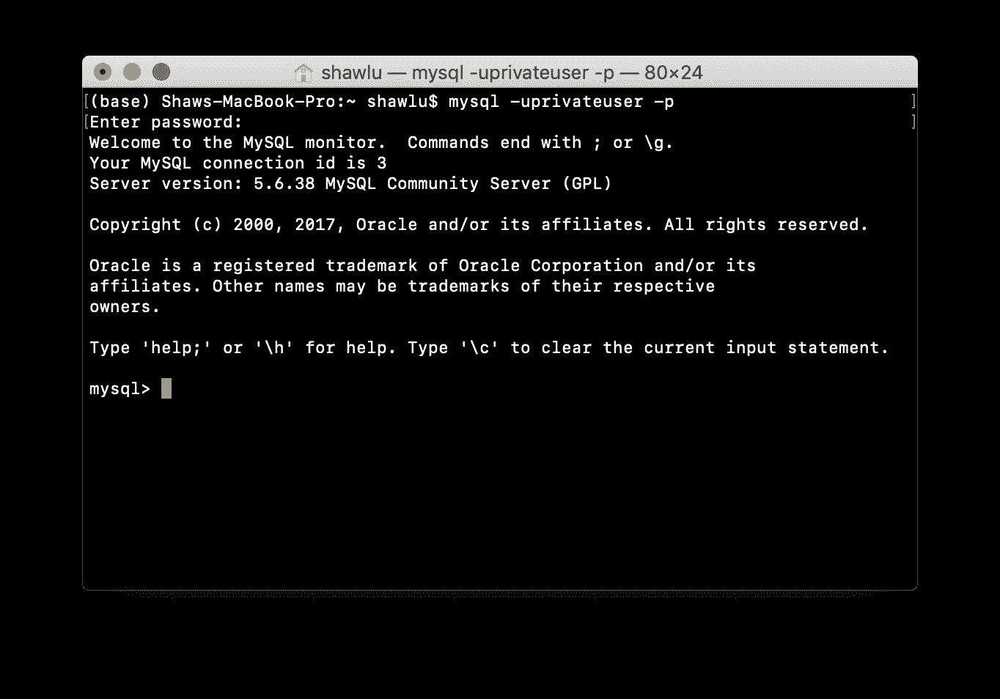
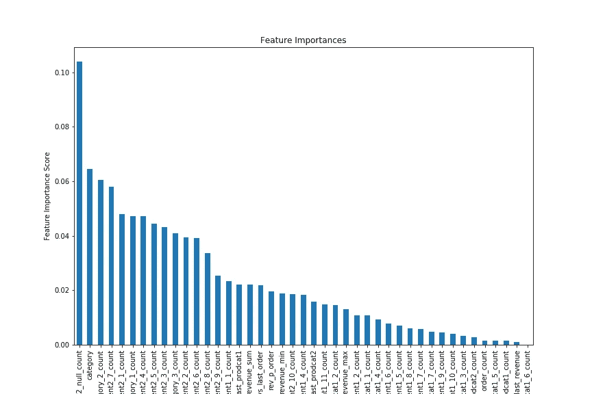

# SQL 和 Python 中的特征工程:一种混合方法

> 原文：<https://towardsdatascience.com/feature-engineering-in-sql-and-python-a-hybrid-approach-b52347cd2de4?source=collection_archive---------19----------------------->

## *设置您的工作站，减少工作场所的混乱，保持一个干净的命名空间，并毫不费力地保持您的数据集最新*


在了解 Pandas 之前，我很早就知道 SQL，Pandas 忠实地模拟 SQL 的方式引起了我的兴趣。一般来说，SQL 是为分析人员设计的，他们将数据整理成信息丰富的报告，而 Python 是为数据科学家设计的，他们使用数据来构建(并过度拟合)模型。尽管它们的功能几乎相同，但我认为这两种工具对于数据科学家高效工作都是必不可少的。根据我和熊猫相处的经验，我注意到了以下几点:

*   在探索不同的特性时，我最终得到了许多 CSV 文件。
*   当我在一个大的数据帧上进行聚合时，Jupyter 内核就会死亡。
*   在我的内核中，有多个数据帧有令人困惑的(长的)名字。
*   我的特征工程代码看起来很难看，分散在许多单元中。

当我直接在 SQL 中开始特性工程时，这些问题自然就解决了。所以在这篇文章中，我将通过一个带回家的挑战数据集来分享一些我最喜欢的技巧。如果你懂一点 SQL，是时候好好利用它了。

## 安装 MySQL

首先，您需要一台 SQL 服务器。我在这篇文章中使用 MySQL。你可以通过安装 MAMP、WAMP 或 XAMPP 等本地桌面服务器来获得 MySQL 服务器。网上有很多教程，值得不厌其烦的去做。

在设置好你的服务器后，确保你已经准备好三样东西:用户名，密码，端口号。通过终端输入以下命令登录(这里我们有用户名“root”，密码 1234567)。

```
mysql -uroot -p1234567
```



然后在 MySQL 控制台中创建一个名为“Shutterfly”的数据库(你可以随意命名)。这两个表将被加载到这个数据库中。

```
create database Shutterfly;
```

## 安装 sqlalchemy

您将需要 Pandas 和 sqlalchemy 来使用 Python 中的 SQL。我打赌你已经有熊猫了。然后通过激活您想要的环境来安装 sqlalchemy，启动 Jupyter notebook，并输入:

```
pip install sqlalchemy
```

sqlalchemy 模块还需要 *MySQLdb* 和 *mysqlclient* 模块。根据你的操作系统，这可以使用不同的[命令](https://stackoverflow.com/questions/454854/no-module-named-mysqldb)来安装。

## 将数据集加载到 MySQL 服务器

在这个例子中，我们将从两个 [CSV 文件](https://github.com/shawlu95/Data-Science-Toolbox/tree/master/case_study/shutterfly/data)中加载数据，并直接在 MySQL 中设计特性。为了加载数据集，我们需要使用用户名、密码、端口号和数据库名实例化一个**引擎**对象。将创建两个表:*在线*和*订单*。将在每个表上创建一个自然索引。

在 MySQL 控制台中，您可以验证表是否已经创建。

## 分割数据集

这可能看起来违背直觉，因为我们还没有构建任何特性。但它实际上非常简洁，因为我们所需要做的就是按照索引分割**数据集。通过设计，我还包含了我们试图预测的标签(事件 2)。当加载特性时，我们将简单地用特性表连接索引。**

在 MySQL 控制台中，您可以验证训练集和测试集是否已创建。

## 特征工程

这是最重要的部分。我直接用 Sublime 文本编写 SQL 代码，并通过将它们粘贴到 MySQL 控制台来调试我的代码。因为这个数据集是一个事件日志，所以我们必须避免将未来的信息泄露到每个数据点。正如您所想象的，每个特性都需要在历史上进行聚合！

连接表是最慢的操作，所以我们希望从每个连接中获得尽可能多的特征。在这个数据集中，我实现了四种类型的连接，产生了四组要素。细节并不重要，但是你可以在这里找到我所有的 SQL 片段。每个代码片段创建一个表。**索引被保留，并且必须与训练集和测试集中的响应变量正确匹配。**每个片段的结构如下:

要生成功能表，请打开一个新的终端，导航到包含 sql 文件的文件夹，并输入以下命令和密码。第一个代码片段创建了一些必要的索引来加速连接操作。接下来的四个片段创建了四个功能表。如果没有索引，连接将永远无法完成。使用索引，大约需要 20 分钟(在本地机器上还不错)。

```
mysql < add_index.sql -uroot -p1234567
mysql < feature_group_1.sql -uroot -p1234567
mysql < feature_group_2.sql -uroot -p1234567
mysql < feature_group_3.sql -uroot -p1234567
mysql < feature_group_4.sql -uroot -p1234567
```

现在，数据库中应该有下面的表。请注意，派生功能与原始事件日志分开存储，这有助于防止混淆和灾难。

## 加载功能

这里我写了一个从 MySQL 服务器获取数据的实用函数。

*   该函数将表名“trn_set”(训练集)或“tst_set”(测试集)作为输入，如果您只需要数据的一个子集，还需要一个可选的 *limit* 子句。
*   删除唯一列和大部分值缺失的列。
*   日期列映射到月份，以帮助捕捉季节性影响。
*   请注意特征表是如何连续连接的。这实际上是有效的，因为我们总是以一对一的映射来连接索引。

最后，让我们来看看 5 个培训示例及其特点。

现在您已经有了一个定义良好的数据集和特性集。您可以调整每个要素和缺失值的比例，以满足模型的要求。

对于基于树的方法，它对特征缩放是不变的，我们可以直接应用模型，只需专注于调整参数！在这里看一个普通的梯度推进机器[的例子。](https://github.com/shawlu95/Data-Science-Toolbox/blob/master/case_study/shutterfly/gbm_benchmark_2.ipynb)



很高兴看到除了*类别*功能之外，所有有用的功能都被设计出来了。我们的努力得到了回报！此外，event2 最具预测性的特性是在 event2 中观察到多少 nulls 值。这是一个说明性的例子**，我们不能用中值或平均值来代替空值**，因为它们缺失的事实与响应变量相关！

## 摘要

如您所见，我们没有中间 CSV 文件，笔记本中有一个非常干净的名称空间，我们的功能工程代码减少到几个简单的 SQL 语句。在两种情况下，SQL 方法更加高效:

*   如果您的数据集部署在云上，您可能能够运行分布式查询。如今，大多数 SQL server 都支持分布式查询。在 Pandas 中，您需要一些名为 *Dask DataFrame 的扩展。*
*   如果你能负担得起实时拉取数据，你可以创建 SQL **视图**而不是表。这样，每次用 Python 拉数据，**你的数据都会一直是最新的**。

这种方法的一个基本限制是，您必须能够用 Python 直接连接到 SQL server。如果这是不可能的，您可能需要下载一个 CSV 文件格式的查询结果，并在 Python 中加载它。

我希望这篇文章对你有所帮助。虽然我并不提倡一种方法优于另一种方法，但有必要了解每种方法的优点和局限性，并在我们的工具包中准备好这两种方法。因此，我们可以应用在约束条件下最有效的方法。