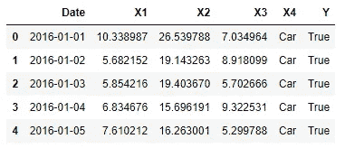
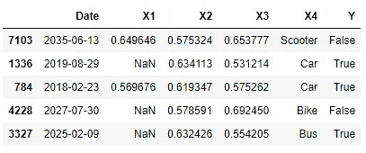
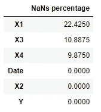
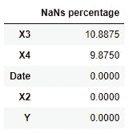
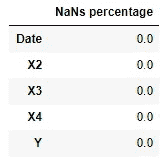
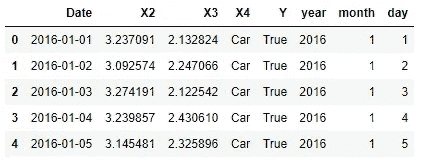
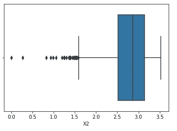
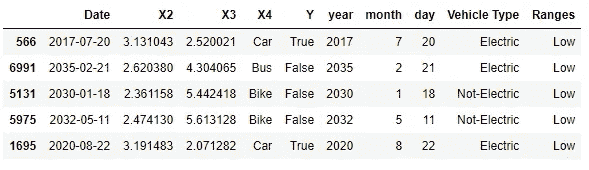
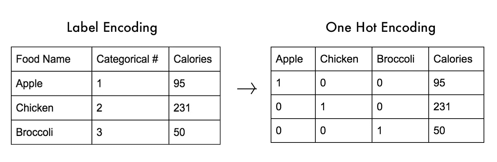

# 特征工程技术

> 原文：<https://towardsdatascience.com/feature-engineering-techniques-9a57e4901545?source=collection_archive---------12----------------------->

## 介绍一些可用于为机器学习分析准备原始特征的主要技术。


Photo by ["My Life Through A Lens"](https://unsplash.com/@bamagal?utm_source=medium&utm_medium=referral) on [Unsplash](https://unsplash.com?utm_source=medium&utm_medium=referral)

# 介绍

在开始机器学习分析之前，特征工程是最重要的步骤之一。创建尽可能最好的机器学习/深度学习模型当然有助于实现良好的结果，但选择正确格式的正确功能来输入模型可以大大提高性能，从而带来以下好处:

*   使我们能够使用更简单的机器学习模型来实现良好的模型性能。
*   使用更简单的机器学习模型，增加了我们模型的透明度，从而使我们更容易理解如何进行预测。
*   减少使用集成学习技术的需求。
*   减少执行[超参数优化](/hyperparameters-optimization-526348bb8e2d)的需求。

为了充分利用给定的数据，可以使用的其他常用技术是[特征选择](/feature-selection-techniques-1bfab5fe0784)和[提取](/feature-extraction-techniques-d619b56e31be)，我在以前的帖子中已经谈到过。

我们现在将介绍一些最常见的特征工程技术。大多数基本特征工程技术包括**发现数据中的不一致**和**通过组合/分割现有特征来创建新特征**。

本文使用的所有代码都可以在我的 GitHub 账户上的[链接](https://github.com/pierpaolo28/Artificial-Intelligence-Projects/blob/master/Features%20Analysis/FeatureEngineering.ipynb)中找到。

对于这个示例，我决定创建一个简单的数据集，它受到数据分析过程中面临的一些最常见问题的影响(例如，缺失数字、异常值、缩放问题等)。



Figure 1: Dataset Head

## 对数变换

使用对数变换时，原始要素的分布被变换为更接近高斯分布。这可能特别有用，尤其是当使用机器学习模型时，例如线性判别分析(LDA)和朴素贝叶斯分类器，它们假设它们的输入数据遵循高斯分布。

在本例中，我将对数据集中所有可用的数字要素应用对数变换。此外，我还决定用各自的最小值减去原始特征，然后将它们加到一起，以确保这些列中的每个元素都是正的(对数只支持正值)。



Figure 2: Logarithmically Transformed Dataset

## 归罪

插补是使用适当的值识别和替换数据集中缺失值的艺术。数据集中缺失值的存在可能是由许多可能的因素造成的，例如:隐私问题、使用传感器记录数据时的技术故障、人为错误等

有两种主要的插补类型:

*   **数字插补**:数字特征中缺失的数字可以使用许多不同的技术进行插补。使用的一些主要方法是用受影响列的总体平均值或模式替换缺失值。如果你有兴趣了解更多先进技术，你可以在这里找到更多信息[。](/why-using-a-mean-for-missing-data-is-a-bad-idea-alternative-imputation-algorithms-837c731c1008)
*   **分类插补**:对于分类特征，缺失值通常使用整体列模式替换。在某些特殊情况下，如果分类列结构没有很好地定义，那么最好替换丢失的值，创建一个新的类别，并将其命名为“未知”或“其他”。

我们现在可以，首先，通过运行下面几行来检查哪些特性受到 NaNs(不是一个数字)的影响。



Figure 3: Percentage of NaNs in each Feature

处理缺失数字的最简单方法之一是删除受其影响的所有行。不过，最好设置一个阈值(例如 20%)，只删除缺失数超过阈值的行。



Figure 4: Imputation by deleting features with excessive NaNs

另一个可能的解决方案是，对于我们的数值和分类数据，用列模式替换所有 nan。



Figure 5: Imputation using column mode

## 处理日期

[日期对象](https://www.w3schools.com/python/python_datetime.asp)由于其格式，对于机器学习模型来说可能很难处理。因此，有时有必要将一个日期分成多列。同样的考虑可以应用于数据分析中的许多其他常见情况(例如，自然语言处理)。

在我们的示例中，我们现在要将日期列分成三个不同的列:年、月和日。



Figure 6: Dealing with Dates

## 极端值

异常值是数据点的一小部分，这些数据点与特征中的其余观察值相距甚远。异常值可能被引入到数据集中，主要是因为收集数据时的错误，或者是因为我们的特定特征所特有的特殊异常。

使用四种主要技术来识别异常值:

*   **数据可视化**:通过目视检查数据分布来确定异常值。
*   **Z-Score** :如果我们知道我们的特征分布是高斯分布，就使用 Z-Score。事实上，当使用高斯分布时，我们知道分布的大约 2 个标准偏差意味着大约 95%的数据将被覆盖，而远离平均值的 3 个标准分布将覆盖大约 99.7%的数据。因此，使用介于 2 和 3 之间的因子值，我们能够非常准确地删除所有异常值。如果你有兴趣了解更多关于高斯分布的信息，你可以在这里找到更多信息。
*   **百分位数**:是另一种识别异常值的统计方法。当使用百分位数时，我们假设数据的某个顶部和底部百分比是异常值。使用这种方法的关键点是找到最佳百分比值。一种有用的方法是在应用百分位数法检查总体结果之前和之后，将数据可视化。
*   **封顶**:我们不是删除异常值，而是用我们列中最高的正常值来替换它们。

其他常用于检测异常值的更高级技术有 [DBSCAN](https://en.wikipedia.org/wiki/DBSCAN) 和[隔离林](https://scikit-learn.org/stable/modules/generated/sklearn.ensemble.IsolationForest.html)。

继续我们的例子，我们可以从左边的两个数字特征(X2，X3)开始。通过使用 Seaborn 创建一个简单的箱线图，我们可以清楚地看到 X2 有一些异常值。



Figure 7: Examining Outliers using Data Visualization

使用 Z 分数(因子为 2)和百分位数方法，我们现在可以测试在 X2 将识别出多少异常值。如下面的输出框所示，使用 Z 分数确定了 234 个值，而使用百分位数方法删除了 800 个值。

```
8000
7766
7200
```

此外，还可以通过限制异常值来处理异常值，而不是丢弃它们。

## 扔掉

宁滨是一种用于平滑噪声数据的常用技术，通过将数字或分类特征划分到不同的箱中。因此，这可以帮助我们降低过度拟合的风险(尽管可能会降低我们的模型精度)。



Figure 8: Binning Numeric and Categoric Data

## 分类数据编码

大多数机器学习模型目前不能处理分类数据，因此通常需要在将所有分类特征输入到机器学习模型之前将其转换为数字。

可以在 Python 中实现不同的技术，例如:One Hot Encoding(转换要素)和 Label Encoder(转换标注)。

一种热编码采用一个特征，并将它分割成与原始列中不同类别的数量一样多的列。然后，它给所有没有该特定类别的行分配一个 0，给所有有该类别的行分配一个 1。使用 Pandas***get _ dummies()***函数可以在 Python 中实现一个热编码。

Label Encoder 通过为所有分类案例分配不同的编号并将它们存储在一列中来替代所有分类案例。

不使用具有正常特征的标签编码器是非常优选的，因为一些机器学习模型可能会混淆，并认为具有比其他值更高的值的编码情况可能对它们更重要(按层次顺序考虑它们)。当使用一种热编码时，这种情况不会发生。



Figure 9: Difference between One Hot Encoding and Label Encoding [1]

我们现在可以继续将数据集划分为特征( ***X*** )和标签( ***Y*** )，然后分别应用一个热编码和标签编码器。

## 缩放比例

在大多数数据集中，数字特征都有不同的范围(例如，身高与体重)。虽然，对于一些机器学习算法来说，将我们的输入特征限制在一个定义的范围内是很重要的。事实上，对于一些基于距离的模型，如朴素贝叶斯、[支持向量机](/svm-feature-selection-and-kernels-840781cc1a6c)和聚类算法，如果它们都有不同的范围，那么几乎不可能比较不同的特征。

缩放特征的两种常见方式是:

*   **标准化:**缩放输入要素，同时考虑它们的标准偏差(使用标准化，我们的变换后的要素将看起来类似于正态分布)。这种方法可以降低异常值的重要性，但由于标准差的差异，可能会导致要素之间的不同范围。通过使用[***StandardScaler()***](https://scikit-learn.org/stable/modules/generated/sklearn.preprocessing.StandardScaler.html)可以在 scikit-learn 中实现标准化。
*   **归一化:**在 0 和 1 之间的范围内缩放所有特征，但是会增加异常值的影响，因为没有考虑每个不同特征的标准偏差。使用[***minmax scaler()***](https://scikit-learn.org/stable/modules/generated/sklearn.preprocessing.MinMaxScaler.html#sklearn.preprocessing.MinMaxScaler)可以在 scikit-learn 中实现归一化。

在本例中，我们将使用标准化，然后我们将处理异常值。如果您正在处理的数据集没有受到离群值的广泛影响，scikit-learn 还提供了另一个名为 [***的标准化函数，该函数可以在默认情况下减少离群值的影响。***](https://scikit-learn.org/stable/modules/generated/sklearn.preprocessing.RobustScaler.html)

## 自动化特征工程

为了使特征工程过程自动化，在过去几年中已经开发了不同的技术和软件包。当对我们的数据集进行第一次分析时，这些肯定会产生有用的结果，但是它们仍然不能完全自动化整个特征工程过程。关于数据的领域知识和数据科学家在对原始数据建模以最适合分析目的方面的专业知识是不可替代的。Python 中最流行的自动特征选择库之一是 [Featuretools](https://docs.featuretools.com/#) 。

# 结论

现在是时候通过使用随机森林分类器来最终测试我们抛光的数据集预测准确性了。如下所示，我们的分类器现在成功地实现了 100%的预测准确率。

```
1.40625
[[1204    0]
 [   0 1196]]
              precision    recall  f1-score   support

           0       1.00      1.00      1.00      1204
           1       1.00      1.00      1.00      1196

   micro avg       1.00      1.00      1.00      2400
   macro avg       1.00      1.00      1.00      2400
weighted avg       1.00      1.00      1.00      2400
```

*希望您喜欢这篇文章，感谢您的阅读！*

# 联系人

如果你想了解我最新的文章和项目[，请在媒体](https://medium.com/@pierpaoloippolito28?source=post_page---------------------------)上关注我，并订阅我的[邮件列表](http://eepurl.com/gwO-Dr?source=post_page---------------------------)。以下是我的一些联系人详细信息:

*   [领英](https://uk.linkedin.com/in/pier-paolo-ippolito-202917146?source=post_page---------------------------)
*   [个人博客](https://pierpaolo28.github.io/blog/?source=post_page---------------------------)
*   [个人网站](https://pierpaolo28.github.io/?source=post_page---------------------------)
*   [中型简介](https://towardsdatascience.com/@pierpaoloippolito28?source=post_page---------------------------)
*   [GitHub](https://github.com/pierpaolo28?source=post_page---------------------------)
*   [卡格尔](https://www.kaggle.com/pierpaolo28?source=post_page---------------------------)

# 文献学

[1]什么是 One Hot Encoding，如何进行？迈克尔·德尔索尔，中号。访问地址:[https://medium . com/@ michaeldelsole/what-one-hot-encoding-and-how-do-it-f0ae 272 f 1179](https://medium.com/@michaeldelsole/what-is-one-hot-encoding-and-how-to-do-it-f0ae272f1179)