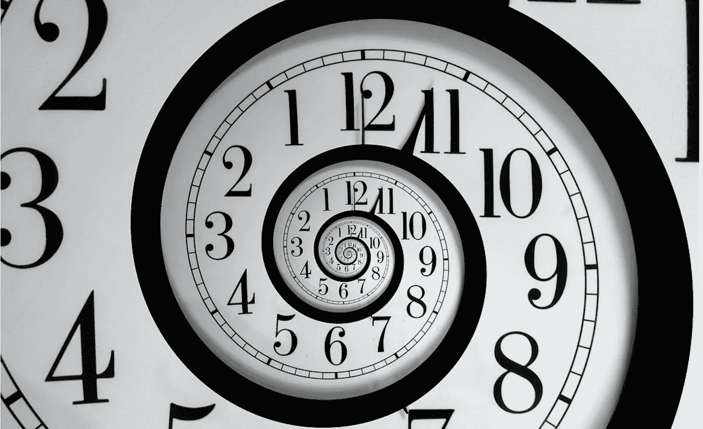
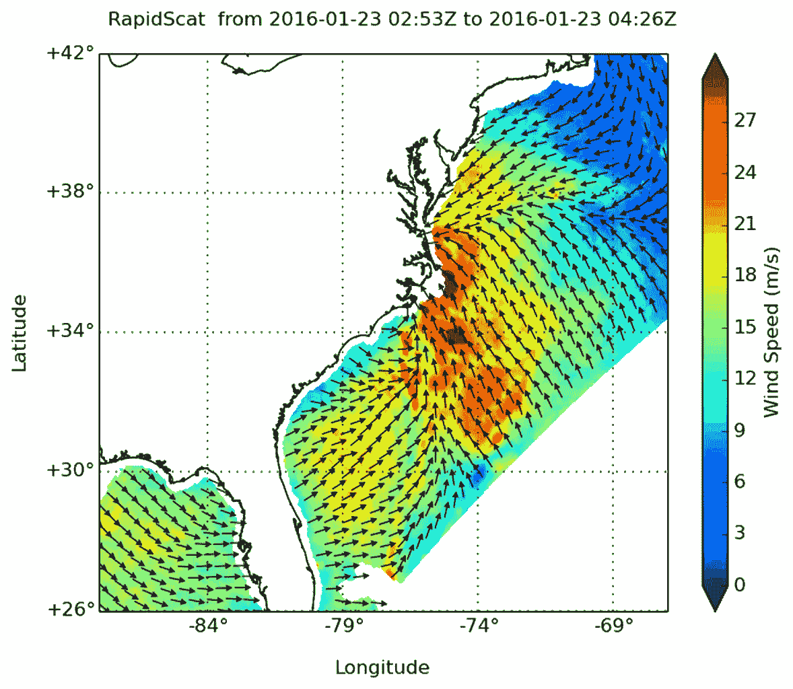
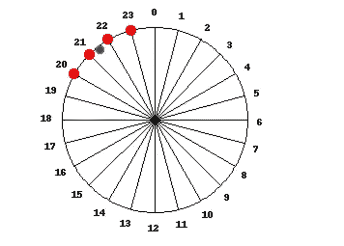
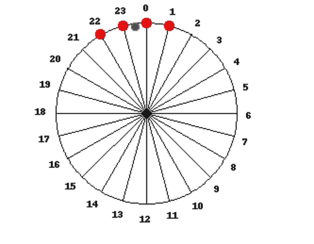
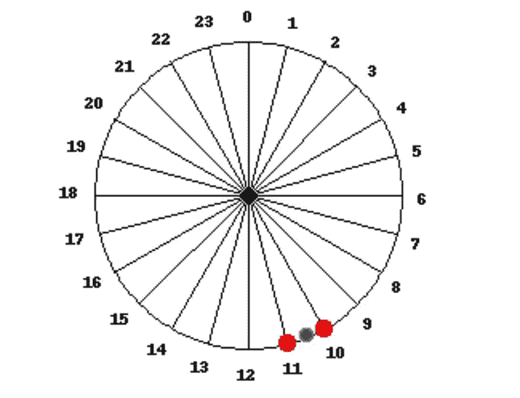
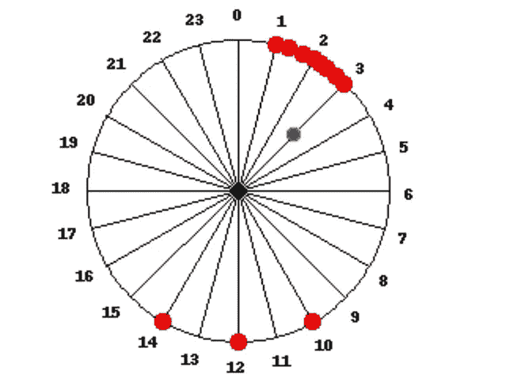
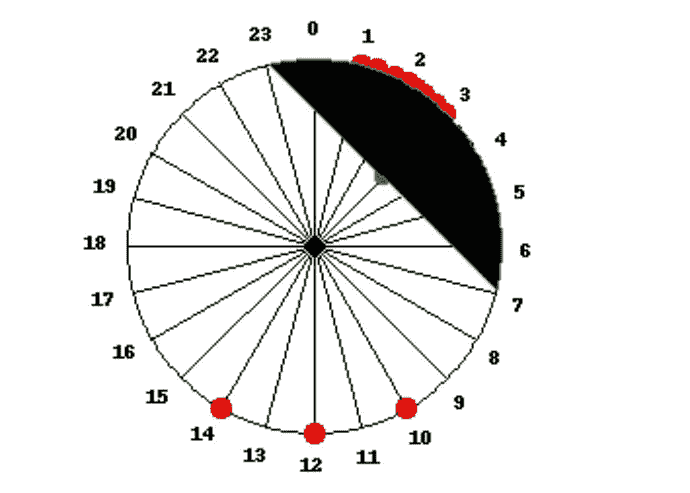

# 特征工程时间

> 原文：<https://towardsdatascience.com/feature-engineering-time-3934038e0dbe?source=collection_archive---------10----------------------->

## 计算圆形/周期性特征的统计数据。

> 在本帖中，我们将讨论一种处理周期性特征的数学方法。
> 这可用于计算平均值。
> (例如 23:50，22:40，00:30 的平均时间是多少？)
> 它也是聚类的一个有用的距离度量。
> (比如 00:01 比 00:10 更接近 23:59，能不能优雅地解决这个？)
> 同样的方法在特征工程中证明是有用的，例如 ML 模型的圆形特征**“一天中的时间”**或**“一年中的一天”**或**“方位角”**。

## 问题:

1.  根据事件时间对事件进行聚类。
2.  当一天中的时间是重要特征时，学习一些结果的模型。
3.  计算每个用户完成一个动作几次的典型时间。

## 一个有问题的问题:

你如何处理集群中跨越到第二天的事件？一些用户可能是夜猫子或来自另一个时区；如果他们的活动持续到午夜，数学就变得更难了。
如果用户在 23:57、23:58 和 23:59 发送消息，计算平均值是简单的。用户迟到一分钟怎么办？显然我们不想把 00:00 加到平均值上。
假设您正试图预测某个依赖于一天中某个时间的结果，一个简单的模型(回归)将在午夜遭遇中断。

# 尝试 1，暴力:

让我们假设我们的用户必须在某个时刻离线，在某个时刻有一个边界，在其附近没有任何活动。
然后我们可以“移动”到那个时区，添加几个小时来将日期边界放在空白处。

## 问题:

我们可能有遍布全球的用户，他们有不同的活动模式，我们需要找到每个用户的时移。往好里说，这是非常低效的，往坏里说，这可能是不可能的。更糟糕的是，如果我们的假设是错误的呢？如果我们看不到活动和不活动之间如此清晰的界限，会怎么样？

# 灵感:平均风向。

Wind direction off the East coast.

看着风的地图，我们对风的平均方向(和大小)有很好的直觉。

359 和 1 之间的任意区别丝毫不会困扰我们，因为我们取的是向量平均值。当我们用手指指向一个方向时，360°的数学跳跃并不重要。

我们如何将这种直觉形式化？让我们把方向描述为一个二维向量(x，y)，而不是一个单一的标量，也就是“航向”。

# 是的，让我们做那件事，有时间

让我们将时间映射到 24 小时制的圆周上

The geometric representation of time of day lends itself to geometric clustering, averaging. (Code to generate these if you want to play around with them is provided in a notebook linked below.)

如果我们想要聚类，我们在 2d 空间(x，y)中聚类。如果要取平均值，就取点(重心)的几何平均值。
如果我们想在模型中使用时间作为特征，我们使用向量，(x，y)。

## 当平均值不在圆上时会发生什么。

尽管多于一个点的任何平均值都在圆内；范围越大，平均值离圆周越远。

**Left**: with small variance, the center is very close to the circle’s edge and shows the average time; **Center**: the high variance of the points puts the center inside the circle. The direction of the center indicates the average time, in this case 3:00\. **Right**: A measure that is analogous to standard deviation can be derived by examining the arc defined by the chord that is bisected by that center.

# 摘要

通过将一天中的时间映射到代表 24 小时的 2D 圆，我们可以缓解时针从 23 到 0 时出现的不连续性。
这也适用于一年中的**天**，或者实际的**方向**。

这个新的 2D 向量(可以简单地是模型中的两列)表现得非常自然，它定义了一个将 23:59 和 00:01 放在一起的度量。同样，它把 12 月 31 日和 1 月 1 日放在一起。NNE 和 NNW 不关心它们在 360 — (0)的不同侧

这些不连续点一开始是任意的，但是只要我们只用一个维度，它们就一定会出现在某个地方。在 2D，一切又变得美好起来。

# 代码:

你可以克隆这个笔记本来玩代码。(还包含 pySpark 计算平均值的可行示例。)

# 附录，数学和操作方法:

**把时间映射**到圆周上很简单。

1.  把时间转换成一个单一的数字[0，24]{或者[0，1]，这可能是免费的}所以 12:36 可能是 12.6 {或者 0.525}。
2.  然后将这个数字乘以 15，得到 360。{或 360 度}
3.  然后取 ***Sin*** 和 ***Cos*** 得到 ***Y*** 和 ***X*** 坐标。(开心注:SQL 有三角函数，别忘了换算成弧度)
4.  要计算平均值，只需独立取 ***X*** 和 ***Y*** 的平均值。
5.  使用*(E(***Y***)、E( ***X*** ))变换回时间，然后反向变换(弧度到角度，取消拉伸到 24H)*

## *奖金，标准发展:*

1.  *用给出的勾股定理 ***X*** 和 ***Y*** 计算半径， ***r*** 。*
2.  *代表标准差的圆弧由**arccos**(***r***)给出。证明这一点是留给读者的练习。*