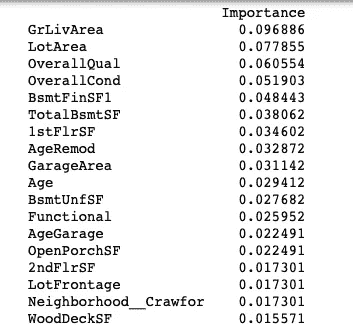
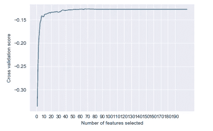

# 特征工程-将数据集转换成机器可用的格式

> 原文：<https://towardsdatascience.com/feature-engineering-translating-the-dataset-to-a-machine-ready-format-af4788d15d6c?source=collection_archive---------23----------------------->

## 创建可以帮助机器学习算法工作的功能


这一步使您的数据为最终训练做好准备。特性工程的方法基于对数据的良好理解，正如我在之前关于 [EDA](/exploratory-data-analysis-unravelling-a-story-with-data-b01d70069035) 的文章中提到的。我将继续使用 Kaggle 上的住房数据集(在上一篇文章中用于解释 EDA)，来说明我是如何对它进行特征工程的。

测试和训练数据集都被合并，以从特征工程开始。我按照以下步骤得出最终数据集:

## ***剔除异常值***

在上一篇文章中，我举例说明了如何识别异常值。第一步是删除所有带有离群值的索引，因为离群值往往会向机器传递关于数据集的不准确信息。

## 将分类变量转换为数字变量

其次，分类变量需要转换为数值变量，因为大多数机器学习算法只能读取数值。

请注意，一些分类变量(如 Alley、GarageQual、BsmtQual)缺少一些值，而其他变量则由“Po”、“Gd”、“TA”等值填充。数据描述文件有助于解释这些变量的含义。在这种情况下，缺失的数据仅仅意味着房子可能没有小巷、车库或地下室。因此，我使用下面的代码来估算缺失值，并将现有值转换为数字值:

```
combined.Alley = combined.Alley.map({np.nan:0, 'Grvl':1, 'Pave':2})
combined.BsmtCond = combined.BsmtCond.map({np.nan:0, 'Po':1, 'Fa':2, 'TA':3, 'Gd':4, 'Ex':5})*combined is the name of the merged dataset of train and test
```

这是可能的，因为赋值就像等级变量，例如“Fa”比“Po”好，“TA”比“Fa”好。

但是对于那些值不表示等级的分类变量，pandas 的 get_dummies 函数将行转换为列。

## 输入分类和数值特征的缺失值

但在此之前，重要的是估算所有分类变量的缺失值。例如，mischaracter 和 MasVnrType 缺少值，这可能表明它们不存在。有一个简单的方法来交叉检查这个。如果 MiscVal 和 MasVnrArea 是对应于缺失值的零，则假设是正确的，可以估算如下:

```
combined.MiscFeature.fillna('NA', inplace=True)
combined.MasVnrType.fillna('None', inplace=True)
```

对于 KitchenQual 或 SaleType 等其他特性，使用值的模式对它们进行估算更安全。

数字特征中缺失的值可以通过放置零来估算，具体取决于特征。例如，GarageCars 列中缺少值可能表示根本没有车库，因此零是最合适的值。

GarageYrBlt 也有缺失值，我用零来估算，因为不可能猜出缺失的年份！

## 处理时间变量

数据集中有 5 个时间变量。将它们转换成年龄变量似乎更有意义，因为它们提供了关于特征寿命的更多信息。类似于这样的事实，陈述“X 先生在 66 岁时去世”比陈述“X 先生在 2019 年去世”包含更多的信息。因此引入了三个年龄特征:

```
combined['Age'] = combined.YrSold - combined.YearBuilt
combined['AgeRemod'] = combined.YrSold - combined.YearRemodAdd
combined['AgeGarage'] = combined.YrSold - combined.GarageYrBlt 
```

“AgeGarage”列的值似乎很少，都在 2000 左右！这是因为 GarageYrBlt 的缺失值被估算为零，如前一节所述。根据以下代码，所有这些异常值都被替换为低于某个阈值的最大可能值:

```
max_AgeGarage = np.max(combined.AgeGarage[combined.AgeGarage < 1000])
combined['AgeGarage'] = combined['AgeGarage'].map(lambda x: max_AgeGarage if x > 1000 else x)
```

负值，如果有的话，应该被替换为零，并且原始时间特征现在可以被丢弃。

## 将分类列转换为虚拟列

分类特征现在可以用示例代码转换成虚拟列:

```
Foundation_dummies=pd.get_dummies(combined['Foundation'], prefix='Foundation_', drop_first=True)
combined=pd.concat([combined, Foundation_dummies], axis=1)
combined.drop('Foundation', axis=1, inplace=True)
```

prefix 参数有助于以后识别列。我们只需要保留 k 列中的 k-1 列，因此 drop_first 被设置为 True。要了解更多关于这些论点的信息，请阅读此处的。

虚拟数据集与原始数据集连接在一起，实际的列被删除。

数据集几乎建立起来了，但还没有。

完整的数据集现在有 209 列！数据太多，机器消化不了。更多的特征会导致更多的噪声，并最终导致过度拟合。

## 删除不重要的功能

问题是如何决定放弃哪个特性？幸运的是 XGBoost 有一个答案。

组合的数据集被切片以获得训练集，并且 xgboost 对象被拟合在其上。

```
X = combined[:-1459]
y = targets
y = y.drop(index_drop).reset_index(drop=True)xgb = XGBRegressor()
xgb.fit(X, y)
```

然后计算特征重要性并排序:

```
imp = pd.DataFrame(xgb.feature_importances_ ,columns = ['Importance'],index = X.columns)
imp = imp.sort_values(['Importance'], ascending = False)
print(imp)
```

结果是这样的:



有很多功能的重要性为零。为了确定到底应该保留多少特性，我使用了一个名为 [RFECV](https://scikit-learn.org/stable/modules/generated/sklearn.feature_selection.RFECV.html) 的函数。

RFECV 告诉我们应该保留多少和哪些特性。它有一个评分参数，我用 RMSE(均方根误差)来表示，因为 Kaggle 练习也将根据相同的条件进行评估。以下函数定义 rmse，并使其成为计分器:

```
def rmse(y_true, y_pred):
    return np.sqrt(np.mean((y_true-y_pred)**2))rmse = make_scorer(rmse, greater_is_better=False)
```

因为目标是减少 RMSE，所以“越大越好”的参数被设置为假。最后，RFECV 在 X 和 y 数据集上拟合，给出了最佳特征数 67！

```
rfecv = RFECV(estimator=xgb, step=1, cv=3, n_jobs=-1, scoring=rmse)
rfecv = rfecv.fit(X, y)
print("Optimal number of features : %d" % rfecv.n_features_)
```

绘制特征与交叉验证分数的关系为我们提供了下图:

```
plt.figure()
plt.xlabel("Number of features selected")
plt.ylabel("Cross validation score")
plt.xticks(np.arange(0,200,10))
plt.plot(range(1, len(rfecv.grid_scores_) + 1), rfecv.grid_scores_)
plt.show()
```



在大约 67 个特征之后，交叉验证分数几乎没有改善。这里的下一步是检查函数建议哪些列。

```
features_kept = X.columns.values[rfecv.support_] 
X = X[features_kept]
```

X 的特点是:

```
LotFrontage
LotArea
Alley
OverallQual
OverallCond
MasVnrArea
ExterQual
ExterCond
BsmtQual
BsmtCond
BsmtExposure
BsmtFinType1
BsmtFinSF1
BsmtFinSF2
BsmtUnfSF
TotalBsmtSF
HeatingQC
CentralAir
1stFlrSF
2ndFlrSF
GrLivArea
BsmtFullBath
FullBath
HalfBath
KitchenAbvGr
KitchenQual
Functional
FireplaceQu
GarageType
GarageFinish
GarageCars
GarageArea
GarageQual
GarageCond
PavedDrive
WoodDeckSF
OpenPorchSF
EnclosedPorch
ScreenPorch
PoolArea 
Fence
Age
AgeRemod
AgeGarage
MSZoning__FV
MSZoning__RL
MSZoning__RM
LotConfig__CulDSac
Street__Pave
Foundation__CBlock
Neighborhood__BrkSide
Neighborhood__ClearCr
Neighborhood__Crawfor
Neighborhood__OldTown
Neighborhood__Sawyer
Neighborhood__StoneBr
Condition1__Norm
Exterior1st__BrkComm
Exterior1st__BrkFace
Exterior1st__HdBoard
Exterior2nd__BrkFace
Exterior2nd__Wd Shng
HouseStyle__SLvl
SaleType__New
SaleCondition__Family
SaleCondition__Normal
MSSubClass__class2
```

这里有一些功能，根据我们在 [EDA](/exploratory-data-analysis-unravelling-a-story-with-data-b01d70069035) 中的分析，这些功能本不应该出现在这里。例如，我们已经推断出公摊面积不是预测销售价格的重要特征。

因此可以删除 PoolArea。

其次，有一些变量是相互关联的。因此，只保留其中一个是有意义的。运行命令时(参考上一篇关于 [EDA](/exploratory-data-analysis-unravelling-a-story-with-data-b01d70069035) 的文章):

```
print(corr['SalePrice'].sort_values(ascending=False))SalePrice        1.000000
OverallQual      0.790982
GrLivArea        0.708624
GarageCars       0.640409
GarageArea       0.623431
TotalBsmtSF      0.613581
1stFlrSF         0.605852
FullBath         0.560664
TotRmsAbvGrd     0.533723
YearBuilt        0.522897
YearRemodAdd     0.507101
GarageYrBlt      0.486362
MasVnrArea       0.477493
Fireplaces       0.466929
BsmtFinSF1       0.386420
LotFrontage      0.351799
WoodDeckSF       0.324413
2ndFlrSF         0.319334
OpenPorchSF      0.315856
HalfBath         0.284108
LotArea          0.263843
BsmtFullBath     0.227122
BsmtUnfSF        0.214479
BedroomAbvGr     0.168213
ScreenPorch      0.111447
PoolArea         0.092404
MoSold           0.046432
3SsnPorch        0.044584
BsmtFinSF2      -0.011378
BsmtHalfBath    -0.016844
MiscVal         -0.021190
Id              -0.021917
LowQualFinSF    -0.025606
YrSold          -0.028923
OverallCond     -0.077856
MSSubClass      -0.084284
EnclosedPorch   -0.128578
KitchenAbvGr    -0.135907
```

因此，GarageArea，1stFlrSF 可能会被删除，我们减少到 64 个功能。

这里的结论是，一个人不应该盲从任何函数的结果。我们应该每时每刻问自己，这是否有意义。因此，据说通过机器学习实现高精度不仅是一门科学，也是一门艺术。特征工程通常是一个迭代过程，在实施模型时，可能需要进一步修改数据集以实现更高的精度。

我继续使用这个数据集，并用不同的算法进行训练，这将在我的下一篇博客中介绍。

欢迎提出进一步改进功能工程的建议！