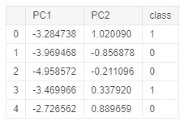
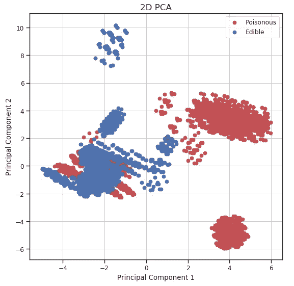
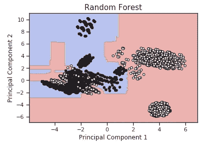
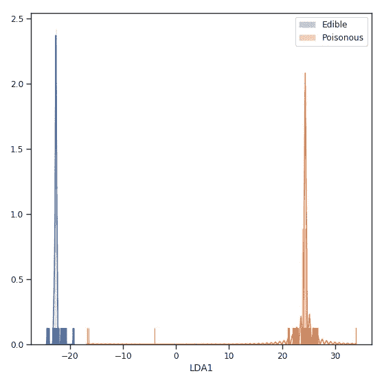
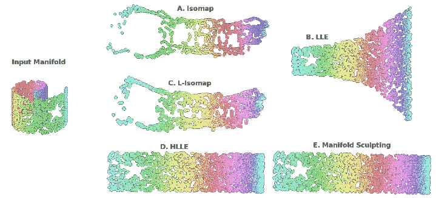

# 特征提取技术

> 原文：<https://towardsdatascience.com/feature-extraction-techniques-d619b56e31be?source=collection_archive---------0----------------------->

## 关于如何使用特征提取技术(如 PCA、ICA、LDA、LLE、t-SNE 和 AE)降低数据集维数的端到端指南。


(Source: [https://blog.datasciencedojo.com/curse-of-dimensionality-python/](https://blog.datasciencedojo.com/curse-of-dimensionality-python/))

# 介绍

如今，处理包含数百(甚至数千)个要素的数据集变得非常普遍。如果特征的数量变得相似(甚至更大！)多于数据集中存储的观察值的数量，那么这很可能导致机器学习模型遭受过度拟合。为了避免这种类型的问题，有必要应用正则化或降维技术(特征提取)。在机器学习中，数据集的维数等于用来表示它的变量的数量。

使用正则化当然有助于降低过拟合的风险，但是使用特征提取技术也可以带来其他类型的优势，例如:

*   精度提高。
*   过度拟合风险降低。
*   在训练中加速。
*   改进的数据可视化。
*   增加我们模型的可解释性。

要素提取旨在通过从现有要素创建新要素(然后丢弃原始要素)来减少数据集中的要素数量。这些新的精简特征集应该能够概括原始特征集中包含的大部分信息。这样，可以从原始集合的组合中创建原始特征的概括版本。

另一种减少数据集中要素数量的常用技术是要素选择。要素选择和要素提取的区别在于，要素选择旨在对数据集中现有要素的重要性进行排序，并丢弃不太重要的要素(不创建新要素)。如果你有兴趣了解更多关于特性选择的信息，你可以在[我之前的文章](https://medium.com/@pierpaoloippolito28/feature-selection-techniques-1bfab5fe0784)中找到更多关于特性选择的信息。

在本文中，我将以 [Kaggle 蘑菇分类数据集](https://www.kaggle.com/uciml/mushroom-classification)为例，向您介绍如何应用特征提取技术。我们的目标是试图通过观察给定的特征来预测蘑菇是否有毒。这篇文章中使用的所有代码(以及更多！)可在 [Kaggle](https://www.kaggle.com/pierpaolo28/feature-extraction?scriptVersionId=21698205) 和[我的 GitHub 账户](https://github.com/pierpaolo28/Artificial-Intelligence-Projects/blob/master/Features%20Analysis/feature-extraction.ipynb)上获得。

首先，我们需要导入所有必需的库。

下图显示了我们将在本例中使用的数据集。


Figure 1: Mushroom Classification dataset

在将这些数据输入到我们的机器学习模型之前，我决定将我们的数据分为特征(***【X】***)和标签(***【Y***)，并对所有分类变量进行热编码。

随后，我决定创建一个函数( ***forest_test*** )将输入数据分成训练集和测试集，然后训练和测试一个随机的森林分类器。

我们现在可以使用整个数据集来使用该函数，然后在使用简化版本而不是整个数据集时，连续使用该函数来比较这些结果。

如下所示，使用所有特征训练随机森林分类器，在大约 2.2 秒的训练时间内达到 100%的准确度。在下面的每个例子中，每个模型的训练时间将在每个片段的第一行打印出来，供您参考。

```
2.2676709799999992
[[1274    0]
 [   0 1164]]
              precision    recall  f1-score   support

           0       1.00      1.00      1.00      1274
           1       1.00      1.00      1.00      1164

    accuracy                           1.00      2438
   macro avg       1.00      1.00      1.00      2438
weighted avg       1.00      1.00      1.00      2438
```

# 特征抽出

## 主成分分析

主成分分析是最常用的线性降维技术之一。当使用主成分分析时，我们将原始数据作为输入，并试图找到能够最好地概括原始数据分布的输入特征的组合，从而降低其原始维数。PCA 能够通过查看成对距离最大化方差和最小化重建误差来做到这一点。在 PCA 中，我们的原始数据被投影到一组正交轴上，每个轴按照重要性排序。

PCA 是一种无监督学习算法，因此它不关心数据标签，而只关心变化。这在某些情况下会导致数据的错误分类。

在本例中，我将首先在整个数据集中执行 PCA，将数据缩减为二维，然后用新要素及其各自的标注构建一个数据框。



Figure 2: PCA Dataset

使用我们新创建的数据框，我们现在可以在 2D 散点图中绘制我们的数据分布。



Figure 3: 2D PCA Visualization

我们现在可以重复同样的过程，保留 3 个维度，使用 [Plotly](/interactive-data-visualization-167ae26016e8) 创建动画(请随意与下面的动画互动！).

在使用 PCA 时，我们还可以使用***explained _ variance _ ratio _***sci kit-learn 函数来探究原始数据方差保留了多少。一旦计算出方差比，我们就可以继续创建有趣的可视化图形。

使用由 PCA 构建的 3 个特征的集合(而不是整个数据集)再次运行随机森林分类器导致 98%的分类准确度，而仅使用 2 个特征 95%的准确度。

```
[10.31484926  9.42671062  8.35720548]
2.769664902999999
[[1261   13]
 [  41 1123]]
              precision    recall  f1-score   support

           0       0.97      0.99      0.98      1274
           1       0.99      0.96      0.98      1164

    accuracy                           0.98      2438
   macro avg       0.98      0.98      0.98      2438
weighted avg       0.98      0.98      0.98      2438
```

此外，使用我们的二维数据集，我们现在还可以可视化随机森林使用的决策边界，以便对每个不同的数据点进行分类。



Figure 4: PCA Random Forest Decision Boundary

## 独立成分分析

ICA 是一种线性降维方法，它将独立分量的混合作为输入数据，其目的是正确识别它们中的每一个(删除所有不必要的噪声)。如果两个输入特征的线性和非线性相关性都等于零[1]，则可以认为这两个输入特征是独立的。

独立分量分析通常用于医疗应用，如 EEG 和 fMRI 分析，以将有用的信号与无用的信号分开。

作为 ICA 应用程序的一个简单示例，让我们考虑一个音频注册，其中有两个不同的人在说话。例如，使用 ICA，我们可以尝试识别配准中的两个不同的独立成分(两个不同的人)。通过这种方式，我们可以让我们的无监督学习算法识别对话中不同的说话者。

使用 ICA，我们现在可以再次将数据集减少到只有三个特征，使用随机森林分类器测试其准确性，并绘制结果。

```
2.8933812039999793
[[1263   11]
 [  44 1120]]
              precision    recall  f1-score   support

           0       0.97      0.99      0.98      1274
           1       0.99      0.96      0.98      1164

    accuracy                           0.98      2438
   macro avg       0.98      0.98      0.98      2438
weighted avg       0.98      0.98      0.98      2438
```

从下面的动画中我们可以看到，尽管 PCA 和 ICA 导致了相同的精度结果，但它们构建了两种不同的三维空间分布。

## 线性判别分析(LDA)

LDA 是监督学习降维技术和机器学习分类器。

LDA 的目标是最大化每个类的均值之间的距离，并最小化类本身内的扩散。因此，LDA 使用类内和类间作为度量。这是一个很好的选择，因为在低维空间中投影数据时，最大化每个类的均值之间的距离可以获得更好的分类结果(由于不同类之间的重叠减少)。

使用 LDA 时，假设输入数据遵循高斯分布(如本例所示)，因此将 LDA 应用于非高斯数据可能会导致较差的分类结果。

在本例中，我们将运行 LDA 将数据集缩减为一个要素，测试其准确性并绘制结果。

```
Original number of features: 117
Reduced number of features: 1
```

因为我们的数据分布紧密遵循高斯分布，所以 LDA 表现得非常好，在这种情况下，使用随机森林分类器实现了 100%的准确性。

```
1.2756952610000099
[[1274    0]
 [   0 1164]]
              precision    recall  f1-score   support

           0       1.00      1.00      1.00      1274
           1       1.00      1.00      1.00      1164

    accuracy                           1.00      2438
   macro avg       1.00      1.00      1.00      2438
weighted avg       1.00      1.00      1.00      2438
```

正如我在本节开始时提到的，LDA 也可以用作分类器。因此，我们现在可以测试 LDA 分类器在这种情况下的表现。

```
0.008464782999993758
[[1274    0]
 [   2 1162]]
              precision    recall  f1-score   support

           0       1.00      1.00      1.00      1274
           1       1.00      1.00      1.00      1164

    accuracy                           1.00      2438
   macro avg       1.00      1.00      1.00      2438
weighted avg       1.00      1.00      1.00      2438
```

最后，我们现在可以可视化我们的两类分布看起来像创建我们的一维数据的分布图。



Figure 5: LDA Classes Separation

## 局部线性嵌入(LLE)

到目前为止，我们已经考虑了诸如 PCA 和 LDA 的方法，它们能够在不同特征之间的线性关系的情况下执行得非常好，我们现在将继续考虑如何处理非线性情况。

局部线性嵌入是一种基于流形学习的降维技术。流形是嵌入在更高维度空间中的 D 维对象。流形学习的目标是让这个对象可以在它原来的三维空间中表现，而不是在一个不必要的更大的空间中表现。

用于解释机器学习中流形学习的一个典型例子是瑞士滚动流形(图 6)。给我们一些数据作为输入，这些数据的分布类似于一个卷(在三维空间中)，然后我们可以展开它，以便将我们的数据减少到二维空间中。

流形学习算法的一些例子是:Isomap、局部线性嵌入、修改的局部线性嵌入、Hessian 特征映射等



Figure 6: Manifold Learning [2]

现在，我将向您介绍如何在我们的示例中实现 LLE。根据 Scikit-learn 文档[3]:

> 局部线性嵌入(LLE)寻求数据的低维投影，其保持局部邻域内的距离。它可以被认为是一系列局部主成分分析，它们被全局比较以找到最佳非线性嵌入。

现在，我们可以在数据集上运行 LLE，将数据维数降低到 3 维，测试整体准确性并绘制结果。

```
2.578125
[[1273    0]
 [1143   22]]
              precision    recall  f1-score   support

           0       0.53      1.00      0.69      1273
           1       1.00      0.02      0.04      1165

   micro avg       0.53      0.53      0.53      2438
   macro avg       0.76      0.51      0.36      2438
weighted avg       0.75      0.53      0.38      2438
```

## t 分布随机邻居嵌入(t-SNE)

t-SNE 是一种非线性降维技术，通常用于可视化高维数据集。t-SNE 的一些主要应用是自然语言处理(NLP)，语音处理等

t-SNE 通过最小化由原始高维空间中的输入特征的成对概率相似性构成的分布与其在缩减的低维空间中的等价物之间的差异来工作。然后，t-SNE 利用 **Kullback-Leiber (KL)** 散度来衡量两种不同分布的差异。然后使用梯度下降最小化 KL 散度。

当使用 t-SNE 时，高维空间使用高斯分布建模，而低维空间使用学生的 t-分布建模。这样做是为了避免由于转换到低维空间而导致的相邻点距离分布的不平衡。

我们现在准备使用 TSNE，将数据集减少到只有 3 个要素。

```
[t-SNE] Computing 121 nearest neighbors...
[t-SNE] Indexed 8124 samples in 0.139s...
[t-SNE] Computed neighbors for 8124 samples in 11.891s...
[t-SNE] Computed conditional probabilities for sample 1000 / 8124
[t-SNE] Computed conditional probabilities for sample 2000 / 8124
[t-SNE] Computed conditional probabilities for sample 3000 / 8124
[t-SNE] Computed conditional probabilities for sample 4000 / 8124
[t-SNE] Computed conditional probabilities for sample 5000 / 8124
[t-SNE] Computed conditional probabilities for sample 6000 / 8124
[t-SNE] Computed conditional probabilities for sample 7000 / 8124
[t-SNE] Computed conditional probabilities for sample 8000 / 8124
[t-SNE] Computed conditional probabilities for sample 8124 / 8124
[t-SNE] Mean sigma: 2.658530
[t-SNE] KL divergence after 250 iterations with early exaggeration: 65.601128
[t-SNE] KL divergence after 300 iterations: 1.909915
143.984375
```

可视化结果要素的分布，我们可以清楚地看到我们的数据是如何很好地分离的，即使是在缩小的空间中进行转换。

使用 t-SNE 缩减子集测试我们的随机森林准确性证实，现在我们的类可以很容易地分开。

```
2.6462027340000134
[[1274    0]
 [   0 1164]]
              precision    recall  f1-score   support

           0       1.00      1.00      1.00      1274
           1       1.00      1.00      1.00      1164

    accuracy                           1.00      2438
   macro avg       1.00      1.00      1.00      2438
weighted avg       1.00      1.00      1.00      2438
```

## 自动编码器

自动编码器是一系列机器学习算法，可用作降维技术。自动编码器和其他降维技术的主要区别在于，自动编码器使用非线性变换将数据从高维投影到低维。

存在不同类型的自动编码器，例如:

*   **去噪自动编码器**
*   **变型自动编码器**
*   **卷积自动编码器**
*   **稀疏自动编码器**

在这个例子中，我们将从构建一个基本的自动编码器开始(图 7)。自动编码器的基本架构可以分为两个主要部分:

1.  **编码器**:获取输入数据并进行压缩，以去除所有可能的噪音和无用信息。编码器级的输出通常被称为瓶颈或潜在空间。
2.  **解码器**:将编码的潜在空间作为输入，并尝试仅使用其压缩形式(编码的潜在空间)再现原始自动编码器输入。

如果所有的输入特征都是相互独立的，那么自动编码器会发现将输入数据编码和解码到低维空间特别困难。


Figure 7: Autoencoder Architecture [4]

可以使用 Keras API 在 Python 中实现自动编码器。在这种情况下，我们在编码层中指定我们希望将输入数据减少到的特征数量(在本例中为 3)。从下面的代码片段中我们可以看到，自动编码器将 X(我们的输入特征)作为我们的特征和标签(X，Y)。

对于这个例子，我决定使用 ReLu 作为编码阶段的激活函数，使用 Softmax 作为解码阶段的激活函数。如果我没有使用非线性激活函数，那么 Autoencoder 会尝试使用线性变换来减少输入数据(因此给我们一个类似于使用 PCA 的结果)。

我们现在可以重复与前面的例子类似的工作流程，这次使用一个简单的自动编码器作为我们的特征提取技术。

```
1.734375
[[1238   36]
 [  67 1097]]
              precision    recall  f1-score   support

           0       0.95      0.97      0.96      1274
           1       0.97      0.94      0.96      1164

   micro avg       0.96      0.96      0.96      2438
   macro avg       0.96      0.96      0.96      2438
weighted avg       0.96      0.96      0.96      2438
```

*希望您喜欢这篇文章，感谢您的阅读！*

# 联系人

如果你想了解我最新的文章和项目[，请在媒体](https://medium.com/@pierpaoloippolito28?source=post_page---------------------------)上关注我，并订阅我的[邮件列表](http://eepurl.com/gwO-Dr?source=post_page---------------------------)。以下是我的一些联系人详细信息:

*   [领英](https://uk.linkedin.com/in/pier-paolo-ippolito-202917146?source=post_page---------------------------)
*   [个人博客](https://pierpaolo28.github.io/blog/?source=post_page---------------------------)
*   [个人网站](https://pierpaolo28.github.io/?source=post_page---------------------------)
*   [中型简介](https://towardsdatascience.com/@pierpaoloippolito28?source=post_page---------------------------)
*   [GitHub](https://github.com/pierpaolo28?source=post_page---------------------------)
*   [卡格尔](https://www.kaggle.com/pierpaolo28?source=post_page---------------------------)

# 文献学

[1]用独立分量分析(ICA)深入探讨降维，Paperspace。访问网址:[https://blog . paper space . com/dimension-reduction-with-independent-components-analysis/](https://blog.paperspace.com/dimension-reduction-with-independent-components-analysis/)

[2]迭代非线性流形造型降维，ResearchGate。访问:[https://www . research gate . net/publication/220270207 _ Iterative _ Non-linear _ Dimensionality _ Reduction _ with _ Manifold _ sculpture](https://www.researchgate.net/publication/220270207_Iterative_Non-linear_Dimensionality_Reduction_with_Manifold_Sculpting)

[3]流形学习，Scikit-learn 文档。访问:[https://sci kit-learn . org/stable/modules/Manifold . html # target text = Manifold % 20 learning % 20 is % 20 an % 20 approach，sets % 20 is % 20 only % 20 artificial % 20 high。](https://scikit-learn.org/stable/modules/manifold.html#targetText=Manifold%20learning%20is%20an%20approach,sets%20is%20only%20artificially%20high.)

[4]可变自动编码器是美丽的。访问地点:[http://www.compthree.com/blog/autoencoder/](http://www.compthree.com/blog/autoencoder/)