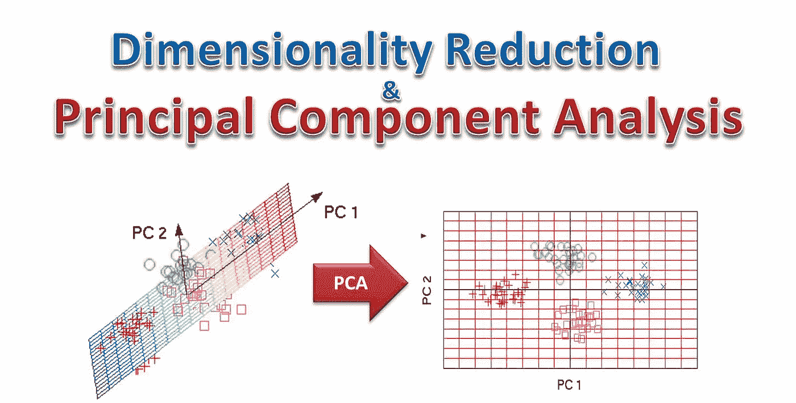
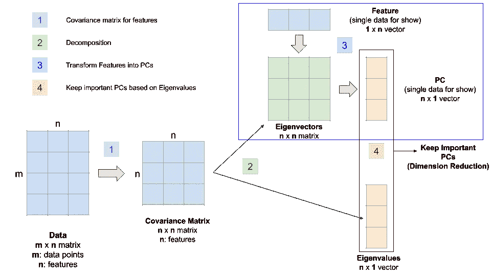
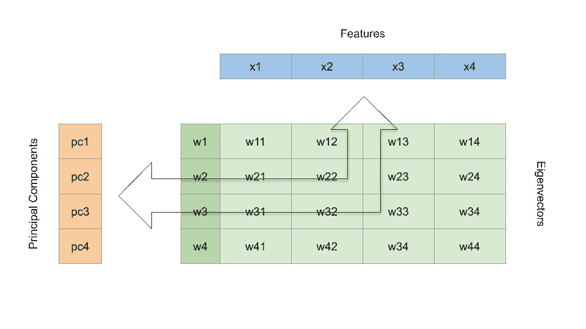
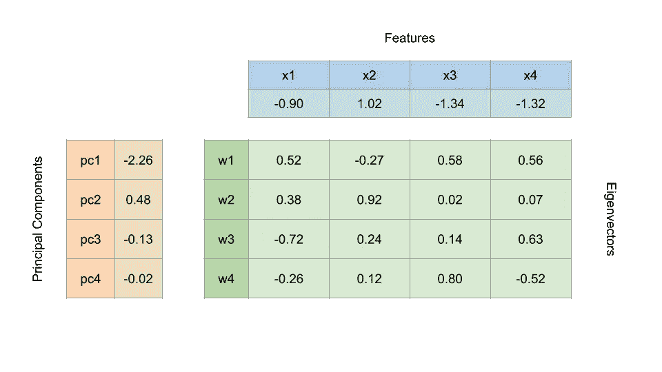
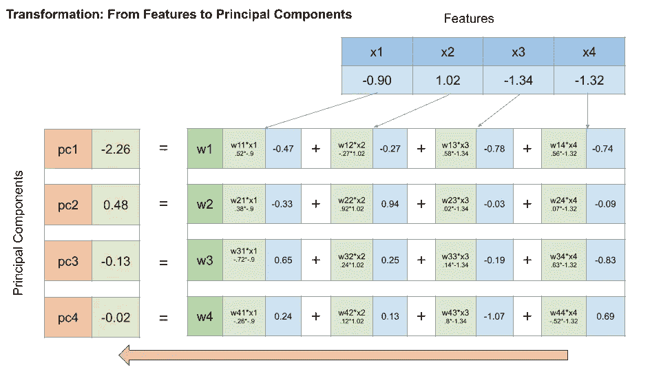
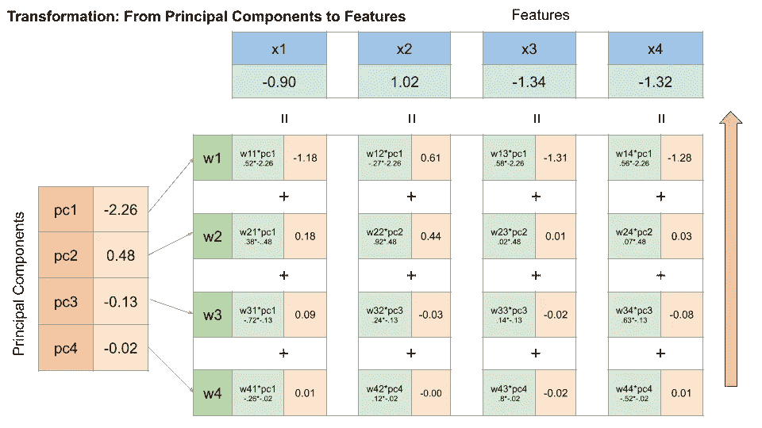
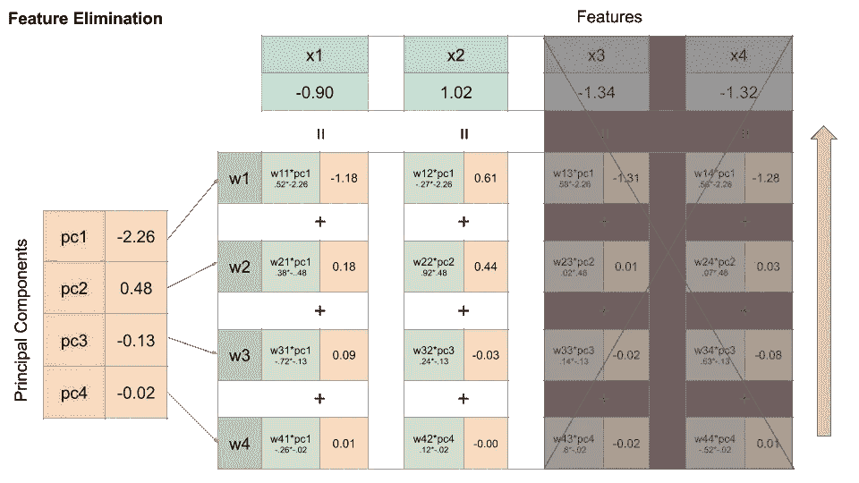
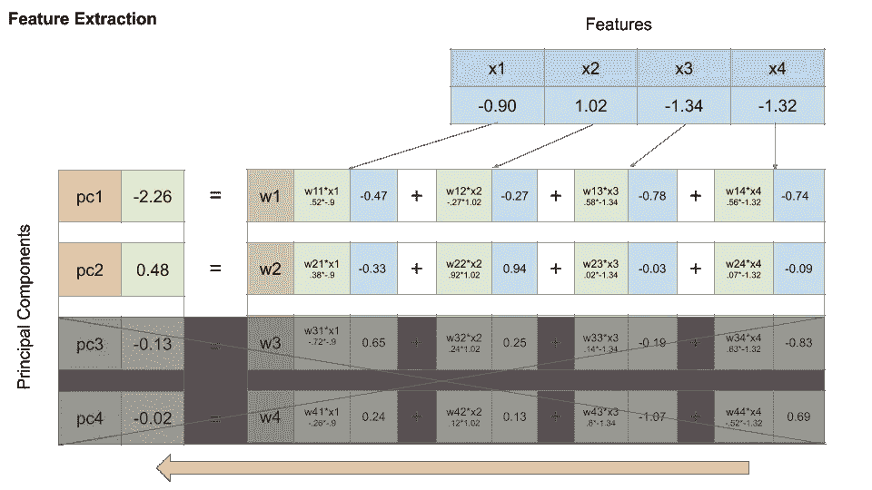
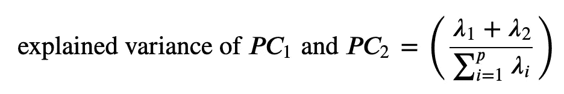
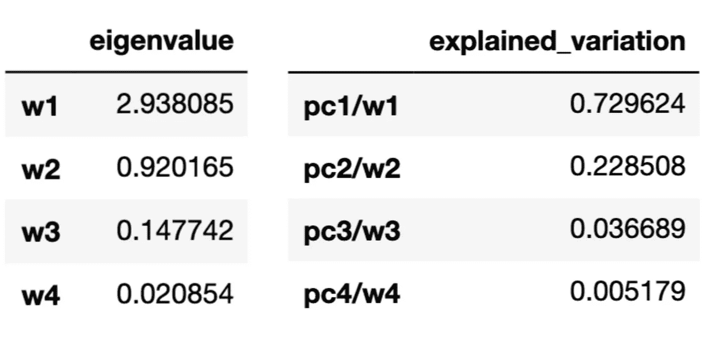

# 使用主成分分析的特征提取——一个简化的可视化演示

> 原文：<https://towardsdatascience.com/feature-extraction-using-principal-component-analysis-a-simplified-visual-demo-e5592ced100a?source=collection_archive---------6----------------------->

## 理解特征和主成分之间的转换

# 介绍

没有扎实的线性代数基础，理解主成分分析(PCA)背后的数学是一个挑战。当我在旧金山的 General Assembly 教授数据科学时，我发现帮助学生可视化特征和主成分之间的转换极大地增强了他们的理解。 **PCA 是一种降维技术，它有四个主要部分:特征协方差、特征分解、主分量变换和根据解释的方差选择分量。**这个博客的目的是分享一个视觉演示，这个演示是**帮助学生理解最后两步**。

# 降维的快速回顾

## 维度的诅咒

为了理解 PCA，我们必须知道它的目的。为了理解这个目的，我们必须知道 [**维数灾难**](https://en.wikipedia.org/wiki/Curse_of_dimensionality) ，这个方法解决的根本问题。虽然我们总是可以在维基百科上找到详尽的定义，但以下提供了更简单直观的解释:

> 随着要素或维度数量的增长，我们需要精确归纳的数据量也呈指数级增长
> 
> — Charles Isbell，佐治亚理工学院交互计算学院教授

[*维度的诅咒*](https://www.kdnuggets.com/2017/04/must-know-curse-dimensionality.html)*—Prasad Pore 撰写的 KDNuggets 帖子。*

有两种方法可以降低维数:

1.  特征消除:我们直接去掉一些特征。
2.  特征提取:我们保留所有特征的重要部分。我们应用主成分分析来实现这一点。注意，PCA 不是进行特征提取的唯一方法。

## 主成分分析

PCA 是一种降维方法，即**识别我们数据中的重要关系**,**根据这些关系转换现有数据**，然后**量化这些关系的重要性**，这样我们就可以保留最重要的关系，丢弃其他关系。为了记住这个定义，我们可以把它分成四个步骤:

1.  我们通过一个 [**协方差矩阵**](https://en.wikipedia.org/wiki/Covariance_matrix) **来识别特征之间的关系。**
2.  通过协方差矩阵的线性变换或 [**特征分解**](https://en.wikipedia.org/wiki/Eigendecomposition_of_a_matrix) ，得到 [**特征向量**和**特征值**](https://en.wikipedia.org/wiki/Eigenvalues_and_eigenvectors) 。
3.  然后，我们使用特征向量将数据转换成主分量。
4.  最后，我们使用特征值量化这些关系的重要性，并保留重要的主成分**。**

Figure 1

同样，我们可以在维基百科上找到所有术语的完整解释。我发现下面的帖子更直观，也更有帮助。

*   [PCA](https://stats.stackexchange.com/q/140579)——由“阿米巴说恢复莫妮卡”(我觉得很好笑)发布的 Stackoverflow 回复。

一个[伟大的可视化](https://www.youtube.com/watch?v=PFDu9oVAE-g)由 [3blue1brown](https://www.3blue1brown.com/) 为**步骤 2** 发布(事实上，我强烈推荐他们的整个线性代数动画系列)。以下章节包括**步骤 3** 和**步骤 4** 的可视化。

# 简化的视觉演示

下面的演示使用虹膜数据库中单个数据点的特征向量来呈现特征和主成分之间的线性变换。我描述计算时没有使用任何线性代数术语。但是，如果您了解两个向量之间的点积(因为我们演示了单个数据点的转换)和矩阵乘法(当我们转换所有数据点时)，将会很有帮助。

Figure 2

1.  **特征**:顶部蓝色横线表示。注意，x1、x2、x3 和 x4 代表单个虹膜的四个特征(即，萼片长度、萼片宽度、花瓣长度和花瓣宽度)，而不是四个不同的虹膜。
2.  **特征向量**:用绿色矩阵表示
3.  **主成分**:左侧橙色竖线表示

Figure 3

图 3 包括每个部分的值。学习和理解数学方法的最好方法之一是验证数字相加。从这里，我们将做一些简单的计算。

## 步骤 3 的视觉演示

1.  **将特征转换成主成分。**

Figure 4

为了将特征转换成主分量，我们将特征与特征向量逐个元素相乘，如上面的图 4 所示，并在水平方向上相加。

**2。将主成分转换回特征。**

当然，通过执行上面图 5 所示的计算，您可以将主成分转换回原始特征。

## 步骤 4 的视觉演示

在可视化了变换背后的数学之后，让我们演示一下特征消除和特征提取之间的区别。

Figure 6

如上面的图 6 所示，如果我们选择通过特征消除来降低维数，我们将完全删除一些特征，在本例中是 x3 和 x4。当我们将维度从 4 减少到 2 时，由花瓣长度和花瓣宽度提供的所有信息都丢失了。

Figure 7

相比之下，当我们通过 PCA 等特征提取方法降低维数时，我们通过选择解释特征之间大多数关系的主成分来保留最重要的信息。这就是特征值发挥作用的地方，它帮助我们了解每个主成分包含多少信息。

在我们的例子中，基于与每个特征向量相关的归一化特征值，第一和第二主成分(即 pc1 和 pc2)解释了特征变化的 95%以上，如下图 8 所示。因此，我们只保留 pc1 和 pc2。

**Lambda is the eigenvalue**

Figure 8

注意，每个主成分包含来自所有四个特征的信息。通过只保留 pc1 和 pc2，我们从所有四个特征中提取最重要的信息，并将维数从 4 降低到 2。

# 评论

我想用几句话来结束我的博客，包括 PCA 的使用，PCA 的利弊，以及何时不使用 PCA。

**数据清理很重要**

*   PCA 对异常值和缺失值很敏感。

**标准化数据**

*   PCA 使用欧几里德距离作为其特征向量相似性度量，因此确保我们在应用 PCA 之前缩放特征。
*   如果我们在模型中使用 GridSearchCV，确保我们将 PCA 放在管道中。在运行 GridSearch 之前拟合和转换训练数据会导致 GridSearch 内部交叉验证期间的数据泄漏。详见我上一篇博文。

**优点**

*   PCA 在不丢失任何特征信息的情况下降低了维数。
*   减少存储数据所需的存储空间
*   加速学习算法(用更低的维度)。
*   解决多重共线性问题(所有主成分相互正交)。
*   帮助可视化高维数据(在将维度减少到 2 或 3 之后)。

**缺点**

*   使用主成分分析可以防止对原始特征的解释，以及它们的影响，因为特征向量是没有意义的。

**五氯苯甲醚的潜在使用案例(非详尽清单)**

*   我们有许多具有高度多重共线性的要素。
*   我们有太多的功能导致算法运行非常缓慢。

**滥用五氯苯甲醚(并非详尽清单)**

*   我们不应该使用 PCA 来降低维数，以防止过度拟合。我们应该使用正则化(如 L1 和 L2)来代替。
*   在用原始数据运行机器学习模型之前，我们不应该盲目地应用 PCA。如果使用原始数据效果不好，我们应该考虑 PCA 作为替代方法。

# 资源和信用

*   为了进一步研究 PCA，我推荐了 Coursera 上的斯坦福大学吴恩达教授的机器学习课程(第 8 周)。【https://www.coursera.org/learn/machine-learning? 号
*   我还引用了大会全球讲师 Matt Brems 为他的学生准备的材料。他还写了一篇关于 PCA 细节的博文。[https://towards data science . com/a-一站式主成分分析-5582fb7e0a9c](/a-one-stop-shop-for-principal-component-analysis-5582fb7e0a9c)