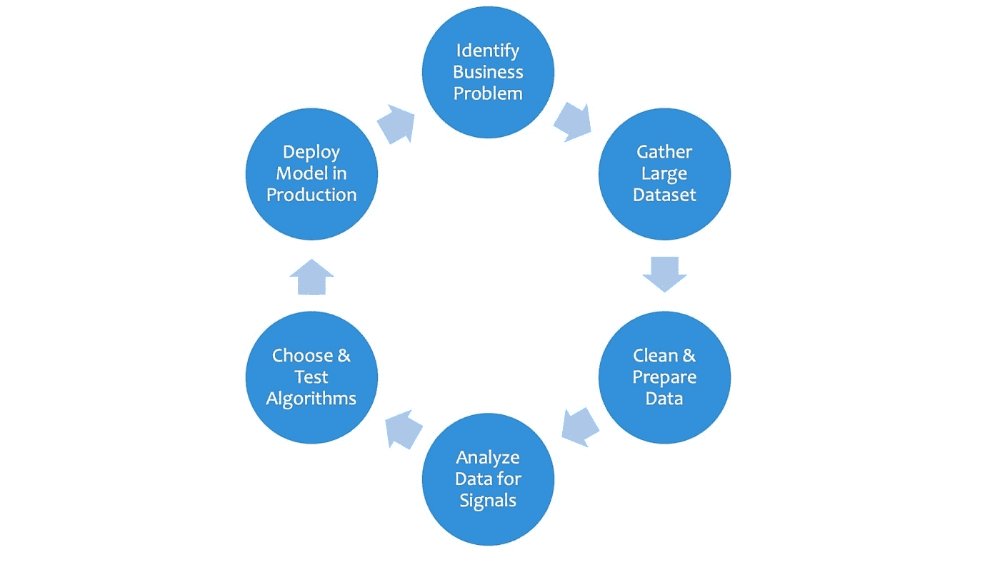
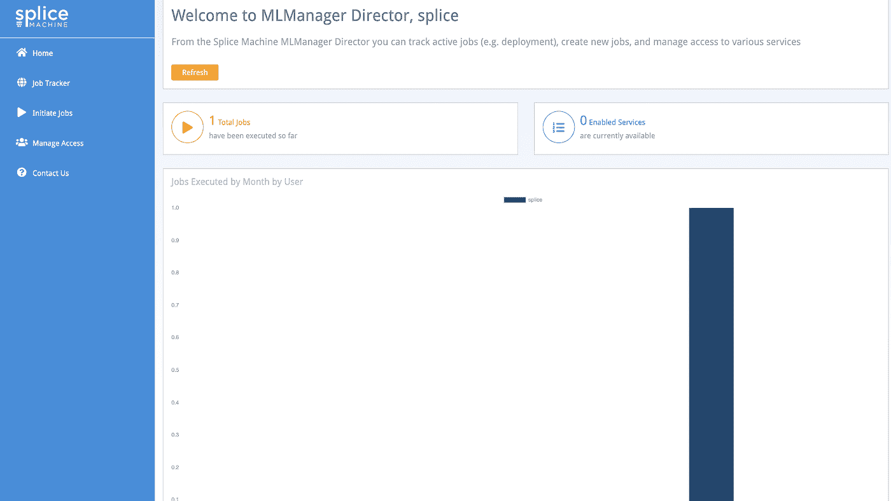

# 特性工厂第 2 部分:MLFlow 简介

> 原文：<https://towardsdatascience.com/feature-factories-pt-2-an-introduction-to-mlflow-873be3c66b66?source=collection_archive---------14----------------------->

如果你读了我的第一篇文章，你有希望很好地理解什么是特性工厂，为什么它很重要，以及如何最好地培养一个特性工厂的一般想法。如果你没有，建议你先去看看。在这篇后续文章中，我想开始深入 MLFlow 并通过一些代码示例介绍主要概念。

# ML 生命周期

首先，让我们对经典的机器学习生命周期有一个共同的理解:

一个商业问题被识别，其中机器学习的应用可能是有价值的

一个团队收集了大量数据

数据工程师开始清理和标准化数据，为分析做准备

主题专家挖掘数据，寻找有用的新信号(特征)

数据科学家研究手头问题的最佳算法，*记录他们所有的个人运行*

一旦决定了一个模型，开发-运营团队就把这个模型部署到一个服务平台，比如 Sagemaker、Azure ML，或者一个定制的实现，比如一个包装在 web 服务中的容器。

在这个过程中有一些常见的棘手问题，主要是生命周期/部署管理和分析跟踪。

部署一个训练有素的机器学习模型并不像人们预期的那样简单，如果你曾经试图弄清楚如何去做，你可能会发现围绕它的文档并不像 ML 生命周期中的其他阶段那样全面。此外，在部署之后，您仍然必须处理监控、再培训和重新部署。如果没有标准化的流程，这可能会占用您的开发-运营团队大量时间，如果您的公司或团队要转换云服务(例如从 AWS 到 Azure)，您必须从头开始学习流程。

Outdated data science organization

如果你曾经看过这样的图表，你就会知道跟踪你的数据科学项目的漫长而艰难的过程。为你正在处理的每个问题创建一个新的电子表格，保存在你公司每个人共享的云存储上(希望如此)，确保你的团队可以看到你所有的试验，这样他们就不会浪费时间尝试相同的设置，你明白了吧。

我总是使用 Excel 来跟踪我的项目，你可能有另一个你喜欢的工具，但它很可能是一个个人日志，很难与他人分享和扩展。很难跟踪谁尝试了什么，什么有效，什么无效，以及正在使用的数据集。正如你从上面的图片中所看到的，该表缺少了很多东西，添加东西可能会迫使你完全重新设计它。如果有人想尝试梯度推进或想添加当今使用的许多其他[神经网络超参数](http://docs.h2o.ai/h2o/latest-stable/h2o-docs/data-science/deep-learning.html#defining-a-deep-learning-model)中的一个，会怎么样？正如你所看到的，这种跟踪概念是不可持续的。

# **介绍 MLFlow**

[MLFlow](https://www.mlflow.org/) 是面向数据科学家和开发运营工程师的开源解决方案。在我的[上一篇文章](https://medium.com/@ben.epstein97/the-ultimate-tool-for-data-science-feature-factories-55aed0f70974)中，我从较高的层面解释了为什么 MLFlow 如此伟大，所以在这里我想深入一下，从治理开始。我们将介绍如何使用 MLFlow 来交付治理和组织实验。我们还将谈到我们可以跟踪哪些细节来帮助模型构建过程，以及如何选择和部署模型。

# **治理**

治理是对数据科学过程有一个完整的鸟瞰图的想法，从原始数据到摄取到实验到建模，甚至是部署。对任何可能影响有价值的东西的过程进行治理是非常重要的，无论是货币、监管，尤其是面向用户的(即 ML 模型做出实时决策)。因此，必须对数据科学过程进行跟踪和管理。在我们授权将模型部署到生产中之前，我们需要知道模型来自哪里，对它们进行了何种类型和深度的测试，以及进入它们的确切数据

MLFlow 允许您将数据科学工件组织成两个主要类别:

> **实验** —你试图解决的首要问题，例如:销售点欺诈。通常围绕一个公共数据集创建
> 
> **运行** —特征工程和模型训练中的每个单独“尝试”:Excel 表格的每一行(具有更大的灵活性)

这种组织设计的伟大之处在于，它允许您设计希望在运行之间跟踪的元数据，并且不会强迫您使用一些公共参数。您可以在给定的运行中存储您想要的任何内容，并且它不需要与上次运行完全匹配。例如，对于一个给定的运行，您可以跟踪您想要的任何参数(模型类型、超参数、训练/测试分割)、您想要的度量标准( [fpr](https://en.wikipedia.org/wiki/False_positive_rate) 、 [r](https://en.wikipedia.org/wiki/Coefficient_of_determination) 、 [f1](https://en.wikipedia.org/wiki/F1_score#Definition) )，即使它是针对不同的模型流派([二元/多类分类、回归](https://www.geeksforgeeks.org/ml-classification-vs-regression/))。

# 说够了，让我们开始演示:

出于本演示的目的，我将使用 [Splice Machine 的 MLManager](https://www.splicemachine.com/splice-machine-ml-manager/) ，因为这是我通常日常使用的(因为它在 Splice DB 上本地运行)，但在大多数情况下，它看起来与普通 MLFlow 相同，我将指出该示例在 Splice Machine 之外工作所需的任何更改。

## 基础

在这个演示中，我们将使用修改过的 [Kaggle](https://www.kaggle.com/) 数据集来预测供应链环境中的订单延迟。作为数据科学团队中的典型，我们将有不止一个数据科学家在这个项目上合作，每个人都执行许多转换和建模技术。

首先，我们导入必要的库并创建一个用于跟踪的 MLManager 对象(注意，对于普通的 mlflow，没有对象，只需用 ml flow 替换 Manager)。我们现在从 create _ experiment 函数开始实验，并传入一个名称。如果该实验已经存在，它将自动成为活动实验。

创建管理器后，我们可以将数据接收到数据帧中，并开始分析和转换。请务必注意将信息记录(记录)到 MLFlow 的方式:

> **log_param(或 lp)** :允许你记录任何你想要的模型/管道参数。想想训练/测试分割、超参数、转换管道的阶段、特定源数据集的描述。
> 
> **log_params** : MLManager 的特定函数，该函数采用参数列表来记录并自动处理所有参数
> 
> **log_metric(或 lm)** :允许您记录任何模型指标。考虑训练时间、准确度、精确度、AUC 等。
> 
> **log_metrics** : MLManager 的特定函数，它获取一个度量列表并自动处理它们
> 
> **log_artifact** :允许您将对象记录到特定的运行中。想想图表、系列模型、图片等等。
> 
> **log_artifacts** : MLManager 的特定函数，获取工件列表并处理所有工件
> 
> **log _ feature _ transformation**:ml manager 特定函数，它采用**未经训练的** Spark 管道并记录数据集中每个特性的所有转换步骤
> 
> **log _ Pipeline _ stages**:ml manager 特定函数，采用 Spark 管道(合适或不合适)并以可读格式记录所有阶段
> 
> **log _ model _ params**:ml manager 特定函数，采用拟合的火花模型或管道模型，并记录所有参数和超参数
> 
> **log _ Evaluator _ metrics**:ml manager 特定函数，采用拼接评估器并记录其所有度量
> 
> **log _ spark _ model**:ml manager 的特定函数，它获取一个经过训练的 Spark 模型并将其记录下来以供部署。这是因为，在拼接机的实施中，模型直接存储在拼接机数据库中，而不是 S3 或外部存储器中。

MLFlow 的伟大之处在于它足够灵活，允许您以任何您想要的方式设计您的工作流，根据您的团队需要和期望的治理流程的要求获得粒度或高级别。

如果这有点神秘，下面的演示应该会让它更容易理解。

## 开始跑步

我们喜欢保持非常有条理，所以我们将立即开始我们的第一次运行，并在运行过程中记录所有的特性转换和发现。当我们创建各种新功能和功能转换时，我们可以使用 log_param 函数单独记录这些功能，或者我们可以使用(特定拼接)log_feature_transformations 函数并传入一个 Spark Pipeline 对象。请注意，这个批量日志记录功能仅适用于 Spark ML 管道。

*‘dataSize’ is simply an arbitrary key:value MLFlow* [*tag*](https://www.mlflow.org/docs/latest/python_api/mlflow.entities.html#mlflow.entities.RunTag)

Preprocessing our dataset by converting our string columns into numeric and creating a [feature vector](https://brilliant.org/wiki/feature-vector/)

在上面的单元格中，我们调用 manager . log _ feature _ transformations 并传入一个 [Spark 管道](https://spark.apache.org/docs/latest/ml-pipeline.html)。如上所述，这是拼接机器的特定功能，仅适用于 MLManager。为了创建这个函数的输出，您将循环通过您的管道的阶段以及您的数据帧的列，并“跟踪”每一列的路径，查看它受哪个[变压器](https://spark.apache.org/docs/latest/ml-pipeline.html#transformers)和[估计器](https://spark.apache.org/docs/latest/ml-pipeline.html#estimators)影响，分别记录这些发现。

Feature transformations for each column

上表描述了每一列的预处理步骤。例如，首先使用一个 [StringIndexer](https://spark.apache.org/docs/latest/ml-features.html#stringindexer) 将列 CITY_destination 从一个字符串值索引为一个整数值，然后使用[一个热编码](https://spark.apache.org/docs/latest/ml-features.html#onehotencoder-deprecated-since-230)，最后在最后一个名为 *featuresVec* 的列中组合成一个[特征向量](https://spark.apache.org/docs/latest/ml-features.html#vectorassembler)

一旦我们有了最终形式的数据集，我们就可以使用 Splice Machine 的[本地 Spark 数据源](https://doc.splicemachine.com/bestpractices_sparkadapter_intro.html)(在另一篇文章中会有更多的介绍)来创建并插入我们转换后的数据集到一个 SQL 表中，这样我们就可以跟踪这个特定运行所使用的数据。然后，我们可以记录一个参数或一个标记，指定数据库中的表名，以供以后分析时参考。这很有用，因为如果我们的模型在未来表现奇怪，我们可以看到它被训练的确切数据集，并可能找到灾难的原因。

Create a table in Splice database from the Spark Dataframe, and insert that dataframe into the DB table

因为将数据帧作为表格直接存储在拼接数据库中是拼接特定的功能，所以您可以使用普通 MLFlow 做的是使用 *mlflow.log_artifact* 将您的数据帧作为工件*记录。这将把您的数据集链接到有问题的运行，以便将来进行分析。另一个选择是调用 *df.write.sav* e 并传入一个 S3 桶来将数据帧保存到 S3，在到 S3 位置的运行中记录一个参数。*

## 培训模型

一旦我们的数据准备好了，我们就可以开始训练一些模型了。我们希望尝试许多不同的模型，看看哪一个具有最佳基准性能，然后缩小所选模型的超参数范围。我们可以通过多个模型迭代运行一个循环，跟踪每个模型的度量。对于我们运行的每个模型，我们可以开始一个新的运行，并记录数据集所来自的表(上面创建的表)。在这些运行过程中，我们还可以记录诸如接收机工作特性(ROC)曲线之类的图表。

Trying multiple models and logging all parameters and results

在我们运行一些超参数调优并且对我们选择的模型感到满意之后，我们可以将模型保存到 MLFlow(它被连续存储在 Splice DB 中),并在 MLFlow UI 中的工件中看到它。

## manager.log_evaluator_metrics()的输出

## manager.stop_and_log_timer()的输出

## manager.log_model_params()的输出

正如您在上面所看到的，一些拼接机内置的日志记录功能为您提供了一些很好的管理，但是您也可以在 MLFlow 中实现这些功能:

> 要记录您的**模型参数**，您可以使用 model.extractParamMap()提取参数映射，并遍历您的参数，将每个参数记录到 MLFlow。
> 
> 要记录根据您的数据进行训练和根据您的测试数据进行预测所花费的**时间**，您可以导入本地时间库，用 t1 = time.time()获得您的训练的开始和结束时间，并记录两个时间的差值。
> 
> 为了记录您所有的**指标**，您可以使用 Spark [评估器](https://spark.apache.org/docs/latest/mllib-evaluation-metrics.html)来获取评估指标，并遍历可用的指标，使用 mlflow.log_metric 记录每个指标。

当其他数据科学家构建运行来测试他们的想法时，他们可以在同一个实验中填充，允许模型的交叉比较。任何东西都可以在这些实验和运行中保存，允许团队开发他们自己的工作标准。下面我们展示了两个比较:一个图表将特定的模型超参数与单个指标进行比较(在这种情况下，r 与树的数量)，另一个图表显示了四个模型构建的整体视图，显示了每个模型的优势和劣势。

Comparing Number of Trees against r²

Comparing all metrics of each model against each other

我非常欣赏第二个图表，因为您可以看到每个模型的更全面的视图。例如，在这里您可以看到 magenta 模型明显优于所有其他模型，除了 r。因此，除非 r 是一个关键的评估指标，否则这将是一个明确的选择。

# 模型部署

Model tracking screen before deployment

既然一切都被跟踪和比较了，那么是时候部署您的模型了。没有部署，你的模型只不过是一个漂亮的 Jupyter 笔记本，但 MLFlow 允许轻松地基于代码部署到 AzureML 或 AWS Sagemaker。在拼接平台中，我们有一个方便的用户界面用于部署，因此无论您的云服务如何，部署都保持一致和简单。如果你使用普通的 MLFlow，你可以使用内置的 [AzureML](https://www.mlflow.org/docs/latest/models.html#azureml-deployment) 或者[sage maker](https://www.mlflow.org/docs/latest/python_api/mlflow.sagemaker.html#mlflow.sagemaker.deploy)API 来部署你的模型。

Model deployment UI

当部署到 Azure ML 或 AWS Sagemaker 时，只需选择您的地区、名称和一些其他细节，您的模型就上路了。部署完成后，您可以在 UI 中跟踪所有作业以及是谁部署了它们。

Model tracking screen after deployment

# 摘要

据此，我们使用 MLFlow 改造，训练，测试并部署了第一个机器学习模型。在任何时候，团队中的任何人都可以导航到 MLFlow UI，并查看从原始数据到部署模型所采取的所有步骤。随着数据的变化和模型需要被监控或调整，每个人都确切地知道去哪里看。

我真的很喜欢使用 MLFlow 及其所有令人难以置信的功能。如果你自己是 MLFlow 的粉丝，请随意评论我可能错过的任何其他伟大功能，欢迎所有建议！

要了解更多关于 MLFlow 的信息，请点击[此处](https://mlflow.org/)，要了解更多关于 Splice Machine 的 MLManager 实现，请点击[此处](https://splicemachine.com/product/ml-manager/)，或请求演示[此处](https://info.splicemachine.com/ml-manager-2-0-demo.html)。