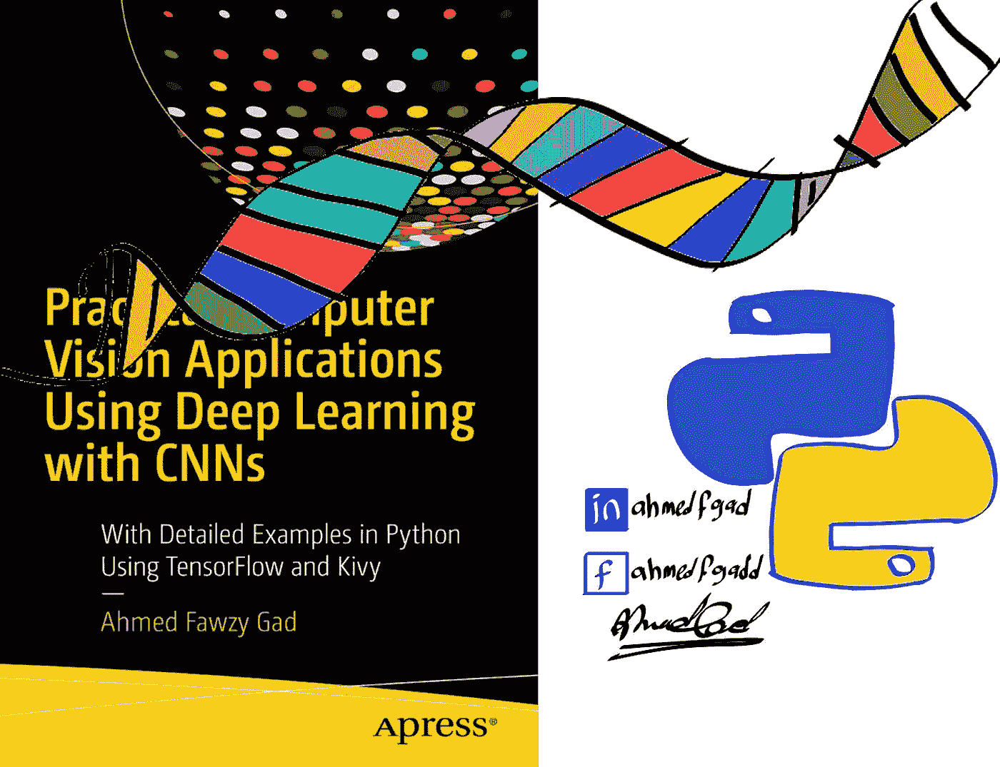
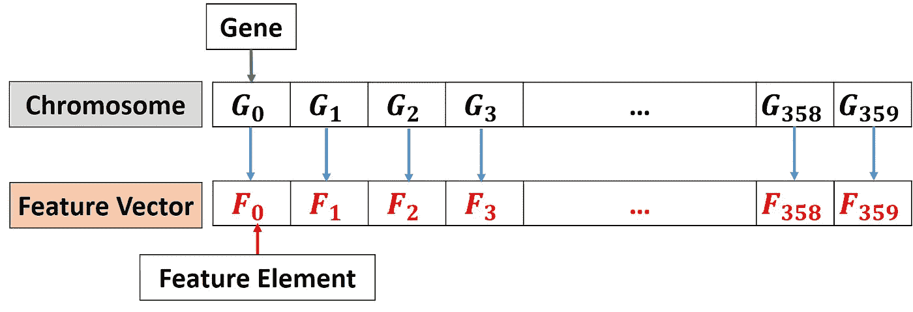
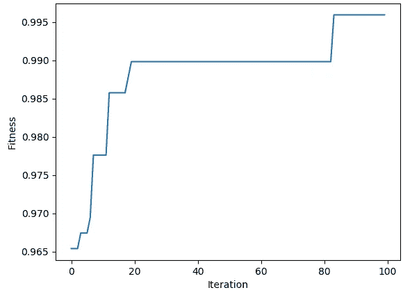

# 基于 Python 的遗传算法特征约简

> 原文：<https://towardsdatascience.com/feature-reduction-using-genetic-algorithm-with-python-403a5f4ef0c1?source=collection_archive---------5----------------------->

# 介绍

在某些情况下，使用原始数据来训练机器学习算法可能不是合适的选择。当由原始数据训练时，该算法必须自己进行特征挖掘，以检测彼此不同的组。但是这需要大量的数据来自动进行特征挖掘。对于小数据集，数据科学家最好自己执行特征挖掘步骤，并告诉机器学习算法使用哪个特征集。

所使用的特征集必须代表数据样本，因此我们必须注意选择最佳特征。数据科学家建议使用某些类型的特征，这些特征似乎有助于根据以前的经验表示数据样本。一些特征可能证明它们在代表样本方面的稳健性，而另一些则不然。

可能有一些类型的特征可能通过降低分类问题的准确度或增加回归问题的误差来影响训练模型的结果。例如，在特征向量中可能有一些噪声元素，因此它们应该被去除。特征向量也可以包括 2 个或更多相关元素。仅仅使用一种元素将替代另一种元素。为了去除这类元素，有两个有用的步骤，即**特征选择**和**减少**。本教程重点介绍**特征减少**。

假设有 3 个特征 F1、F2 和 F3，每个特征有 3 个特征元素。因此，特征向量长度是 3×3 = 9。特征选择仅选择特定类型的特征，而排除其他特征。比如只选择 F1 和 F2，去掉 F3。特征向量长度现在是 6 而不是 9。在**特征缩减**中，每个特征的特定元素可能被排除。例如，该步骤可能会从 F3 中移除第一个**元素**和第三个**元素**，同时保留第二个元素。因此，特征向量长度从 9 减少到仅仅 7。

在开始本教程之前，值得一提的是，它是我的 LinkedIn 个人资料中先前发布的 2 个教程的扩展。

第一个教程的标题是“**使用 NumPy 和 Fruits360 图像数据集**的分类的人工神经网络实现”。它首先从 Fruits360 数据集的 4 个类中提取长度为 360 的特征向量。然后，它使用 NumPy 从头开始构建人工神经网络(ANN ),以便对数据集进行分类。这里有[https://www . LinkedIn . com/pulse/artificial-neural-network-implementation-using-numpy-fruits 360-gad](https://www.linkedin.com/pulse/artificial-neural-network-implementation-using-numpy-fruits360-gad)。这里有它的 GitHub 项目:【https://github.com/ahmedfgad/NumPyANN】T4。

第二个教程的标题是“**使用遗传算法优化人工神经网络**”。建立并使用遗传算法优化神经网络参数，以提高分类精度。这里有[https://www . LinkedIn . com/pulse/artificial-neural-networks-optimization-using-genetic-Ahmed-gad](https://www.linkedin.com/pulse/artificial-neural-networks-optimization-using-genetic-ahmed-gad)。它的 GitHub 项目也在这里:[https://github.com/ahmedfgad/NeuralGenetic](https://github.com/ahmedfgad/NeuralGenetic)。

本教程讨论了如何使用遗传算法(GA)来减少从长度为 360 的 Fruits360 数据集提取的特征向量。本教程首先讨论要遵循的步骤。之后主要用 NumPy 和 Sklearn 用 Python 实现步骤。

本教程的实现可以在我的 GitHub 页面这里找到:[https://github.com/ahmedfgad/FeatureReductionGenetic](https://github.com/ahmedfgad/FeatureReductionGenetic)

遗传算法从一个初始群体开始，该群体由多个染色体(即解)组成，其中每个染色体具有一个基因序列。使用适应度函数，遗传算法选择最佳解作为父代来创建新的种群。这种新群体中的新解是通过对双亲应用两种操作来创建的，这两种操作是交叉和变异。当应用遗传算法解决一个给定的问题时，我们必须确定基因的表示，合适的适应度函数，以及如何应用交叉和变异。让我们看看事情是如何运作的。



# 关于 GA 的更多信息

您可以从我准备的以下资源中了解有关 GA 的更多信息:

*   遗传算法优化导论

[https://www . LinkedIn . com/pulse/introduction-优化-遗传-算法-ahmed-gad/](https://www.linkedin.com/pulse/introduction-optimization-genetic-algorithm-ahmed-gad/)

[https://www . kdnugges . com/2018/03/introduction-optimization-with-genetic-algorithm . html](https://www.kdnuggets.com/2018/03/introduction-optimization-with-genetic-algorithm.html)

[https://towards data science . com/introduction-to-optimization-with-genetic algorithm-2f 5001d 9964 b](/introduction-to-optimization-with-genetic-algorithm-2f5001d9964b)

*   遗传算法(GA)优化—分步示例

[https://www . slide share . net/AhmedGadFCIT/genetic-algorithm-ga-optimization-step by step-example](https://www.slideshare.net/AhmedGadFCIT/genetic-algorithm-ga-optimization-stepbystep-example)

*   遗传算法在 Python 中的实现

[https://www . LinkedIn . com/pulse/genetic-algorithm-implementation-python-Ahmed-gad/](https://www.linkedin.com/pulse/genetic-algorithm-implementation-python-ahmed-gad/)

[https://www . kdnugges . com/2018/07/genetic-algorithm-implementation-python . html](https://www.kdnuggets.com/2018/07/genetic-algorithm-implementation-python.html)

[https://towardsdatascience . com/genetic-algorithm-implementation-in-python-5ab 67 bb 124 a 6](/genetic-algorithm-implementation-in-python-5ab67bb124a6)

[https://github.com/ahmedfgad/GeneticAlgorithmPython](https://github.com/ahmedfgad/GeneticAlgorithmPython)

我还在 2018 年写了一本书，其中一章涉及 GA。这本书被称为“**Ahmed faw zy Gad‘使用深度学习和 CNN 的实用计算机视觉应用’。2018 年 12 月，Apress，978–1–4842–4167–7**”，可在施普林格[https://www.springer.com/us/book/9781484241660](https://www.springer.com/us/book/9781484241660)获得。

# 染色体表示

GA 中的基因是染色体的组成部分。首先，我们需要确定染色体中有哪些基因。要做到这一点，要考虑到每一个可能影响结果的属性都应该被视为一个基因。因为我们问题的目标是选择最佳的特征元素集合，因此每个特征元素的选择与否都会影响结果。因此，每个特征元素被视为一个基因。染色体将由所有基因(即所有特征元素)组成。因为有 360 个特征元素，那么就会有 360 个基因。一个很好的信息是，染色体的长度是 360。

在确定了被选择的基因是什么之后，接下来就是确定基因的代表性。有不同的表示法，如十进制、二进制、浮点、字符串等。我们的目标是知道基因(即特征元素)是否在缩减的特征集中被选择。因此，分配给基因的值应该反映它是否被选择。基于这一描述，很明显每个基因有两个可能的值。一个值表示基因被选中，另一个值表示基因未被选中。因此，二进制表示是最佳选择。当基因值为 1 时，则它将在缩减的特征集中被选择。当值为 0 时，它将被忽略。

总的来说，染色体将由 360 个二进制表示的基因组成。根据下图，在特征向量和染色体之间存在一对一的映射。即染色体中的第一个基因与特征向量中的第一个元素相联系。当该基因的值为 1 时，这意味着选择了特征向量中的第一个元素。



# 适应度函数

通过得到如何产生染色体，初始种群可以很容易地被随机初始化为 NumPy。在初始化之后，选择双亲。GA 是基于**达尔文**的理论**适者生存**。即选择当前种群中的最佳解进行交配，以产生更好的解。通过保留好的解决方案并删除坏的解决方案，我们可以达到最优或次优的解决方案。

用于选择双亲的标准是与每个解(即染色体)相关联的适应值。适应值越高，解决方案越好。使用适应度函数来计算适应度值。那么，在我们的问题中，什么是最好的函数呢？我们的问题的目标是创建一个减少的特征向量，增加分类精度。因此，判断解决方案好坏的标准是**分类精度**。因此，适应度函数将返回一个数字，该数字指定每个解决方案的分类精度。精度越高，解决方案越好。

为了返回分类精度，必须有一个机器学习模型，以通过每个解决方案返回的特征元素进行训练。对于这种情况，我们将使用支持向量分类器(SVC)。

数据集分为训练样本和测试样本。基于训练数据，SVC 将使用由群体中的每个解决方案选择的特征元素来训练。经过训练后，会根据测试数据进行测试。

基于每个解的适应值，我们可以选择其中最好的作为父代。这些父母被一起放在交配池中，以产生后代，这些后代将成为下一代新群体的成员。这样的后代是通过对选择的亲本应用交叉和变异操作来创建的。让我们按照下面的讨论来配置这样的操作。

# 交叉和变异

在适应度函数的基础上，我们可以在当前群体中筛选出最好的解，称为父代。GA 假设将两个好的解决方案配对会产生第三个更好的解决方案。交配意味着交换父母双方的一些基因。使用交叉操作来交换基因。有不同的方式可以应用这样的操作。本教程使用单点交叉，其中一个点分割染色体。点之前的基因取自一个解，点之后的基因取自另一个解。

通过应用交叉，所有的基因都取自先前的双亲。新的后代中没有引入新的基因。如果所有父母中都有一个不好的基因，那么这个基因就会传递给后代。为此，应用突变操作以便在后代中引入新的基因。在基因的二进制表示中，通过翻转一些随机选择的基因的值来应用突变。如果基因值是 1，那么它将是 0，反之亦然。

产生后代后，我们可以创造下一代的新种群。这个群体除了后代外，还包括以前的父母。

至此，所有步骤都讨论完毕。接下来是用 Python 实现它们。请注意，我之前写了一篇名为“**用 Python 实现遗传算法**”的教程，用于用 Python 实现遗传算法，我将修改它的代码来解决我们的问题。还不如读一读。

# Python 实现

该项目分为两个文件。一个名为“GA.py”的文件将 GA 步骤的实现保存为函数。另一个文件，也就是主文件，只是导入这个文件并在一个循环中调用它的函数，这个循环遍历所有代。

主文件首先根据下面的代码读取从 Fruits360 数据集中提取的特征。这些特征返回到**数据输入**变量中。有关提取这些要素的详细信息，请参见本教程开头提到的两个教程。该文件还读取变量 **data_outputs** 中与样本相关的分类标签。

选择一些样本进行训练，其指数存储在**train _ indexes**变量中。类似地，测试样本索引存储在**test _ indexes**变量中。

```
**import** numpy
**import** GA
**import** pickle
**import** matplotlib.pyplot

f = open(**"dataset_features.pkl"**, **"rb"**)
data_inputs = pickle.load(f)
f.close()

f = open(**"outputs.pkl"**, **"rb"**)
data_outputs = pickle.load(f)
f.close()

num_samples = data_inputs.shape[0]
num_feature_elements = data_inputs.shape[1]
train_indices = numpy.arange(1, num_samples, 4)
test_indices = numpy.arange(0, num_samples, 4)
print(**"Number of training samples: "**, train_indices.shape[0])
print(**"Number of test samples: "**, test_indices.shape[0])

**"""
Genetic algorithm parameters:
    Population size
    Mating pool size
    Number of mutations
"""** sol_per_pop = 8 *# Population size.* num_parents_mating = 4 *# Number of parents inside the mating pool.* num_mutations = 3 *# Number of elements to mutate.
# Defining the population shape.* pop_shape = (sol_per_pop, num_feature_elements)

*# Creating the initial population.* new_population = numpy.random.randint(low=0, high=2, size=pop_shape)
print(new_population.shape)

best_outputs = []
num_generations = 100
```

它初始化遗传算法的所有参数。这包括根据 **sol_per_pop** 变量设置为 8 的每个种群的解数，在**num _ parents _ matting**变量中设置为 4 的后代数，以及在 **num_mutations** 变量中设置为 3 的突变数。之后，它在一个名为 **new_population** 的变量中随机创建初始种群。

有一个名为 **best_outputs** 的空列表，它保存每代之后的最佳结果。这有助于在完成所有代之后可视化 GA 的进程。在 **num_generations** 变量中，代数被设置为 100。请注意，您可以更改所有这些参数，这可能会产生更好的结果。

在准备好特性、类标签和 GA 参数之后，我们可以根据下一个代码进行 GA 的迭代。首先，通过调用 GA 文件中定义的名为 **cal_pop_fitness()** 的适应度函数来计算所有解的适应度值。该函数接受当前总体、提取的特征、类标签、训练索引和测试索引。该函数在名为 **fitness** 的变量中返回所有解决方案的适应值。记住，适应值代表分类精度。最佳(即最高)分类精度保存在**最佳输出**列表中。

基于计算的适应值，使用 GA.py 文件中定义的**select _ matting _ pool()**函数，选择具有最高分类精度的最佳解作为交配池中的亲代。它接受当前人口、适应值和要返回的父代数量。它将选择的双亲返回到**双亲**变量中。

```
**for** generation **in** range(num_generations):
    print(**"Generation : "**, generation)
    *# Measuring the fitness of each chromosome in the population.* fitness = GA.cal_pop_fitness(new_population, data_inputs, data_outputs, train_indices, test_indices)

    best_outputs.append(numpy.max(fitness))
    *# The best result in the current iteration.* print(**"Best result : "**, best_outputs[-1])

    *# Selecting the best parents in the population for mating.* parents = GA.select_mating_pool(new_population, fitness, num_parents_mating)

    *# Generating next generation using crossover.* offspring_crossover = GA.crossover(parents, offspring_size=(pop_shape[0]-parents.shape[0], num_feature_elements))

    *# Adding some variations to the offspring using mutation.* offspring_mutation = GA.mutation(offspring_crossover, num_mutations=num_mutations)

    *# Creating the new population based on the parents and offspring.* new_population[0:parents.shape[0], :] = parents
    new_population[parents.shape[0]:, :] = offspring_mutation
```

下一步是对选择的父代应用交叉操作来创建后代。这是在 GA.py 文件中定义的 **crossover()** 函数内完成的。它接受父数组和后代数组的形状，稍后返回到**后代交叉**变量中。然后使用 GA.py 文件中的**突变()**函数对数组进行突变操作。除了交叉结果，该函数还接受突变的数量。

因为新群体除了后代之外还包括所选的父母，所以**父母**和**后代 _ 突变**数组都被保存到**新 _ 群体**变量中。之后，新的一代应用于新的人口。

在所有代完成之后，执行下一个代码，以便返回最佳选择的特征元素集合和所选元素的数量。在 100 代完成后，该算法使用了 174 个特征元素，以达到 99.59%的准确度。

```
fitness = GA.cal_pop_fitness(new_population, data_inputs, data_outputs, train_indices, test_indices)

*# Then return the index of that solution corresponding to the best fitness.* best_match_idx = numpy.where(fitness == numpy.max(fitness))[0]
best_match_idx = best_match_idx[0]

best_solution = new_population[best_match_idx, :]
best_solution_indices = numpy.where(best_solution == 1)[0]
best_solution_num_elements = best_solution_indices.shape[0]
best_solution_fitness = fitness[best_match_idx]

print(**"best_match_idx : "**, best_match_idx)
print(**"best_solution : "**, best_solution)
print(**"Selected indices : "**, best_solution_indices)
print(**"Number of selected elements : "**, best_solution_num_elements)
print(**"Best solution fitness : "**, best_solution_fitness)

matplotlib.pyplot.plot(best_outputs)
matplotlib.pyplot.xlabel(**"Iteration"**)
matplotlib.pyplot.ylabel(**"Fitness"**)
matplotlib.pyplot.show()
```

上面的代码还显示了一个图表，显示了 GA 在所有代中的进度，如下所示。



这里是主文件的完整代码。

```
import numpy
import GA
import pickle
import matplotlib.pyplot

f = open("dataset_features.pkl", "rb")
data_inputs = pickle.load(f)
f.close()

f = open("outputs.pkl", "rb")
data_outputs = pickle.load(f)
f.close()

num_samples = data_inputs.shape[0]
num_feature_elements = data_inputs.shape[1]

train_indices = numpy.arange(1, num_samples, 4)
test_indices = numpy.arange(0, num_samples, 4)
print("Number of training samples: ", train_indices.shape[0])
print("Number of test samples: ", test_indices.shape[0])

"""
Genetic algorithm parameters:
    Population size
    Mating pool size
    Number of mutations
"""
sol_per_pop = 8 # Population size.
num_parents_mating = 4 # Number of parents inside the mating pool.
num_mutations = 3 # Number of elements to mutate.

# Defining the population shape.
pop_shape = (sol_per_pop, num_feature_elements)

# Creating the initial population.
new_population = numpy.random.randint(low=0, high=2, size=pop_shape)
print(new_population.shape)

best_outputs = []
num_generations = 100
for generation in range(num_generations):
    print("Generation : ", generation)
    # Measuring the fitness of each chromosome in the population.
    fitness = GA.cal_pop_fitness(new_population, data_inputs, data_outputs, train_indices, test_indices)

    best_outputs.append(numpy.max(fitness))
    # The best result in the current iteration.
    print("Best result : ", best_outputs[-1])

    # Selecting the best parents in the population for mating.
    parents = GA.select_mating_pool(new_population, fitness, num_parents_mating)

    # Generating next generation using crossover.
    offspring_crossover = GA.crossover(parents, offspring_size=(pop_shape[0]-parents.shape[0], num_feature_elements))

    # Adding some variations to the offspring using mutation.
    offspring_mutation = GA.mutation(offspring_crossover, num_mutations=num_mutations)

    # Creating the new population based on the parents and offspring.
    new_population[0:parents.shape[0], :] = parents
    new_population[parents.shape[0]:, :] = offspring_mutation

# Getting the best solution after iterating finishing all generations.
# At first, the fitness is calculated for each solution in the final generation.
fitness = GA.cal_pop_fitness(new_population, data_inputs, data_outputs, train_indices, test_indices)
# Then return the index of that solution corresponding to the best fitness.
best_match_idx = numpy.where(fitness == numpy.max(fitness))[0]
best_match_idx = best_match_idx[0]

best_solution = new_population[best_match_idx, :]
best_solution_indices = numpy.where(best_solution == 1)[0]
best_solution_num_elements = best_solution_indices.shape[0]
best_solution_fitness = fitness[best_match_idx]

print("best_match_idx : ", best_match_idx)
print("best_solution : ", best_solution)
print("Selected indices : ", best_solution_indices)
print("Number of selected elements : ", best_solution_num_elements)
print("Best solution fitness : ", best_solution_fitness)

matplotlib.pyplot.plot(best_outputs)
matplotlib.pyplot.xlabel("Iteration")
matplotlib.pyplot.ylabel("Fitness")
matplotlib.pyplot.show()
```

# 遗传算法实现

下面列出了 GA.py 文件的实现。在 **cal_pop_fitness()** 函数中，SVC 根据每个解决方案选择的特征元素进行训练。在被训练之前，根据其基因被赋予值 1 的所选元素来过滤特征。这是在 **reduce_features()** 函数中完成的。除了所有样本的完整功能之外，它还接受当前的解决方案。

经过训练后，使用**classification _ accuracy()**函数计算其分类精度。该函数返回存储在 **cal_pop_fitness()** 函数中名为 accuracy 的数组中的精度。

**crossover()** 和 **mutation()** 函数的实现与我之前的教程“Python 中的**遗传算法实现”中讨论的非常相似。一个主要的区别是**突变()**函数通过翻转它们的值来改变随机选择的基因，因为我们使用二进制表示。**

```
import numpy
import sklearn.svm

def reduce_features(solution, features):
    selected_elements_indices = numpy.where(solution == 1)[0]
    reduced_features = features[:, selected_elements_indices]
    return reduced_features

def classification_accuracy(labels, predictions):
    correct = numpy.where(labels == predictions)[0]
    accuracy = correct.shape[0]/labels.shape[0]
    return accuracy

def cal_pop_fitness(pop, features, labels, train_indices, test_indices):
    accuracies = numpy.zeros(pop.shape[0])
    idx = 0

    for curr_solution in pop:
        reduced_features = reduce_features(curr_solution, features)
        train_data = reduced_features[train_indices, :]
        test_data = reduced_features[test_indices, :]

        train_labels = labels[train_indices]
        test_labels = labels[test_indices]

        SV_classifier = sklearn.svm.SVC(gamma='scale')
        SV_classifier.fit(X=train_data, y=train_labels)

        predictions = SV_classifier.predict(test_data)
        accuracies[idx] = classification_accuracy(test_labels, predictions)
        idx = idx + 1
    return accuracies

def select_mating_pool(pop, fitness, num_parents):
    # Selecting the best individuals in the current generation as parents for producing the offspring of the next generation.
    parents = numpy.empty((num_parents, pop.shape[1]))
    for parent_num in range(num_parents):
        max_fitness_idx = numpy.where(fitness == numpy.max(fitness))
        max_fitness_idx = max_fitness_idx[0][0]
        parents[parent_num, :] = pop[max_fitness_idx, :]
        fitness[max_fitness_idx] = -99999999999
    return parents

def crossover(parents, offspring_size):
    offspring = numpy.empty(offspring_size)
    # The point at which crossover takes place between two parents. Usually, it is at the center.
    crossover_point = numpy.uint8(offspring_size[1]/2)

    for k in range(offspring_size[0]):
        # Index of the first parent to mate.
        parent1_idx = k%parents.shape[0]
        # Index of the second parent to mate.
        parent2_idx = (k+1)%parents.shape[0]
        # The new offspring will have its first half of its genes taken from the first parent.
        offspring[k, 0:crossover_point] = parents[parent1_idx, 0:crossover_point]
        # The new offspring will have its second half of its genes taken from the second parent.
        offspring[k, crossover_point:] = parents[parent2_idx, crossover_point:]
    return offspring

def mutation(offspring_crossover, num_mutations=2):
    mutation_idx = numpy.random.randint(low=0, high=offspring_crossover.shape[1], size=num_mutations)
    # Mutation changes a single gene in each offspring randomly.
    for idx in range(offspring_crossover.shape[0]):
        # The random value to be added to the gene.
        offspring_crossover[idx, mutation_idx] = 1 - offspring_crossover[idx, mutation_idx]
    return offspring_crossover
```

# 联系作者

*   电子邮件:[ahmed.f.gad@gmail.com](mailto:ahmed.f.gad@gmail.com)
*   领英:[https://linkedin.com/in/ahmedfgad/](https://linkedin.com/in/ahmedfgad/)
*   https://kdnuggets.com/author/ahmed-gad
*   YouTube:【https://youtube.com/AhmedGadFCIT 
*   https://towardsdatascience.com/@ahmedfgad
*   GitHub:[https://github.com/ahmedfgad](https://github.com/ahmedfgad)