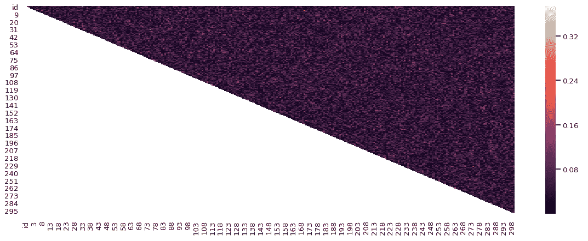

# 特征选择和降维

> 原文：<https://towardsdatascience.com/feature-selection-and-dimensionality-reduction-f488d1a035de?source=collection_archive---------2----------------------->

## 探索 Kaggle“不要过度适应 II”竞赛中的特征选择和降维技术


Photo by [rawpixel](https://unsplash.com/photos/CMuFjjDHI70?utm_source=unsplash&utm_medium=referral&utm_content=creditCopyText) on [Unsplash](https://unsplash.com/search/photos/collection?utm_source=unsplash&utm_medium=referral&utm_content=creditCopyText)

根据[维基百科](https://en.wikipedia.org/wiki/Feature_selection)，“特征选择是选择相关特征子集用于模型构建的过程”，或者换句话说，选择最重要的特征。

在正常情况下，领域知识起着重要的作用，我们可以选择我们认为最重要的特性。例如，在预测房价时，卧室的数量和面积通常被认为是重要的。

不幸的是，在“不要过度适应”II 竞赛中，使用领域知识是不可能的，因为我们有一个二元目标和 300 个“神秘起源”的连续变量，迫使我们尝试自动特征选择技术。

完整的笔记本可以在这里找到[。](https://www.kaggle.com/tboyle10/feature-selection)

# 特征选择与降维

通常，特征选择和降维被组合在一起(如本文中所示)。虽然这两种方法都用于减少数据集中的要素数量，但有一个重要的区别。

特征选择是简单地选择和排除给定的特征**而不改变它们**。

维度缩减**将**特征转换到一个更低的维度。

在本文中，我们将探讨以下特征选择和维度缩减技术:

## 特征选择

*   移除缺少值的要素
*   移除方差较小的要素
*   移除高度相关的要素
*   单变量特征选择
*   递归特征消除
*   使用 SelectFromModel 进行特征选择

## 降维

*   主成分分析

# 基线模型

我们将使用逻辑回归作为基线模型。我们首先分成测试集和训练集，并缩放数据:

```
# prepare for modeling
X_train_df = train.drop(['id', 'target'], axis=1)
y_train = train['target']# scaling data
scaler = StandardScaler()
X_train = scaler.fit_transform(X_train_df)lr = LogisticRegression(solver='liblinear')
lr_scores = cross_val_score(lr,
                            X_train,
                            y_train,
                            cv=5,
                            scoring='roc_auc')print('LR Scores: ', lr_scores)LR Scores:  [0.80729167 0.71875    0.734375   0.80034722 0.66319444]
```

我们可以从交叉验证分数的变化中看到模型过度拟合。我们可以尝试通过特征选择来提高这些分数。

# 移除缺少值的要素

检查缺失值是任何机器学习问题的良好开端。然后，我们可以删除超出我们定义的阈值的列。

```
# check missing values
train.isnull().any().any()False
```

不幸的是，对于我们的降维工作来说，这个数据集没有缺失值。

# 移除方差较小的要素

在 sklearn 的特征选择模块中我们找到了`VarianceThreshold`。它会移除方差未达到某个阈值的所有要素。默认情况下，它会移除方差为零的要素或所有样本值相同的要素。

```
from sklearn import feature_selection

sel = feature_selection.VarianceThreshold()
train_variance = sel.fit_transform(train)
train_variance.shape(250, 302)
```

比赛描述说我们的特征都是连续的。从上面我们可以看到，所有列中没有具有相同值的特性，因此我们在这里没有要删除的特性。

我们可以随时重新审视这一技术，并考虑移除方差较低的特征。

# 移除高度相关的要素

高度相关或共线的特征会导致过度拟合。

当一对变量高度相关时，我们可以删除其中一个以降低维度，而不会丢失太多信息。我们应该保留哪一个？与目标相关性更高的那个。

让我们探索一下我们的特征之间的相互关系:

```
# find correlations to target
corr_matrix = train.corr().abs()print(corr_matrix['target'].sort_values(ascending=False).head(10))target    1.000000
33        0.373608
65        0.293846
217       0.207215
117       0.197496
91        0.192536
24        0.173096
295       0.170501
73        0.167557
183       0.164146
```

这里我们看到了与我们的目标变量高度相关的特征。特征 33 与目标的相关性最高，但是相关性值只有 0.37，所以相关性很弱。

我们还可以检查功能与其他功能的相关性。下面我们可以看到一个相关矩阵。看起来我们的特征没有一个高度相关。



Correlation Matrix

让我们尝试删除相关值大于 0.5 的要素:

```
# Find index of feature columns with high correlation
to_drop = [column for column in matrix.columns if any(matrix[column] > 0.50)]
print('Columns to drop: ' , (len(to_drop)))Columns to drop: 0
```

使用高度相关的特性，我们没有要删除的列。让我们继续探索其他策略。

# 单变量特征选择

单变量特征选择通过基于单变量统计测试选择最佳特征来工作。

我们可以使用 sklearn 的 SelectKBest 来选择一些要保留的特性。该方法使用统计测试来选择与目标具有最高相关性的特征。这里我们将保留前 100 个功能。

```
from sklearn.feature_selection import SelectKBest, f_classif*# feature extraction*
k_best = SelectKBest(score_func=f_classif, k=100)*# fit on train set*
fit = k_best.fit(X_train, y_train)*# transform train set*
univariate_features = fit.transform(X_train)
```

# 递归特征消除

递归特征选择通过消除最不重要的特征来工作。它以递归方式继续，直到达到指定的特征数。递归消除可用于任何通过`coef_`或`feature_importances_`为特征分配权重的模型

这里，我们将使用随机森林来选择 100 个最佳功能:

```
from sklearn.feature_selection import RFE# feature extraction
rfe = RFE(rfc, n_features_to_select=100)# fit on train set
fit = rfe.fit(X_train, y_train)# transform train set
recursive_features = fit.transform(X_train)
```

# 使用`SelectFromModel`功能选择

像递归特征选择一样，sklearn 的`SelectFromModel`与任何具有`coef_`或`feature_importances_`属性的估计器一起使用。它会移除值低于设定阈值的要素。

```
from sklearn.feature_selection import SelectFromModel
from sklearn.ensemble import RandomForestClassifier# define model
rfc = RandomForestClassifier(n_estimators=100)# feature extraction
select_model = feature_selection.SelectFromModel(rfc)# fit on train set
fit = select_model.fit(X_train, y_train)# transform train set
model_features = fit.transform(X_train)
```

# 主成分分析

PCA(主成分分析)是一种降维技术，它将数据投影到一个更低维的空间中。

虽然有许多有效的降维技术，主成分分析是我们在这里探讨的唯一例子。

PCA 在许多情况下都很有用，但特别是在多重共线性过大或预测因子的解释不重要的情况下。

这里我们将应用 PCA 并保留 90%的方差:

```
from sklearn.decomposition import PCA
# pca - keep 90% of variance
pca = PCA(0.90)principal_components = pca.fit_transform(X_train)
principal_df = pd.DataFrame(data = principal_components)print(principal_df.shape)(250, 139)
```

我们可以看到剩下的 139 个特征解释了我们数据中 90%的差异。

# 结论

特征选择是任何机器学习过程的重要部分。在这里，我们探讨了几种有助于提高模型性能的特征选择和降维方法。