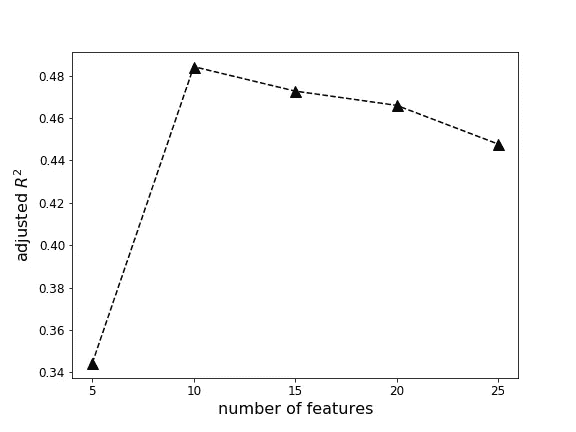

# Airbnb 柏林数据集上的特征选择和回归

> 原文：<https://towardsdatascience.com/feature-selection-and-regression-on-the-airbnb-berlin-dataset-decaf771880b?source=collection_archive---------28----------------------->

数据科学的多学科领域可以从结构化和非结构化数据中提取深刻的见解和知识。它统一了统计学、数据分析和机器学习等相关概念，用数据来理解和分析实际现象。机器学习(ML)使计算机能够在没有明确编程的情况下进行学习和解释。ML 方法广泛应用于金融、医疗保健、材料科学、运输、石油和天然气等领域。

在这项研究中，我们对柏林地区的 Airbnb 数据集[1]进行了分析，并使用回归分析预测了 Airbnb 的价格。我们使用了基于 python 的开源数据分析平台的“sci kit-learn”[3]库中可用的随机森林回归[2]模型，这些图是使用 Matplotlib 创建的。

Airbnb 数据集的形状是(22552，96)。这 96 个要素中有许多是非数字要素，并且许多要素有缺失值。使用标签编码器将一些非数字特征转换为数字特征。使用正向填充方法填充缺失值，并从“$”、“、”等中清除某些要素。使用条带法。此外，我们使用 Airbnb 的经度和纬度创建了 Airbnb 到柏林中心的新特征“距离”。这个新要素随后被追加到原始数据集中。数据处理完成后，我们使用 scikit-learn 中的“功能选择”来选择重要的功能。我们计算每个特征和目标之间的 *χ2* ，并选择具有最佳 *χ2* 分数的期望数量的特征。最佳的 25 个特征和 *χ2* 分数在下面的表 1 中列出。

```
**Table 1\. Best 25 features of the dataset and their corresponding *χ2* scores.
   Features                     χ2 scores**
maximum_nights                 2.152729e+10
minimum_nights                 8.856912e+05
security_deposit               7.716334e+05
number_of_reviews              8.341015e+04
square_feet                    2.982368e+04
property_type                  2.222414e+04
calculated_host_listings_count 1.072021e+04
neighbourhood_cleansed         1.071895e+04
accommodates                   7.771539e+03
room_type                      4.234147e+03
neighbourhood                  3.254091e+03
guests_included                3.061216e+03
bedrooms                       2.380380e+03
cancellation_policy            1.444670e+03
distance                       9.580979e+02
host_is_superhost              6.349556e+02
neighbourhood_group_cleansed   5.957898e+02
instant_bookable               3.502228e+02
bathrooms                      3.290317e+02
review_scores_rating           2.151681e+02
is_location_exact              9.053878e+01
review_scores_cleanliness      5.194306e+01
review_scores_accuracy         2.410470e+01
bed_type                       7.055763e+00
longitude                      1.016177e-01
```

接下来，只选择了前五个特性。这个子集被分成训练和测试数据。“价格”被设定为目标特征。训练数据子集用于拟合随机森林，而测试子集用于预测。通过使用包括前十、前十五、前二十和前二十五个特征的不同子集来重复这一过程。对于每种情况，我们计算的值定义为

```
**adjusted R^2 = 1-R^2(N-1)/(N-M-1)**
```

其中 N 是数据集中的点数，M 是独立要素的数量，而是拟合优度的测量值。随着模型特征数量的增加而增加。因为总是增加而从不减少，所以随着更多的术语被添加到模型中，它可能看起来更适合。在回归分析中，向数据中添加更多的变量是很诱人的，这可能会产生误导。其中一些变量可能是重要的，但人们不能确定这种重要性只是偶然的。通过对那些额外变量进行惩罚来对此进行补偿。相应的曲线如图 1 所示。



图一。图中的特征数和相应的*调整后的 R*

# 结论:

通过图表进行探索性数据分析(EDA)无疑是有用和重要的。然而，对于大型数据集，采用 EDA 变得极其困难，因为有大量的图要分析。因此，通过 *scikit* learn 的 SelectKBest 方法进行的特性选择提供了一种定义良好的特性选择方式，如这里所示。