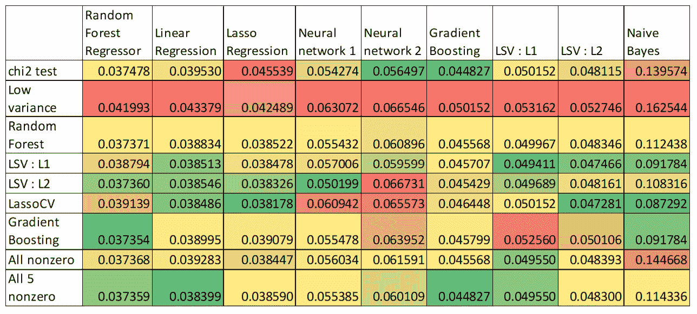
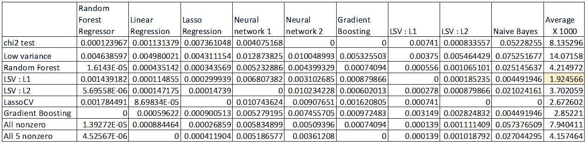
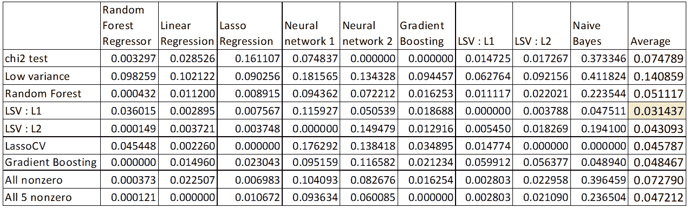
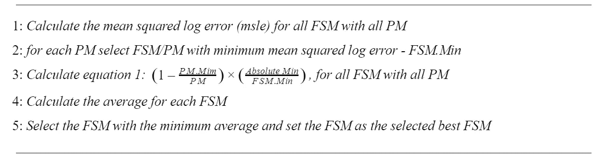

# 自动化人工智能的特征选择评估

> 原文：<https://towardsdatascience.com/feature-selection-evaluation-for-automated-ai-e67f488098d8?source=collection_archive---------15----------------------->

## 如何为特征选择算法设置自动选择

Photo by [Anthony](https://www.pexels.com/@inspiredimages?utm_content=attributionCopyText&utm_medium=referral&utm_source=pexels) from [Pexels](https://www.pexels.com/photo/clear-water-drops-132477/?utm_content=attributionCopyText&utm_medium=referral&utm_source=pexels)

特征选择算法寻求在数据中有效且高效地找到相关特征的最优子集。随着要素数量和数据集大小的增加，这一预处理步骤变得至关重要。在本帖中，我们将展示我们在 [TapReason](https://tapreason.com/) 开发的独特自动流程，用于评估特定数据集的不同特征选择算法的有效性。在第一和第二部分，我们解释了执行特征选择的动机，并回顾了常见的特征选择方法(FSM)。第三部分描述了我们在研究中使用的方法及其结果。在第四部分，我们提出了 TapReason 算法来评估和选择特征选择算法。

# 动机

在机器学习和模式识别中，特征是正在观察的现象的单个可测量的属性或特征。收集和处理数据可能是一个昂贵且耗时的过程。因此，选择信息丰富的、有区别的和独立的特征是有效算法的关键步骤。

在我们生活的信息时代，数据集的规模在实例数量和可用特性数量上都变得越来越大。在许多不同的领域中，拥有数万个或更多要素的数据集已经变得非常常见。此外，在许多情况下，算法开发人员通过使用称为特征生成的过程来增加可用特征的数量。要素生成是从一个或多个现有要素创建新要素的过程，以便在统计分析中使用。通常，特征生成过程将现有特征的表示转换成新的更复杂的表示，这将有助于算法更有效地执行。该过程显著增加了特征的数量，尤其是如果它是自动完成的话。以如此多的特征结束的问题是，一些算法在多个维度上表现很差，并且在一些维度上，它可能导致过度拟合。

对于高维数据，通常许多特征对于给定的学习任务是不相关的或冗余的，在性能或计算成本方面具有有害的后果(“维数灾难”)。特征选择是降维、去除无关数据、提高学习精度、提高结果可理解性的有效方法[【1】](http://www.ijarcst.com/conference/first/conf8.pdf)。

由于一些预测模型(PM)与特定的特征选择方法一起工作得更好，我们需要仔细选择 FSM 以最好地适合 PM。在 TapReason 中，人工智能算法会自动选择预测模型。因此，我们需要找到一个能够有效支持我们使用的所有 PM 的特征选择算法。此外，我们还提出了如何衡量特征选择效率的问题。我们如何知道我们在选择功能方面越来越好？以及如何利用积累的知识来改进 FS 算法？

# 常见特征选择方法

许多特征选择方法已经被提出并研究用于机器学习应用。它们可以分为四大类:嵌入式、包装器、过滤器和混合方法[【1】](http://www.ijarcst.com/conference/first/conf8.pdf)。

# 过滤方法

滤波方法是预处理方法，独立于学习算法，具有很好的通用性。他们试图从数据中评估特征的优点，忽略了所选特征子集对学习算法性能的影响[【1】](http://www.ijarcst.com/conference/first/conf8.pdf)。它们的计算复杂度很低，但是学习算法的精度不能保证得到提高。例如，一些方法是根据方差、相关性、单变量特征选择(基于单变量统计测试的选择，例如 chi2 测试、F 值)、通过压缩技术(例如 PCA)或通过计算与输出的相关性(例如 Gram-Schmidt、互信息)来对特征进行排序。

# 包装方法

包装方法是根据变量子集对给定预测器的有用性来评估变量子集的方法。这些方法使用预定学习算法的预测准确性来确定所选子集的良好性。这些方法的两个主要缺点是:

*   当观察次数不足时，过拟合风险增加。
*   当变量数量很大时，计算时间很长。

例如，在线性回归分析中提出了逐步方法，如人工神经网络的 AIC、BIC 和 MSE。

# 嵌入式方法

嵌入式方法将特征选择作为训练过程的一部分，并且通常特定于给定的学习算法，因此可能比前两类更有效。像决策树或人工神经网络这样的传统机器学习算法就是嵌入式方法的例子。

# 混合方法

提出了混合方法来结合过滤器和包装器的最佳特性。首先，使用过滤方法来减少特征维度空间，这将被后续的包装器考虑。然后，使用包装器来寻找最佳候选子集。混合方法通常实现包装器特有的高精度和过滤器特有的高效率[【2】](https://bib.irb.hr/datoteka/763354.MIPRO_2015_JovicBrkicBogunovic.pdf)。在 TapReason 中，我们使用混合方法过滤器并嵌入到各种组合中，以自动找到最适合手头问题的特征选择方法。

# 评估有限状态机有效性的方法

对于研究预测方法对特征选择方法的反应的过程，我们选择了九种 FSM 和九种预测方法(PM ),并计算预测的均方对数误差。在表 1 中，您可以看到不同 PM 的均方对数误差与 FSM 的相关性。每一列的颜色分别从绿色(最好)到红色(最差)。根据表 1，对于大多数 PM，使用低方差的 FSM 是最差的 FSM。根据表 1，朴素贝叶斯是最差的 PM。全非零 FSM 是由至少一个 FSM 选择的所有特征的组合。所有 5 个非零 FSM 是由至少 5 个 FSM 选择的所有特征的组合。

Table 1: feature selection method Vs prediction methods. Image by Author.

有几种方法可以分析表 1 所示的结果，以评估不同的特性选择方法。例如:

1.  绝对最小值、最佳均方对数误差 FSM/PM。在表 1 中，最佳结果是用于随机森林回归的梯度推进(FSM)。
2.  对列中得分最高的 FSM 进行排名，chi 测试，LassoCV，所有 5 个非零特征，都获得了两次最高分。
3.  对 FSM 得分的平均值进行排名。在表 1 中，它是所有 5 个非零功能的 FSM。

上述每种方法都指向不同的最优 FSM。因此我们引入了第四种方法:

4.最小𝛥-在要素选择算法中描述。这种方法显示出最有希望的结果。

在表 2 中，我们显示了 PM 的均方对数误差和最小均方对数误差之间的𝛥。使用 FSM 行 X 1000 的平均值分析结果表，在 LSV: L1 产生最小值。可以看到，每一列都有一个 FSM 为零，这是 PM 的最小均方对数误差。FSM、LassoCV 和所有 5 个非零具有 PM ( *FSM)的最小均方对数误差中的三个。Min* )但是他们都没有最小的平均𝛥.FSM LSV: L1 具有最小的平均𝛥.

Table 2: The FSM/PM table according 𝛥 from the Minimum. Image by Author.

根据这一分析，选择 Lasso 回归 FSM，因为它在所有 PMs 中对 LSV: L1 具有最好的均方对数误差。0.0384782765 的结果比较接近绝对最小值(*绝对值)。Min)* 最适为 0.03735447816。但是进一步的研究发现，结果相对较差的 PM 倾向于使选择过程偏向对它们表现最好的算法。因此，我们决定通过根据它们与绝对最小值(*绝对值)的距离调整 PMs 的权重来抵消这种影响。最小*。根据以下等式计算距离:

*密克罗尼西亚联邦。min-*FSM 的最小均方对数误差。

*绝对。Min-* 最小均方对数误差在 *FSM/PM 表中。*

*下午。Min-* 预测方法的最小均方对数误差。

*PM-* 最小均方对数误差。

Table 3: The FSM/PM table according to equation 1\. Image by Author.

在表 3 中，我们可以看到这个例子的最终结果没有变化。但是现在 FSM 用更高的 *FSM。Min* 对平均值的影响(权重)较小，因此对所选的 FSM 的影响较小。这样，我们给了所有 FSM 一个机会，但不会因为大𝛥而使结果偏离最小值。

# 该算法

在 TapReason，我们使用几十种不同的有限状态机来搜索每个问题的最佳算法。这些 FSM 包括各种各样的滤波器、嵌入式方法以及基于过去性能构建的集合 FSM。针对每个问题，针对每个客户端定期离线更新功能选择方法。实现的算法如下:

因此，很少选择以前的方法。

# 未来的研究

我们知道，某些预测方法与某些特征选择方法一起使用效果更好。由于在所呈现的过程中，首先选择 FSM，所以在该过程中不表达 PM 偏好。因此，我们可以为每个 PM 收集最佳 FSM 的信息，并在选择 PM 后使用它。

[1][http://www.ijarcst.com/conference/first/conf8.pdf](http://www.ijarcst.com/conference/first/conf8.pdf)

[2][https://bib.irb.hr/datoteka/763354.mi pro _ 2015 _ jovicbrkicbogunovic . pdf](https://bib.irb.hr/datoteka/763354.MIPRO_2015_JovicBrkicBogunovic.pdf)