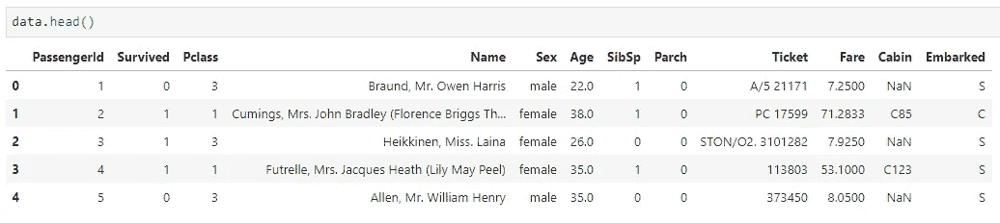
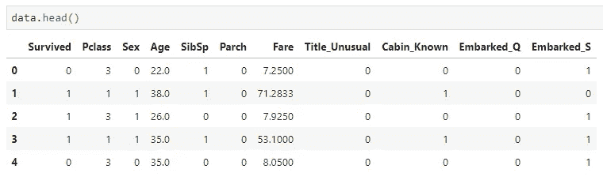
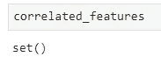
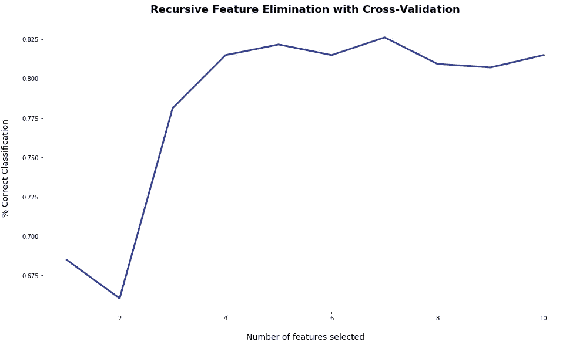
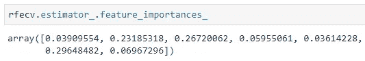
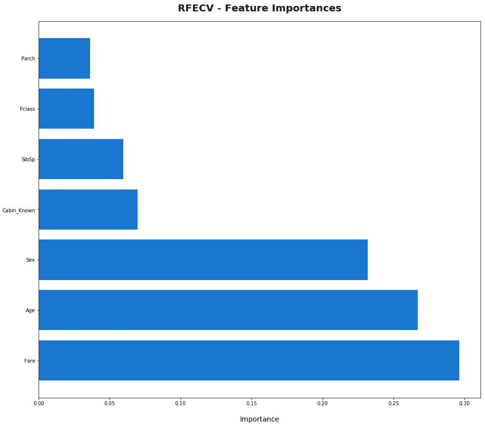

# Python 中的要素选择—递归要素消除

> 原文：<https://towardsdatascience.com/feature-selection-in-python-recursive-feature-elimination-19f1c39b8d15?source=collection_archive---------0----------------------->

寻找用于机器学习模型训练的最佳特征有时可能是一项难以完成的任务。我并不是说这个过程本身很难，只是有太多的方法可供选择。你可能已经读过很多像主成分分析这样的方法，它绝不是一个坏方法，但它不会告诉你哪些特征是最重要的——它会返回主成分，这些主成分实际上是特征的组合(用最简单的话来解释)。

为了解决这个问题，出现了**递归特征消除**技术。在本文中，我将讨论带交叉验证的递归特性消除( **RFECV** )，因为它比不带交叉验证的选项更常用。首先，让我们讨论一些术语:

*递归*——为了产生特定的结果或效果，多次做或说同样的事情【1】(只要谷歌一下‘递归’这个词，你马上就能找到它的要点)

*特征* —被观察现象的个体可测量属性或特征[2] —数据集中的属性

*交叉验证* —一种评估 ML 模型的技术，通过在可用输入数据的子集上训练几个 ML 模型，并在数据的互补子集上评估它们。使用交叉验证来检测过度拟合，即未能归纳出一个模式[3]

好了，现在解释了一些基本术语，是时候简要解释一下 RFE 背后的想法了。我会说这个街区完美地解释了它:

> 如前所述，递归特征消除(RFE，Guyon 等人( [2002](https://bookdown.org/max/FES/references.html#ref-Guyon) ))基本上是预测器的向后选择。该技术首先在整个预测因子集上建立一个模型，并计算每个预测因子的重要性分数。然后移除最不重要的预测值，重新构建模型，并再次计算重要性分数。在实践中，分析师指定要评估的预测值子集的数量以及每个子集的大小。因此，子集大小是 RFE 的*调整参数*。优化性能标准的子集大小用于基于重要性排名选择预测器。然后，最佳子集用于训练最终模型。[4]

说到它背后的理论，基本上就是这样了。当然，仍有一些方面需要讨论，但我不想用一堆理论来抨击你——请自行进一步探索。

好了，现在开始有趣的事情——编码！

# 1.数据集介绍和准备

首先，让我们讨论一下所使用的数据集。我将使用著名的[泰坦尼克号数据集](https://raw.githubusercontent.com/datasciencedojo/datasets/master/titanic.csv)。我之所以选择使用这个数据集，是因为它非常有名，而且很容易清理和准备。和往常一样，你的笔记本要从导入最常见的疑点开始——***【Numpy】******熊猫******Matplotlib***。我还从 *Scikit-Learn* 中导入了***random forests******StratifiedKFold***和 ***RFECV*** 。该模型将通过随机森林进行训练，由于类别不平衡(存活/未存活)，将需要分层以确保每个类别的良好代表性:

[https://gist.github.com/dradecic/761479ba15e6d371b2303008c614444a#file-rfecv_1_imports-py](https://gist.github.com/dradecic/761479ba15e6d371b2303008c614444a#file-rfecv_1_imports-py)

现在，您可以读入数据集并检查它的头部:

Head of titanic.csv

以下是关于数据清理需要做的事情:

1.  ***PassengerId*** 和 ***车票*** 应该被丢弃——第一个只是一个任意的整数值，第二个对每个乘客都是截然不同的。
2.  ***性别*** 列的值应重新映射为 0 和 1，而不是“男性”和“女性”
3.  从 ***姓名*** 中提取人物头衔，如先生、夫人、小姐……等，如果头衔常见(先生、小姐)，则进一步转换为 0 和 1-0。)，如果不是，则为 1(博士、牧师、上尉)。最后，**名*名*名**应该去掉
4.  ***船舱*** 应替换为 ***船舱 _ 已知*** —如果值为 *NaN* ，否则为 1
5.  虚拟列应该从 ***开始创建*** 并且应该删除第一个虚拟列以避免共线性问题
6.  ***年龄*** 中缺失的值应填入平均值的整数值

下面的代码片段将处理提到的所有问题:

[https://gist.github.com/dradecic/2b6c1d81e6089cf6022b36f82b460f4b](https://gist.github.com/dradecic/2b6c1d81e6089cf6022b36f82b460f4b)

完成后，数据集应该是这样的:

Head of cleaned titanic.csv

您的数据集现在已经清理和准备好了，您可以继续下一部分。

# 2.移除相关特征

RFE 的主要问题是运行起来可能很昂贵——所以你应该事先尽你所能减少功能的数量。移除相关要素是一种很好的方法，因为您可能知道，**您不希望数据集中的要素高度相关，因为它们提供相同的信息**-一个要素就足够了。

为了解决这个问题，你可以绘制一个相关矩阵，然后记下哪些特征是相关的，并手动删除它们，但总有一个更聪明的方法。我决定与您分享一个简单的片段，它将检查哪些特征的相关系数高于 0.8。由于显而易见的原因，这样做时，您应该**总是删除目标变量**。不管怎样，这是片段:

[https://gist.github.com/dradecic/f8d32045aa886756f59adc1ca50eabd1](https://gist.github.com/dradecic/f8d32045aa886756f59adc1ca50eabd1)

如果您现在检查 ***关联 _ 特性*** 集合中的内容，您会看到:

Correlated features

这很好，因为该数据集不包含任何相关的要素。在您的工作中，通常您的数据集不会有这么少的属性，其中一些属性可能是相关的，因此这是查找它们的最快方法。

从数据集中删除它们的过程就像调用 ***一样简单。drop()*** 和 passing***correlated _ features***作为参数。

# 3.运行 RFECV

现在有趣的部分终于开始了。您将需要声明两个变量— ***X*** 和 ***target*** ，其中第一个表示所有特性，第二个表示目标变量。然后你将创建一个机器学习算法的实例(我使用的是 **RandomForests** )。在其中，您可以有选择地传递一个随机状态种子以获得可再现性。现在你可以创建一个 ***RFECV*** 的实例，这里需要参数:

1.  *估算器* —您的模型实例
2.  *步骤* —每次迭代要移除的特征数量
3.  *cv* —您的交叉验证，使用 StratifiedKFold 并将 K 设置为 10
4.  *评分* —评分标准，您想要优化的内容。我使用了“准确性”,但您可以选择任何其他选项

它应该是这样的:

[https://gist.github.com/dradecic/ce30af3efc6072f18e67f0d54a13f8e7](https://gist.github.com/dradecic/ce30af3efc6072f18e67f0d54a13f8e7)

执行这个单元可能需要一些时间——我的意思是，如果你的电脑是新的，需要测试的功能很少，这可能不会发生，但仍然需要几秒钟。

一旦执行完成，您可以使用这一行代码来查看有多少特性是产生最佳准确度的最佳特性(或者您选择的任何度量):

[https://gist.github.com/dradecic/4b27705203dd018168f2eb4ddfeeca79](https://gist.github.com/dradecic/4b27705203dd018168f2eb4ddfeeca79)

不仅如此，您还可以绘制出使用每种特性所获得的精度:

[https://gist.github.com/dradecic/94305fc88c19976aa64ffec3716d4bba](https://gist.github.com/dradecic/94305fc88c19976aa64ffec3716d4bba)

Accuracy obtained vs. Num Features used

可以看到，使用 **7** 特性时，精确度约为 **82.5%** ，这对于我们所做的大量准备工作来说当然不算糟糕。

您还可以打印出哪些特性被认为是最不重要的，并用下面的代码片段删除它们:

[https://gist.github.com/dradecic/d2bb599f662c8f586b4180d5baf17038](https://gist.github.com/dradecic/d2bb599f662c8f586b4180d5baf17038)

RFECV 的实例也有一个漂亮的***feature _ importances***属性，值得一试:

Feature importances

好吧，好吧，先别冲我吼。我知道这不能告诉你太多。谢天谢地，这很容易想象。一种方法是创建一个 **DataFrame** 对象，属性作为一列，重要性作为另一列，然后简单地按照重要性降序排列数据帧。然后，您可以使用绘图库(如***【Matplotlib】***)来绘制条形图(这种情况下最好是水平的)以获得漂亮的视觉表示。下面是这样做的代码:

[https://gist.github.com/dradecic/4bc8f929a86795c0d9c5e663293cd71f](https://gist.github.com/dradecic/4bc8f929a86795c0d9c5e663293cd71f)

运行此代码单元后，您将获得特性重要性的可视化表示:

RFECV — Feature Importance

这基本上就是递归特征消除！这张图表会告诉你一切。现在，您可以尝试使用这 7 个特征来训练模型，稍后，您可以尝试子集化并仅使用三个最重要的特征( ***票价*** 、 ***年龄*** 和 ***性别*** )。

# 4.结论

最后，我只想说谢谢你把这篇文章读完。RFE 当然不是唯一使用的特征选择方法，但它是其中之一，我当然觉得它没有得到应有的关注。我希望这篇文章背后的代码和逻辑能对你的日常工作和/或兼职项目有所帮助。

直到下一次…

*喜欢这篇文章吗？成为* [*中等会员*](https://medium.com/@radecicdario/membership) *继续无限制学习。如果你使用下面的链接，我会收到你的一部分会员费，不需要你额外付费。*

 [## 通过我的推荐链接加入 Medium-Dario rade ci

### 作为一个媒体会员，你的会员费的一部分会给你阅读的作家，你可以完全接触到每一个故事…

medium.com](https://medium.com/@radecicdario/membership) 

# 参考

[1][https://dictionary . Cambridge . org/dictionary/English/recursive](https://dictionary.cambridge.org/dictionary/english/recursive)

[2][https://en . Wikipedia . org/wiki/Feature _(machine _ learning)](https://en.wikipedia.org/wiki/Feature_(machine_learning))

[3][https://docs . AWS . Amazon . com/machine-learning/latest/DG/cross-validation . html](https://docs.aws.amazon.com/machine-learning/latest/dg/cross-validation.html)

[4][https://book down . org/max/FES/recursive-feature-elimination . html](https://bookdown.org/max/FES/recursive-feature-elimination.html)