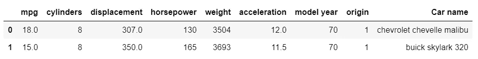
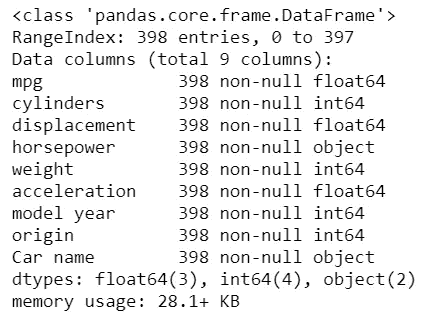
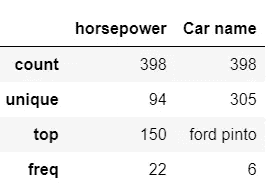
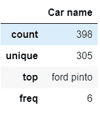
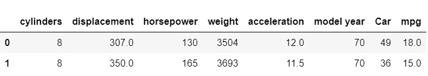
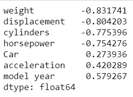
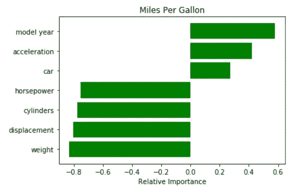
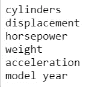
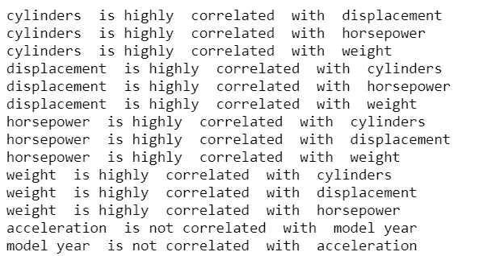
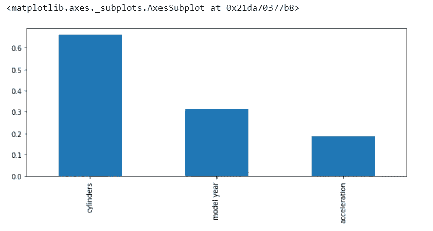

# 使用过滤器方法在 Python 中选择要素

> 原文：<https://towardsdatascience.com/feature-selection-in-python-using-filter-method-7ae5cbc4ee05?source=collection_archive---------3----------------------->

## ***在本文中，我们将使用 Pythons 中的过滤方法实现特征选择。这里我们将探讨包括相关性、互信息*和**的过滤方法

先决条件:[功能选择理解](https://medium.com/datadriveninvestor/feature-selection-identifying-the-best-input-features-2ba9c95b5cab)


# 特征选择的过滤方法

过滤方法基于一些单变量度量对每个特征进行排名，然后选择排名最高的特征。一些单变量指标是

*   **方差:**去除常数和准常数特征
*   **卡方:**用于分类。这是一种独立性的统计测试，用于确定两个变量的相关性。
*   **相关系数:**删除重复特征
*   **信息增益或互信息**:评估自变量在预测目标变量时的相关性。换句话说，它决定了独立特征预测目标变量的能力

## 过滤方法的优势

*   过滤方法是模型不可知的
*   完全依赖数据集中的特征
*   计算速度非常快
*   基于不同的统计方法

## 过滤方法的缺点

*   过滤方法着眼于单个特征，以确定其相对重要性。一个特性本身可能没什么用，但是当它与其他特性结合起来时，可能是一个重要的影响因素。过滤方法可能会遗漏这些特征。

## 选择最佳特征的过滤标准

使用选择独立特征

*   与目标变量高度相关
*   与另一个独立变量相关性低
*   自变量的较高信息增益或互信息

此处有可用的数据集

导入所需的库

```
import numpy as np
import pandas as pd
import matplotlib.pyplot as plt
import seaborn as sns
%matplotlib inline
from sklearn.model_selection import train_test_split
**from sklearn.feature_selection import mutual_info_regression, mutual_info_classif**
```

读取数据集中的数据

```
dataset= pd.read_csv(‘c:\\data\\auto-mpg.csv’)
dataset.head(2)
```



```
dataset.info()
```



我们看到马力不是浮动的，但是上面的数据显示马力是数字的。

检查分类特征的存在

```
dataset.describe(include=’O’)
```



将马力特性更新为 int 并用 0 填充所有空值

```
dataset[‘horsepower’] = pd.to_numeric(dataset[‘horsepower’], errors=’coerce’).fillna(0).astype(int)
```

我们现在再次检查分类变量的存在

```
dataset.describe(include=’O’)
```



我们看到马力不再是一个分类变量，汽车名称是唯一的分类变量。

为汽车名称创建一个 labelEncoder，用 0 和 n_classes-1 之间的值对汽车名称进行编码。在我们的例子中，汽车名称的 n _ classes 是 305

```
**from sklearn.preprocessing import LabelEncoder**
labelencoder = LabelEncoder()
**X_en= dataset.iloc[:, 8].values
X_en = labelencoder.fit_transform(X_en)**
```

创建输入要素 X 和目标变量 y

```
X= dataset.iloc[:,1:7]
X[‘Car’] = X_en
y= dataset.iloc[:,0].values
```

在将所有输入要素转换为数字(包括目标变量)后，创建一个包含所有输入要素的数据集

```
full_data= X.copy()
full_data[‘mpg’]= y
full_data.head(2)
```



## **应用过滤方法的步骤 1**

**识别与目标变量高度相关的输入特征。**

这里我们打印每个输入特征与目标变量的相关性

```
**importances = full_data.drop(“mpg”, axis=1).apply(lambda x: x.corr(full_data.mpg))**
indices = np.argsort(importances)
print(importances[indices])
```



绘制这些数据以便可视化

```
**names=['cylinders','displacement','horsepower','weight','acceleration','model year', 'car']** plt.title('Miles Per Gallon')
**plt.barh(range(len(indices)), importances[indices], color='g', align='center')**
plt.yticks(range(len(indices)), [names[i] for i in indices])
plt.xlabel('Relative Importance')
plt.show()
```



我们希望保留仅与目标变量高度相关的特征。这意味着输入特征对预测目标变量有很大的影响。

我们将阈值设置为绝对值 0.4。只有当输入特征与目标变量的相关性大于 0.4 时，我们才保留输入特征

```
for i in range(0, len(indices)):
   ** if np.abs(importances[i])>0.4:**
        print(names[i])
```



Features with correlation >0.4 with target variable

```
X= dataset[ [‘cylinders’, ‘displacement’, ‘horsepower’, ‘weight’, ‘acceleration’, ‘model year’]]
```

我们现在已经将输入特征从 7 个减少到 6 个。汽车名称被删除，因为它与 mpg(每加仑英里数)的相关性不高

## 应用过滤方法的步骤 2

识别与其他独立变量相关性较低的输入特征。

根据步骤 1 遍历所有过滤后的输入要素，并检查每个输入要素与所有其他输入要素的相关性。

我们将保留与其他输入要素不高度相关的输入要素

```
for i in range(0,len(X.columns)):
    for j in  range(0,len(X.columns)):
        if i!=j:
            corr_1=np.abs(X[X.columns[i]].corr(X[X.columns[j]]))
            **if corr_1 <0.3:
                print( X.columns[i] , " is not correlated  with ", X.columns[j])**
            **elif corr_1>0.75:
                print( X.columns[i] , " is highly  correlated  with ", X.columns[j])**
```



排量，马力，气缸，重量高度相关。我们将只保留其中的一个。

基于上述结果，我们保留气缸、加速度和车型年，并删除马力、排量和重量

```
X= dataset[ [‘cylinders’, ‘acceleration’, ‘model year’]]
```

## 应用过滤方法的步骤 3

**求自变量相对于目标变量的信息增益或互信息**

```
mi = mutual_info_regression(X, y)
```

绘制交互信息

```
mi = pd.Series(mi)
mi.index = X.columns
mi.sort_values(ascending=False)
mi.sort_values(ascending=False).plot.bar(figsize=(10, 4))
```



我们现在有了预测每加仑英里数的特征重要性。每加仑行驶的英里数可以根据汽车的汽缸数量、汽车制造年份和加速度来预测。

**用于特征选择的过滤方法因此是模型不可知的，简单且易于解释**

代码可用[此处](https://github.com/arshren/Feature-Selection/blob/master/Feature_Selection.ipynb)