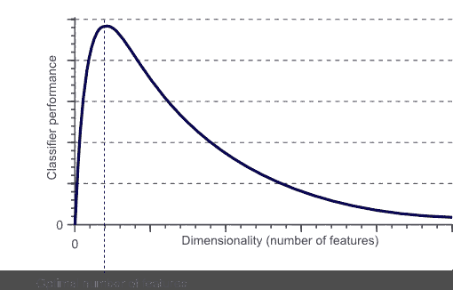
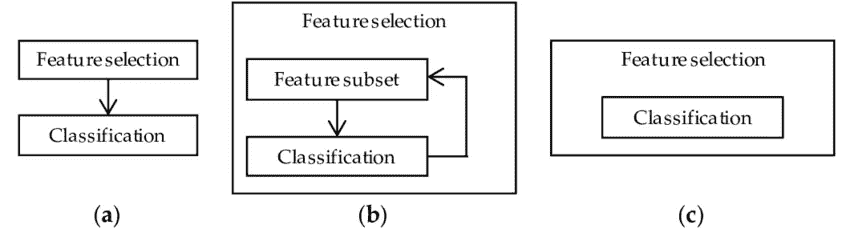
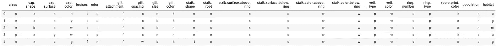
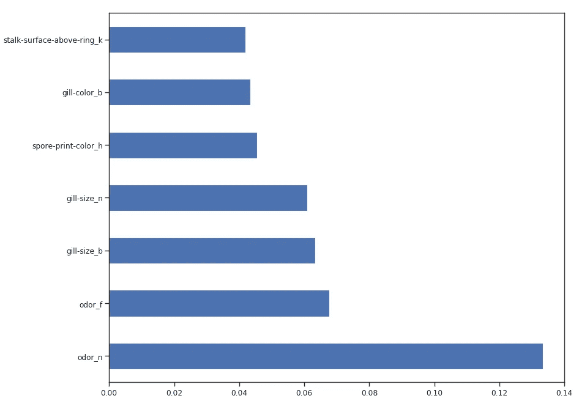
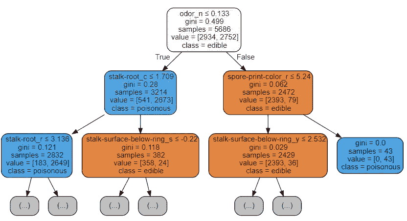
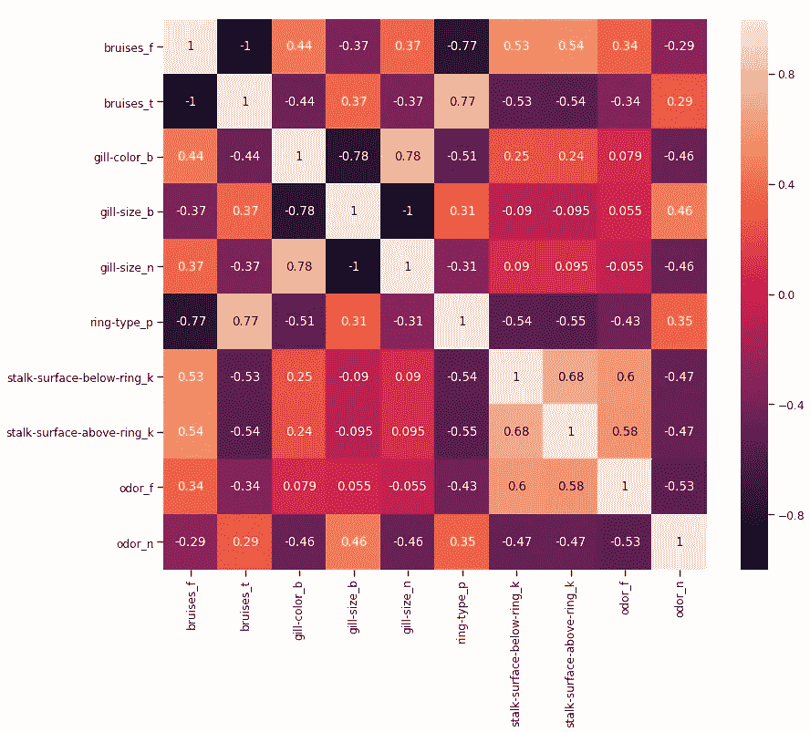
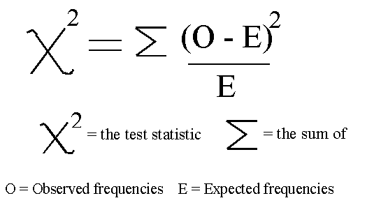
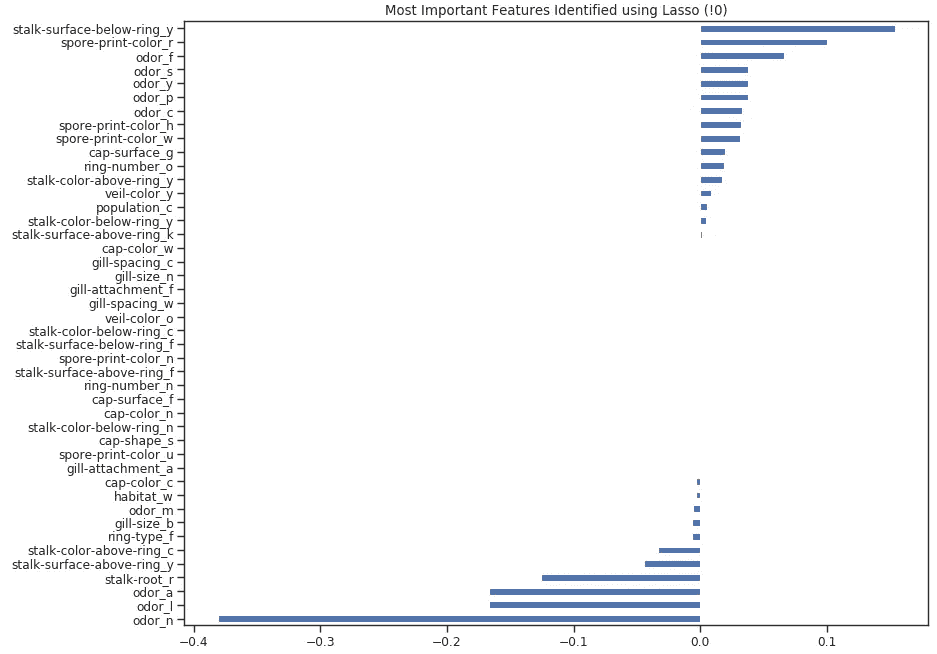

# 特征选择技术

> 原文：<https://towardsdatascience.com/feature-selection-techniques-1bfab5fe0784?source=collection_archive---------2----------------------->

## 关于如何减少数据集中要素数量的端到端指南，包含 Python 中的实际示例。


Photo by [Clem Onojeghuo](https://unsplash.com/@clemono2?utm_source=medium&utm_medium=referral) on [Unsplash](https://unsplash.com?utm_source=medium&utm_medium=referral)

# 介绍

据《福布斯》报道，每天大约产生 2.5 万亿字节的数据[1]。然后可以使用数据科学和机器学习技术来分析这些数据，以便提供见解和做出预测。尽管在大多数情况下，最初收集的数据需要在开始任何统计分析之前进行预处理。有许多不同的原因可能需要进行预处理分析，例如:

*   收集的数据格式不正确(如 SQL 数据库、JSON、CSV 等)。
*   缺失值和异常值。
*   缩放和标准化。
*   减少数据集中存在的固有噪声(部分存储的数据可能已损坏)。
*   数据集中的某些要素可能不会收集任何信息用于我们的分析。

在本文中，我将带您了解如何使用 [Kaggle 蘑菇分类数据集](https://www.kaggle.com/uciml/mushroom-classification)在 Python 中减少数据集中的要素数量。这篇文章中使用的所有代码(以及更多！)可在 [Kaggle](https://www.kaggle.com/pierpaolo28/mushrooms-selection?scriptVersionId=20931617) 和我的 [GitHub 账户](https://github.com/pierpaolo28/Kaggle-Challenges/blob/master/mushrooms-selection.ipynb)上获得。

减少统计分析过程中使用的要素数量可能会带来多种好处，例如:

*   精度提高。
*   过度拟合风险降低。
*   在训练中加速。
*   改进的数据可视化。
*   增加我们模型的可解释性。

事实上，统计证明，当执行机器学习任务时，存在每个特定任务都应该使用的最佳数量的特征(图 1)。如果添加的特性多于绝对必要的特性，那么我们的模型性能将会下降(因为添加了噪声)。真正的挑战是找出要使用的功能的最佳数量(实际上，这取决于我们可用的数据量以及我们要完成的任务的复杂性)。这就是特征选择技术帮助我们的地方！



Figure 1: Relationship between Classifier Performance and Dimensionality [2]

# 特征选择

有许多不同的方法可用于特征选择。其中一些最重要的是:

1.  **过滤方法** =过滤我们的数据集，只取其中包含所有相关特征的子集(例如，使用皮尔逊相关的相关矩阵)。
2.  **包装方法** =遵循过滤方法的相同目标，但使用机器学习模型作为其评估标准(例如，向前/向后/双向/递归特征消除)。我们向我们的机器学习模型提供一些特征，评估它们的性能，然后决定是否添加或删除这些特征以提高准确性。因此，这种方法可能比过滤更精确，但是计算量更大。
3.  **嵌入式方法** =与过滤方法一样，嵌入式方法也利用了机器学习模型。这两种方法之间的区别在于，嵌入式方法检查我们的 ML 模型的不同训练迭代，然后根据每个特征对 ML 模型训练的贡献大小来排列每个特征的重要性(例如，LASSO 正则化)。



Figure 2: Filter, Wrapper and Embedded Methods Representation [3]

# 实际实施

在本文中，我将利用蘑菇分类数据集，通过观察给定的特征来尝试预测蘑菇是否有毒。在这样做的同时，我们将尝试不同的特征消除技术，看看这会如何影响训练时间和整体模型精度。

首先，我们需要导入所有必需的库。

下图显示了我们将在本例中使用的数据集。



Figure 3: Mushroom Classification dataset

在将这些数据输入我们的机器学习模型之前，我决定对所有的分类变量进行一次热编码，将我们的数据分成特征( ***X*** )和标签( ***Y*** )，最后在训练集和测试集中使用。

## 特征重要性

基于集合(例如额外的树和随机森林)的决策树模型可以用于对不同特征的重要性进行排序。了解我们的模型赋予哪些特征最重要，对于理解我们的模型如何做出预测(从而使其更具解释力)至关重要。同时，我们可以去掉那些不会给我们的模型带来任何好处的特征(或者迷惑它做出错误的决定！).

如下所示，使用所有特征训练随机森林分类器，在大约 2.2 秒的训练时间内达到 100%的准确度。在下面的每个例子中，每个模型的训练时间将在每个片段的第一行打印出来，供您参考。

```
2.2676709799999992
[[1274    0]
 [   0 1164]]
              precision    recall  f1-score   support

           0       1.00      1.00      1.00      1274
           1       1.00      1.00      1.00      1164

    accuracy                           1.00      2438
   macro avg       1.00      1.00      1.00      2438
weighted avg       1.00      1.00      1.00      2438
```

一旦我们的随机森林分类器被训练，我们就可以创建一个特征重要性图，以查看哪些特征被认为对我们的模型进行预测是最重要的(图 4)。在本例中，下面只显示了前 7 项功能。



Figure 4: Feature Importance Plot

既然我们知道了随机森林认为哪些特性是最重要的，我们可以尝试使用前 3 个来训练我们的模型。

正如我们在下面看到的，仅使用 3 个特征导致准确度仅下降 0.03%，并且**将训练时间减半**。

```
1.1874146949999993
[[1248   26]
 [  53 1111]]
              precision    recall  f1-score   support

           0       0.96      0.98      0.97      1274
           1       0.98      0.95      0.97      1164

    accuracy                           0.97      2438
   macro avg       0.97      0.97      0.97      2438
weighted avg       0.97      0.97      0.97      2438
```

我们还可以通过可视化一个经过训练的决策树结构来理解如何执行特征选择。

```
0.02882629099999967
[[1274    0]
 [   0 1164]]
              precision    recall  f1-score   support

           0       1.00      1.00      1.00      1274
           1       1.00      1.00      1.00      1164

    accuracy                           1.00      2438
   macro avg       1.00      1.00      1.00      2438
weighted avg       1.00      1.00      1.00      2438
```

位于树结构顶部的特征是我们的模型为了执行分类而保留的最重要的特征。因此，通过只选择顶部的前几个特征并丢弃其他特征，可能会导致创建一个具有可观准确度分数的模型。



Figure 5: Decision Tree Visualization

## 递归特征消除(RFE)

递归特征消除(RFE)将机器学习模型的实例和要使用的最终期望数量的特征作为输入。然后，它通过使用机器学习模型准确性作为度量标准来对特征进行排序，从而递归地减少要使用的特征的数量。

创建一个 for 循环，其中输入要素的数量是我们的变量，然后可以通过跟踪每个循环迭代中记录的精度来找出我们的模型需要的最佳要素数量。使用 RFE 支持方法，我们可以找出被评估为最重要的特征的名称*(****rfe . support***返回一个布尔列表，其中 TRUE 表示一个特征被认为是重要的，FALSE 表示一个特征不被认为是重要的)。

```
210.85839133899998
Overall Accuracy using RFE:  0.9675963904840033
```

## SelecFromModel

SelectFromModel 是另一种 Scikit-learn 方法，可用于特征选择。该方法可用于具有 ***coef_*** 或***feature _ importances _***属性的所有不同类型的 Scikit-learn 模型(拟合后)。与 RFE 相比，SelectFromModel 是一个不太健壮的解决方案。事实上，SelectFromModel 只是根据计算出的阈值来删除不太重要的特性(不涉及优化迭代过程)。

为了测试 SelectFromModel 的功效，我决定在这个例子中使用一个 ExtraTreesClassifier。

ExtraTreesClassifier(极度随机化的树)是基于树的集成分类器，与随机森林方法相比，它可以产生更小的方差(因此降低了过度拟合的风险)。随机森林和极度随机化的树之间的主要区别在于，在极度随机化的树中，节点被采样而没有替换。

```
1.6003950479999958
[[1274    0]
 [   0 1164]]
              precision    recall  f1-score   support

           0       1.00      1.00      1.00      1274
           1       1.00      1.00      1.00      1164

    accuracy                           1.00      2438
   macro avg       1.00      1.00      1.00      2438
weighted avg       1.00      1.00      1.00      2438
```

## 相关矩阵分析

另一种可用于减少数据集中要素数量的方法是检查要素与标注的相关性。

使用皮尔逊相关，我们返回的系数值将在-1 和 1 之间变化:

*   如果两个特征之间的相关性为 0，这意味着改变这两个特征中的任何一个都不会影响另一个。
*   如果两个特征之间的相关性大于 0，这意味着增加一个特征中的值也会增加另一个特征中的值(相关系数越接近 1，两个不同特征之间的结合越强)。
*   如果两个特征之间的相关性小于 0，这意味着增加一个特征中的值将使另一个特征中的值减小(相关系数越接近-1，两个不同特征之间的这种关系就越强)。

在这种情况下，我们将只考虑与输出变量相关度至少为 0.5 的特征。

```
bruises_f                     0.501530
bruises_t                     0.501530
gill-color_b                  0.538808
gill-size_b                   0.540024
gill-size_n                   0.540024
ring-type_p                   0.540469
stalk-surface-below-ring_k    0.573524
stalk-surface-above-ring_k    0.587658
odor_f                        0.623842
odor_n                        0.785557
Y                             1.000000
Name: Y, dtype: float64
```

现在，我们可以通过创建一个相关矩阵来进一步了解不同相关特征之间的关系。



Figure 6: Correlation Matrix of highest correlated features

此分析中另一个可能的控制方面是检查所选变量是否高度相关。如果是，那么我们只需要保留其中一个相关的，而丢弃其他的。

最后，我们现在可以只选择与 Y 最相关的特征，并训练/测试 SVM 模型来评估这种方法的结果。

```
0.06655320300001222
[[1248   26]
 [  46 1118]]
              precision    recall  f1-score   support

           0       0.96      0.98      0.97      1274
           1       0.98      0.96      0.97      1164

    accuracy                           0.97      2438
   macro avg       0.97      0.97      0.97      2438
weighted avg       0.97      0.97      0.97      2438
```

## 单变量选择

单变量特征选择是一种统计方法，用于选择与我们的对应标签具有最强关系的特征。使用 **SelectKBest** 方法，我们可以决定使用哪些指标来评估我们的特性以及我们想要保留的 K 个最佳特性的数量。根据我们的需求，可以使用不同类型的评分功能:

*   **分类** = chi2，f_classif，mutual_info_classif
*   **回归**= f _ 回归，mutual _ info _ 回归

在本例中，我们将使用 chi2(图 7)。



Figure 7: Chi-squared Formula [4]

[卡方(Chi2)](https://en.wikipedia.org/wiki/Chi-squared_test) 可以将非负值作为输入，因此，首先，我们将输入数据的范围定在 0 到 1 之间。

```
1.1043402509999964
[[1015  259]
 [  41 1123]]
              precision    recall  f1-score   support

           0       0.96      0.80      0.87      1274
           1       0.81      0.96      0.88      1164

    accuracy                           0.88      2438
   macro avg       0.89      0.88      0.88      2438
weighted avg       0.89      0.88      0.88      2438
```

## 套索回归

当将正则化应用于机器学习模型时，我们向模型参数添加惩罚，以避免我们的模型试图过于接近我们的输入数据。通过这种方式，我们可以使我们的模型不那么复杂，并且我们可以避免过度拟合(使学习到我们的模型，不仅是关键数据特征，还有它的内在噪声)。

一种可能的正则化方法是拉索(L1)回归。当使用 Lasso 回归时，如果输入特征的系数对我们的机器学习模型训练没有积极的贡献，它们就会缩小。这样，一些特征可能会被自动丢弃，为它们分配等于零的系数。

```
LassoCV Best Alpha Scored:  0.00039648980844788386
LassoCV Model Accuracy:  0.9971840741918596
Variables Eliminated:  73
Variables Kept:  44
```

一旦训练了我们的模型，我们可以再次创建一个特性重要性图，以了解哪些特性被我们的模型认为是最重要的(图 8)。这真的很有用，尤其是在试图理解我们的模型是如何决定做出预测的时候，因此使我们的模型更容易解释。



Figure 8: Lasso Feature Importance

***感谢阅读！***

# 联系人

如果你想了解我最新的文章和项目[，请通过媒体](https://medium.com/@pierpaoloippolito28?source=post_page---------------------------)关注我，并订阅我的[邮件列表](http://eepurl.com/gwO-Dr?source=post_page---------------------------)。以下是我的一些联系人详细信息:

*   [领英](https://uk.linkedin.com/in/pier-paolo-ippolito-202917146?source=post_page---------------------------)
*   [个人博客](https://pierpaolo28.github.io/blog/?source=post_page---------------------------)
*   [个人网站](https://pierpaolo28.github.io/?source=post_page---------------------------)
*   [中等轮廓](https://towardsdatascience.com/@pierpaoloippolito28?source=post_page---------------------------)
*   [GitHub](https://github.com/pierpaolo28?source=post_page---------------------------)
*   [卡格尔](https://www.kaggle.com/pierpaolo28?source=post_page---------------------------)

# 文献学

[1]什么是大数据？—大数据世界入门指南。阿努什里·苏布拉马年，爱德华卡！。访问地点:[https://www.edureka.co/blog/what-is-big-data/](https://www.edureka.co/blog/what-is-big-data/)

[2]分类中的维数灾难，假人的计算机视觉。访问:[https://www . vision dummy . com/2014/04/curse-dimensionality-affect-class ification/](https://www.visiondummy.com/2014/04/curse-dimensionality-affect-classification/)

[3]整合化学计量学和统计学，推动成功的蛋白质组学生物标志物发现，ResearchGate。访问:[https://www . research gate . net/publication/324800823 _ Integrated _ chemo metrics _ and _ Statistics _ to _ Drive _ Successful _ Proteomics _ Biomarker _ Discovery](https://www.researchgate.net/publication/324800823_Integrated_Chemometrics_and_Statistics_to_Drive_Successful_Proteomics_Biomarker_Discovery)

[4]卡方检验，淡水中的生命。请访问:[https://www . lifeinfreshwater . org . uk/Stats % 20 for % 20 twits/Chi-squared . html](https://www.lifeinfreshwater.org.uk/Stats%20for%20twits/Chi-Squared.html)