# 分类的要素选择技术及其应用的 Python 技巧

> 原文：<https://towardsdatascience.com/feature-selection-techniques-for-classification-and-python-tips-for-their-application-10c0ddd7918b?source=collection_archive---------1----------------------->

## 关于如何使用最常见的特征选择技术解决分类问题的教程


选择使用哪些功能是任何机器学习项目中的关键一步，也是数据科学家日常工作中的一项经常性任务。在本文中，我回顾了分类问题中最常见的特征选择技术，将它们分为 6 大类。我提供了如何在机器学习项目中使用它们的技巧，并尽可能用 Python 代码给出例子。你准备好了吗？

# TL；灾难恢复-汇总表

下表总结了主要方法，并在以下部分进行了讨论。

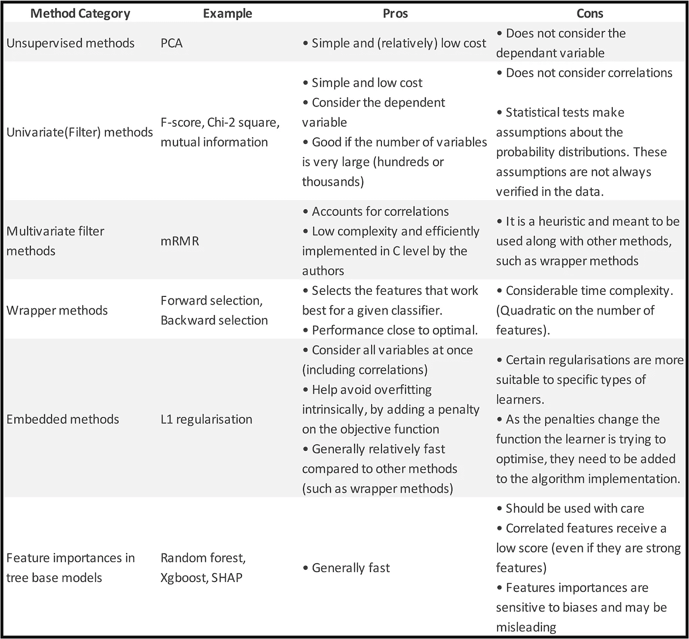

# 什么是特征选择，为什么有用？

机器学习中最大的两个问题是**过拟合**(拟合在数据集之外不可概括的数据方面)和**维数灾难**(高维数据的非直观和稀疏特性)。

通过减少模型中的特征数量，尝试优化模型性能，特征选择有助于避免这两个问题。这样做，特性选择还提供了一个额外的好处:**模型**解释。随着特征的减少，输出模型变得更简单和更容易解释，并且人类更有可能相信模型做出的未来预测。

# 无监督方法

减少特征数量的一个简单方法是对数据应用**降维技术**。这通常以无人监督的方式完成，即不使用标签本身。

降维实际上并不选择特征的子集，而是在低维空间中产生一组新的特征。这个新的集合可以用于分类过程本身。

以下示例使用降维后的特征进行分类。更准确地说，它使用主成分分析**(PCA)的前 2 个成分作为新的特征集。**

```
from sklearn.datasets import load_iris
from sklearn.decomposition import PCA
from sklearn.svm import SVC
import matplotlib.pyplot as plt
from matplotlib.colors import ListedColormapimport numpy as np
h = .01
x_min, x_max = -4,4
y_min, y_max = -1.5,1.5# loading dataset
data = load_iris()
X, y = data.data, data.target# selecting first 2 components of PCA
X_pca = PCA().fit_transform(X)
X_selected = X_pca[:,:2]# training classifier and evaluating on the whole plane
clf = SVC(kernel='linear')
clf.fit(X_selected,y)
xx, yy = np.meshgrid(np.arange(x_min, x_max, h),
                     np.arange(y_min, y_max, h))Z = clf.predict(np.c_[xx.ravel(), yy.ravel()])
Z = Z.reshape(xx.shape)# Plotting
cmap_light = ListedColormap(['#FFAAAA', '#AAFFAA', '#AAAAFF'])
cmap_bold = ListedColormap(['#FF0000', '#00FF00', '#0000FF'])
plt.figure(figsize=(10,5))
plt.pcolormesh(xx, yy, Z, alpha=.6,cmap=cmap_light)
plt.title('PCA - Iris dataset')
plt.xlabel('Dimension 1')
plt.ylabel('Dimension 2')
plt.scatter(X_pca[:,0],X_pca[:,1],c=data.target,cmap=cmap_bold)
plt.show()
```

**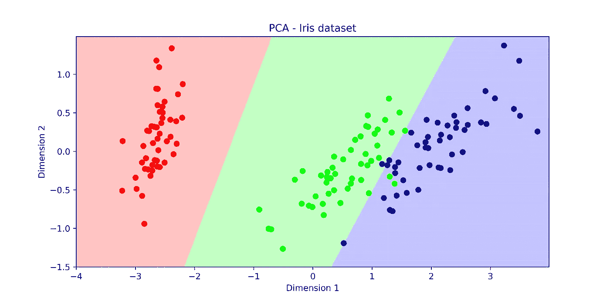**

**在评估特征的上下文中，降维的另一个用途是用于可视化:在较低维度的空间中，更容易从视觉上验证数据是否是潜在可分的，这有助于设置对分类准确性的期望。在实践中，我们对特征的子集执行维度缩减(例如 PCA ),并检查标签如何分布在缩减的空间中。如果它们看起来是分开的，这是一个明显的迹象，表明使用这组特征时，预期会有高的分类性能。**

**在下面的例子中，在一个 2 维的缩减空间中，不同的标签被显示为是相当可分的。这表明，在训练和测试分类器时，人们可以期待高性能。**

```
from sklearn.datasets import load_iris
from sklearn.decomposition import PCA
import matplotlib.pyplot as pltfrom mlxtend.plotting import plot_pca_correlation_graphdata = load_iris()
X, y = data.data, data.targetplt.figure(figsize=(10,5))
X_pca = PCA().fit_transform(X)
plt.title('PCA - Iris dataset')
plt.xlabel('Dimension 1')
plt.ylabel('Dimension 2')
plt.scatter(X_pca[:,0],X_pca[:,1],c=data.target)
_ = plot_pca_correlation_graph(X,data.feature_names)
```

**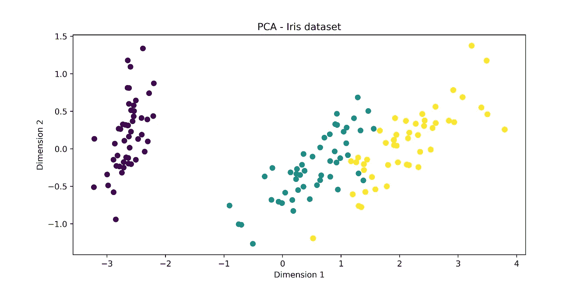****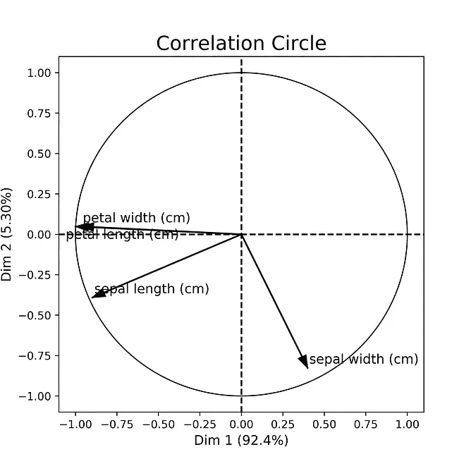**

**除此之外，我还绘制了**相关圆**，它显示了每个原始维度和新 PCA 维度之间的相关性。直观地说，该图显示了每个原始特征对新创建的 PCA 成分的贡献。在上面的例子中，花瓣长度和宽度与第一个主成分分析维度高度相关，萼片宽度对第二个维度贡献很大。**

# **单变量滤波方法**

****

**过滤方法旨在对特征的重要性进行排序，而不使用任何类型的分类算法。**

**单变量过滤方法单独评估每个特征，并且不考虑特征的相互作用。这些方法包括为每个特征提供一个分数，通常基于统计测试。**

**分数通常或者测量因变量和特征之间的相关性(例如 Chi2 和用于回归的 Pearls 相关系数)，或者测量给定类别标签的特征分布之间的差异(f 检验和 T 检验)。**

**分数通常对基础数据的统计属性做出假设。理解这些假设对于决定使用哪种测试是很重要的，即使其中一些假设对于违反假设是稳健的。**

**基于统计测试的分数提供了一个 **p 值**，可以用来排除一些特征。如果 p 值高于某个阈值(通常为 0.01 或 0.05)，则会出现这种情况。**

**常见测试包括:**

**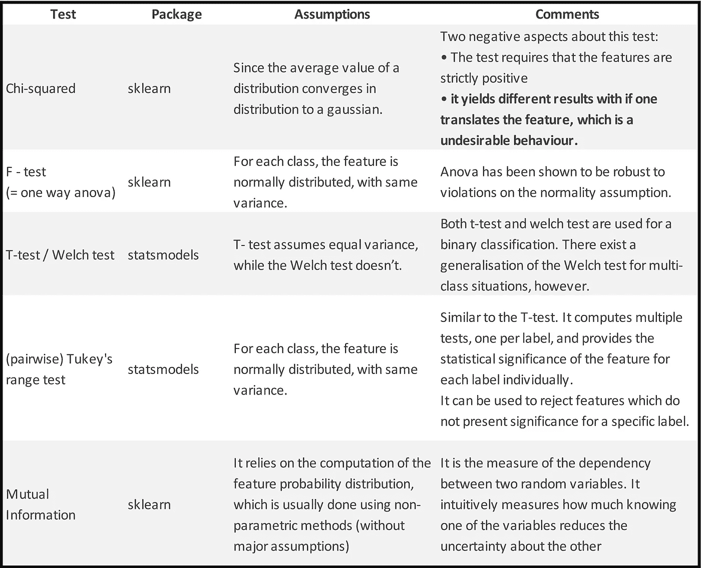**

**包`sklearn`实现了一些过滤方法。然而，由于大多数都是基于统计测试的，所以也可以使用统计包(比如`statsmodels`)。**

**下面是一个例子:**

```
from sklearn.feature_selection import f_classif, chi2, mutual_info_classif
from statsmodels.stats.multicomp import pairwise_tukeyhsdfrom sklearn.datasets import load_irisdata = load_iris()
X,y = data.data, data.targetchi2_score, chi_2_p_value = chi2(X,y)
f_score, f_p_value = f_classif(X,y)
mut_info_score = mutual_info_classif(X,y)pairwise_tukeyhsd = [list(pairwise_tukeyhsd(X[:,i],y).reject) for i in range(4)]print('chi2 score        ', chi2_score)
print('chi2 p-value      ', chi_2_p_value)
print('F - score score   ', f_score)
print('F - score p-value ', f_p_value)
print('mutual info       ', mut_info_score)
print('pairwise_tukeyhsd',pairwise_tukeyhsd)Out:chi2 score         [ 10.82   3.71 116.31  67.05]
chi2 p-value       [0\.   0.16 0\.   0\.  ]
F - score score    [ 119.26   49.16 1180.16  960.01]
F - score p-value  [0\. 0\. 0\. 0.]
mutual info        [0.51 0.27 0.98 0.98]
pairwise_tukeyhsd [[True, True, True], [True, True, True], [True, True, True], [True, True, True]]
```

## **对特征进行分级的可视化方法**

## **箱线图和小提琴图**

**箱线图/小提琴图可能有助于可视化给定类别的特征分布。对于 Iris 数据集，下面显示了一个示例。**

**这是有用的，因为统计测试通常只评估这种分布的平均值之间的差异。因此，这些图提供了关于特征质量的更多信息**

```
import pandas as pd
import seaborn as sns
sns.set()
df = pd.DataFrame(data.data,columns=data.feature_names)
df['target'] = data.targetdf_temp = pd.melt(df,id_vars='target',value_vars=list(df.columns)[:-1], 
                  var_name="Feature", value_name="Value")
g = sns.FacetGrid(data = df_temp, col="Feature", col_wrap=4, size=4.5,sharey = False)
g.map(sns.boxplot,"target", "Value");
g = sns.FacetGrid(data = df_temp, col="Feature", col_wrap=4, size=4.5,sharey = False)
g.map(sns.violinplot,"target", "Value");
```

**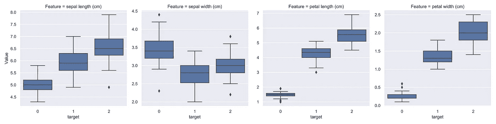****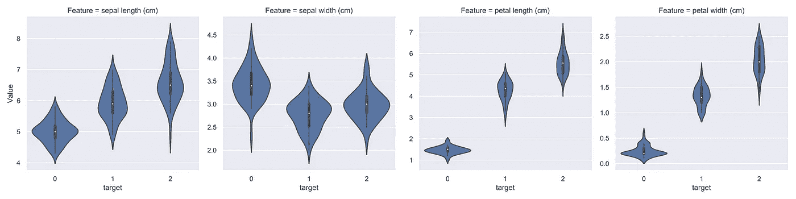**

## **用 ROC 曲线进行特征排序**

**ROC 曲线可用于按重要性顺序排列特征，这给出了排列特征性能的直观方式。**

**这种技术最适合二进制分类任务。为了应用于多类问题，可以使用**微观或宏观**平均值或基于多重比较的标准(类似于成对 Tukey 的范围测试)。**

**以下示例绘制了各种特征的 ROC 曲线。**

```
from sklearn.datasets import load_iris
import matplotlib.pyplot as plt
from sklearn.metrics import auc
import numpy as np# loading dataset
data = load_iris()
X, y = data.data, data.targety_ = y == 2plt.figure(figsize=(13,7))
for col in range(X.shape[1]):
    tpr,fpr = [],[]
    for threshold in np.linspace(min(X[:,col]),max(X[:,col]),100):
        detP = X[:,col] < threshold
        tpr.append(sum(detP & y_)/sum(y_))# TP/P, aka recall
        fpr.append(sum(detP & (~y_))/sum((~y_)))# FP/N

    if auc(fpr,tpr) < .5:
        aux = tpr
        tpr = fpr
        fpr = aux
    plt.plot(fpr,tpr,label=data.feature_names[col] + ', auc = '\
                           + str(np.round(auc(fpr,tpr),decimals=3)))plt.title('ROC curve - Iris features')
plt.xlabel('False Positive Rate')
plt.ylabel('True Positive Rate')
plt.legend()
plt.show()
```

**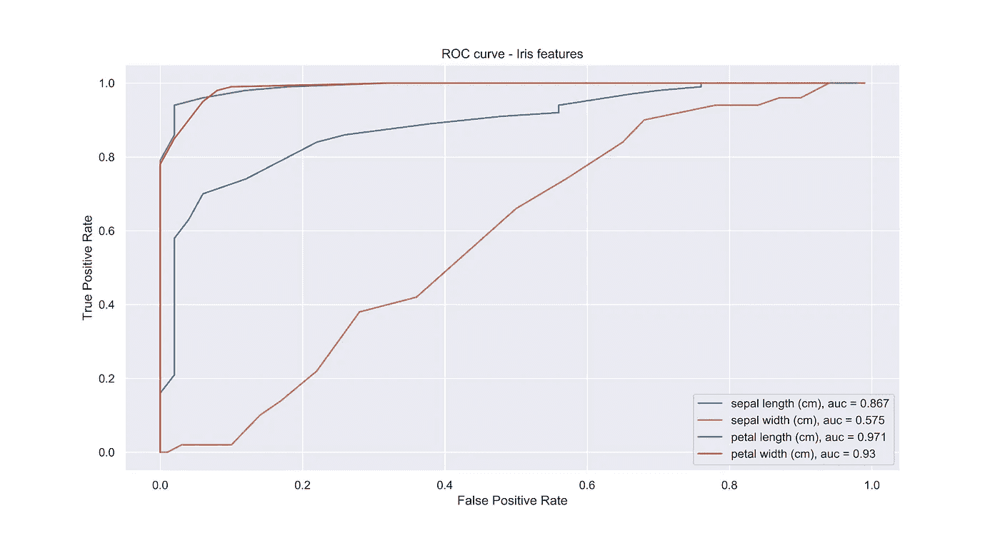**

# **多元滤波方法**

**这些方法考虑了变量之间的相关性，而没有考虑任何类型的分类算法。**

## **mRMR**

****mRMR(最小冗余最大相关性)**是一种启发式算法，通过考虑特征的重要性和它们之间的相关性来寻找接近最优的特征子集。**

**其思想是，即使两个特征高度相关，如果它们高度相关，将它们都添加到特征集中可能不是一个好主意。在这种情况下，添加两个特征会增加模型的复杂性(增加过度拟合的可能性)，但由于特征之间的相关性，不会添加重要的信息。**

**在一组 *N* 特征的 *S* 中，特征的相关性( *D* )计算如下:**

****

**其中 *I* 为互信息算子。**

**特征的冗余表示如下:**

****

**集合 *S* 的 mRMR 分数定义为( *D - R)* 。目标是找到具有最大值( *D-R)* 的特征子集。然而，在实践中，我们执行增量搜索(也称为前向选择)，在每一步，我们添加产生最大 mRMR 的特征。**

**该算法由算法作者自己用 C 实现。你可以在这里找到这个包的源代码，以及原始论文[。](http://home.penglab.com/proj/mRMR/)**

**在名称`pymrmr`上创建了一个(未维护的)python 包装器。如果`pymrmr`有问题，我建议直接调用 C 级函数。**

**下面的代码举例说明了`pymrmr`的用法。注意，`pandas`数据帧的列应按照 C 级包中的描述进行格式化(此处[为](http://home.penglab.com/proj/mRMR/))。**

```
import pandas as pd
import pymrmrdf = pd.read_csv('some_df.csv')
# Pass a dataframe with a predetermined configuration. 
# Check http://home.penglab.com/proj/mRMR/ for the dataset requirements
pymrmr.mRMR(df, 'MIQ', 10)
```

**输出:**

```
*** This program and the respective minimum Redundancy Maximum Relevance (mRMR)
     algorithm were developed by Hanchuan Peng <hanchuan.peng@gmail.com>for
     the paper
     "Feature selection based on mutual information: criteria of
      max-dependency, max-relevance, and min-redundancy,"
      Hanchuan Peng, Fuhui Long, and Chris Ding,
      IEEE Transactions on Pattern Analysis and Machine Intelligence,
      Vol. 27, No. 8, pp.1226-1238, 2005.*** MaxRel features ***
 Order    Fea     Name    Score
 1        765     v765    0.375
 2        1423    v1423   0.337
 3        513     v513    0.321
 4        249     v249    0.309
 5        267     v267    0.304
 6        245     v245    0.304
 7        1582    v1582   0.280
 8        897     v897    0.269
 9        1771    v1771   0.269
 10       1772    v1772   0.269*** mRMR features ***
 Order    Fea     Name    Score
 1        765     v765    0.375
 2        1123    v1123   24.913
 3        1772    v1772   3.984
 4        286     v286    2.280
 5        467     v467    1.979
 6        377     v377    1.768
 7        513     v513    1.803
 8        1325    v1325   1.634
 9        1972    v1972   1.741
 10       1412    v1412   1.689
Out[1]:
 ['v765',
  'v1123',
  'v1772',
  'v286',
  'v467',
  'v377',
  'v513',
  'v1325',
  'v1972',
  'v1412']
```

# **包装方法**

****

**包装器方法背后的主要思想是搜索哪组特性最适合特定的分类器。这些方法可以总结如下，并且在所使用的搜索算法方面有所不同。**

1.  **选择一个性能指标(可能性、AIC、BIC、F1 分数、准确度、MSE、MAE…)，记为 **M.****
2.  **选择一个分类器/回归器/ …，在这里记为 **C** 。**
3.  ****用给定的搜索方法搜索**不同的特征子集。对于每个子集 **S，**执行以下操作:**

*   **使用 **S** 作为分类器的特征，以交叉验证的方式训练和测试**C**；**
*   **从交叉验证程序中获得平均分数(对于指标 **M** )，并将该分数分配给子集**S**；**
*   **选择一个新的子集并重做步骤*一个*。**

## **详述步骤 3**

**第三步未指定将使用哪种类型的搜索方法。几乎在任何情况下，测试所有可能的特征子集都是禁止的(**强力选择**)，因为这将需要执行步骤 3 指数次(特征数量的 2 次方)。除了时间复杂性之外，由于有如此大量的可能性，很可能某个特征组合仅仅是随机地表现得最好，这使得强力解决方案更容易过度拟合。**

**搜索算法在实践中往往能很好地解决这个问题。它们倾向于实现接近蛮力解决方案的性能，具有更少的时间复杂度和更少的过拟合机会。**

****正向选择**和**反向选择**(又名**修剪**)在实践中被大量使用，以及它们的搜索过程的一些小变化。**

**反向选择包括从具有全部特征的模型开始，并且在每一步中，移除没有特征的模型具有最高分数。正向选择以相反的方式进行:它从一组空的特征开始，并添加最能提高当前分数的特征。**

**向前/向后选择仍然倾向于过度拟合，因为通常，分数倾向于通过添加更多特征来提高。避免这种情况的一种方法是使用惩罚模型复杂性的分数，如 AIC 或 BIC。**

**包装方法结构的图示如下。值得注意的是，特征集是(1)通过**搜索方法**找到的，以及(2)在打算使用的同一分类器上交叉验证的**。****

**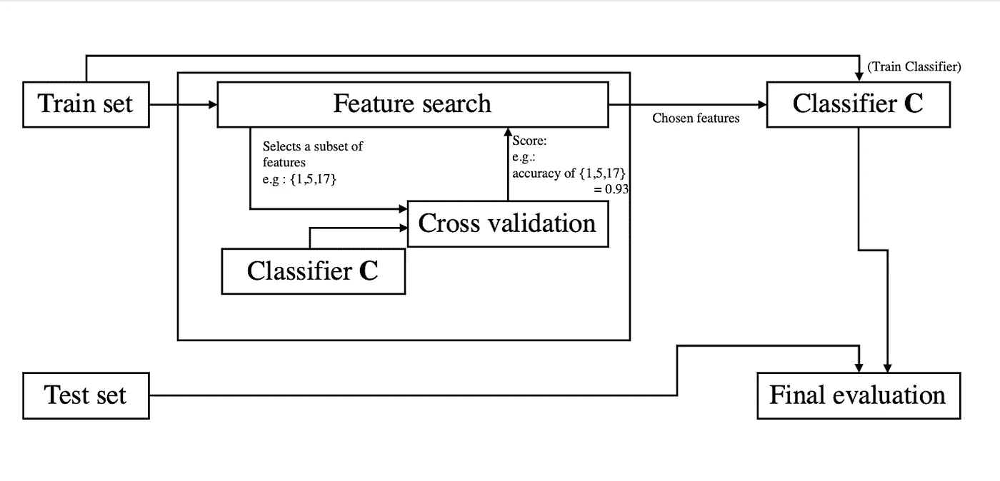**

**第三步还开放了交叉验证参数。通常，使用 k-fold 程序。然而，使用大 k 会给整个包装器方法带来额外的复杂性。**

## **包装方法的 Python 包**

**([http://rasbt.github.io/mlxtend/](http://rasbt.github.io/mlxtend/))是一个用于各种数据科学相关任务的有用包。这个包的包装方法可以在 SequentialFeatureSelector 上找到。它提供向前和向后的功能选择，有些变化。**

**该包还提供了一种通过函数 plot _ sequential _ feature _ selection 将分数可视化为要素数量的函数的方法。**

**下面的例子摘自包的主页。**

```
from mlxtend.feature_selection import SequentialFeatureSelector as SFS
from mlxtend.plotting import plot_sequential_feature_selection as plot_sfsfrom sklearn.linear_model import LinearRegression
from sklearn.datasets import load_bostonboston = load_boston()
X, y = boston.data, boston.targetlr = LinearRegression()sfs = SFS(lr, 
          k_features=13, 
          forward=True, 
          floating=False, 
          scoring='neg_mean_squared_error',
          cv=10)sfs = sfs.fit(X, y)
fig = plot_sfs(sfs.get_metric_dict(), kind='std_err')plt.title('Sequential Forward Selection (w. StdErr)')
plt.grid()
plt.show()
```

**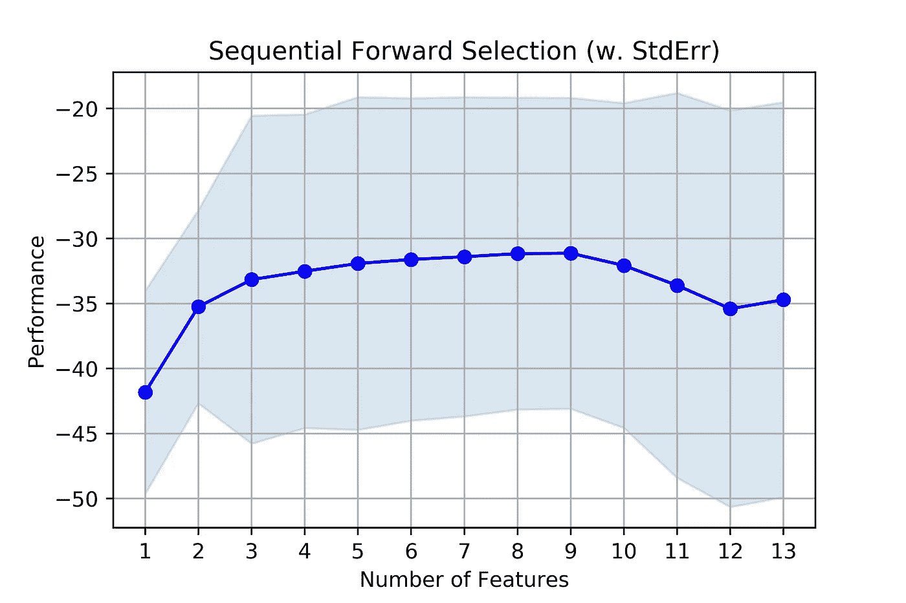**

# **嵌入式方法**

****

**训练一个分类器归结为一个优化问题，其中我们试图最小化其参数的函数(这里记为𝜃).这个函数被称为**损失函数**(记为𝐿(𝜃)).**

**在一个更一般的框架中，我们通常希望最小化一个**目标** **函数**，它考虑了损失函数和对模型复杂性的**惩罚**(或**正则化**)(ω(𝜃):**

****obj(𝜃)=𝐿(𝜃)+ω(𝜃)****

## **线性分类器的嵌入式方法**

**对于线性分类器(例如线性 SVM、逻辑回归)，损失函数表示为:**

****

**其中每个 **xʲ** 对应一个数据样本，而 **Wᵀxʲ** 表示系数向量 **(w₁,w₂,…w_n)** 与每个样本中的特征的内积。**

**对于线性 SVM 和逻辑回归，铰链和逻辑损失分别为:**

**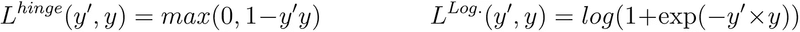**

**线性分类器的两个最常见的惩罚是 L-1 和 L-2 惩罚:**

****

****λ** 的值越高，惩罚越强，最优目标函数将趋向于以**收缩**越来越多的系数 **w_i** 而结束。**

**众所周知，“L1”惩罚会创建稀疏模型，这简单地意味着，在优化过程中，通过使一些系数等于零，它倾向于**从模型中选择一些特征。****

**另一个常见的处罚是 L-2。虽然 L-2 缩小了系数，因此有助于避免过拟合，但它不会创建稀疏模型，因此它不适合作为特征选择技术。**

**对于一些线性分类器(线性 SVM，逻辑回归)，可以有效地使用 L-1 罚分，这意味着有有效的数值方法来优化最终的目标函数。对于其他几个分类器(各种核 SVM 方法、决策树等等)，情况就不一样了。因此，**不同的分类器应该使用不同的正则化方法**。**

**带有正则化的逻辑回归示例如下所示，我们可以看到，随着 C 的减少，算法排除了一些特征(想想如果 **C** 为 **1/λ** )。**

```
import numpy as np
import matplotlib.pyplot as pltfrom sklearn.svm import LinearSVC
from sklearn.model_selection import ShuffleSplit
from sklearn.model_selection import GridSearchCV
from sklearn.utils import check_random_state
from sklearn import datasets
from sklearn.linear_model import LogisticRegressionrnd = check_random_state(1)# set up dataset
n_samples = 3000
n_features = 15# l1 data (only 5 informative features)
X, y = datasets.make_classification(n_samples=n_samples,
                                        n_features=n_features, n_informative=5,
                                        random_state=1)cs = np.logspace(-2.3, 0, 50)coefs = []
for c in cs:
    clf = LogisticRegression(solver='liblinear',C=c,penalty='l1')
    # clf = LinearSVC(C=c,penalty='l1', loss='squared_hinge', dual=False, tol=1e-3)

    clf.fit(X,y)
    coefs.append(list(clf.coef_[0]))

coefs = np.array(coefs)
plt.figure(figsize=(10,5))
for i,col in enumerate(range(n_features)):
    plt.plot(cs,coefs[:,col])
plt.xscale('log')
plt.title('L1 penalty - Logistic regression')
plt.xlabel('C')
plt.ylabel('Coefficient value')
plt.show()
```

**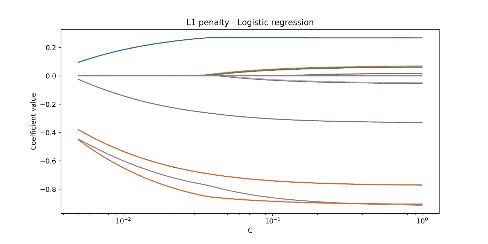**

# **基于树的模型的特征重要性**

**另一种常见的特征选择技术包括从基于树的模型中提取特征重要性等级。**

**特征重要性本质上是由每个变量产生的分裂标准中的单个树的改进的平均值。换句话说，它是在使用特定变量分割树时分数(决策树符号上所谓的“杂质”)提高了多少。**

**它们可用于对要素进行分级，然后选择要素的子集。然而，**应小心使用特性重要性，因为它们会受到偏差和的影响，并呈现出与高度相关特性**相关的意外行为，不管它们有多强。**

**如本文中的[所示，随机森林特征重要性偏向于具有更多类别的特征。此外，如果两个特征高度相关，无论特征的质量如何，它们的分数都会大大降低。](https://link.springer.com/content/pdf/10.1186%2F1471-2105-8-25.pdf)**

**以下是如何从随机森林中提取要素重要性的示例。虽然是回归变量，但对于分类器来说，过程是相同的。**

```
from sklearn.datasets import load_boston
from sklearn.ensemble import RandomForestRegressorimport numpy as npboston = load_boston()
X = boston.data
Y = boston.target
feat_names = boston.feature_names 
rf = RandomForestRegressor()
rf.fit(X, Y)
print("Features sorted by their score:")
print(sorted(zip(map(lambda x: round(x, 4), rf.feature_importances_), feat_names), 
             reverse=True))
Out:
Features sorted by their score:
[(0.4334, 'LSTAT'), (0.3709, 'RM'), (0.0805, 'DIS'), (0.0314, 'CRIM'), (0.0225, 'NOX'), (0.0154, 'TAX'), (0.0133, 'PTRATIO'), (0.0115, 'AGE'), (0.011, 'B'), (0.0043, 'INDUS'), (0.0032, 'RAD'), (0.0016, 'CHAS'), (0.0009, 'ZN')]
```

## **额外:树模型的主要杂质分数**

**如上所述，“杂质”是决策树算法在决定分割节点时使用的分数。有许多决策树算法(IDR3、C4.5、CART 等)，但一般规则是，我们用来分割树中节点的变量是对杂质产生最高改善的变量。**

**最常见的杂质是基尼杂质和熵。基尼系数杂质的改进被称为“**基尼系数重要性**，而熵的改进是**信息增益。****

****

## **SHAP:来自树模型的可靠特征重要性**

**(感谢[恩里克·加斯帕里尼·菲乌萨·多纳西门托](https://medium.com/u/7ba65e2cae1e?source=post_page-----10c0ddd7918b--------------------------------)的建议！)**

**SHAP 实际上远不止于此。它是一种算法，提供任何预测模型之外的模型解释。然而，对于基于树的模型，它特别有用:作者为这种模型开发了高速和精确(不仅仅是局部)的解释，与 X *GBoost* 、 *LightGBM* 、 *CatBoost* 和 *scikit-learn* 树模型兼容。**

**我鼓励检查一下 SHAP 提供的解释能力(比如**特征依赖、交互效果、模型监控……**)。下面，我(仅)绘制了 SHAP 输出的特征重要性，当对它们进行排序以进行特征选择时，这些特征重要性比原始树模型输出的特征重要性更可靠。这个例子摘自他们的 [*github*](https://medium.com/p/10c0ddd7918b/edit) 页面。**

```
import xgboost
import shap# load JS visualization code to notebook
shap.initjs()# train XGBoost model
X,y = shap.datasets.boston()
model = xgboost.train({"learning_rate": 0.01}, xgboost.DMatrix(X, label=y), 100)# explain the model's predictions using SHAP values
# (same syntax works for LightGBM, CatBoost, and scikit-learn models)
explainer = shap.TreeExplainer(model)
shap_values = explainer.shap_values(X)shap.summary_plot(shap_values, X, plot_type="bar")
```

**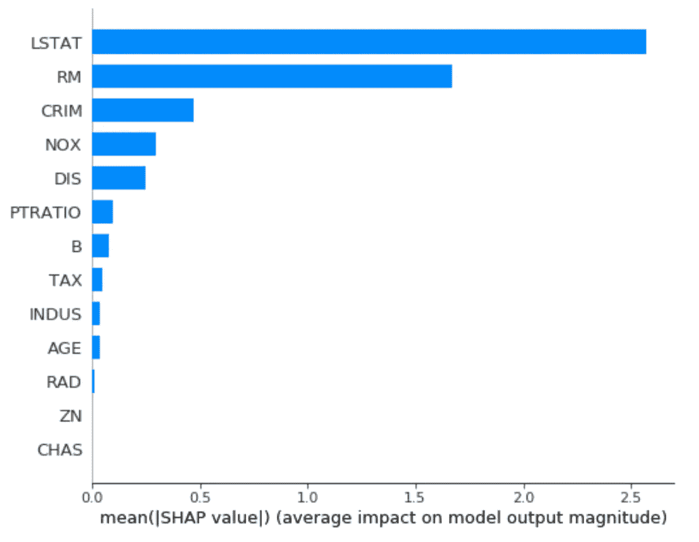**

# **结论——何时使用每种方法？**

**嵌入式方法对于避免过度拟合和选择有用的变量通常非常有效。它们也是时间有效的，因为它们嵌入在目标函数中。它们的主要缺点是它们可能无法用于所需的分类器。**

**包装方法在实践中往往工作得很好。然而，它们在计算上是昂贵的，特别是当处理数百个特征时。但是如果你有计算资源，这是一个很好的方法。**

**如果特征集非常大(大约数百或数千)，因为过滤方法很快，它们可以很好地作为选择的第一阶段，以排除一些变量。随后，可以将另一种方法应用于已经缩减的特征集。例如，如果您想要创建要素的组合，将它们相乘或相除，这将非常有用。**

# **参考**

**[变量和特征选择介绍](http://www.jmlr.org/papers/volume3/guyon03a/guyon03a.pdf)**

**[随机森林变量重要性测量中的偏差:例证、来源和解决方案](https://link.springer.com/content/pdf/10.1186%2F1471-2105-8-25.pdf)**

**[用于分类的特征选择:综述](https://pdfs.semanticscholar.org/310e/a531640728702fce6c743c1dd680a23d2ef4.pdf)**