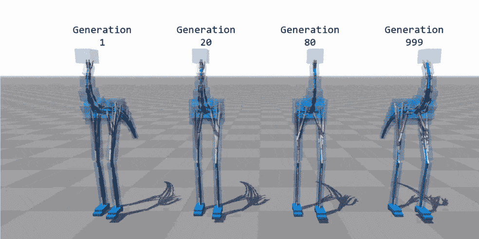
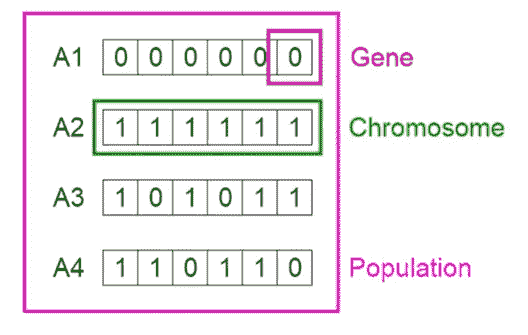
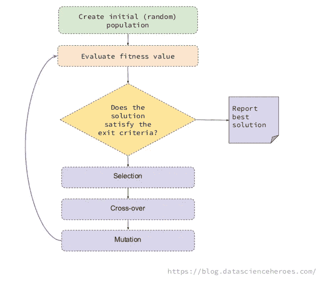
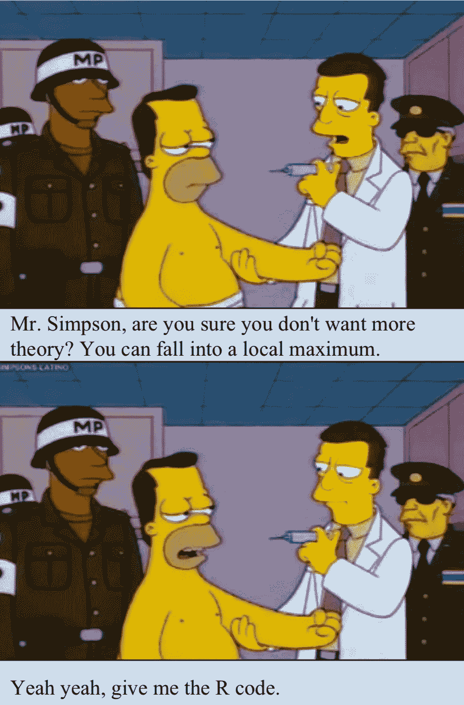
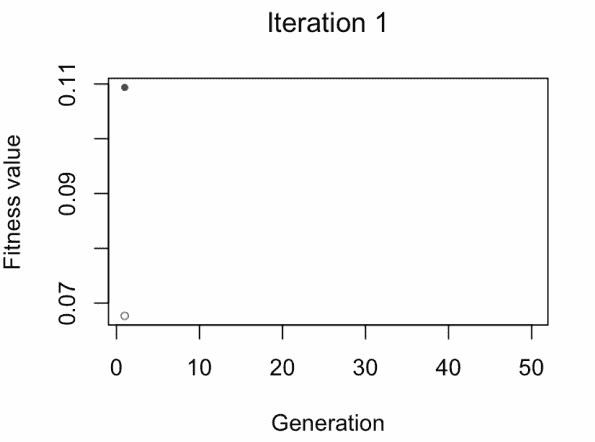

# R 中基于遗传算法的特征选择

> 原文：<https://towardsdatascience.com/feature-selection-using-genetic-algorithms-in-r-3d9252f1aa66?source=collection_archive---------7----------------------->

这是一篇关于在 R 中使用遗传算法进行特征选择的文章，在这篇文章中，我们将快速回顾一下:

*   什么是遗传算法？
*   ML 中的 GA？
*   解决方案是什么样的？
*   遗传过程及其算子
*   健身功能
*   R 中的遗传算法！
*   你自己试试
*   相关概念



*Animation source: “Flexible Muscle-Based Locomotion for Bipedal Creatures” — Thomas Geijtenbeek*

【在 [Twitter](https://twitter.com/pabloc_ds) 和[Linkedin】](https://www.linkedin.com/in/pcasas/)上找到我】

# 背后的直觉

想象一个黑盒，它可以帮助我们在**无限的可能性**中做出决定，并有一个标准，这样我们就可以找到一个可接受的解决方案(在时间和质量上)来解决我们提出的问题。

# 什么是遗传算法？

遗传算法(GA)是一种数学模型，其灵感来自著名的查尔斯·达尔文的自然选择思想。

在不同的世代中，自然选择只保留最适合的个体。

想象一下 1900 年有 100 只兔子，如果我们看看今天的数量，我们会发现其他兔子比它们的祖先更快更熟练地找到食物。

# ML 中的 GA

在**机器学习**中，遗传算法的用途之一是挑选正确数量的变量，以便创建预测模型。

选择正确的变量子集是一个组合优化问题。

这种技术相对于其他技术的优势在于，它允许从先前的最佳解决方案中产生最佳解决方案。随着时间的推移改进选择的进化算法。

遗传算法的思想是将一代又一代的不同解决方案组合起来，从每一个解决方案中提取出最好的基因。这样它创造了新的更适合的个体。

我们可以找到遗传算法的其他用途，如超调参数、寻找函数的最大值(或最小值)或搜索正确的神经网络结构(神经进化)等

# 特征选择中的遗传算法

GA 的每一个可能的解，都是被选择的变量(一个*单个*🐇)，则**被视为一个整体**，它不会针对目标对变量进行单独排序。

这很重要，因为我们已经知道[变量在](https://livebook.datascienceheroes.com/selecting-best-variables.html#variables-work-in-groups)组中起作用。

# 解决方案是什么样的？

简单地说，假设我们总共有 6 个变量，

一个解决方案可以是选取 3 个变量，比如:`var2`、`var4`和`var5`。

另一种解决方法可以是:`var1`和`var5`。

这些解就是群体中所谓的**个体**或**染色体**。它们是我们问题的可能解决方案。



*信用图像:Vijini mallawatarachchi*

根据图像，解决方案 3 可以表示为一个热点向量:`c(1,0,1,0,1,1)`。每个`1`表示包含该变量的解决方案。这种情况:`var1`、`var3`、`var5`、`var6`。

而方案 4 则是:`c(1,1,0,1,1,0)`。

载体中的每个位置都是一个**基因**。

# 遗传过程及其算子



GA 的基本思想是生成一些随机的可能的解决方案(称为`population`)，它们代表不同的变量，然后在迭代过程中组合最佳解决方案。

这种组合遵循基本的遗传算法操作，即:选择，变异和交叉。

*   **选择**:挑选一代中最适合的个体(即:提供最高 ROC 的解决方案)。
*   **交叉**:基于两种溶液的基因，创建两个新个体。这些孩子会出现在下一代面前。
*   **突变**:在个体中随机改变一个基因(即:翻转一个`0`到`1`)

这个想法是每一代，我们会找到更好的个体，就像一只跑得快的兔子。

我推荐 Vijini mallawatarachchi 关于遗传算法如何工作的帖子。

这些基本操作允许算法通过以最大化目标的方式组合它们来改变可能的解决方案。

# 健身功能

例如，这个目标最大化是为了保持使 ROC 曲线下的面积最大化的解决方案。这在*适应度函数*中定义。

适应度函数采用一个可能的解决方案(或者染色体，如果你想听起来更复杂的话)，并且*以某种方式*评估选择的有效性。

正常情况下，适应度函数采用独热向量`c(1,1,0,0,0,0)`，创建例如带有`var1`和`var2`的随机森林模型，并返回适应度值(ROC)。

此代码中计算的适应度值为:`ROC value / number of variables`。通过这样做，该算法对具有大量变量的解进行惩罚。类似于[赤池信息准则](https://en.wikipedia.org/wiki/Akaike_information_criterion)的想法，或者说 AIC。



# R 中的遗传算法！🐛

我的意图是为您提供一个清晰的代码，这样您就可以理解背后的内容，同时尝试新的方法，比如修改适应度函数。这是至关重要的一点。

要在您自己的数据集上使用，请确保`data_x`(数据帧)和`data_y`(因子)与`custom_fitness`功能兼容。

主图书馆是由卢卡·斯库卡开发的`GA`。此处[见](https://cran.r-project.org/web/packages/GA/vignettes/GA.html)中的小插曲与例子。

📣**重要**:以下代码不完整。 [**克隆存储库**](https://github.com/pablo14/genetic-algorithm-feature-selection) 来运行这个例子。

```
# data_x: input data frame
# data_y: target variable (factor)# GA parameters
param_nBits=ncol(data_x)
col_names=colnames(data_x)# Executing the GA 
ga_GA_1 = ga(fitness = function(vars) custom_fitness(vars = vars, 
                                                     data_x =  data_x, 
                                                     data_y = data_y, 
                                                     p_sampling = 0.7), # custom fitness function
             type = "binary", # optimization data type
             crossover=gabin_uCrossover,  # cross-over method
             elitism = 3, # best N indiv. to pass to next iteration
             pmutation = 0.03, # mutation rate prob
             popSize = 50, # the number of indivduals/solutions
             nBits = param_nBits, # total number of variables
             names=col_names, # variable name
             run=5, # max iter without improvement (stopping criteria)
             maxiter = 50, # total runs or generations
             monitor=plot, # plot the result at each iteration
             keepBest = TRUE, # keep the best solution at the end
             parallel = T, # allow parallel procesing
             seed=84211 # for reproducibility purposes
)# Checking the results
summary(ga_GA_1)── Genetic Algorithm ─────────────────── GA settings: 
Type                  =  binary 
Population size       =  50 
Number of generations =  50 
Elitism               =  3 
Crossover probability =  0.8 
Mutation probability  =  0.03 GA results: 
Iterations             = 17 
Fitness function value = 0.2477393 
Solution = 
     radius_mean texture_mean perimeter_mean area_mean smoothness_mean compactness_mean
[1,]           0            1              0         0               0                1
     concavity_mean concave points_mean symmetry_mean fractal_dimension_mean  ... 
[1,]              0                   0             0                      0      
     symmetry_worst fractal_dimension_worst
[1,]              0                       0# Following line will return the variable names of the final and best solution
best_vars_ga=col_names[ga_GA_1@solution[1,]==1]# Checking the variables of the best solution...
best_vars_ga[1] "texture_mean"     "compactness_mean" "area_worst"       "concavity_worst"
```



*   蓝点:人口健康平均值
*   绿点:最佳健身值

注意:不要期望结果那么快😅

现在我们根据最佳选择来计算精度！

```
get_accuracy_metric(data_tr_sample = data_x, target = data_y, best_vars_ga)[1] 0.9508279
```

准确率在 95，08%左右，而 ROC 值接近 0，95(ROC =适应值*变量个数，查适应函数)。

# 分析结果

不喜欢分析没有分界点([得分数据](https://livebook.datascienceheroes.com/model-performance.html#scoring_data))的准确性，但是和这个 [Kaggle 帖子](https://www.kaggle.com/kanncaa1/feature-selection-and-data-visualization)的结果对比还是很有用的。

他基于 5 个变量使用递归特征消除或 RFE 得到了类似的精度结果，而我们的解决方案保持 4 个变量。

# 你自己试试

尝试一个新的适应度函数，有些解还是提供了大量的变量，你可以试试求变量个数的平方。

另一件要尝试的事情是获取 ROC 值的算法，或者甚至是更改指标的算法。

有些配置可以持续很长时间。建模前平衡等级，并使用`p_sampling`参数进行游戏。采样技术会对模型产生很大的影响。查看[样本大小和模型性能的等级平衡](https://blog.datascienceheroes.com/sample-size-and-class-balance-on-model-performance/)帖子了解更多信息。

改变变异率或者精英主义怎么样？或者尝试其他穿越方式？

增加`popSize`以同时测试更多可能的解决方案(以时间为代价)。

请随时分享任何见解或想法，以改善选择。

[**克隆存储库**](https://github.com/pablo14/genetic-algorithm-feature-selection) 运行实例。

# 相关概念

遗传算法和深度学习之间存在并行性，随着时间的推移迭代和改进的概念是相似的。

我添加了`p_sampling`参数来加快速度。而且通常都能达到目的。类似于深度学习中使用的*批量*概念。另一个相似之处是在神经网络训练中 GA 参数`run`和*提前停止*标准之间。

但是最大的相似之处是这两种技术都来自于对自然的观察。在这两种情况下，人类观察了神经网络和遗传学如何工作，并创建了一个模拟其行为的简化数学模型。大自然有几百万年的进化，为什么不试着模仿一下呢？🌱

—

我尽量简短地介绍 GA，但是如果你对这个庞大的话题有任何具体的问题，请在评论中留下🙋 🙋‍♂

*如果我没有激励你去学习遗传算法，看看这个基于神经进化的项目:*

—

感谢阅读🚀

在 [Twitter](https://twitter.com/pabloc_ds) 和 [Linkedin](https://www.linkedin.com/in/pcasas/) 上找到我。
[更多博文](https://blog.datascienceheroes.com/)。

想了解更多？📗[数据科学活书](http://livebook.datascienceheroes.com/)