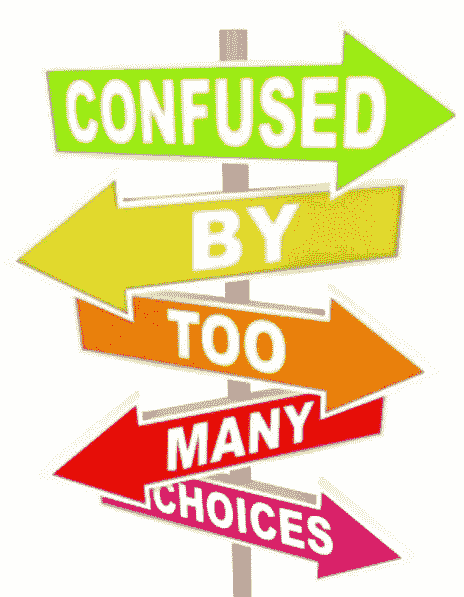

# 使用 Python 解决分类问题的特征选择

> 原文：<https://towardsdatascience.com/feature-selection-using-python-for-classification-problem-b5f00a1c7028?source=collection_archive---------5----------------------->



# 介绍

在模型中包含更多要素会使模型更加复杂，并且模型可能会过度拟合数据。一些特征可能是噪声，并可能损坏模型。通过移除那些不重要的特征，该模型可以更好地概括。

Sklearn 网站列出了不同的功能选择方法。这篇文章主要是基于那个网站的主题。然而，我收集了关于这些方法背后的理论的不同资源，并将它们添加到本文中。此外，我在同一个数据集上应用了不同的特征选择方法来比较它们的性能。

阅读完这篇文章和我在文章中提供的参考资料后，您应该能够理解特性选择背后的理论以及如何使用 python 来完成它。

## 获取数据

我们使用虹膜数据集。有关此数据的更多信息:

[https://sci kit-learn . org/stable/auto _ examples/datasets/plot _ iris _ dataset . html](https://scikit-learn.org/stable/auto_examples/datasets/plot_iris_dataset.html)

```
iris = load_iris()
X = iris.data
y = iris.target
print(X[: 5, :])
print(X.shape)**output:** [[5.1 3.5 1.4 0.2]
 [4.9 3\.  1.4 0.2]
 [4.7 3.2 1.3 0.2]
 [4.6 3.1 1.5 0.2]
 [5\.  3.6 1.4 0.2]](150, 4)
```

这些数据有四个特征。为了测试不同特征选择方法的有效性，我们向数据集添加了一些噪声特征。

```
np.random.seed(100)
E = np.random.uniform(0, 1, size=(len(X), 10))
X = np.hstack((X, E))
print(X.shape)**output:** (150, 14)
```

数据现在有 14 个特征。

在应用特征选择方法之前，我们需要首先分割数据。原因是我们只基于来自训练集的信息选择特征，而不是基于整个数据集。我们应该拿出整个数据集的一部分作为测试集来评估特征选择和模型的性能。因此，在我们进行特征选择和训练模型时，无法看到来自测试集的信息。

```
X_train, X_test, y_train, y_test = train_test_split(X, y, random_state=100, test_size=0.3)
print(X_train.shape)**output:** (105, 14)
```

我们将应用基于 X_train 和 y_train 的特征选择。

## I .移除具有低方差的特征

*变量阈值*是一种简单的特征选择基线方法。它会移除方差未达到某个阈值的所有要素。默认情况下，它会移除所有零方差特征。
[https://scikit-learn . org/stable/modules/generated/sk learn . feature _ selection。variance threshold . html # sk learn . feature _ selection。变量阈值](https://scikit-learn.org/stable/modules/generated/sklearn.feature_selection.VarianceThreshold.html#sklearn.feature_selection.VarianceThreshold)

显然，我们的数据没有任何零方差特征。但是为了演示的目的，我仍然在这里应用这个方法。

```
sel_variance_threshold = VarianceThreshold() 
X_train_remove_variance = sel_variance_threshold.fit_transform(X_train)
print(X_train_remove_variance.shape)**output:** (105, 14)
```

数据仍然有 14 个特征，没有一个特征被删除。

## 二。单变量特征选择

单变量特征选择通过基于单变量统计测试选择最佳特征来工作。我们将每个特征与目标变量进行比较，以查看它们之间是否有任何统计上的显著关系。它也被称为方差分析(ANOVA)。当我们分析一个特征和目标变量之间的关系时，我们忽略了其他特征。这就是它被称为“单变量”的原因。每个特性都有它的测试分数。
最后，比较所有的测试分数，将选择分数最高的特征。

**(1)使用卡方检验。**

有关卡方检验的更多信息，请阅读:

*   统计:[http://vassarstats.net/textbook/,](http://vassarstats.net/textbook/,)第八章
*   sk learn:[https://sci kit-learn . org/stable/modules/generated/sk learn . feature _ selection . chi 2 . html # sk learn . feature _ selection . chi 2](https://scikit-learn.org/stable/modules/generated/sklearn.feature_selection.chi2.html#sklearn.feature_selection.chi2)

如果你想了解更多关于 Sklearn 如何应用卡方检验的信息，请阅读源代码:[https://github . com/scikit-learn/scikit-learn/blob/1495 f 6924/sk learn/feature _ selection/univariate _ selection . py # L172](https://github.com/scikit-learn/scikit-learn/blob/1495f6924/sklearn/feature_selection/univariate_selection.py#L172)

```
sel_chi2 = SelectKBest(chi2, k=4)    # select 4 features
X_train_chi2 = sel_chi2.fit_transform(X_train, y_train)
print(sel_chi2.get_support())**output:**[ True  True  True  True False False False False False False False False False False]
```

数组中的前四个元素为真，这意味着前四个特征是通过这种方法选择的。由于这些特征是数据中的原始特征，卡方检验表现良好。

**(2)使用 f 检验**

*   统计数字

单向方差分析:

[http://vassarstats.net/textbook/,](http://vassarstats.net/textbook/,)第十四章

回归方差分析:

[http://fac web . cs . de Paul . edu/shost/CSC 423/documents/f-test-reg . htm](http://facweb.cs.depaul.edu/sjost/csc423/documents/f-test-reg.htm)

*   Sklearn

分类测试:

[https://sci kit-learn . org/stable/modules/generated/sk learn . feature _ selection . f _ classif . html # sk learn . feature _ selection . f _ classif](https://scikit-learn.org/stable/modules/generated/sklearn.feature_selection.f_classif.html#sklearn.feature_selection.f_classif)

回归检验:

[https://sci kit-learn . org/stable/modules/generated/sk learn . feature _ selection . f _ regression . html # sk learn . feature _ selection . f _ regression](https://scikit-learn.org/stable/modules/generated/sklearn.feature_selection.f_regression.html#sklearn.feature_selection.f_regression)

```
sel_f = SelectKBest(f_classif, k=4)
X_train_f = sel_f.fit_transform(X_train, y_train)
print(sel_f.get_support())**output:** [ True  True  True  True False False False False False False False False False False]
```

f 检验也能正确选择原始特征。

**(3)使用 mutual_info_classif 测试**

*   用于分类:[https://sci kit-learn . org/stable/modules/generated/sk learn . feature _ selection . mutual _ info _ class if . html # sk learn . feature _ selection . mutual _ info _ class if](https://scikit-learn.org/stable/modules/generated/sklearn.feature_selection.mutual_info_classif.html#sklearn.feature_selection.mutual_info_classif)
*   对于回归:[https://sci kit-learn . org/stable/modules/generated/sk learn . feature _ selection . mutual _ info _ regression . html # sk learn . feature _ selection . mutual _ info _ regression](https://scikit-learn.org/stable/modules/generated/sklearn.feature_selection.mutual_info_regression.html#sklearn.feature_selection.mutual_info_regression)

```
sel_mutual = SelectKBest(mutual_info_classif, k=4)
X_train_mutual = sel_mutual.fit_transform(X_train, y_train)
print(sel_mutual.get_support())**output:** [ True  True  True  True False False False False False False False False False False]
```

总之，三种单变量特征选择方法产生相同的结果。

我们使用虹膜数据作为分类问题。对于回归问题，同样，我们可以使用 f_regression，mutual_info_regression 来进行特征选择。

## 三。递归特征消除

给定将权重分配给特征(例如，线性模型的系数)的外部估计器，递归特征消除(RFE)是通过递归地考虑越来越小的特征集来选择特征。首先，在初始特征集上训练估计器，并且通过 *coef_* 属性或通过 *feature_importances_* 属性获得每个特征的重要性。然后，从当前特征集中删除最不重要的特征。该过程在删减集上递归重复，直到最终达到要选择的特征的期望数量。

关于 Sklearn 中的 RFE:[https://sci kit-learn . org/stable/modules/generated/sk learn . feature _ selection。rfe . html # sk learn . feature _ selection。RFE](https://scikit-learn.org/stable/modules/generated/sklearn.feature_selection.RFE.html#sklearn.feature_selection.RFE)

**(1)使用逻辑回归作为模型**

```
model_logistic = LogisticRegression(solver='lbfgs', multi_class='multinomial', max_iter=1000)
sel_rfe_logistic = RFE(estimator=model_logistic, n_features_to_select=4, step=1)
X_train_rfe_logistic = sel_rfe_logistic.fit_transform(X_train, y_train)print(sel_rfe_logistic.get_support())**output:** [False  True  True  True False False False False False False False False False  True]print(sel_rfe_logistic.ranking_)**output:** array([ 3,  1,  1,  1,  9,  8,  7,  6,  5,  4,  2, 11, 10,  1])
```

所选择的特征是等级 1。结果表明，递归特征消除仅选择了部分原始特征和一个噪声特征。这不是我们想要的理想结果。让我们试试另一个模型:

**(2)使用随机森林作为模型**

```
model_tree = RandomForestClassifier(random_state=100, n_estimators=50)
sel_rfe_tree = RFE(estimator=model_tree, n_features_to_select=4, step=1)
X_train_rfe_tree = sel_rfe_tree.fit_transform(X_train, y_train)
print(sel_rfe_tree.get_support())**output:** [ True  True  True  True False False False False False False False False False False]
```

在递归特征选择中使用随机森林作为模型可以在这种情况下选择正确的特征。

## 四。使用 SelectFromModel 进行特征选择

SelectFromModel 是一个元转换器，可以与拟合后具有 *coef_* 或 *feature_importances_* 属性的任何估计器一起使用。如果相应的 *coef_* 或 *feature_importances_* 值低于提供的阈值参数，则这些特征被视为不重要并被移除。

与单变量特征选择相比，基于模型的特征选择一次考虑所有特征，因此可以捕捉交互。用于特征选择的模型不需要与稍后用于训练的模型相同。

sk learn:[https://sci kit-learn . org/stable/modules/generated/sk learn . feature _ selection。select from model . html # sk learn . feature _ selection。从模型中选择](https://scikit-learn.org/stable/modules/generated/sklearn.feature_selection.SelectFromModel.html#sklearn.feature_selection.SelectFromModel)

**(1)基于 L1 的特征选择**

具有 L1 惩罚的线性模型可以消除一些特征，因此可以在使用另一个模型来拟合数据之前充当特征选择方法。

```
model_logistic = LogisticRegression(solver='saga', multi_class='multinomial', max_iter=10000, penalty='l1')
sel_model_logistic = SelectFromModel(estimator=model_logistic)
X_train_sfm_l1 = sel_model_logistic.fit_transform(X_train, y_train)
print(sel_model_logistic.get_support())**output:** [ True False  True  True False False False False False  True False False False False]
```

它选择了错误的功能！选择噪声中的一个要素时，原始数据集中的第二个要素被忽略。

**(2)基于树的特征选择**

```
model_tree = RandomForestClassifier(random_state=100, n_estimators=50)
model_tree.fit(X_train, y_train)
print(model_tree.feature_importances_)sel_model_tree = SelectFromModel(estimator=model_tree, prefit=True, threshold='mean')  
      # since we already fit the data, we specify prefit option here
      # Features whose importance is greater or equal to the threshold are kept while the others are discarded.X_train_sfm_tree = sel_model_tree.transform(X_train)
print(sel_model_tree.get_support())**output:**[0.11844633 0.09434048 0.21340848 0.33708242 0.02019553 0.03081254
 0.02317242 0.01962394 0.02407251 0.02193159 0.03289007 0.01836624
 0.01811144 0.027546  ][ True  True  True  True False False False False False False False False False False]
```

它选择正确的原始特征。

**综上所述的所有特征选择方法:**对于这种特定的数据集，使用 logistic 模型作为递归特征剔除或模型选择会错误地选择特征。另一方面，所有其他特征选择方法都正确地选择了前四个特征。

## 让我们比较特性选择前后的性能

**(1)特征选择前**

```
model_logistic = LogisticRegression(solver='saga', multi_class='multinomial', max_iter=10000)
model_logistic.fit(X_train, y_train)
predict = model_logistic.predict(X_test)
print(confusion_matrix(y_test, predict))
print(classification_report(y_test, predict))**output:** [[16  0  0]
 [ 0 11  0]
 [ 0  2 16]]
              precision    recall  f1-score   support 0       1.00      1.00      1.00        16
           1       0.85      1.00      0.92        11
           2       1.00      0.89      0.94        18 accuracy                           0.96        45
   macro avg       0.95      0.96      0.95        45
weighted avg       0.96      0.96      0.96        45
```

**(2)特征选择后**

我们使用基于卡方检验的特征选择的结果。
*X_train_chi2* 是特征选择后馈入模型的数据。

```
model_logistic = LogisticRegression(solver=’saga’, multi_class=’multinomial’, max_iter=10000)
model_logistic.fit(X_train_chi2, y_train)
```

我们还需要转换测试数据，因为特性的数量发生了变化。

```
X_test_chi2 = sel_chi2.transform(X_test)
print(X_test.shape)
print(X_test_chi2.shape)**output:** (45, 14)
(45, 4)
```

仅使用测试集中与训练集中的剩余特征相对应的特征。这种情况下有四个特征。

```
predict = model_logistic.predict(X_test_chi2)
print(confusion_matrix(y_test, predict))
print(classification_report(y_test, predict))**output:** [[16  0  0]
 [ 0 11  0]
 [ 0  1 17]]
              precision    recall  f1-score   support 0       1.00      1.00      1.00        16
           1       0.92      1.00      0.96        11
           2       1.00      0.94      0.97        18 accuracy                           0.98        45
   macro avg       0.97      0.98      0.98        45
weighted avg       0.98      0.98      0.98        45
```

**总之，**特征选择去除了噪声，更好地泛化了模型，从而提高了模型性能。

## 关于噪音

我们可以尝试添加不同的噪声。例如:

```
E = np.random.uniform(0, 10, size=(len(X), 20))
```

如果噪声特征的数量增加到 20，并且噪声的幅度更大，则特征选择可能会选择错误的特征。不过性能还是提升了！

```
**Before feature selection**[[16  0  0]
 [ 0 10  1]
 [ 0  4 14]]
              precision    recall  f1-score   support0                  1.00      1.00      1.00        16
           1       0.71      0.91      0.80        11
           2       0.93      0.78      0.85        18accuracy                               0.89        45
   macro avg       0.88      0.90      0.88        45
weighted avg       0.90      0.89      0.89        45**After feature selection:**[[16  0  0]
 [ 0 10  1]
 [ 0  1 17]]
              precision    recall  f1-score   support0                  1.00      1.00      1.00        16
           1       0.91      0.91      0.91        11
           2       0.94      0.94      0.94        18accuracy                               0.96        45
   macro avg       0.95      0.95      0.95        45
weighted avg       0.96      0.96      0.96        45
```

# 摘要

在本文中，我对相同的数据使用了不同的特征选择方法。然后我评价他们的表现。我首先向虹膜数据集添加噪声以形成新的数据集。然后，不同的特征选择方法被应用于这个新的数据集。如果噪声与原始数据相比较小，并且噪声特征的数量相对较少，那么大多数方法可以正确地发现原始特征。

比较使用所有特征(原始特征+噪声特征)来训练模型，如果我们仅使用特征选择之后剩余的特征，则模型表现更好。

**注:**完整的木星笔记本可以在这里下载:

[https://github . com/music piano/data-science-project/blob/master/compare-different-feature-selection-methods . ipynb](https://github.com/musicpiano/data-science-project/blob/master/compare-different-feature-selection-methods.ipynb)

# 参考:

[](https://scikit-learn.org/stable/modules/feature_selection.html) [## [1] 1.13.功能选择-sci kit-了解 0.21.3 文档

### sklearn.feature_selection 模块中的类可用于…上的特征选择/维度缩减

scikit-learn.org](https://scikit-learn.org/stable/modules/feature_selection.html) 

[2]安德烈亚斯·c·米勒，萨拉·圭多(2016)。Python 机器学习导论:数据科学家指南。奥赖利