# 使用正则化的特征选择

> 原文：<https://towardsdatascience.com/feature-selection-using-regularisation-a3678b71e499?source=collection_archive---------4----------------------->

## 拉索来救援了


Photo by [Markus Spiske](https://unsplash.com/@markusspiske?utm_source=medium&utm_medium=referral) on [Unsplash](https://unsplash.com?utm_source=medium&utm_medium=referral)

# 介绍

正则化包括向机器学习模型的不同参数添加惩罚，以减少模型的自由度，换句话说，避免过度拟合。在线性模型正则化中，惩罚应用于乘以每个预测值的系数。从不同类型的正则化，套索或 L1 的属性，能够缩小一些系数为零。因此，可以从模型中删除该特征。

在本帖中，我将演示如何使用套索正则化分类问题来选择要素。对于分类，我将使用来自 Kaggle 的 [Paribas 索赔数据集](https://www.kaggle.com/c/bnp-paribas-cardif-claims-management)。

1.  ***导入重要库***

```
import pandas as pd
import numpy as npimport matplotlib.pyplot as plt
import seaborn as sns
%matplotlib inlinefrom sklearn.model_selection import train_test_splitfrom sklearn.linear_model import Lasso, LogisticRegression
from sklearn.feature_selection import SelectFromModel
from sklearn.preprocessing import StandardScaler
```

**2*2。加载数据集***

```
data = pd.read_csv(‘paribas.csv’, nrows=50000)
data.shape
```

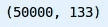

```
data.head()
```

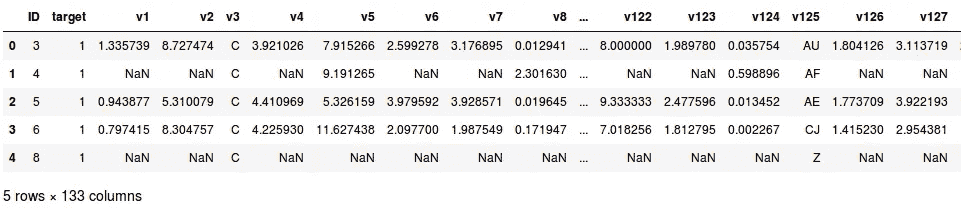

***3。选择数值列*和**

在实践中，特征选择应该在数据预处理之后进行，所以理想情况下，所有分类变量都被编码成数字，然后我们可以评估它们对目标的确定性，这里为了简单起见，我将只使用数字变量来选择数字列:

```
numerics = ['int16','int32','int64','float16','float32','float64']
numerical_vars = list(data.select_dtypes(include=numerics).columns)
data = data[numerical_vars]
data.shape
```

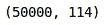

***4。将数据分成训练集和测试集***

```
X_train, X_test, y_train, y_test = train_test_split(
    data.drop(labels=['target', 'ID'], axis=1),
    data['target'],
    test_size=0.3,
    random_state=0)X_train.shape, X_test.shape
```

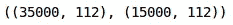

***5*** 。 ***缩放数据，因为线性模型受益于特征缩放***

```
scaler = StandardScaler()
scaler.fit(X_train.fillna(0))
```

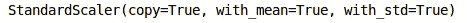

***6。使用*** `***SelectFromModel***`使用套索正则化选择特征

在这里，我将在一行代码中完成模型拟合和特征选择。首先，我指定了逻辑回归模型，并确保选择了套索(L1)惩罚。然后我使用来自`sklearn`的`selectFromModel`对象，它将在理论上选择系数非零的特征。

```
sel_ = SelectFromModel(LogisticRegression(C=1, penalty='l1'))
sel_.fit(scaler.transform(X_train.fillna(0)), y_train)
```

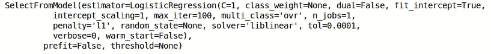

***7。可视化套索正则化保留的特征***

```
sel_.get_support()
```

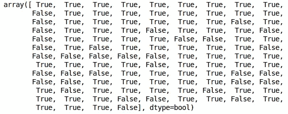

在上面的输出中，输出标签是索引方式的。因此`True`是针对 lasso 认为重要的特征(非零特征)，而`False`是针对权重收缩为零且 Lasso 认为不重要的特征。

***8。列出具有所选功能的。***

```
selected_feat = X_train.columns[(sel_.get_support())]print('total features: {}'.format((X_train.shape[1])))
print('selected features: {}'.format(len(selected_feat)))
print('features with coefficients shrank to zero: {}'.format(
      np.sum(sel_.estimator_.coef_ == 0)))
```

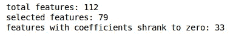

***系数收缩为零的特征数:***

```
np.sum(sel_.estimator_.coef_ == 0)
```


**9*。识别被移除的特征*和**

```
removed_feats = X_train.columns[(sel_.estimator_.coef_ == 0).ravel().tolist()]removed_feats
```

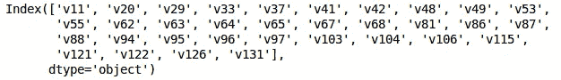

***10。从训练测试集中移除特征***

```
X_train_selected = sel_.transform(X_train.fillna(0))
X_test_selected = sel_.transform(X_test.fillna(0))X_train_selected.shape, X_test_selected.shape
```

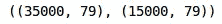

## 注意:

> L2 正则化不会将系数缩小到零

```
# Separating the data into train and test set 
X_train, X_test, y_train, y_test = train_test_split(
    data.drop(labels=['target', 'ID'], axis=1),
    data['target'],
    test_size=0.3,
    random_state=0)X_train.shape, X_test.shape
```

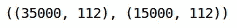

为了比较，我将使用岭正则化拟合逻辑回归，并评估系数:

```
l1_logit = LogisticRegression(C=1, penalty='l2')
l1_logit.fit(scaler.transform(X_train.fillna(0)), y_train)
```

现在，让我们计算零值系数的数量:

```
np.sum(l1_logit.coef_ == 0)
```

所以，现在零值系数的数量是零。因此，现在很清楚，脊正则化(L2 正则化)不会将系数缩小到零。

## **结论:**

正如我们所见，我们用于套索正则化的逻辑回归从数据集中移除了不重要的要素。请记住，增加惩罚`c`会增加移除的特征数量。因此，我们需要保持警惕，不要将惩罚设置得太高，以至于删除甚至重要的功能，或者设置得太低，以至于不删除不重要的功能。

**对于使用随机森林的特征选择:**

[](/feature-selection-using-random-forest-26d7b747597f) [## 使用随机森林的特征选择

### 随机森林是最流行的机器学习算法之一。他们如此成功是因为他们提供了…

towardsdatascience.com](/feature-selection-using-random-forest-26d7b747597f)